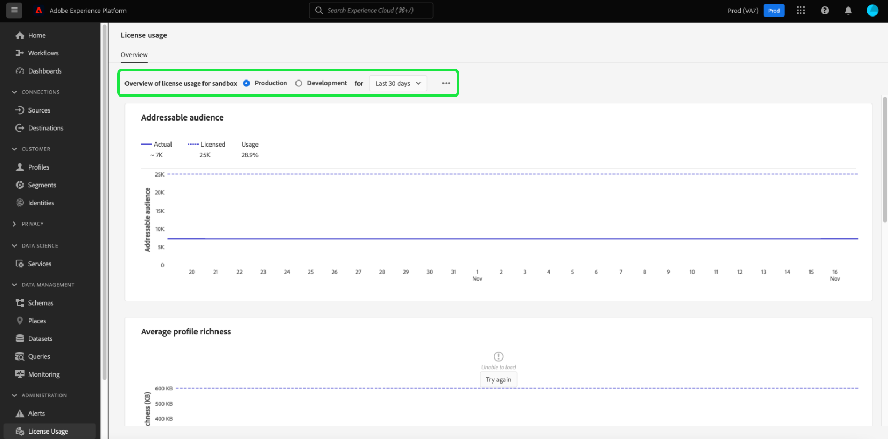

# 许可证使用情况仪表板 {#license-usage-dashboard}

Adobe Experience Platform用户界面(UI)提供了一个仪表板，通过该仪表板可以查看有关您组织的许可证使用情况的重要信息，在每日快照期间捕获了这些信息。 本指南概述如何在UI中访问和使用许可证使用情况仪表板，并提供有关仪表板中显示的可视化的更多信息。

有关Platform UI的概述，请访问 [Experience Platform用户界面指南](../../landing/ui-guide.md).

## 许可证使用情况仪表板数据

许可证使用情况仪表板显示贵组织用于Experience Platform的许可证相关数据的快照。 仪表板中的数据与拍摄快照的特定时间点完全相同。 换句话说，快照不是数据的近似值或样本，并且仪表板没有实时更新。

>[!NOTE]
>
>自拍摄快照以来对数据所做的任何更改或更新都不会反映在功能板中，直到拍摄下一个快照为止。

## 浏览许可证使用情况仪表板

要导航到Platform UI中的许可证使用情况仪表板，请选择 **[!UICONTROL 许可证使用情况]** 在左边栏中。 这将打开 **[!UICONTROL 概述]** 选项卡显示仪表板。

>[!NOTE]
>
>默认情况下，许可证使用情况仪表板未启用。 必须向用户授予“查看许可证使用情况仪表板”权限才能查看仪表板。 有关授予查看许可证使用仪表板的访问权限的步骤，请参阅 [仪表板权限指南](../permissions.md).

### 选择沙盒

要选择要在仪表板中查看的沙盒，请选择 [!UICONTROL 生产] 或 [!UICONTROL 开发]. 沙盒名称旁边的单选按钮表示选定的沙盒。

沙盒的使用情况报告对于同一类型的所有沙盒是累计的。 换句话说，选择 [!UICONTROL 生产] 或 [!UICONTROL 开发] 分别提供所有生产沙盒或开发沙盒的使用情况报表。

>[!WARNING]
>
>必须在沙盒级别指定查看许可证使用情况仪表板的权限。 这意味着必须将查看仪表板的权限添加到每个单独的沙盒中。 此限制将在未来版本中解决。 同时，提供以下解决方法：
>
>1. 在Adobe Admin Console中创建产品配置文件。
>2. 在沙盒类别中的权限下，添加您希望在许可证使用情况仪表板中查看的所有沙盒。
>3. 在“用户仪表板权限”类别下，添加“查看许可证使用情况仪表板”权限。

### 选择日期范围

选择沙盒后，您可以使用日期范围下拉列表选择要显示在仪表板中的时间段。 提供了多个选项，包括最近30天的默认值。

您还可以选择 **[!UICONTROL 自定义日期]** 以选择显示的时间段。

## 小组件

许可证使用情况仪表板由小组件组成，这些小组件显示只读量度，提供有关您组织的许可证使用情况的重要信息。 可见的量度取决于贵组织的特定许可(请参阅 [可用量度](#available-metrics) 部分（以了解详细信息）。

每个小组件显示一个线形图，将贵组织的实际数量与贵组织许可的总可用数量进行比较，并提供总使用量的百分比。

## 可用量度

许可证使用情况仪表板报告四个关键量度，后续版本中将添加更多量度。 可用的量度包括：

* [!UICONTROL 可寻址受众]
* [!UICONTROL 平均配置文件丰富度]
* [!UICONTROL 每个分段扫描的数据比率]
* [!UICONTROL 已使用的存储总数]

这些指标的可用性和每个指标的特定定义因贵组织购买的许可而异。 有关每个量度的详细定义，请参阅相应的产品描述文档：

| 许可 | 产品描述 |
|---|---|
| <ul><li>Adobe Experience Platform：OD LITE</li><li>Adobe Experience Platform：OD STANDARD</li><li>Adobe Experience Platform：OD粗</li></ul> | [Adobe Experience Platform](https://helpx.adobe.com/legal/product-descriptions/adobe-experience-platform.html) |
| <ul><li>Adobe Experience Platform：OD</li></ul> | [Experience Platform、应用程序服务和智能服务](https://helpx.adobe.com/legal/product-descriptions/exp-platform-app-svcs.html) |
| <ul><li>RT CUSTOMER DATA PLATFORM：OD</li><li>RT客户数据平台：OD PRFL到10M</li><li>RT客户数据平台：OD PRFL到50M</li></ul> | [Adobe Real-time Customer Data Platform](https://helpx.adobe.com/legal/product-descriptions/real-time-customer-data-platform.html) |
| <ul><li>AEP：OD激活</li><li>AEP：OD激活PRFL至10M</li><li>AEP：OD激活PRFL，最长50米</li></ul> | [Adobe Experience Platform激活](https://helpx.adobe.com/legal/product-descriptions/adobe-experience-platform0.html) |
| <ul><li>AEP：OD INTELLIGENCE</li></ul> | [Adobe Experience Platform Intelligence](https://helpx.adobe.com/legal/product-descriptions/adobe-experience-platform-intelligence---product-description.html) |
| <ul><li>Journey Optimizer SELECT：OD</li><li>Journey Optimizer PRIME：OD</li><li>Journey Optimizer ULTIMATE：OD</li><li>UNP AJO PRIME简易版：OD</li><li>UNP AJO ULTIMATE STARTER：OD</li><li>UNP Real-Time CDP：OD配置文件编排</li></ul> | [Adobe Journey Optimizer](https://helpx.adobe.com/cn/legal/product-descriptions/adobe-journey-optimizer.html) |

>[!WARNING]
>
>许可证使用仪表板仅报告为您的组织配置的最新许可证。 如果为贵组织配置的最新许可证未在上表中显示，则许可证使用情况仪表板可能无法正确显示。 计划在未来的版本中，支持单个组织中的其他许可证和多个许可证。

## 后续步骤

阅读本文档后，您可以找到许可证使用情况仪表板并选择要查看的沙盒。 您还可以根据贵组织已购买的许可协议，查找有关贵组织可用量度的更多信息。

要了解有关Experience PlatformUI中可用的其他功能的更多信息，请参阅 [Platform UI指南](../../landing/ui-guide.md).
