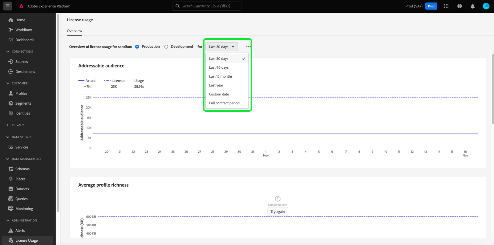
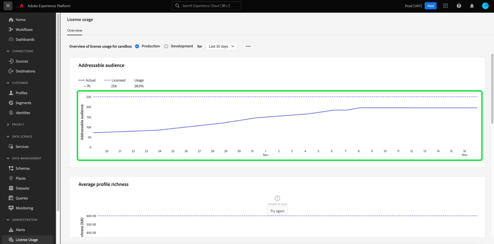

# 许可证使用功能板 {#license-usage-dashboard}

Adobe Experience Platform用户界面(UI)提供了一个功能板，您可以通过该功能板查看有关贵组织许可证使用情况的重要信息，这些信息是在每日快照期间捕获的。 本指南概述了如何在UI中访问和使用许可证使用情况功能板，并提供了有关功能板中显示的可视化的更多信息。

有关Platform UI的一般概述，请访问 [Experience PlatformUI指南](../../landing/ui-guide.md).

## 许可证使用功能板数据

许可证使用功能板显示贵组织与许可证相关的数据的快照，以便进行Experience Platform。 功能板中的数据与拍摄快照时在特定时间点显示的数据完全一样。 换句话说，快照不是数据的近似值或样本，功能板不会实时更新。

>[!NOTE]
>
>自拍摄快照以来对数据所做的任何更改或更新，在拍摄下一个快照之前不会反映在功能板中。

## 浏览许可证使用功能板

要导航到Platform UI中的许可证使用功能板，请选择 **[!UICONTROL 许可证使用情况]** 中。 这将打开 **[!UICONTROL 概述]** 选项卡。

>[!NOTE]
>
>默认情况下，许可证使用功能板未启用。 用户必须获得“查看许可证使用情况功能板”权限，才能查看功能板。 有关授予访问权限以查看许可证使用功能板的步骤，请参阅 [功能板权限指南](../permissions.md).

### 选择沙盒

要选择要在功能板中查看的沙盒，请选择 [!UICONTROL 生产] 或 [!UICONTROL 开发]. 选定的沙盒由沙盒名称旁边的单选按钮指示。

沙箱的使用情况报表是同一类型所有沙箱的累计使用情况。 换句话说，选择 [!UICONTROL 生产] 或 [!UICONTROL 开发] 分别为所有生产沙箱或开发沙箱提供使用情况报表。

>[!WARNING]
>
>必须在沙盒级别指定查看许可证使用情况仪表板的权限。 这意味着必须向每个单独的沙箱添加查看功能板的权限。 此限制将在将来的版本中解决。 同时，还提供了以下解决方法：
>
>1. 在Adobe Admin Console中创建产品配置文件。
>2. 在“沙盒”类别的“权限”下，添加您希望在许可证使用功能板中查看的所有沙箱。
>3. 在“用户功能板权限”类别下，添加“查看许可证使用情况功能板”权限。

### 选择日期范围

选择沙盒后，您可以使用日期范围下拉列表选择要在功能板中显示的时间段。 有多个可用选项，包括最近30天的默认值。

您还可以选择 **[!UICONTROL 自定义日期]** ，以选择显示的时间段。

## 小组件

许可证使用功能板由小组件组成，这些小组件显示只读量度，提供有关贵组织许可证使用情况的重要信息。 可见量度取决于贵组织的特定许可(请参阅 [可用量度](#available-metrics) 部分)。

每个小组件都会显示一个折线图，用于比较贵组织的实际数字与贵组织许可时的可用总数，并提供总使用量的百分比。

## 可用量度

许可证使用情况功能板报告了四个关键量度，并在后续版本中添加了更多量度。 可用的量度包括：

* [!UICONTROL 可寻址受众]
* [!UICONTROL 平均用户档案丰富度]
* [!UICONTROL 每个分段的扫描数据比率]
* [!UICONTROL 总消耗的存储]

这些量度的可用性以及每个量度的具体定义因贵组织购买的许可而异。 有关每个量度的详细定义，请参阅相应的产品描述文档：

| 许可 | 产品描述 |
|---|---|
| <ul><li>Adobe Experience Platform:OD LITE</li><li>Adobe Experience Platform:OD STANDARD</li><li>Adobe Experience Platform:OD重</li></ul> | [Adobe Experience Platform](https://helpx.adobe.com/legal/product-descriptions/adobe-experience-platform.html) |
| <ul><li>Adobe Experience Platform:OD</li></ul> | [Experience Platform、应用程序服务和智能服务](https://helpx.adobe.com/legal/product-descriptions/exp-platform-app-svcs.html) |
| <ul><li>RT客户数据平台：OD</li><li>RT客户数据平台：OD PRFL到10米</li><li>RT客户数据平台：OD PRFL到50M</li></ul> | [Adobe Real-time Customer Data Platform](https://helpx.adobe.com/legal/product-descriptions/real-time-customer-data-platform.html) |
| <ul><li>AEP:OD激活</li><li>AEP:OD激活PRFL至10米</li><li>AEP:OD激活PRFL，最长50米</li></ul> | [Adobe Experience Platform激活](https://helpx.adobe.com/legal/product-descriptions/adobe-experience-platform0.html) |
| <ul><li>AEP:OD INTELLIGENCE</li></ul> | [Adobe Experience Platform Intelligence](https://helpx.adobe.com/legal/product-descriptions/adobe-experience-platform-intelligence---product-description.html) |
| <ul><li>Journey Optimizer SELECT:OD</li><li>Journey Optimizer PRIME:OD</li><li>Journey Optimizer ULTIMATE:OD</li><li>UNP AJO PRIME STARTER:OD</li><li>UNP AJO ULTIMATE STARTER:OD</li><li>UNP Real-Time CDP:OD个人资料编排</li></ul> | [Adobe Journey Optimizer](https://helpx.adobe.com/cn/legal/product-descriptions/adobe-journey-optimizer.html) |

>[!WARNING]
>
>许可证使用功能板仅报告为您的组织配置的最新许可证。 如果为贵组织配置的最新许可证未显示在上表中，则许可证使用功能板可能无法正常显示。 计划在将来的版本中支持单个组织中的其他许可证和多个许可证。

## 后续步骤

阅读本文档后，您可以找到许可证使用功能板并选择要查看的沙盒。 您还可以根据贵组织购买的许可证，找到有关贵组织可用量度的更多信息。

要了解有关Experience PlatformUI中可用的其他功能的更多信息，请参阅 [Platform UI指南](../../landing/ui-guide.md).
