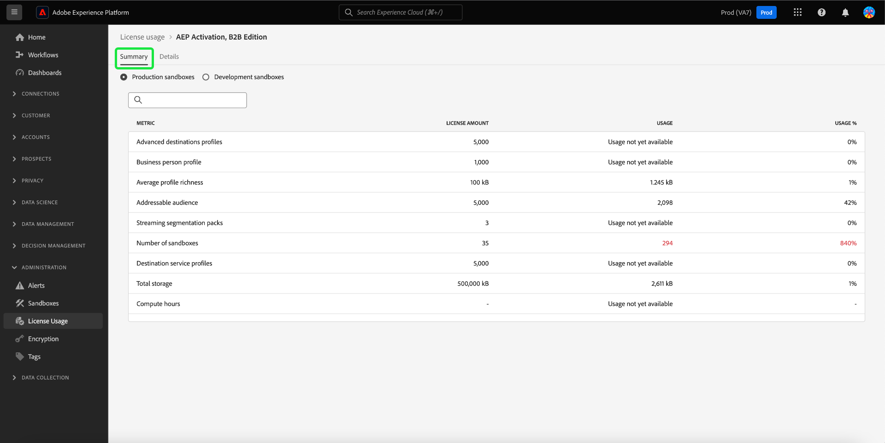

# 许可证用量仪表板 {#license-usage-dashboard}

>[!CONTEXTUALHELP]
>id="testy-mctestface"
>title="不应显示的测试对话框"
>abstract="对象 {name} 正在 {date} 被查看。"

>[!CONTEXTUALHELP]
>id="platform_dashboards_licenseusage_core"
>title="核心产品表"
>abstract="表中列出的核心产品在沙盒级别有各自的量度、使用情况跟踪和钻取视图。这些核心产品提供了用于跟踪的关键量度，并且任何附加组件都包含在这些量度中。"

>[!CONTEXTUALHELP]
>id="platform_dashboards_licenseusage_addons"
>title="附加组件表"
>abstract="附加组件表列出了许可证数量与核心产品支持的量度相结合的产品。这些附加组件没有单独的量度，但增强了与其关联的核心产品的使用情况跟踪功能。"

>[!CONTEXTUALHELP]
>id="platform_dashboards_licenseUsage"
>title="许可证用量仪表板"
>abstract="通过许可证用量仪表板，可了解已购买的 Adobe Experience Platform 产品。该仪表板概述显示产品的主要量度，包括您对每个主要量度的用量以及您的合同许可证数量。详细信息工作区显示特定沙盒中每个产品的量度细分。"
>additional-url="https://experienceleague.adobe.com/docs/experience-platform/data-lifecycle/ui/dataset-expiration.html" text="自动数据集过期"
>additional-url="https://experienceleague.adobe.com/docs/experience-platform/profile/pseudonymous-profiles.html" text="假名轮廓数据过期"

>[!CONTEXTUALHELP]
>id="platform_licenseusage"
>title="许可证用量仪表板"
>abstract="通过许可证用量仪表板，可了解已购买的 Adobe Experience Platform 产品。该仪表板概述显示产品的主要量度，包括您对每个主要量度的用量以及您的合同许可证数量。详细信息工作区显示特定沙盒中每个产品的量度细分。"
>additional-url="https://experienceleague.adobe.com/docs/experience-platform/data-lifecycle/ui/dataset-expiration.html" text="自动数据集过期"
>additional-url="https://experienceleague.adobe.com/docs/experience-platform/profile/pseudonymous-profiles.html" text="假名轮廓数据过期"

>[!CONTEXTUALHELP]
>id="platform_dashboards_licenseusage_predictedusage_computehours"
>title="预测计算小时数"
>abstract="您的使用量可能已达到已授予许可量。要评估或减少您的计算小时数，请导航至查询>日志以查看您的查询历史记录。如果您无权访问查询工作区，请联系您的管理员。"
>additional-url="https://experience.adobe.com/#/platform/query/log.html" text="查询日志工作区"

>[!CONTEXTUALHELP]
>id="platform_dashboards_licenseusage_predictedusage_addressableaudience"
>title="预测的可寻址受众"
>abstract="您的使用量可能已达到已授予许可量。为了减少使用量，您可以为沙箱和数据集配置数据集或匿名轮廓的数据有效期限设置。"
>additional-url="https://experienceleague.adobe.com/docs/experience-platform/profile/event-expirations.html" text="体验事件过期"
>additional-url="https://experienceleague.adobe.com/docs/experience-platform/profile/pseudonymous-profiles.html" text="假名轮廓数据过期"

>[!CONTEXTUALHELP]
>id="platform_dashboards_licenseusage_predictedusage_engageableprofiles"
>title="预测的可参与的轮廓"
>abstract="您的使用量可能已达到已授予许可量。为了减少使用量，您可以为沙箱和数据集配置数据集或匿名轮廓的数据有效期限设置。"
>additional-url="https://experienceleague.adobe.com/docs/experience-platform/profile/event-expirations.html" text="体验事件过期"
>additional-url="https://experienceleague.adobe.com/docs/experience-platform/profile/pseudonymous-profiles.html" text="假名轮廓数据过期"

>[!CONTEXTUALHELP]
>id="platform_dashboards_licenseusage_predictedusage_businesspersonprofile"
>title="预测的商务人士轮廓"
>abstract="您的使用量可能已达到已授予许可量。为了减少使用量，您可以为沙箱和数据集配置数据集或匿名轮廓的数据有效期限设置。"
>additional-url="https://experienceleague.adobe.com/docs/experience-platform/profile/event-expirations.html" text="体验事件过期"
>additional-url="https://experienceleague.adobe.com/docs/experience-platform/profile/pseudonymous-profiles.html" text="假名轮廓数据过期"

>[!CONTEXTUALHELP]
>id="platform_dashboards_licenseusage_predictedusage_corehours"
>title="预测的核心小时数"
>abstract="您的使用量可能已达到已授予许可量。为了减少使用量，您可以为沙箱和数据集配置数据集或匿名轮廓的数据有效期限设置。"
>additional-url="https://experienceleague.adobe.com/docs/experience-platform/profile/event-expirations.html" text="体验事件过期"
>additional-url="https://experienceleague.adobe.com/docs/experience-platform/profile/pseudonymous-profiles.html" text="假名轮廓数据过期"

>[!CONTEXTUALHELP]
>id="platform_dashboards_licenseusage_predictedusage_totaldatavolume"
>title="预测的总数据量"
>abstract="您的使用量可能已达到已授予许可量。为了减少使用量，您可以为沙箱和数据集配置数据集或匿名轮廓的数据有效期限设置。"
>additional-url="https://experienceleague.adobe.com/docs/experience-platform/profile/event-expirations.html" text="体验事件过期"
>additional-url="https://experienceleague.adobe.com/docs/experience-platform/profile/pseudonymous-profiles.html" text="假名轮廓数据过期"

>[!CONTEXTUALHELP]
>id="platform_dashboards_licenseusage_predictedusage_cjaRowsAvailable"
>title="预测的 CJA 可用行"
>abstract="您的使用量可能已达到已授予许可量。为了减少使用量，您可以为沙箱和数据集配置数据集或匿名轮廓的数据有效期限设置。"
>additional-url="https://experienceleague.adobe.com/docs/experience-platform/profile/event-expirations.html" text="体验事件过期"
>additional-url="https://experienceleague.adobe.com/docs/experience-platform/profile/pseudonymous-profiles.html" text="假名轮廓数据过期"

您可以通过Adobe Experience Platform [!UICONTROL 许可证使用情况]仪表板查看有关贵组织许可证使用情况的重要信息。 此处显示的信息是在Platform实例的每日快照期间捕获的。

许可证使用情况报表可提供比许可证使用情况量度更高级别的粒度。 仪表板提供每个购买的产品（及相关插件）的使用量度、所有生产或开发沙盒中量度的综合使用量度，以及特定沙盒的使用量度。 可以使用使用情况量度跟踪以下Experience Platform应用程序：Real-Time Customer Data Platform、Adobe Journey Optimizer和Customer Journey Analytics。

本指南概述如何在UI中访问和使用许可证使用情况仪表板，并提供有关仪表板中显示的可视化的更多信息。

有关Platform UI的一般概述，请参阅[Experience Platform UI指南](../../landing/ui-guide.md)。

## [!UICONTROL 许可证使用情况]仪表板数据

[!UICONTROL 许可证使用情况]仪表板显示您已购买的所有Experience Platform产品以及这些产品的任何加载项的列表。 在此功能板中，您可以找到贵组织在任何关联沙盒中用于Experience Platform的许可证相关数据的快照。

此仪表板中的数据与拍摄快照的特定时间点完全相同。 换句话说，快照不是数据的近似值或样本，并且仪表板没有实时更新。

>[!NOTE]
>
>自拍摄快照以来对数据所做的任何更改或更新都不会反映在功能板中，直到拍摄下一个快照为止。

## 浏览许可证使用情况仪表板 {#explore}

要导航到平台UI中的许可证使用情况仪表板，请在左边栏中选择&#x200B;**[!UICONTROL 许可证使用情况]**。 将打开[!UICONTROL 概述]选项卡，显示可用产品的列表。

>[!NOTE]
>
>默认情况下，许可证使用情况仪表板未启用。 必须向用户授予“查看许可证使用情况仪表板”权限，用户才能查看仪表板。 有关授予查看许可证使用仪表板的访问权限的步骤，请参阅[仪表板权限指南](../permissions.md)。

## [!UICONTROL 概述]选项卡 {#overview-tab}

[!UICONTROL 许可证使用情况]仪表板显示两个单独的表：**核心产品**&#x200B;和&#x200B;**附加组件**。

- **[!UICONTROL 核心产品]表**：此表列出了您的组织许可的主要Adobe Experience Platform产品。 每个核心产品在沙盒级别都有自己的量度、使用情况跟踪和穿透钻取视图。 这些核心产品提供了用于跟踪的关键量度，并且任何附加组件都包含在这些量度中。

- **[!UICONTROL 插件]表**：此表列出了许可证数量与核心产品所支持的量度相结合的其他产品。 加载项没有单独的量度，但可增强对其关联核心产品的使用跟踪。

| 列名 | 描述 |
|---|---|
| **[!UICONTROL 产品]** | 由您的组织许可的Adobe解决方案。 |
| **[!UICONTROL 主要指标]** | 用于跟踪该产品的主要指标。 |
| **[!UICONTROL 许可证数量]** | 产品许可协议中约定的主要量度最大量的约定值。 |
| **[!UICONTROL 用法]** | 您使用的主要量度的数量。 此值提供该量度在所有沙盒（生产沙盒或开发沙盒）中的总使用情况。 |
| **[!UICONTROL 使用情况%]** | 根据您的许可证数量使用的主要量度的百分比。 |
| **[!UICONTROL 预测使用情况]** | 根据您的许可证数量，您的主要量度的预测使用百分比。 |

>[!NOTE]
>
>加载项的许可证金额包含在核心产品的[!UICONTROL 许可证金额]中。 例如，如果您购买一包5个沙盒作为附加产品，则金额将添加到基础产品的金额中。 加载项表显示特定于加载项的[!UICONTROL 许可证金额]，但实际使用情况是通过基本产品进行跟踪的。

这些表指示每个产品的主要量度，因为每个产品都可以跟踪大量量度。

### 预测使用量 {#predicted-usage}

>[!CONTEXTUALHELP]
>id="platform_dashboards_licenseUsage_prediction"
>title="预测使用量"
>abstract="预测基于过去 6-7 个月的使用情况，并在每个月的 15 日生成。请注意, 许可证使用预测是基于过去使用情况的近似值。您有责任了解您组织的实际使用情况，并确保使用不超出您与 Adobe 的许可证范围。为了减少使用量，您可以为沙箱和数据集配置数据集或匿名轮廓的数据有效期限设置。"
>additional-url="https://experienceleague.adobe.com/docs/experience-platform/data-lifecycle/ui/dataset-expiration.html" text="自动数据集过期"
>additional-url="https://experienceleague.adobe.com/docs/experience-platform/profile/pseudonymous-profiles.html" text="假名轮廓数据过期"

>[!CONTEXTUALHELP]
>id="platform_licenseusage_prediction"
>title="预测使用量"
>abstract="预测基于过去 6-7 个月的使用情况，并在每个月的 15 日生成。请注意, 许可证使用预测是基于过去使用情况的近似值。您有责任了解您组织的实际使用情况，并确保使用不超出您与 Adobe 的许可证范围。为了减少使用量，您可以为沙箱和数据集配置数据集或匿名轮廓的数据有效期限设置。"
>additional-url="https://experienceleague.adobe.com/docs/experience-platform/data-lifecycle/ui/dataset-expiration.html" text="自动数据集过期"
>additional-url="https://experienceleague.adobe.com/docs/experience-platform/profile/pseudonymous-profiles.html" text="假名轮廓数据过期"

根据深入的使用预测主动管理和优化您的许可资源。 [!UICONTROL 预测的使用量]列可以准确地预测您购买的所有产品在所有生产和开发沙盒中沙盒级别的未来许可证使用量。 此警报功能会根据您截至本日历月15日的使用情况，预测未来六周内的许可证使用情况。 预测提供有下限和上限。

>[!IMPORTANT]
>
>预测会每月更新。 刷新日期包含在信息图标（)位于列标题上方。

要查看产品权利使用情况的摘要，请从[!UICONTROL 核心产品]表中选择产品。

![产品及预测使用列突出显示的[!UICONTROL 许可证使用情况] [!UICONTROL 概述]。](../images/license-usage/product-predicted-usage.png)

此时将显示摘要选项卡。 您可以使用[!UICONTROL 摘要]和[!UICONTROL 详细信息]选项卡上提供的粒度预测以确保做出明智的决策，从而有效使用许可证。

>[!NOTE]
>
>请注意, 许可证使用预测是基于过去使用情况的近似值。您有责任了解贵组织的实际使用情况，并确保使用情况不会超出贵组织获得Adobe许可证的范围。

预计使用率的百分比确定如下：

- 如果下限和上限有显着差异，则它们将显示为范围（例如，32% - 35%）。
- 如果下限和上限几乎完全相同且不为零，则它们将显示为近似值（例如，~34%）。
- 如果下限和上限几乎完全相同且为零，则它们将显示为0%。

>[!NOTE]
>
>在此上下文中，“几乎相同”意味着值对于小数点两位具有统计意义（例如，0.342的下限和0.344的上限都舍入到34%）。

预测的使用量功能支持以下量度：

- [!UICONTROL 可寻址受众]
- [!UICONTROL 计算小时数]
- [!UICONTROL 客户历程受众行数]
- [!UICONTROL 总数据量]

## [!UICONTROL 摘要]选项卡 {#summary-tab}

要查看有关您的产品许可证使用情况的更多量度和详细分析，请从列表中选择产品名称。 将显示该产品的[!UICONTROL 摘要]视图。 所有可用量度都显示在[!UICONTROL 摘要]选项卡上。 可用的量度取决于许可的产品。 此视图提供了&#x200B;**跨所有生产或开发沙盒的所有量度的合并视图**。 为生产沙盒和开发沙盒提供相同级别的分析。

在“摘要”选项卡上，该表包含[!UICONTROL 量度]列。 这些易于用户识别的描述指示用于该类型沙盒的所有量度。

### 选择一个沙盒 {#select-sandbox}

要更改生产和开发沙盒类型之间的视图，请选择[!UICONTROL 生产沙盒]或[!UICONTROL 开发沙盒]。 沙盒名称旁边的单选按钮表示所选的沙盒类型。

沙盒的使用情况报告对于同一类型的所有沙盒是累计的。 换句话说，选择[!UICONTROL 生产]或[!UICONTROL 开发]将分别提供所有生产沙盒或开发沙盒的使用报告。

>[!WARNING]
>
>必须在沙盒级别指定查看许可证使用情况仪表板的权限。 向每个沙盒添加权限，以便在功能板中查看它们。 此限制将在未来版本中解决。 同时，提供以下解决方法：
>
>1. 在Adobe Admin Console中创建产品配置文件。
>2. 在沙盒类别中的权限下，添加您希望在许可证使用情况仪表板中查看的所有沙盒。
>3. 在“用户仪表板权限”类别下，添加“查看许可证使用情况仪表板”权限。

## [!UICONTROL 详细信息]选项卡 {#details-tab}

要查看来自特定沙盒的&#x200B;**特定使用情况量度**，请导航到[!UICONTROL 详细信息]选项卡。 [!UICONTROL 详细信息]选项卡显示“生产”或“开发”沙盒中的所有可用沙盒。

从该视图中，您可以选择以查看该指标的可视化图表。 此时将打开一个对话框，其中包含该量度的可视化图表。

### 可视化 {#visualizations}

每个可视化小组件包括以下方面：

- 跟踪量度随时间变化的折线图
- 折线图的键
- 沙盒名称
- 用于调整折线图时段的下拉菜单

线形图将贵组织的使用量数字与贵组织许可的总可用量进行比较，并提供总使用量的百分比。

可以从下拉菜单中调整分析的回顾时间段。 过去30天的默认值

要选择日期范围，您可以使用日期范围下拉菜单选择要显示在仪表板中的时间段。 提供了多个选项，包括最近30天的默认值。

您还可以选择&#x200B;**[!UICONTROL 自定义日期]**&#x200B;以选择显示的时间段。

## 可用量度 {#available-metrics}

>[!IMPORTANT]
>
>从8月20日开始，有权使用“[!UICONTROL 平均配置文件丰富度]”和“[!UICONTROL 总存储量]”的客户在“许可证使用情况”仪表板中看到了“[!UICONTROL 总数据量]”。 客户权利没有变化，只是简化了跟踪量度。 [!UICONTROL 总数据量]表示Adobe Experience Platform配置文件服务中可用于参与和个性化工作流程的数据。 此简化的量度改进了用户档案服务使用的管理和测量。 我们鼓励客户联系其Adobe代表，以进一步了解这一更改。

许可证使用情况仪表板报告适用于组织中多个产品的多个唯一量度。 可用的量度包括：

| 量度 | 描述 |
|---|---|
| [!UICONTROL Audience Activation大小] | 一年中激活到任何基于文件的目标的配置文件总数。 注意：这不包括通过流式目标发送的用户档案。 |
| [!UICONTROL 可寻址受众] | 您的业务受众权利和消费者受众权利的总和。 消费者受众定义为销售订单上标识为“消费者受众”的人员配置文件数。 业务受众定义为销售订单上标识为“业务受众”的业务人员个人资料数。 |
| [!UICONTROL 临时查询服务用户包] | 一个附加功能，用于将您的授权并发查询服务用户权利增加5个额外的并发查询服务用户，每个包另加1个并发运行即席查询。 可以许可多个其他Ad Hoc Query用户包。 |
| [!UICONTROL 平均配置文件丰富度] | **已弃用** — 在任何时间点存储在中心配置文件服务中的所有生产数据的总和除以授权的业务人员配置文件数量的五倍。 [!UICONTROL 平均配置文件丰富度]是共享功能。 |
| [!UICONTROL CJA行可用] | 可用于在Customer Journey Analytics中分析的每日平均数据行数。 |
| [!UICONTROL 计算属性] | 汇总的配置文件行为数据的总数。 汇总的个人资料行为数据基于转换为个人资料属性的体验事件，并可包含在人员个人资料或商业人员个人资料中。 |
| [!UICONTROL 使用者受众] | 销售订单上标识为“消费者受众”的人员配置文件数。 |
| [!UICONTROL 数据导出大小] | 一年中通过数据集激活发送的数据量。 |
| [!UICONTROL 数据导出] | 一年中可以（直接或间接地）导出到任何非Adobe解决方案的数据集总大小。 |
| [!UICONTROL 数据湖存储] | Adobe Experience Platform中分析数据存储所使用的数量。 |
| [!UICONTROL 可参与受众] | 此量度是指可参与用户档案的受众。 可启用的用户档案是代表个人的信息记录，并在用户档案服务中显示。 这些记录是您在过去12个月内尝试使用Journey Optimizer的创作、决策、交付、实验或编排功能接触的用户档案。 |
| [!UICONTROL 相似受众] | 通过模拟现有消费者受众以标识与现有消费者受众类似的人员配置文件而生成的受众计数。 |
| [!UICONTROL AMM模型数] | 机器学习模型(在Adobe Mix Modeler中构建)的计数，用于根据您的投资测量和/或预测指定的结果。 |
| [!UICONTROL 沙盒数] | 访问Adobe隔离数据和操作的任何Adobe Experience Platform On-demand Service实例中的逻辑分隔计数。 |
| [!UICONTROL 包的配置文件丰富度] | 每个额外配置文件丰富度包的授权总数据量增加25 KB。 |
| [!UICONTROL 查询服务计算小时数] | 测量在执行批量查询时，查询服务引擎读取、处理数据并将其写回数据湖所花费的时间。 |
| [!UICONTROL 流式分段数（包）] | 当新数据通过流流进入分段服务时，包将更新人员配置文件的区段成员资格。 评估区段成员资格时，将基于当前人员配置文件属性和当前事件的值，而不考虑历史行为。 流式分段是一项共享功能。 |
| [!UICONTROL 总数据量] | 可在参与工作流中使用的Adobe Experience Platform配置文件服务的数据总量。 请参阅有关总数据量](../../landing/license-usage-and-guardrails/total-data-volume.md)的[常见问题解答，以了解更多信息。 |

<!-- |  [!UICONTROL Sandbox No of Packs] |  A logical separation within your instance of any Adobe On-demand Service that accesses Adobe Experience Platform isolating data and operations | -->

>[!TIP]
>
>您可以在销售订单中检查您的许可证权利以计算指标，如“存储容量”。 例如，<ul><li>存储容量=合同中“授权配置文件”的数量X平均配置文件丰富度</li></ul>

这些指标的可用性和每个指标的特定定义因贵组织购买的许可而异。 有关每个量度的详细定义，请参阅相应的产品描述文档：

| 许可证 | 产品描述 |
| --- | --- |
| <ul><li>Adobe Experience Platform：OD LITE</li><li>Adobe Experience Platform：OD STANDARD</li><li>Adobe Experience Platform：OD粗</li></ul> | [Adobe Experience Platform](https://helpx.adobe.com/legal/product-descriptions/adobe-experience-platform.html) |
| <ul><li>Adobe Experience Platform：OD</li></ul> | [Experience Platform、应用程序服务和智能服务](https://helpx.adobe.com/legal/product-descriptions/exp-platform-app-svcs.html) |
| <ul><li>RT CUSTOMER DATA PLATFORM：OD</li><li>RT客户数据平台：OD PRFL到10M</li><li>RT客户数据平台：OD PRFL到50M</li></ul> | [Adobe Real-Time Customer Data Platform](https://helpx.adobe.com/legal/product-descriptions/real-time-customer-data-platform.html) |
| <ul><li>AEP：OD激活</li><li>AEP：OD激活PRFL至10M</li><li>AEP：OD激活PRFL，最长可达50M</li></ul> | [Adobe Experience Platform激活](https://helpx.adobe.com/legal/product-descriptions/adobe-experience-platform0.html) |
| <ul><li>AEP：OD INTELLIGENCE</li></ul> | [Adobe Experience Platform Intelligence](https://helpx.adobe.com/legal/product-descriptions/adobe-experience-platform-intelligence---product-description.html) |
| <ul><li>Journey Optimizer SELECT：OD</li><li>Journey Optimizer PRIME：OD</li><li>Journey Optimizer ULTIMATE：OD</li><li>UNP AJO PRIME STARTER：OD</li><li>UNP AJO ULTIMATE STARTER：OD</li><li>UNP Real-Time CDP：OD配置文件编排</li></ul> | [Adobe Journey Optimizer](https://helpx.adobe.com/cn/legal/product-descriptions/adobe-journey-optimizer.html) |

>[!WARNING]
>
>许可证使用仪表板仅报告为您的组织配置的最新许可证。 如果为贵组织配置的最新许可证未在上表中显示，则许可证使用情况仪表板可能无法正确显示。 计划在未来的版本中，支持单个组织中的其他许可证和多个许可证。

## 后续步骤

阅读本文档后，您可以找到许可证使用情况仪表板，并查看每个已购产品、所有生产或开发沙盒以及特定沙盒的使用量度。 您可以根据贵组织购买的许可协议，查找有关贵组织可用量度的更多信息。

要了解有关Experience Platform UI中其他可用功能的更多信息，请参阅[平台UI指南](../../landing/ui-guide.md)。
