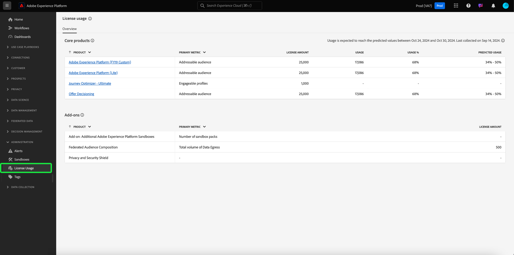
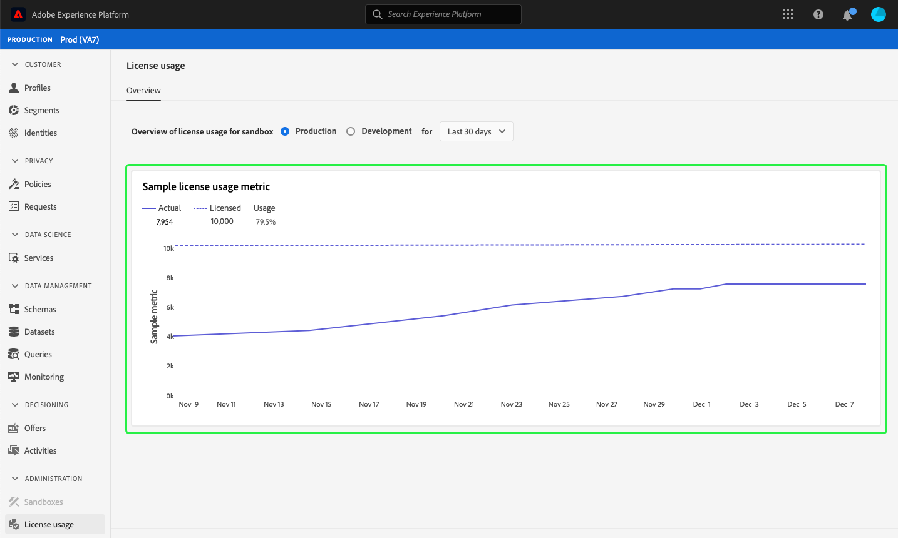

# （测试版）[!UICONTROL 许可证使用]仪表板{#license-usage-dashboard}

>[!IMPORTANT]
>
>此文档中概述的仪表板功能当前为测试版，并非所有用户都可用。 文档和功能可能会发生变化。

Adobe Experience Platform用户界面(UI)提供了一个仪表板，通过它可以视图有关组织许可证使用情况的重要信息，这些信息在每日快照中捕获。 本指南概述了如何在UI中访问和使用许可证使用仪表板，并提供了有关仪表板中显示的可视化的更多信息。

有关平台UI的一般概述，请访问[Experience PlatformUI指南](../../landing/ui-guide.md)。

## 许可证使用仪表板数据

许可证使用仪表板显示您组织的许可证相关数据的快照以供Experience Platform。 仪表板中的数据会与拍摄快照时在特定时间点显示的数据完全一样。 换句话说，快照不是数据的近似值或样本，仪表板不会实时更新。

>[!NOTE]
>
>自拍摄快照以来对数据所做的任何更改或更新将不会反映在仪表板中，直到拍摄下一个快照。

## 浏览许可证使用仪表板

要导航到平台UI中的许可证使用仪表板，请在左边栏中选择&#x200B;**[!UICONTROL 许可证使用]**。 此时将打开&#x200B;**[!UICONTROL 概述]**&#x200B;选项卡，其中显示仪表板。

### 选择沙箱

要在仪表板中选择要视图的沙箱，请选择[!UICONTROL Production]或[!UICONTROL Development]。 选定的沙箱由沙箱名称旁边的单选按钮指示。

>[!NOTE]
>
>沙箱的消耗报告对于相同类型的所有沙箱是累积的。 换句话说，选择[!UICONTROL 生产]或[!UICONTROL 开发]将分别报告所有生产沙箱或开发沙箱。

### 选择日期范围

选择沙箱后，可以使用日期范围下拉列表选择要在仪表板中显示的时间段。 有三种可用选项：[!UICONTROL 最近30天]、[!UICONTROL 最近90天]和[!UICONTROL 最近12个月]。 默认情况下，将选择最近30天。

### 构件和量度

许可证使用仪表板由构件组成，构件显示只读量度，提供有关组织许可证使用情况的重要信息。 要进一步了解这些构件，请参阅本指南中的可用构件部分。

## 可用构件{#available-widgets}

Experience Platform目前提供一个构件，您可以使用它直观地显示许可证使用情况，并且很快会发布更多构件。

### [!UICONTROL 可寻址受众] {#addressable-audiences}

**[!UICONTROL 可寻址受众]**&#x200B;构件在应用系统生成的合并策略以使用确定（专用）图形算法合并来自所有当前数据集的用户档案片段后，显示用户档案数据存储中合并用户档案的总数。

有关片段和合并用户档案的详细信息，请首先阅读[用户档案概述](../../profile/home.md)的&#x200B;*用户档案片段与合并用户档案*&#x200B;部分。

>[!NOTE]
>
>用于计算此量度的合并策略由Experience Platform生成，无法编辑，也无法选择其他合并策略。 此系统生成的合并策略与用于在[!DNL Profile]仪表板中计算[!UICONTROL 受众大小]的默认合并策略不同，因此[!UICONTROL 许可证使用情况]和[!DNL Profile]仪表板中的受众计数不太可能完全相同。

## 后续步骤

通过遵循此文档，您现在应该能够找到许可证使用仪表板并选择一个沙箱以进行视图。 您还应了解可用构件中显示的量度。 要进一步了解Experience Platform UI，请参阅[平台UI指南](../../landing/ui-guide.md)。