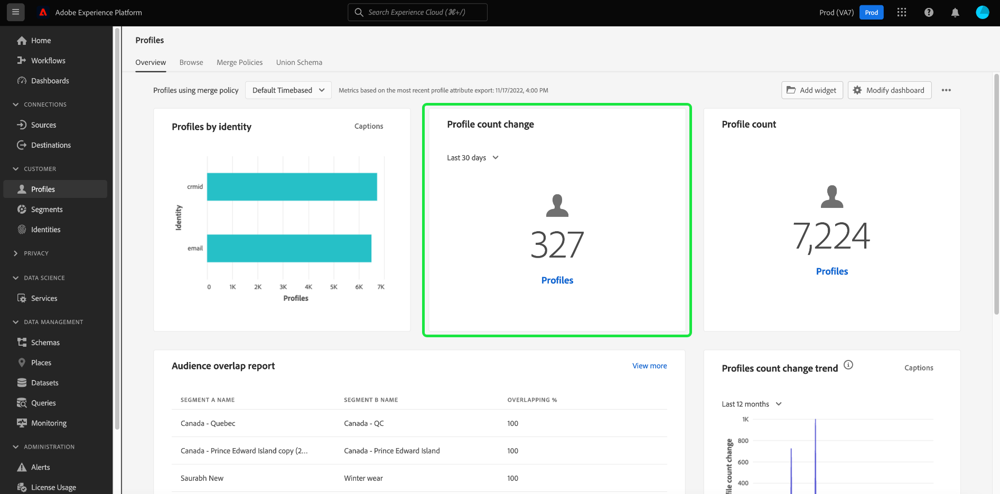

# [!UICONTROL 个人资料]仪表板

Adobe Experience Platform用户界面(UI)提供了一个仪表板，通过该仪表板可以查看有关每日快照期间捕获的[!DNL Real-Time Customer Profile]数据的重要信息。 本指南概述如何在UI中访问和使用用户档案仪表板，并提供有关仪表板中显示的量度的信息。

有关Experience Platform用户界面中配置文件功能的概述，请参阅[实时客户配置文件UI指南](../../profile/ui/user-guide.md)。

## 个人资料仪表板数据

配置文件仪表板显示贵组织在Experience Platform中的配置文件存储区中拥有的属性（记录）数据的快照。 快照不包含任何事件（时间序列）数据。

快照中的属性数据显示的数据与拍摄快照的特定时间点完全相同。 换句话说，快照不是数据的近似值或样本，并且配置文件仪表板没有实时更新。

>[!NOTE]
>
>自拍摄快照以来对数据所做的任何更改或更新都不会反映在功能板中，直到拍摄下一个快照为止。

## 浏览配置文件仪表板 {#explore-dashboard}

要导航到Experience Platform UI中的配置文件仪表板，请在左边栏中选择&#x200B;**[!UICONTROL 配置文件]**，然后选择&#x200B;**[!UICONTROL 概述]**&#x200B;选项卡以显示该仪表板。

>[!NOTE]
>
>如果贵组织是Experience Platform的新用户，并且尚未创建活动配置文件数据集或合并策略，则配置文件仪表板不可见。 相反，[!UICONTROL 概述]选项卡显示链接和文档，以帮助您开始使用实时客户个人资料。

### 修改用户档案仪表板 {#modify-dashboard}

您可以通过选择&#x200B;**[!UICONTROL 修改仪表板]**&#x200B;来修改配置文件仪表板的外观。 您可以从仪表板移动、添加、调整小组件大小和移除小组件，以及访问&#x200B;**[!UICONTROL 小组件库]**&#x200B;以浏览可用小组件并为您的组织创建自定义小组件。

要了解更多信息，请参阅[修改功能板](../customize/modify.md)和[小组件库概述](../customize/widget-library.md)文档。

### 添加构件 {#add-widget}

选择&#x200B;**[!UICONTROL 添加构件]**&#x200B;导航到构件库，并查看要添加到仪表板的可用构件列表。

从构件库中，您可以浏览选择的标准和自定义受众构件。 有关如何添加构件的信息，请参阅构件库文档，了解如何[添加构件](../customize/widget-library.md#add-widgets)。

### 查看 SQL {#view-sql}

通过打开[!UICONTROL 概述]工作区，您可以查看生成可在您的仪表板上可视化的分析的SQL。 您可以从现有见解的SQL中获得灵感，以创建新查询，这些查询可根据您的业务需求从Experience Platform数据获取独特的见解。 若要了解有关此功能的详细信息，请参阅[查看SQL UI指南](../view-sql.md)。

<!-- ## (Beta) Profile efficacy insights {#profile-efficacy-insights}

>[!IMPORTANT]
>
>The profile efficacy insight functionality is currently in beta and are not available to all users. The documentation and the functionality are subject to change.

The [!UICONTROL Efficacy] tab provides metrics on the quality and completeness of your profile data through the use of profile efficacy widgets. These widgets illustrate at a glance the composition of your profiles, trends in completeness over time, and assessments on the quality of your profile data.

See the [profile efficacy widgets section](#profile-efficacy-widgets) for more information on the widgets currently available.

The layout of this dashboard is also customizable by selecting [**[!UICONTROL Modify dashboard]**](../customize/modify.md) from the [!UICONTROL Overview] tab. -->

## 浏览配置文件 {#browse-profiles}

[!UICONTROL 浏览]选项卡允许您搜索和查看摄取到您组织的只读配置文件。 从此处，您可以看到属于用户档案的重要信息，其中包含有关其偏好、过去事件、交互和受众的信息。

## 轮廓详情 {#profile-details}

要打开[!UICONTROL 配置文件] [!UICONTROL 详细信息]工作区，请从列表中选择[!UICONTROL 配置文件ID]。

[!UICONTROL 个人资料] [!UICONTROL 详细信息]工作区显示几个预配置的构件，这些构件传达特定于该个人资料的信息。 此信息使您能够一眼就了解用户档案的关键属性。 您还可以通过创建自己的小组件来自定义您的[!UICONTROL 配置文件] [!UICONTROL 详细信息]工作区。 有关更多详细信息，请参阅[如何添加构件](#add-widgets)部分。

![突出显示[!UICONTROL 详细信息]选项卡的[!UICONTROL 配置文件][!UICONTROL 详细信息]工作区。](../images/profiles/profile-details-workspace.png)

### 配置文件详细信息小组件 {#widgets}

预配置的配置文件详细信息小组件如下所示：

#### 客户轮廓 {#customer-profile}

[!UICONTROL 客户个人资料]构件显示与该个人资料关联的用户的名字和姓氏，以及他们的[!UICONTROL 个人资料ID]。 用户档案ID是与身份类型关联的自动生成的标识符，表示用户档案。 要了解有关身份和身份命名空间的更多信息，请参阅[身份概述](../../rtcdp/profile/identities-overview.md)。

#### 基本属性 {#basic-attributes}

[!UICONTROL 基本属性]构件显示用于定义单个配置文件的最常用属性。

#### 链接身份标识 {#linked-identities}

[!UICONTROL 链接的身份]构件显示与配置文件关联的任何其他身份。

若要更深入地查看配置文件的身份详细信息并导航到[!UICONTROL 身份]工作区，请选择&#x200B;**[!UICONTROL 查看身份图]**。

#### 渠道偏好设置 {#channel-preferences}

[!UICONTROL 渠道首选项]小组件显示用户同意从其接收通信的渠道。 复选标记表示用户已同意从其接收通信的每个频道。

<!-- image needs a blue tick added below -->

客户同意和联系人偏好设置是复杂的主题。 要了解如何在Experience Platform中收集、处理和过滤同意和上下文首选项，建议您阅读以下文档：

* 要了解根据Adobe标准[收集同意数据所需的架构字段组](../../landing/governance-privacy-security/consent/adobe/overview.md)，请参阅有关这些启用配置文件的架构字段组的文档。
   * [[!UICONTROL 同意和偏好设置详细信息]](../../xdm/field-groups/profile/consents.md)
   * [[!UICONTROL IdentityMap]](../../xdm/field-groups/profile/identitymap.md)(如果使用Experience Platform Web或Mobile SDK发送同意信号，则需要)
* 要了解如何使用Adobe标准处理客户同意和偏好设置数据，请参阅有关Experience Platform中的[同意处理](../../landing/governance-privacy-security/consent/adobe/overview.md)的概述。
* 组合的数据治理和同意策略可用于根据用户档案的同意偏好和您建立的组织规则筛选用户档案以进行分段。 要了解如何创建和使用这些组合策略，请参阅有关[管理数据使用策略](../../data-governance/policies/user-guide.md#combine-policies)的用户指南。

### 添加构件 {#add-widgets}

要将自定义小组件添加到您的[!UICONTROL 配置文件] [!UICONTROL 详细信息]工作区，请选择&#x200B;**[!UICONTROL 自定义配置文件详细信息]**。

![突出显示了[!UICONTROL 自定义配置文件详细信息]的配置文件详细信息工作区。](../images/profiles/customize-profile-details.png)

您现在可以通过调整小部件的大小或重新定位来编辑工作区。 选择&#x200B;**[!UICONTROL 添加构件]**&#x200B;以创建具有自定义属性的构件。

![突出显示具有[!UICONTROL 添加构件]的配置文件[!UICONTROL 详细信息]工作区。](../images/profiles/add-widget.png)

将显示构件创建者。 在[!UICONTROL 卡片标题]文本字段中输入小组件的描述性名称，然后选择&#x200B;**[!UICONTROL 添加属性]**。

![突出显示具有[!UICONTROL 卡片标题]字段和[!UICONTROL 添加属性]的Widget Creator画布。](../images/profiles/widget-creator.png)

此时将显示一个对话框，其中包含用户档案合并架构的可视化图表。 使用搜索字段或滚动以查找要用小组件报告的属性。 选中要包含的任何属性的复选框。 选择&#x200B;**[!UICONTROL 选择]**&#x200B;以继续创建工作流。

>[!TIP]
>
>顶级复选框的选择包括任何子元素。

![包含忠诚度属性复选框和[!UICONTROL 选择]的合并架构图突出显示。](../images/profiles/union-schema-attributes.png)

画布上将显示已完成小部件的预览。 在您对所选属性感到满意后，选择&#x200B;**[!UICONTROL 保存]**&#x200B;以确认您的选择并返回到[!UICONTROL 配置文件] [!UICONTROL 详细信息]工作区。 新创建的构件现在可在工作区中看到。

## 合并策略 {#merge-policies}

配置文件仪表板中显示的量度基于应用于实时客户配置文件数据的合并策略。 当从多个来源将数据汇集在一起以创建客户配置文件时，数据可能包含冲突的值。 例如，一个数据集可能将客户列为“单身”，而另一个数据集可能将客户列为“已婚”。 合并策略的工作是确定要优先处理哪些数据并将其显示为配置文件的一部分。

有关合并策略的更多信息，包括如何为组织创建、编辑和声明默认合并策略，请参阅[合并策略概述](../../profile/merge-policies/overview.md)。

仪表板会自动选择要使用的合并策略。 可以使用合并策略名称旁边的下拉菜单更改应用的合并策略。

>[!NOTE]
>
>下拉菜单仅显示使用`_xdm.context.profile`架构的合并策略。 但是，如果贵组织创建了多个合并策略，则可能意味着您需要滚动才能查看可用合并策略的完整列表。

## 合并架构

[!UICONTROL 联合架构]仪表板显示特定XDM类的联合架构。 通过选择&#x200B;**[!UICONTROL 类]**&#x200B;下拉列表，您可以查看不同XDM类的合并架构。

合并架构由共享同一类并已为配置文件启用的多个架构组成。 它们允许您在单个视图中查看共享同一类的每个架构中包含的每个字段的合并。

要了解有关[在Experience Platform UI](../../profile/ui/union-schema.md#view-union-schemas)中查看合并架构的更多信息，请参阅合并架构UI指南。

## 小工具和量度

仪表板由小组件组成，这些小组件是只读量度，可提供有关用户档案数据的重要信息。

最新快照的日期和时间显示在合并策略下拉列表旁边的[!UICONTROL 概述]选项卡的顶部。 截至该日期和时间，所有构件数据都是准确的。 快照的时间戳以UTC格式提供；它不在单个用户或组织的时区内。

## 默认构件 {#default-widgets}

为Adobe Experience Platform的所有新实例提供了默认构件加载，该构件会突出显示数据中最新的可用见解。 从一开始就在区段视图中预配置了以下构件。 有关构件用途和功能的完整详细信息见下文。

* [[!UICONTROL 轮廓计数]](#profile-count)
* [[!UICONTROL 轮廓计数变化]](#profile-count-change)
* [[!UICONTROL 轮廓计数变化趋势]](#profiles-count-change-trend)
* [[!UICONTROL 按身份标识列出的轮廓]](#profiles-by-identity)
* [[!UICONTROL 身份标识重叠]](#identity-overlap)

>[!NOTE]
>
>自2023年7月26日起，[!UICONTROL 配置文件]、[!UICONTROL 受众]和[!UICONTROL 目标]概述功能板已重置为在过去六个月未修改其视图的所有用户的新默认构件加载。 有关哪些构件包含在默认构件加载中的详细信息，请参阅[目标](./destinations.md#default-widgets)和[受众](./audiences.md#default-widgets)默认构件部分中的文档。 您可以像以前一样继续自定义仪表板小组件。

## Customer AI构件 {#customer-ai-profiles-widgets}

客户人工智能用于生成自定义倾向分数，如轮廓大规模的流失率和转化率。客户人工智能通过分析现有的消费者体验事件数据来预测&#x200B;**流失或转化倾向分数**&#x200B;来实现这一点。 这些高精度的客户倾向模型允许进行更精确的分段和定位。 分数](#customer-ai-distribution-of-scores)和[得分摘要](#customer-ai-scoring-summary)分析的[分布演示了受众中的这一划分。 它们会突出显示哪些用户档案具有高度/低度/中度的倾向性，以及它们在用户档案计数中的分布方式。

* [[!UICONTROL 客户人工智能评分汇总]](#customer-ai-scoring-summary)
* [[!UICONTROL 客户人工智能分数分布]](#customer-ai-distribution-of-scores)

### [!UICONTROL 客户人工智能分数分布] {#customer-ai-distribution-of-scores}

>[!CONTEXTUALHELP]
>id="platform_dashboards_profiles_distributionOfScores"
>title="分数分布"
>abstract="该构件通过倾向打分（以 5% 的增量）功能显示轮廓总数的分布。轮廓计数的分布由 AI 模型和所选的合并策略决定。您可以从构件标题下的下拉菜单中更改 AI 模型。"

分数]的[!UICONTROL 客户人工智能分布构件按倾向分数对配置文件总数进行分类。 用户档案计数的分布由AI模型和选定的合并策略确定，然后以5%的增量进行可视化以指示其倾向。 沿Y轴提供用户档案计数，沿X轴提供倾向分数。

>[!NOTE]
>
>如果可视化图表是转化倾向得分，则高分以绿色显示，低分以红色显示。 如果您预计客户流失倾向，则流失倾向会逆转，高分以红色显示，低分以绿色显示。 无论您选择哪种倾向类型，中段都会保持黄色。

确定倾向分数的AI模型是从小组件标题下的下拉选择器中选择的。 下拉列表包含所有已配置的Customer AI模型的列表。 从可用模型列表中为您的分析选择适当的AI模型。 如果没有可用的客户人工智能模型，则小部件中的消息将指导您配置至少一个客户人工智能模型，并提供指向客户人工智能模型配置页面的超链接。 有关[如何配置Customer AI实例](../../intelligent-services/customer-ai/user-guide/configure.md)的说明，请参阅文档。

>[!NOTE]
>
>选择概述选项卡正下方的下拉列表，以更改用于确定分析中包含哪些配置文件的合并策略。 有关简要说明，请参阅[合并策略](#merge-policies)部分，有关更多详细信息，请参阅[合并策略概述](../../profile/merge-policies/overview.md)。

要导航到所选客户人工智能模型的详细分析页面，请选择&#x200B;**[!UICONTROL 查看模型详细信息]**。

![已突出显示Experience Platform受众仪表板，该仪表板具有[!UICONTROL 分数的Customer AI分布]小组件和[!UICONTROL 查看模型详细信息]。](../images/segments/customer-ai-distribution-of-scores.png)

此时将显示详细的模型分析页面。

有关客户人工智能的更多信息，请参阅[发现见解UI指南](../../intelligent-services/customer-ai/user-guide/discover-insights.md)。

### [!UICONTROL 客户人工智能评分汇总] {#customer-ai-scoring-summary}

>[!CONTEXTUALHELP]
>id="platform_dashboards_profiles_scoringSummary"
>title="评分汇总"
>abstract="该构件会显示经过评分的轮廓的总数，并将其分类为包含高、中、低倾向的存储桶。圆环图说明了高、中、低倾向的总体轮廓的比例构成。"

此构件显示已评分的用户档案总数，并将它们分类为分别包含高、中和低倾向性的绿色、黄色和红色存储桶。 圆环图说明了高、中和低倾向性之间用户档案的比例组成。 用户档案符合75岁以上的高倾向性、25至74岁之间的中倾向性和24岁以下的低倾向性条件。 图例指示颜色代码和倾向性阈值。 当光标悬停在圆环图的相应部分上时，会在对话框中显示高、中和低倾向的配置文件计数。

>[!NOTE]
>
>如果可视化图表是转化倾向得分，则高分以绿色显示，低分以红色显示。 如果您预计客户流失倾向，则流失倾向会逆转，高分以红色显示，低分以绿色显示。 无论您选择哪种倾向类型，中段都会保持黄色。

构件标题下的下拉菜单提供了所有已配置的Customer AI模型的列表。 从可用模型列表中为您的分析选择适当的AI模型。 如果没有可用的客户人工智能模型，则小部件中的消息将指导您配置至少一个客户人工智能模型，并提供指向客户人工智能模型配置页面的超链接。 有关详细说明，请参阅有关[如何配置客户人工智能实例](../../intelligent-services/customer-ai/user-guide/configure.md)的文档。

>[!NOTE]
>
>计算的配置文件总数取决于所选的合并策略。 要更改使用的合并策略，请选择概述选项卡正下方的下拉菜单。 有关简要说明，请参阅[合并策略](#merge-policies)部分，有关更多详细信息，请参阅[合并策略概述](../../profile/merge-policies/overview.md)。

要导航到所选客户人工智能模型的详细分析页面，请选择&#x200B;**[!UICONTROL 查看模型详细信息]**。 有关客户人工智能的更多信息，请参阅[发现见解UI指南](../../intelligent-services/customer-ai/user-guide/discover-insights.md)。

## 标准构件 {#standard-widgets}

Adobe提供了多个标准构件，您可以使用这些构件可视化与配置文件数据相关的各种指标。 您还可以使用[!UICONTROL 构件库]创建要与您的组织共享的自定义构件。 要了解有关创建自定义小组件的更多信息，请从阅读[小组件库概述](../customize/widget-library.md)开始。

要了解有关每个可用标准构件的更多信息，请从以下列表中选择构件的名称：

* [[!UICONTROL 轮廓计数]](#profile-count)
* [[!UICONTROL 配置文件计数趋势]](#profile-count-trend)
* [[!UICONTROL 轮廓计数变化]](#profile-count-change)
* [[!UICONTROL 轮廓计数变化趋势]](#profiles-count-change-trend)
* [[!UICONTROL 按身份列出的配置文件计数变化趋势]](#profiles-count-change-trend-by-identity)
* [[!UICONTROL 按身份标识列出的轮廓]](#profiles-by-identity)
* [[!UICONTROL 身份标识重叠]](#identity-overlap)
* [[!UICONTROL 单一身份标识轮廓]](#single-identity-profiles)
* [[!UICONTROL 按身份列出的单一身份配置文件]](#single-identity-profiles-by-identity)
* [[!UICONTROL 未分段的轮廓]](#unsegmented-profiles)
* [[!UICONTROL 未分段的轮廓变化趋势]](#unsegmented-profiles-change-trend)
* [[!UICONTROL 按身份标识列出的未分段的轮廓]](#unsegmented-profiles-by-identity)
* [[!UICONTROL 受众]](#audiences)
* [[!UICONTROL 映射到目标状态的受众]](#audiences-mapped-to-destination-status)
* [[!UICONTROL 受众大小]](#audiences-size)
* [[!UICONTROL 按合并策略列出的受众重叠]](#audience-overlap-by-merge-policy)
* [[!UICONTROL 受众重叠报表]](#audience-overlap-report)

### [!UICONTROL 轮廓计数] {#profile-count}

>[!CONTEXTUALHELP]
>id="platform_dashboards_profiles_profilecount"
>title="轮廓计数"
>abstract="此构件显示在拍摄快照时轮廓存储中合并轮廓的总数。该数量取决于应用于您的轮廓数据的所选合并策略。"

**[!UICONTROL 配置文件计数]**&#x200B;构件显示拍摄快照时配置文件存储中合并的配置文件总数。 此数字是所选合并策略应用于您的配置文件数据的结果，用于将配置文件片段合并在一起，为每个片段形成一个单独的配置文件。

请参阅本文档](#merge-policies)前面关于合并策略的[部分以了解更多信息。

>[!NOTE]
>
>出于多种原因，[!UICONTROL 配置文件计数]构件可能显示与UI [!UICONTROL 配置文件]分区中[!UICONTROL 浏览]选项卡上显示的配置文件计数不同的数字。 出现此差异的最常见原因是，[!UICONTROL 浏览]选项卡根据您组织的默认合并策略引用合并配置文件总数，而[!UICONTROL 配置文件计数]构件根据您选择在仪表板中查看的合并策略引用合并配置文件总数。
>
>另一个常见原因是拍摄仪表板快照的时间和为[!UICONTROL 浏览]选项卡运行示例作业的时间之间的差异。 您可以通过查看构件上的时间戳来查看[!UICONTROL 配置文件计数]构件的上次更新时间。 要了解有关如何在[!UICONTROL 浏览]选项卡上触发示例作业的详细信息，请参阅实时客户个人资料UI指南](../../profile/ui/user-guide.md#profile-count)中的[个人资料计数部分。

### [!UICONTROL 配置文件计数趋势] {#profile-count-trend}

[!UICONTROL 配置文件计数趋势]构件使用折线图说明系统中包含的配置文件总数随时间变化的趋势。 此总数包括自上次每日快照以来导入到系统中的任何配置文件。 数据可以在30天、90天和12个月的时段内可视化。 从小组件中的下拉菜单中选择时间段。

### [!UICONTROL 轮廓计数变化] {#profile-count-change}

>[!CONTEXTUALHELP]
>id="platform_dashboards_profiles_profilescountchange"
>title="轮廓计数变化"
>abstract="此构件显示在上次拍摄快照时&#x200B;**添加到**&#x200B;轮廓存储的合并轮廓的总数。该数量取决于应用于您的轮廓数据的所选合并策略。"

**[!UICONTROL 配置文件计数更改]**&#x200B;构件显示自上次快照以来添加到配置文件存储区的合并配置文件数。 此数字是所选合并策略应用于您的配置文件数据的结果，用于将配置文件片段合并在一起，为每个片段形成一个单独的配置文件。 您可以使用下拉选择器查看过去30天、90天或12个月内添加的用户档案数。

>[!NOTE]
>
>[!UICONTROL 配置文件计数更改]构件反映了在初始配置文件摄取和配置文件存储设置后&#x200B;**添加的**&#x200B;配置文件数。 换言之，如果您的组织设置了配置文件存储并在第1天摄取4,000,000个，则仪表板在24小时内将可用，但[!UICONTROL 配置文件计数更改]构件将设置为0。 此计数方法旨在避免与将用户档案初始摄取到系统中相关的峰值。 在接下来的30天中，您的组织会额外摄取1,000,000个配置文件到配置文件存储中。 拍摄下一个快照后，[!UICONTROL 配置文件计数更改]构件将显示添加的总共1,000,000个配置文件，而[!UICONTROL 配置文件计数]构件将显示总共5,000,000个配置文件。

### [!UICONTROL 轮廓计数变化趋势] {#profiles-count-change-trend}

>[!CONTEXTUALHELP]
>id="platform_dashboards_profiles_profilesaddedtrend"
>title="轮廓计数变化趋势"
>abstract="此构件显示在过去 30 天、90 天或 12 个月内每天添加到轮廓存储的合并轮廓的数量。该数量也取决于应用于您的轮廓数据的所选合并策略。"

**[!UICONTROL 配置文件计数变化趋势]**&#x200B;小组件显示过去30天、90天或12个月内每天添加到配置文件存储区的合并配置文件总数。 此数字在每天拍摄快照时都会更新，因此，如果您要将配置文件摄取到Experience Platform，则在拍摄下一个快照之前不会反映配置文件数。 添加的配置文件计数是选定的合并策略应用于您的配置文件数据的结果，这样可以将配置文件片段合并在一起，形成每个人的单个配置文件。

要了解更多信息，请参阅本文档](#merge-policies)前面关于合并策略的[部分。

**[!UICONTROL 配置文件计数变化趋势]**&#x200B;构件在构件的右上角显示“字幕”按钮。 要打开自动字幕对话框，请选择&#x200B;**[!UICONTROL 字幕]**。

机器学习模型通过分析图表和数据自动生成描述关键趋势和重要事件的标题。 注释会根据字幕添加到图表中。 选择题注以专注于其相应的注释。

### [!UICONTROL 按身份列出的配置文件计数变化趋势] {#profiles-count-change-trend-by-identity}

<!-- This widget uses a line graph to illustrate the change in number of profiles filtered by a chosen source identity and merge policy. -->

此构件根据选定的源身份筛选用户档案计数并合并策略，然后使用线形图说明各个期间数量的变化。 从页面顶部的概述下拉菜单中选择合并策略，从小组件下拉菜单中选择源标识和时间段。 可以在30天、90天和12个月的时段内可视化趋势。

此构件通过展示按所需身份过滤的用户档案的增长模式，帮助您管理目标激活需求。

### [!UICONTROL 按身份标识列出的轮廓] {#profiles-by-identity}

>[!CONTEXTUALHELP]
>id="platform_dashboards_profiles_profilesbyidentity"
>title="按身份标识列出的轮廓"
>abstract="此构件按身份标识显示您的轮廓存储中所有合并轮廓的明细。"

**[!UICONTROL 按身份列出的配置文件]**&#x200B;构件显示配置文件存储中所有合并配置文件的身份划分。 按身份划分的配置文件总数（也就是为每个命名空间显示的值相加）可能高于合并的配置文件总数，因为一个配置文件可能具有多个与其关联的命名空间。 例如，如果客户在多个渠道上与您的品牌互动，则多个命名空间将与该个人客户关联。

要了解更多信息，请参阅本文档](#merge-policies)前面关于合并策略的[部分。

要打开自动字幕对话框，请选择&#x200B;**[!UICONTROL 字幕]**。

机器学习模型通过分析数据的总体分布和关键维度自动生成数据见解。

要了解有关身份的详细信息，请参阅[Adobe Experience Platform Identity Service文档](../../identity-service/home.md)。

### [!UICONTROL 身份标识重叠] {#identity-overlap}

>[!CONTEXTUALHELP]
>id="platform_dashboards_profiles_identityoverlap"
>title="身份标识重叠"
>abstract="此构件使用维恩图显示您的轮廓存储中包含两个选定身份标识的轮廓的重叠。"

**[!UICONTROL 身份重叠]**&#x200B;构件使用维恩图或集图显示配置文件存储中包含两个选定身份的配置文件重叠。

使用构件下拉菜单选择要比较的标识。 圆圈显示包含每个身份的配置文件的相对总数。 包含两个身份的配置文件的数量由圆之间的重叠大小表示。 如果客户在多个渠道上与您的品牌互动，则多个身份会与该个人客户相关联。 在此情况下，您的组织可能具有多个包含来自多个标识的片段的配置文件。

有关配置文件片段的更多信息，请参阅实时客户配置文件概述中有关[配置文件片段与合并的配置文件](../../profile/home.md#profile-fragments-vs-merged-profiles)的章节。

要了解有关身份的详细信息，请参阅[Adobe Experience Platform Identity Service文档](../../identity-service/home.md)。

### [!UICONTROL 单一身份标识轮廓] {#single-identity-profiles}

>[!CONTEXTUALHELP]
>id="platform_dashboards_profiles_singleidentityprofiles"
>title="单一身份标识轮廓"
>abstract="此构件提供您组织的只有一种类型的 ID 类型创建其身份标识的轮廓的计数。此 ID 类型可以是电子邮件或 ECID。"

[!UICONTROL 单一身份配置文件]小组件提供贵组织只有一种ID类型用于创建其身份的配置文件的计数。 此ID类型可以是电子邮件或ECID。 配置文件计数是根据最新快照中包含的数据生成的。

### [!UICONTROL 按身份列出的单一身份配置文件] {#single-identity-profiles-by-identity}

此构件使用条形图说明仅通过单个唯一标识符标识的用户档案总数。 该构件最多支持五种最常见的身份。

要查看详细描述身份的配置文件的总数的对话框，请使用光标将鼠标悬停在各个栏上。

### [!UICONTROL 未分段的轮廓] {#unsegmented-profiles}

>[!CONTEXTUALHELP]
>id="platform_dashboards_profiles_unsegmentedprofiles"
>title="未分段的轮廓"
>abstract="此构件提供未附加到任何受众的所有轮廓的总数，并表示在整个组织中激活轮廓的机会。"

[!UICONTROL 未分段的配置文件]小组件提供未附加到任何受众的所有配置文件的总数。 生成的数字与上一个快照时是准确的，表示在您的组织内激活配置文件的机会。 它还表示有机会删除未提供适当ROI的用户档案。

### [!UICONTROL 未分段的轮廓变化趋势] {#unsegmented-profiles-change-trend}

>[!CONTEXTUALHELP]
>id="platform_dashboards_profiles_unsegmentedprofilestrend"
>title="未分段的轮廓趋势"
>abstract="此构件为给定时间段内未附加到任何受众的轮廓数量提供了一个线形图说明。可以在 30 天、90 天和 12 个月的时间段内查看未附加到任何受众的轮廓的趋势。"

[!UICONTROL 未分段的配置文件变化趋势]构件使用线形图说明自上次未附加到任何受众的每日快照以来添加的配置文件数。 未附加到任何受众的用户档案的变化趋势可以在30天、90天和12个月的时段内可视化。 从小组件中的下拉菜单中选择时间段。 轮廓计数反映在y轴上，时间反映在x轴上。

### [!UICONTROL 按身份标识列出的未分段的轮廓] {#unsegmented-profiles-by-identity}

>[!NOTE]
>
>截至2022年10月，按身份构件划分的未分段配置文件已被弃用，不再可用。

<!-- 

>[!CONTEXTUALHELP]
>id="platform_dashboards_profiles_unsegmentedprofilesbyidentity"
>title="Unsegmented profiles by identity"
>abstract="This widget categorizes the total number of unsegmented profiles by their unique identifier."

The [!UICONTROL Unsegmented Profiles by Identity] widget categorizes the total number of unsegmented profiles by their unique identifier. The data is visualized in a bar chart for ease of comparison. 

 -->

### [!UICONTROL 受众] {#audiences}

此构件根据应用于用户档案数据的所选合并策略，提供准备好激活的受众总数。

选择&#x200B;**[!UICONTROL 受众]**&#x200B;导航到[!UICONTROL 受众]仪表板[!UICONTROL 浏览]选项卡。 从该位置，您可以查看组织的所有区段定义的列表。

<!-- https://jira.corp.adobe.com/browse/PLAT-115291 -->

<!-- * [[!UICONTROL Audiences change trend]](#audiences-change-trend) -->
<!-- ### [!UICONTROL Audiences change trend] {#audiences-change-trend}

This line graph widget visualizes the change in the total number of audiences each day, trending over time. The change in the number of audiences is dependent on the selected merge policy being applied to your profile data. The period of analysis is selected from the widget dropdown menu. The bar chart can be visualized over 30 days, 90 days, and 12-month periods.

The visualization allows you to monitor the overall health of audiences within Adobe Experience Platform by understanding trends in the growth or decline of the total number of audiences. -->

<!--  -->

### [!UICONTROL 受众重叠报表] {#audience-overlap-report}

此构件可将按合并策略过滤的所有可用受众的数据重叠情况制成表格化。 为从屏幕顶部的下拉菜单中选择的合并策略提供了从最高重叠百分比到最低重叠百分比排名的五个受众列表。 在[!UICONTROL 受众A名称]和[!UICONTROL 受众B名称]列中列出了两个分析的受众。 第三列中提供了精确到小数点十二位的重叠百分比。

受众重叠报表可帮助您构建新的高性能受众。 通过观察高百分比重叠，您可以抑制受众并防止将同一受众发送到不同的目标。 它们还帮助您识别可能有助于更好分段的可隐藏见解。 低百分比重叠有助于找到要追求的独特用户档案。

选择&#x200B;**[!UICONTROL 查看更多]**&#x200B;以打开包含更多受众重叠数据的全屏对话框。

出现[!UICONTROL 受众重叠报表]对话框。 此对话框最多可包含50行受众重叠分析，这些分析划分为6列。 要从表中删除或添加列，请选择设置图标（）。

>[!NOTE]
>
>若要将结果的排名从最高更改为最低，或从最低更改为最高，请选择&#x200B;**[!UICONTROL 重叠]**&#x200B;列标题。

要以PDF格式下载整个报表，请选择选项菜单(**`...`**)，然后选择&#x200B;**[!UICONTROL 下载]**。

要打开重叠分析的维恩图，请从报表中选择一行。 要在对话框中查看用户档案计数，请将鼠标悬停在维恩图的某个部分上。

选择&#x200B;**[!UICONTROL 关闭]**&#x200B;以返回到[!UICONTROL 配置文件]仪表板。

### [!UICONTROL 映射到目标状态的受众] {#audiences-mapped-to-destination-status}

映射到目标状态的[!UICONTROL 受众构件]在单个量度中显示已映射和未映射受众的总数，并使用圆环图说明其总数之间的比例差异。 计算出的数字取决于所选的合并策略。

当光标悬停在圆环图的相应部分上时，会在对话框中显示已映射或未映射受众的单个计数。

### [!UICONTROL 受众大小] {#audiences-size}

[!UICONTROL 受众大小]小组件提供了一个两列表格，其中列出了最多20个受众的名称以及每个受众中包含的配置文件总数。 该列表会根据受众中包含的用户档案总数从高到低排序。 总受众人数取决于应用的合并策略。

要查看受众的综合信息，请从提供的列表中选择受众名称，以导航到[!UICONTROL 受众] [!UICONTROL 详细信息]页面。 此外，通过从小部件的末尾选择&#x200B;**[!UICONTROL 查看所有受众]**，您可以导航到[!UICONTROL 受众][!UICONTROL 浏览]选项卡以查找任何现有受众。

有关受众详细信息的更多信息，请参阅[受众门户文档](../../segmentation/ui/audience-portal.md)。

### [!UICONTROL 按合并策略列出的受众重叠] {#audience-overlap-by-merge-policy}

此构件使用维恩图显示两个选定受众的重叠。 将从页面顶部的概述下拉菜单中选择合并策略，并从小部件的两个下拉菜单中选择要分析的受众。 通过将鼠标悬停在圆或相交上，可以看到相关段定义中包含的配置文件总数。

由于小组件显示了区段定义的视觉交叉，因此您可以通过研究区段定义之间的相似性来优化分段策略。

<!-- ## (Beta) Profile efficacy widgets {#profile-efficacy-widgets}

>[!IMPORTANT]
>
>The profile efficacy widgets are currently in Beta and are not available to all users. The documentation and the functionality are subject to change.

Adobe provides multiple widgets to assess the completeness of the ingested profiles available for your data analysis. Each of the profile efficacy widgets can be filtered by the merge policy. To change the merge policy filter, select the[!UICONTROL Profiles using merge policy] dropdown and choose the appropriate policy from the available list.

To learn more about each of the profile efficacy widgets, select the name of a widget from the following list:

* [[!UICONTROL Attribute quality assessment]](#attributes-quality-assessment)
* [[!UICONTROL Profiles by completeness]](#profiles-by-completeness)
* [[!UICONTROL Profiles completeness trend]](#profiles-completeness-trend)

### (Beta) [!UICONTROL Attributes quality assessment] {#attributes-quality-assessment}

>[!CONTEXTUALHELP]
>id="platform_dashboards_profiles_attributesqualityassessment"
>title="Attributes quality assessment"
>abstract="This widget shows the completeness and cardinality of all profiles according to their attributes. Each row describes one attribute. The **Profiles** column provides the number of profiles that have this attribute and are filled with non-null values. The **Completeness** percentage is determined by the total number of profiles that have this attribute and are filled with non-null values divided by the total number of non-empty values in the profiles for that attribute. **Cardinality** provides the total number of unique non-null values of this attribute across all attributes."

The [!UICONTROL Attribute quality assessment] widget shows the completeness and cardinality of all profiles according to their attributes. The data is accurate to the last processing date. This information is presented as a table with four columns where each row in the table represents a single attribute.

| Column  | Description  |
|---|---|
| Attribute  | The name of the attribute.  |
| Profiles  | The number of profiles that have this attribute and are filled with non-null values.  |
| Completeness  | This percentage is determined by the total number of profiles that have this attribute and are filled with non-null values. The number is calculated by dividing the total number of profiles by the total number of non-empty values in the profiles for that attribute.  |
| Cardinality  | The total number of **unique** non-null values of this attribute. It is measured across all profiles. |

### (Beta) [!UICONTROL Profiles by completeness] {#profiles-by-completeness}

>[!CONTEXTUALHELP]
>id="platform_dashboards_profiles_profilesbycompleteness"
>title="Profiles by completeness"
>abstract="The donut chart displays the percentage of profile attributes that are filled with non-null values among all observed attributes. It illustrates the proportion of profiles that are of high, medium, or low completeness. High completeness profiles have more than 70% of their attributes filled. Medium completeness profiles have between 30% and 70% of their attributes filled. Low completeness profiles have less than 30% of their attributes filled."

The [!UICONTROL Profiles by completeness] widget creates a donut chart of profile completeness since the last processing date. The completeness of a profile is measured by the percentage of attributes that are filled with non-null values among all observed attributes.

This widget shows the proportion of profiles that are of high, medium, or low completeness. By default, there are three levels of completeness configured: 

* High completeness: Profiles have more than 70% of their attributes filled. 
* Medium completeness: Profiles have between 30% and 70% of their attributes filled. 
* Low completeness: Profiles have less than 30% of their attributes filled. 

### (Beta) [!UICONTROL Profiles completeness trend] {#profiles-completeness-trend}

>[!CONTEXTUALHELP]
>id="platform_dashboards_profiles_profilescompletenesstrend"
>title="Profiles completeness trend"
>abstract="This widget creates a stacked area chart to depict the trend of profile completeness over time. Completeness is measured by the percentage of attributes that are filled with non-null values among all observed attributes."

This widget creates a stacked area chart to depict the trend of profile completeness over time. Completeness is measured by the percentage of attributes filled with non-null values among all observed attributes. It categorizes the profile completeness as high, medium, or low completeness since the last processing date.

The x-axis represents time, the y-axis represents the number of profiles, and the colors represent the three levels of profile completeness. 

The three levels of completeness are:

* High completeness: Profiles have more than 70% of attributes filled. 
* Medium completeness: Profiles have less than 70% and more than 30% of attributes filled. 
* Low completeness: Profiles have less than 30% of attributes filled.

 -->

## 后续步骤

通过阅读本文档，您现在应该能够找到用户档案仪表板，并了解可用构件中显示的量度。 要了解有关在Experience Platform UI中使用[!DNL Profile]数据的更多信息，请参阅[实时客户个人资料UI指南](../../profile/ui/user-guide.md)。
