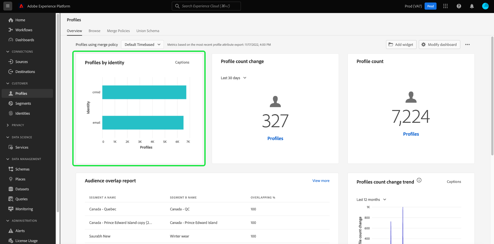

# [!UICONTROL 用户档案] 仪表板

Adobe Experience Platform用户界面(UI)提供了一个功能板，您可以通过该功能板查看有关您的 [!DNL Real-time Customer Profile] 数据，在每日快照期间捕获。 本指南概述了如何访问和使用 [!UICONTROL 用户档案] 功能板，并提供有关功能板中显示的量度的信息。

有关Experience Platform用户界面中所有用户档案功能的概述，请访问 [实时客户资料UI指南](../../profile/ui/user-guide.md).

## 用户档案功能板数据

的 [!UICONTROL 用户档案] 功能板显示贵组织在“配置文件存储”中(在Experience Platform中)拥有的属性（记录）数据的快照。 快照不包含任何事件（时间系列）数据。

快照中的属性数据完全显示快照拍摄时在特定时间点显示的数据。 换句话说，快照不是数据的近似值或样本，而且“配置文件”功能板不会实时更新。

>[!NOTE]
>
>自拍摄快照以来对数据所做的任何更改或更新，在拍摄下一个快照之前不会反映在功能板中。

## 浏览 [!UICONTROL 用户档案] 仪表板

导航到 [!UICONTROL 用户档案] 功能板中，选择 **[!UICONTROL 用户档案]** 在左边栏中，选择 **[!UICONTROL 概述]** 选项卡来显示功能板。

>[!NOTE]
>
>如果贵组织是Platform的新用户，并且尚未创建活动的配置文件数据集或合并策略，则 [!UICONTROL 用户档案] 功能板不可见。 相反， [!UICONTROL 概述] 选项卡会显示可帮助您开始使用实时客户配置文件的链接和文档。

### 修改 [!UICONTROL 用户档案] 仪表板

您可以修改 [!UICONTROL 用户档案] 通过选择 **[!UICONTROL 修改功能板]**. 这样，您就可以在功能板中移动、添加和删除小组件，以及访问 **[!UICONTROL 构件库]** 以浏览可用小组件并为贵组织创建自定义小组件。

请参阅 [修改功能板](../customize/modify.md) 和 [构件库概述](../customize/widget-library.md) 文档以了解更多信息。

## （测试版）用户档案功效分析 {#profile-efficacy-insights}

>[!IMPORTANT]
>
>用户档案功效分析功能目前处于测试阶段，并非所有用户都能使用。 文档和功能可能会发生变化。

的 [!UICONTROL 功效] 选项卡通过使用用户档案功效小组件提供有关用户档案数据质量和完整性的量度。 这些小部件可概览用户档案的组成、随时间的完整性趋势以及对用户档案数据质量的评估。

请参阅 [用户档案功效小组件部分](#profile-efficacy-widgets) 有关当前可用的小组件的详细信息。

此功能板的布局也可通过选择 [**[!UICONTROL 修改功能板]**](../customize/modify.md) 从 [!UICONTROL 概述] 选项卡。

## 浏览配置文件 {#browse-profiles}

的 [!UICONTROL 浏览] 选项卡，用于搜索和查看摄取到您组织的只读用户档案。 从此处，您可以看到属于用户档案的有关其首选项、过去事件、交互和区段的重要信息

要进一步了解Platform UI中提供的配置文件查看功能，请参阅 [在Real-time Customer Data Platform浏览用户档案](../../rtcdp/profile/profile-browse.md).

## 合并策略 {#merge-policies}

在 [!UICONTROL 用户档案] 功能板基于应用于实时客户资料数据的合并策略。 当从多个来源收集数据以创建客户配置文件时，数据可能包含冲突值。 例如，一个数据集可能将一个客户列为“单个”，而另一个数据集可能将该客户列为“已婚”。 合并策略的作业是确定哪些数据要优先排序，并作为用户档案的一部分显示。

有关合并策略的更多信息，包括如何为贵组织创建、编辑和声明默认的合并策略，请首先阅读 [合并策略概述](../../profile/merge-policies/overview.md).

功能板将自动选择要使用的合并策略。 可以使用合并策略名称旁边的下拉菜单更改应用的合并策略。

>[!NOTE]
>
>下拉菜单仅显示与XDM单个配置文件类相关的合并策略。 但是，如果贵组织已创建多个合并策略，则可能意味着您需要滚动才能查看可用合并策略的完整列表。

## 并集模式

的 [!UICONTROL 并集架构] 功能板显示特定XDM类的并集架构。 通过选择 **[!UICONTROL 类]** 下拉列表中，您可以查看不同XDM类的并集架构。

合并模式由多个共享同一类并已启用用户档案的模式组成。 它们使您能够在单个视图中查看同一类的每个架构中包含的每个字段的集合。

请参阅并集模式UI指南，以了解有关 [在平台UI中查看并集模式](../../profile/ui/union-schema.md#view-union-schemas).

## 小组件和量度

功能板由小组件组成，这些小组件是只读量度，提供有关用户档案数据的重要信息。

最近快照的日期和时间显示在 [!UICONTROL 概述] 选项卡。 自该日期和时间起，所有小组件数据都是准确的。 快照的时间戳以UTC格式提供；它不在单个用户或组织的时区内。

## 标准小组件 {#standard-widgets}

Adobe提供了多个标准小组件，您可以使用这些小组件来可视化与用户档案数据相关的不同量度。 您还可以使用 [!UICONTROL 构件库]. 要了解有关创建自定义小组件的更多信息，请首先阅读 [构件库概述](../customize/widget-library.md).

要进一步了解每个可用的标准小组件，请从以下列表中选择小组件的名称：

* [[!UICONTROL 用户档案计数]](#profile-count)
* [[!UICONTROL 用户档案计数趋势]](#profile-count-trend)
* [[!UICONTROL 配置文件计数更改]](#profile-count-change)
* [[!UICONTROL 用户档案计数更改趋势]](#profiles-count-change-trend)
* [[!UICONTROL 按身份划分的用户档案计数更改趋势]](#profiles-count-change-trend-by-identity)
* [[!UICONTROL 按身份划分的用户档案]](#profiles-by-identity)
* [[!UICONTROL 身份重叠]](#identity-overlap)
* [[!UICONTROL 单个身份配置文件]](#single-identity-profiles)
* [[!UICONTROL 按身份划分的单个身份配置文件]](#single-identity-profiles-by-identity)
* [[!UICONTROL 未分段的用户档案]](#unsegmented-profiles)
* [[!UICONTROL 未分段的用户档案趋势]](#unsegmented-profiles-trend)
* [[!UICONTROL 按身份划分的未分段用户档案]](#unsegmented-profiles-by-identity)
* [[!UICONTROL 受众]](#audiences)
* [[!UICONTROL 映射到目标状态的受众]](#audiences-mapped-to-destination-status)
* [[!UICONTROL 受众大小]](#audiences-size)
* [[!UICONTROL 按合并策略划分的受众重叠]](#audience-overlap-by-merge-policy)

### [!UICONTROL 用户档案计数] {#profile-count}

>[!CONTEXTUALHELP]
>id="platform_dashboards_profiles_profilecount"
>title="用户档案计数"
>abstract="此小组件显示拍摄快照时“配置文件存储区”内合并的配置文件总数。 数字取决于所选的合并策略是否应用于您的配置文件数据。"
>additional-url="https://experienceleague.adobe.com/docs/experience-platform/dashboards/guides/profiles.html" text="从文档了解更多信息"

的 **[!UICONTROL 用户档案计数]** 小组件显示拍摄快照时“配置文件存储区”内合并的配置文件总数。 此数字是将所选合并策略应用于配置文件数据的结果，以便将配置文件片段合并在一起，为每个人形成一个配置文件。

请参阅 [本文档前面关于合并策略的章节](#merge-policies) 以了解更多。

>[!NOTE]
>
>的 [!UICONTROL 用户档案计数] 小组件显示的数字可能与 [!UICONTROL 浏览] 选项卡 [!UICONTROL 用户档案] 部分，原因有多种。 最常见的原因是 [!UICONTROL 浏览] 选项卡会根据贵组织的默认合并策略引用合并的用户档案总数，而 [!UICONTROL 用户档案计数] 小组件会根据您选择在功能板中查看的合并策略，引用合并配置文件的总数。
>
>另一个常见原因是，拍摄功能板快照的时间与为 [!UICONTROL 浏览] 选项卡。 您可以查看 [!UICONTROL 用户档案计数] 小组件上次更新时，会查看小组件上的时间戳，并进一步了解如何在 [!UICONTROL 浏览] 选项卡，请参阅 [实时客户用户档案UI指南中的用户档案计数部分](https://experienceleague.adobe.com/docs/experience-platform/profile/ui/user-guide.html?lang=en#profile-count).

### [!UICONTROL 用户档案计数趋势] {#profile-count-trend}

的 [!UICONTROL 用户档案计数趋势] 小组件使用折线图来说明一段时间内系统中包含的配置文件总数的趋势。 此总数包括自上次每日快照后导入系统的所有用户档案。 数据可在30天、90天和12个月期间显示。 时间段是从小组件的下拉菜单中选择的。

### [!UICONTROL 配置文件计数更改] {#profile-count-change}

>[!CONTEXTUALHELP]
>id="platform_dashboards_profiles_profilescountchange"
>title="配置文件计数更改"
>abstract="此小组件显示合并的用户档案总数 **添加** 到配置文件存储区。 数字取决于所选的合并策略是否应用于您的配置文件数据。"
>additional-url="https://experienceleague.adobe.com/docs/experience-platform/dashboards/guides/profiles.html" text="从文档了解更多信息"

的 **[!UICONTROL 配置文件计数更改]** 小组件显示自上次快照以来添加到配置文件存储区的合并配置文件数量。 此数字是将所选合并策略应用于配置文件数据的结果，以便将配置文件片段合并在一起，为每个人形成一个配置文件。 您可以使用下拉选择器查看过去30天、90天或12个月内添加的用户档案数。

>[!NOTE]
>
>的 [!UICONTROL 配置文件计数更改] 小组件反映添加的用户档案数 **after** 初始配置文件摄取和配置文件存储设置。 换言之，如果贵组织设置用户档案存储并在第1天摄取了4,000,000个用户档案，则在24小时内即可使用功能板，但是 [!UICONTROL 配置文件计数更改] 小组件将设置为0。 这样做是为了避免与将用户档案初始摄取到系统中相关的尖峰。 在接下来的30天中，您的组织会将另外1,000,000个用户档案摄取到用户档案存储区。 在拍摄下一个快照后， [!UICONTROL 配置文件计数更改] 小组件将显示共添加1,000,000个用户档案， [!UICONTROL 用户档案计数] 小组件会显示总共5,000,000个用户档案。

### [!UICONTROL 用户档案计数更改趋势] {#profiles-count-change-trend}

>[!CONTEXTUALHELP]
>id="platform_dashboards_profiles_profilesaddedtrend"
>title="用户档案计数更改趋势"
>abstract="此小组件显示过去30天、90天或12个月内每天添加到配置文件存储的合并配置文件数。 此数字还取决于所选合并策略是否应用于您的配置文件数据。"
>additional-url="https://experienceleague.adobe.com/docs/experience-platform/dashboards/guides/profiles.html" text="从文档了解更多信息"

的 **[!UICONTROL 用户档案计数更改趋势]** 小组件显示过去30天、90天或12个月内每天添加到用户档案存储的合并用户档案总数。 此数字在拍摄快照时每天都会更新，因此，如果要将配置文件摄取到平台，则在拍摄下一个快照之前不会反映配置文件数量。 添加的用户档案计数是将选定的合并策略应用于您的用户档案数据的结果，以便将用户档案片段合并在一起，为每个人形成一个用户档案。

请参阅 [本文档前面关于合并策略的章节](#merge-policies) 以了解更多。

的 **[!UICONTROL 用户档案计数更改趋势]** 小组件在小组件的右上角显示“字幕”按钮。 选择 **[!UICONTROL 字幕]** 打开自动字幕对话框。

机器学习模型通过分析图表和数据自动生成用于描述关键趋势和重要事件的字幕。

### [!UICONTROL 按身份划分的用户档案计数更改趋势] {#profiles-count-change-trend-by-identity}

<!-- This widget uses a line graph to illustrate the change in number of profiles filtered by a chosen source identity and merge policy. -->

此小组件根据选定的源标识和合并策略过滤配置文件计数，然后使用折线图说明不同时段的数量变化。 从页面顶部的概述下拉菜单中选择合并策略，从小组件下拉菜单中选择源标识和时间段。 可在30天、90天和12个月期间显示趋势。

此小组件通过展示按所需身份过滤的用户档案的增长模式，帮助您管理目标激活需求。

### [!UICONTROL 按身份划分的用户档案] {#profiles-by-identity}

>[!CONTEXTUALHELP]
>id="platform_dashboards_profiles_profilesbyidentity"
>title="按身份划分的用户档案"
>abstract="此小组件按身份显示“配置文件存储区”中所有合并配置文件的划分。"
>additional-url="https://experienceleague.adobe.com/docs/experience-platform/dashboards/guides/profiles.html" text="从文档了解更多信息"

的 **[!UICONTROL 按身份划分的用户档案]** 小组件可显示“配置文件存储区”中所有合并配置文件的身份划分。 按身份划分的用户档案总数（即将每个命名空间显示的值相加）可能大于合并的用户档案总数，因为一个用户档案可能具有与其关联的多个命名空间。 例如，如果客户在多个渠道上与您的品牌进行交互，则多个命名空间将与该个别客户关联。

请参阅 [本文档前面关于合并策略的章节](#merge-policies) 以了解更多。

选择 **[!UICONTROL 字幕]** 打开自动字幕对话框。

机器学习模型通过分析数据的整体分布和关键维度自动生成数据分析。

要进一步了解身份信息，请访问 [Adobe Experience Platform Identity Service文档](../../identity-service/home.md).

### [!UICONTROL 身份重叠] {#identity-overlap}

>[!CONTEXTUALHELP]
>id="platform_dashboards_profiles_identityoverlap"
>title="身份重叠"
>abstract="此小组件使用维恩图显示配置文件存储区中包含两个选定身份的配置文件重叠。"
>additional-url="https://experienceleague.adobe.com/docs/experience-platform/dashboards/guides/profiles.html" text="从文档了解更多信息"

的 **[!UICONTROL 身份重叠]** 小组件使用维恩图或设置图来显示配置文件存储区中包含两个选定身份的配置文件重叠。

使用小组件下拉菜单选择要比较的身份。 圈子显示包含每个身份的用户档案的相对总计数。 包含两个标识的用户档案的数量由圈子之间重叠的大小表示。 如果客户在多个渠道上与您的品牌进行交互，则多个身份将与该个别客户关联，因此，您的组织可能具有多个包含多个身份片段的用户档案。

有关用户档案片段的更多信息，请首先阅读 [配置文件片段与合并的配置文件](https://experienceleague.adobe.com/docs/experience-platform/profile/home.html?lang=en#profile-fragments-vs-merged-profiles) （在“实时客户资料”概述中）。

要进一步了解身份信息，请访问 [Adobe Experience Platform Identity Service文档](../../identity-service/home.md).

### [!UICONTROL 单个身份配置文件] {#single-identity-profiles}

>[!CONTEXTUALHELP]
>id="platform_dashboards_profiles_singleidentityprofiles"
>title="单个身份配置文件"
>abstract="此小组件提供贵组织仅具有一种类型的ID类型来创建其身份的用户档案计数。 此ID类型可以是电子邮件或ECID。"
>additional-url="https://experienceleague.adobe.com/docs/experience-platform/dashboards/guides/profiles.html" text="从文档了解更多信息"

的 [!UICONTROL 单个身份配置文件] 小组件会提供贵组织仅具有一种类型的ID类型来创建其身份的用户档案计数。 此ID类型可以是电子邮件或ECID。 配置文件计数是根据最近快照中包含的数据生成的。

### [!UICONTROL 按身份划分的单个身份配置文件] {#single-identity-profiles-by-identity}

此小组件使用条形图来说明仅使用单个唯一标识符标识的用户档案总数。 该小组件最多支持五种最常出现的身份。

将鼠标悬停在单个栏上可查看一个对话框，其中详细列出了身份的用户档案总数。

### [!UICONTROL 未分段的用户档案] {#unsegmented-profiles}

>[!CONTEXTUALHELP]
>id="platform_dashboards_profiles_unsegmentedprofiles"
>title="未分段的用户档案"
>abstract="此小组件提供了未附加到任何区段的所有用户档案总数，并代表了在整个组织内激活用户档案的机会。"
>additional-url="https://experienceleague.adobe.com/docs/experience-platform/dashboards/guides/profiles.html" text="从文档了解更多信息"

的 [!UICONTROL 未分段的用户档案] 小组件提供未附加到任何区段的所有用户档案总数。 生成的数字从上次快照开始就是准确的，它代表了整个组织中激活配置文件的机会。 它还表示有机会排除未提供足够ROI的用户档案。

### [!UICONTROL 未分段的用户档案趋势] {#unsegmented-profiles-trend}

>[!CONTEXTUALHELP]
>id="platform_dashboards_profiles_unsegmentedprofilestrend"
>title="未分段的用户档案趋势"
>abstract="此小组件为在给定时间段内未附加到任何区段的用户档案数量提供了折线图插图。 未附加到任何区段的用户档案趋势可在30天、90天和12个月期间进行可视化。"
>additional-url="https://experienceleague.adobe.com/docs/experience-platform/dashboards/guides/profiles.html#unsegmented-profiles-trend" text="从文档了解更多信息"

的 [!UICONTROL 未分段的用户档案趋势] 小组件为在给定时间段内未附加到任何区段的用户档案数量提供了折线图插图。 未附加到任何区段的用户档案趋势可在30天、90天和12个月期间进行可视化。 时间段是从小组件的下拉菜单中选择的。 轮廓计数反映在y轴上，时间反映在x轴上。

### [!UICONTROL 按身份划分的未分段用户档案] {#unsegmented-profiles-by-identity}

>[!CONTEXTUALHELP]
>id="platform_dashboards_profiles_unsegmentedprofilesbyidentity"
>title="按身份划分的未分段用户档案"
>abstract="此小组件按其唯一标识符对未分段的用户档案总数进行分类。"
>additional-url="https://experienceleague.adobe.com/docs/experience-platform/dashboards/guides/profiles.html" text="从文档了解更多信息"

的 [!UICONTROL 按身份划分的未分段用户档案] 小组件按其唯一标识符对未分段的用户档案总数进行分类。 数据以条形图形式显示，以便于比较。

### [!UICONTROL 受众] {#audiences}

此小组件根据所选的应用于用户档案数据的合并策略，提供准备激活的区段总数。

选择 **[!UICONTROL 受众]** 导航到 [!UICONTROL 区段] 仪表板 [!UICONTROL 浏览] 选项卡。 从此处，您可以看到组织的所有区段定义列表。

<!-- https://jira.corp.adobe.com/browse/PLAT-115291 -->

<!-- * [[!UICONTROL Audiences change trend]](#audiences-change-trend) -->
<!-- ### [!UICONTROL Audiences change trend] {#audiences-change-trend}

This line graph widget visualizes the change in the total number of audiences each day, trending over time. The change in the number of audiences is dependent on the selected merge policy being applied to your profile data. The period of analysis is selected from the widget dropdown menu. The bar chart can be visualized over 30 days, 90 days, and 12-month periods.  

The visualization allows you to monitor the overall health of audiences within Adobe Experience Platform by understanding trends in the growth or decline of the total number of audiences. -->

<!--  -->

<!-- * [[!UICONTROL Audience overlap report]](#audience-overlap-report) -->
<!-- ### [!UICONTROL Audience overlap report] {#audience-overlap-report} -->

<!-- View an ordered list of audiences by highest or lowest overlap percentages by selected merge policy. -->
<!--  -->
<!-- https://jira.corp.adobe.com/browse/PLAT-126851 -->

### [!UICONTROL 映射到目标状态的受众] {#audiences-mapped-to-destination-status}

的 [!UICONTROL 映射到目标状态的受众] 小组件在单个量度中显示已映射和未映射受众的总数，并使用圆环图来说明其总数之间的比例差异。 计算的数字取决于所选的合并策略。

当光标悬停在圆环图的相应部分上时，对话框中会显示已映射或未映射受众的单个计数。

### [!UICONTROL 受众大小] {#audiences-size}

的 [!UICONTROL 受众大小] 小组件提供了一个双列表，其中列出了最多20个区段以及每个区段包含的受众总数。 该列表按受众总数从高到低进行排序。 总受众大小取决于应用的合并策略。

要查看区段的完整信息，请从提供的列表中选择一个区段名称，以导航到 [!UICONTROL 区段] [!UICONTROL 详细信息] 页面。 此外，通过选择 **[!UICONTROL 查看所有区段]** 在小组件的末尾，您可以导航到 [!UICONTROL 区段] [!UICONTROL 浏览] 选项卡来查找任何现有区段。

有关 [[!UICONTROL 区段] [!UICONTROL  浏览] 选项卡](https://experienceleague.adobe.com/docs/experience-platform/segmentation/ui/overview.html#browse).

### [!UICONTROL 按合并策略划分的受众重叠] {#audience-overlap-by-merge-policy}

此小组件使用维恩图来显示两个选定区段的重叠。 合并策略是从页面顶部的概述下拉列表中选择的，而分析区段则从小组件的两个下拉菜单中选择。 通过将鼠标悬停在圆圈或交集上，可查看相关区段定义中包含的用户档案总数。

当小组件显示区段定义的可视交叉时，您可以通过研究区段定义之间的相似性来优化分段策略。

## （测试版）用户档案功效小组件 {#profile-efficacy-widgets}

>[!IMPORTANT]
>
>用户档案功效小组件当前为测试版，并非所有用户都可用。 文档和功能可能会发生变化。

Adobe会提供多个小组件，用于评估所摄取的用户档案是否完整，以便用于数据分析。 每个用户档案效能小组件都可通过合并策略进行过滤。 要更改合并策略筛选器，请选择[!UICONTROL 使用合并策略的用户档案] 下拉列表，然后从可用列表中选择相应的策略。

要进一步了解每个用户档案功效小组件，请从以下列表中选择小组件的名称：

* [[!UICONTROL 属性质量评估]](#attributes-quality-assessment)
* [[!UICONTROL 按完整性划分的用户档案]](#profiles-by-completeness)
* [[!UICONTROL 用户档案完整性趋势]](#profiles-completeness-trend)

### （测试版） [!UICONTROL 属性质量评估] {#attributes-quality-assessment}

>[!CONTEXTUALHELP]
>id="platform_dashboards_profiles_attributesqualityassessment"
>title="属性质量评估"
>abstract="此小组件可根据所有用户档案的属性显示其完整性和基数。 每行都描述一个属性。 的 **用户档案** 列提供具有此属性且填充了非空值的配置文件数。 的 **完整性** 百分比由具有此属性且填充了非空值的配置文件总数除以该属性配置文件中非空值的总数确定。 **基数** 提供此属性在所有属性中唯一非空值的总数。"
>additional-url="https://experienceleague.adobe.com/docs/experience-platform/dashboards/guides/profiles.html" text="从文档了解更多信息"

的 [!UICONTROL 属性质量评估] 小组件会根据所有用户档案的属性显示其完整性和基数。 数据精确到上次处理日期。 此信息以表格形式呈现，表格中有四列，其中表格中的每一行代表单个属性。

| 栏目 | 描述 |
|---|---|
| 属性 | 属性的名称。 |
| 用户档案 | 具有此属性且填充了非空值的配置文件数。 |
| 完整性 | 此百分比由具有此属性且填充了非空值的配置文件总数确定。 该数值是用用户档案总数除以该属性用户档案中非空值的总数计算得来的。 |
| 基数 | 总数 **独特** 此属性的非空值。 它在所有用户档案中进行测量。 |

### （测试版） [!UICONTROL 按完整性划分的用户档案] {#profiles-by-completeness}

>[!CONTEXTUALHELP]
>id="platform_dashboards_profiles_profilesbycompleteness"
>title="按完整性划分的用户档案"
>abstract="圆环图显示在所有观察到的属性中填充了非空值的配置文件属性的百分比。 它说明了高、中或低完整性的用户档案比例。 高完整性用户档案会填充其70%以上的属性。 中等完整性用户档案的属性有30%到70%的已填充。 不完整性较低的用户档案填充的属性不到其30%。"
>additional-url="https://experienceleague.adobe.com/docs/experience-platform/dashboards/guides/profiles.html" text="从文档了解更多信息"

的 [!UICONTROL 按完整性划分的用户档案] 小组件创建自上次处理日期以来配置文件完整性的圆环图。 配置文件的完整性由所有观察到的属性中填充了非空值的属性的百分比来衡量。

此小组件显示高完整性、中完整性或低完整性的用户档案比例。 默认情况下，配置了三个完整性级别：

* 高度完整性：用户档案超过70%的属性已填充。
* 中等完整性：用户档案中已填充其属性的30%到70%。
* 低完整性：用户档案已填充的属性不到其总数的30%。

### （测试版） [!UICONTROL 用户档案完整性趋势] {#profiles-completeness-trend}

>[!CONTEXTUALHELP]
>id="platform_dashboards_profiles_profilescompletenesstrend"
>title="用户档案完整性趋势"
>abstract="此小组件创建堆叠式面积图以描述配置文件随时间的完整性趋势。 完整性由所有观察到的属性中填充了非空值的属性的百分比来衡量。"
>additional-url="https://experienceleague.adobe.com/docs/experience-platform/dashboards/guides/profiles.html" text="从文档了解更多信息"

此小组件创建堆叠式面积图以描述配置文件随时间的完整性趋势。 完整性由所有观察到的属性中填充了非空值的属性的百分比来衡量。 它将配置文件完整性分类为自上次处理日期以来的高、中或低完整性。

x轴表示时间，y轴表示用户档案的数量，颜色表示用户档案完整性的三个级别。

完整性的三个级别是：

* 高度完整性：用户档案中超过70%的属性已填充。
* 中等完整性：用户档案中已填充的属性少于70%且超过30%。
* 低完整性：用户档案填充的属性少于30%。

## 后续步骤

通过阅读本文档，您现在应该能够找到“配置文件”功能板并了解可用小组件中显示的量度。 了解有关使用的更多信息 [!DNL Profile] Experience PlatformUI中的数据，请参阅 [实时客户资料UI指南](../../profile/ui/user-guide.md).
