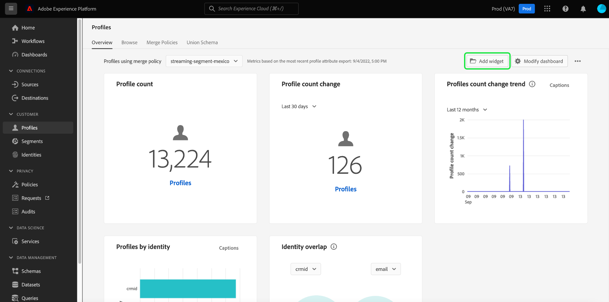

# [!UICONTROL 配置文件] 仪表板

Adobe Experience Platform用户界面(UI)提供了一个功能板，通过该功能板，您可以查看有关 [!DNL Real-Time Customer Profile] 数据，在每日快照期间捕获。 本指南概述如何在UI中访问和使用用户档案仪表板，并提供有关仪表板中显示的量度的信息。

有关Experience Platform用户界面中所有配置文件功能的概述，请参阅 [Real-Time Customer Profile用户界面指南](../../profile/ui/user-guide.md).

## 个人资料仪表板数据

配置文件仪表板显示贵组织在Experience Platform的配置文件存储区中拥有的属性（记录）数据的快照。 快照不包括任何事件（时间序列）数据。

快照中的属性数据显示的数据与拍摄快照时特定时间点显示的数据完全相同。 换句话说，快照不是数据的近似值或样本，并且配置文件仪表板没有实时更新。

>[!NOTE]
>
>自拍摄快照以来对数据所做的任何更改或更新都不会反映在功能板中，直到拍摄下一个快照为止。

## 浏览“配置文件”仪表板

要导航到Platform UI中的配置文件仪表板，请选择 **[!UICONTROL 配置文件]** 然后，在左边栏中选择 **[!UICONTROL 概述]** 选项卡以显示仪表板。

>[!NOTE]
>
>如果您的组织是初次使用Platform，但尚未创建活动的配置文件数据集或合并策略，则配置文件仪表板不可见。 相反， [!UICONTROL 概述] 选项卡显示链接和文档，以帮助您开始使用Real-Time Customer Profile。

### 修改用户档案仪表板

通过选择，可以修改“轮廓”操控板的外观 **[!UICONTROL 修改仪表板]**. 这使您可以在仪表板中移动、添加和删除构件，以及访问 **[!UICONTROL 构件库]** 浏览可用的构件，并为您的组织创建自定义构件。

请参阅 [修改仪表板](../customize/modify.md) 和 [构件库概述](../customize/widget-library.md) 文档，以了解更多信息。

### 添加构件 {#add-widget}

选择 **[!UICONTROL 添加构件]** 导航到构件库，然后查看要添加到仪表板的可用构件列表。

从构件库中，您可以浏览选择的标准和自定义受众构件。 有关如何添加构件的信息，请参阅构件库文档，了解如何 [添加构件](../customize/widget-library.md#add-widgets).

<!-- ## (Beta) Profile efficacy insights {#profile-efficacy-insights}

>[!IMPORTANT]
>
>The profile efficacy insight functionality is currently in beta and are not available to all users. The documentation and the functionality are subject to change.

The [!UICONTROL Efficacy] tab provides metrics on the quality and completeness of your profile data through the use of profile efficacy widgets. These widgets illustrate at a glance the composition of your profiles, trends in completeness over time, and assessments on the quality of your profile data.

See the [profile efficacy widgets section](#profile-efficacy-widgets) for more information on the widgets currently available.

The layout of this dashboard is also customizable by selecting [**[!UICONTROL Modify dashboard]**](../customize/modify.md) from the [!UICONTROL Overview] tab. -->

## 浏览配置文件 {#browse-profiles}

此 [!UICONTROL 浏览] 选项卡允许您搜索和查看摄取到组织中的只读配置文件。 从此处，您可以看到属于用户档案的重要信息，这些信息涉及其偏好、过去的活动、交互和受众。

要详细了解Platform UI中提供的配置文件查看功能，请参阅以下文档： [在Adobe Real-time Customer Data Platform中浏览配置文件](../../rtcdp/profile/profile-browse.md).

## 合并策略 {#merge-policies}

配置文件仪表板中显示的量度基于应用于实时客户配置文件数据的合并策略。 当从多个来源汇集数据以创建客户配置文件时，数据可能包含冲突的值。 例如，一个数据集可能将客户列为“单身”，而另一个数据集可能将客户列为“已婚”。 合并策略的工作是确定要优先处理哪些数据并将其显示为配置文件的一部分。

有关合并策略的更多信息，包括如何为组织创建、编辑和声明默认合并策略，请参阅 [合并策略概述](../../profile/merge-policies/overview.md).

仪表板将自动选择要使用的合并策略。 可以使用合并策略名称旁边的下拉菜单更改应用的合并策略。

>[!NOTE]
>
>下拉菜单仅显示使用 `_xdm.context.profile` 架构。 但是，如果贵组织创建了多个合并策略，则可能意味着您需要滚动才能查看可用合并策略的完整列表。

## 合并模式

此 [!UICONTROL 合并架构] 仪表板显示特定XDM类的合并架构。 通过选择 **[!UICONTROL 类]** 下拉列表中，您可以查看不同XDM类的合并架构。

合并模式由多个共享同一类并已启用用户档案的模式组成。 它们允许您在单个视图中查看共享同一类的每个架构中包含的每个字段的合并。

请参阅合并架构UI指南，了解更多关于 [在Platform UI中查看合并架构](../../profile/ui/union-schema.md#view-union-schemas).

## 小工具和量度

仪表板由小组件组成，这些小组件是只读量度，提供有关用户档案数据的重要信息。

最新快照的日期和时间显示在的顶部 [!UICONTROL 概述] 选项卡。 截至该日期和时间，所有构件数据都是准确的。 快照的时间戳以UTC格式提供；它不在单个用户或组织的时区内。

## 标准构件 {#standard-widgets}

Adobe提供了多个标准构件，您可以使用这些构件可视化与配置文件数据相关的各种指标。 您还可以使用创建要与贵组织共享的自定义构件 [!UICONTROL 构件库]. 要了解有关创建自定义小部件的更多信息，请从阅读 [构件库概述](../customize/widget-library.md).

要详细了解每个可用的标准构件，请从以下列表中选择构件的名称：

* [[!UICONTROL 配置文件计数]](#profile-count)
* [[!UICONTROL 配置文件计数趋势]](#profile-count-trend)
* [[!UICONTROL 配置文件计数变化]](#profile-count-change)
* [[!UICONTROL 配置文件计数变化趋势]](#profiles-count-change-trend)
* [[!UICONTROL 按身份列出的配置文件计数变化趋势]](#profiles-count-change-trend-by-identity)
* [[!UICONTROL 按标识列出的配置文件]](#profiles-by-identity)
* [[!UICONTROL 标识重叠]](#identity-overlap)
* [[!UICONTROL 单一标识配置文件]](#single-identity-profiles)
* [[!UICONTROL 按身份列出的单一身份配置文件]](#single-identity-profiles-by-identity)
* [[!UICONTROL 未分段的配置文件]](#unsegmented-profiles)
* [[!UICONTROL 未分段配置文件变化趋势]](#unsegmented-profiles-change-trend)
* [[!UICONTROL 按标识列出的未分段的配置文件]](#unsegmented-profiles-by-identity)
* [[!UICONTROL 受众]](#audiences)
* [[!UICONTROL 映射到目标状态的受众]](#audiences-mapped-to-destination-status)
* [[!UICONTROL 受众规模]](#audiences-size)
* [[!UICONTROL 按合并策略列出的受众重叠]](#audience-overlap-by-merge-policy)
* [[!UICONTROL 受众重叠报表]](#audience-overlap-report)

### [!UICONTROL 配置文件计数] {#profile-count}

>[!CONTEXTUALHELP]
>id="platform_dashboards_profiles_profilecount"
>title="配置文件计数"
>abstract="此小部件显示在拍摄快照时配置文件存储中合并配置文件的总数。该数量取决于应用于您的配置文件数据的所选合并策略。"

此 **[!UICONTROL 配置文件计数]** 构件显示拍摄快照时配置文件存储区中合并的配置文件总数。 此数字是所选合并策略应用到配置文件数据以合并配置文件片段并为每个人形成一个配置文件的结果。

请参阅 [之前关于合并策略的章节](#merge-policies) 了解更多信息。

>[!NOTE]
>
>此 [!UICONTROL 配置文件计数] 构件显示的数字可能与上显示的配置文件计数不同。 [!UICONTROL 浏览] 在中选项卡 [!UICONTROL 配置文件] 部分，原因有多种。 最常见的原因是 [!UICONTROL 浏览] 选项卡根据贵组织的默认合并策略引用合并的配置文件总数，而 [!UICONTROL 配置文件计数] 构件会根据您选择在仪表板中查看的合并策略，引用合并的配置文件总数。
>
>另一个常见原因是拍摄仪表板快照的时间与为运行示例作业的时间之间的差异 [!UICONTROL 浏览] 选项卡。 您会看到 [!UICONTROL 配置文件计数] 构件上次更新是通过查看构件上的时间戳进行的。 要详细了解如何在上触发示例作业，请 [!UICONTROL 浏览] 选项卡，请参见 [实时客户用户档案UI指南中的用户档案计数部分](https://experienceleague.adobe.com/docs/experience-platform/profile/ui/user-guide.html?lang=en#profile-count).

### [!UICONTROL 配置文件计数趋势] {#profile-count-trend}

此 [!UICONTROL 配置文件计数趋势] 构件使用线形图说明系统中包含的配置文件总数随时间变化的趋势。 此总数包括自上次每日快照以来导入到系统中的任何配置文件。 数据可以在30天、90天和12个月的时段内可视化。 从小部件中的下拉菜单中选择时间段。

### [!UICONTROL 配置文件计数变化] {#profile-count-change}

>[!CONTEXTUALHELP]
>id="platform_dashboards_profiles_profilescountchange"
>title="配置文件计数变化"
>abstract="此小部件显示在上次拍摄快照时&#x200B;**添加到**&#x200B;配置文件存储的合并配置文件的总数。该数量取决于应用于您的配置文件数据的所选合并策略。"

此 **[!UICONTROL 配置文件计数更改]** 构件显示自上次快照以来添加到配置文件存储区的合并配置文件数。 此数字是所选合并策略应用到配置文件数据以合并配置文件片段并为每个人形成一个配置文件的结果。 您可以使用下拉选择器查看过去30天、90天或12个月内添加的用户档案数。

>[!NOTE]
>
>此 [!UICONTROL 配置文件计数更改] 构件反映添加的配置文件数 **之后** 初始配置文件摄取和配置文件存储设置。 换言之，如果贵组织设置了个人资料存储区并在第1天接收了4,000,000个数据，那么在24小时内，该仪表板将可用，但是 [!UICONTROL 配置文件计数更改] 构件将设置为0。 这样做是为了避免与用户档案首次摄取到系统相关的峰值。 在接下来的30天内，您的组织会额外摄取1,000,000个配置文件到配置文件存储区。 拍摄下一个快照后， [!UICONTROL 配置文件计数更改] 构件将显示添加的总共1,000,000个配置文件，而 [!UICONTROL 配置文件计数] 该小组件将显示总共5,000,000个配置文件。

### [!UICONTROL 配置文件计数变化趋势] {#profiles-count-change-trend}

>[!CONTEXTUALHELP]
>id="platform_dashboards_profiles_profilesaddedtrend"
>title="配置文件计数变化趋势"
>abstract="此小部件显示在过去 30 天、90 天或 12 个月内每天添加到配置文件存储的合并配置文件的数量。该数量也取决于应用于您的配置文件数据的所选合并策略。"

此 **[!UICONTROL 配置文件计数变化趋势]** 构件显示过去30天、90天或12个月内每天添加到配置文件存储区的合并配置文件总数。 此数量会在每天拍摄快照时更新，因此，如果您要将配置文件摄取到Platform，则直到拍摄下一个快照后才会反映配置文件的数量。 添加的配置文件计数是选定的合并策略应用到配置文件数据的结果，以便将配置文件片段合并在一起，为每个人形成一个配置文件。

请参阅 [之前关于合并策略的章节](#merge-policies) 了解更多信息。

此 **[!UICONTROL 配置文件计数变化趋势]** 构件在构件的右上角显示“字幕”按钮。 选择 **[!UICONTROL 字幕]** 以打开自动字幕对话框。

机器学习模型通过分析图表和数据自动生成描述关键趋势和重要事件的字幕。 注释会根据字幕添加到图表中。 选择题注以专注于其相应的注释。

### [!UICONTROL 按身份列出的配置文件计数变化趋势] {#profiles-count-change-trend-by-identity}

<!-- This widget uses a line graph to illustrate the change in number of profiles filtered by a chosen source identity and merge policy. -->

此构件根据选定的源标识和合并策略筛选用户档案计数，然后使用线形图说明各种期间数量的变化。 从页面顶部的概述下拉菜单中选择合并策略，从小组件下拉菜单中选择源标识和时间段。 可以在30天、90天和12个月期间可视化趋势。

该构件通过展示按所需身份过滤的用户档案的增长模式，帮助您管理目标激活需求。

### [!UICONTROL 按标识列出的配置文件] {#profiles-by-identity}

>[!CONTEXTUALHELP]
>id="platform_dashboards_profiles_profilesbyidentity"
>title="各个标识的配置文件"
>abstract="此小部件按标识显示您的配置文件存储中所有合并配置文件的明细。"

此 **[!UICONTROL 按身份列出的配置文件]** 构件显示配置文件存储区中所有合并配置文件的身份划分。 按身份划分的配置文件总数（即为每个命名空间显示的值相加）可能高于合并的配置文件总数，因为一个配置文件可能具有多个与其关联的命名空间。 例如，如果客户在多个渠道上与您的品牌互动，则多个命名空间将与该个人客户关联。

请参阅 [之前关于合并策略的章节](#merge-policies) 了解更多信息。

选择 **[!UICONTROL 字幕]** 以打开自动字幕对话框。

机器学习模型通过分析数据的总体分布和关键维度自动生成数据见解。

要了解有关身份的详细信息，请访问 [Adobe Experience Platform Identity服务文档](../../identity-service/home.md).

### [!UICONTROL 标识重叠] {#identity-overlap}

>[!CONTEXTUALHELP]
>id="platform_dashboards_profiles_identityoverlap"
>title="标识重叠"
>abstract="此小部件使用维恩图显示您的配置文件存储中包含两个选定标识的配置文件的重叠。"

此 **[!UICONTROL 身份重叠]** 构件使用维恩图或设置图来显示配置文件存储区中包含两个选定标识的配置文件重叠。

使用小组件下拉菜单选择要比较的身份。 圆圈显示包含每个身份的用户档案的相对总数。 包含两种身份的用户档案的数量由圆之间的重叠大小表示。 如果客户在多个渠道上与您的品牌互动，则多个身份将与该个人客户关联，因此，您的组织可能拥有多个包含多个身份片段的配置文件。

有关配置文件片段的更多信息，请参阅以下章节： [配置文件片段与合并的配置文件](https://experienceleague.adobe.com/docs/experience-platform/profile/home.html?lang=en#profile-fragments-vs-merged-profiles) 在Real-Time Customer Profile概述中。

要了解有关身份的详细信息，请访问 [Adobe Experience Platform Identity服务文档](../../identity-service/home.md).

### [!UICONTROL 单一标识配置文件] {#single-identity-profiles}

>[!CONTEXTUALHELP]
>id="platform_dashboards_profiles_singleidentityprofiles"
>title="单一标识配置文件"
>abstract="此小部件提供您组织的只有一种类型的 ID 类型创建其标识的配置文件的计数。此 ID 类型可以是电子邮件或 ECID。"

此 [!UICONTROL 单一身份配置文件] 小组件提供贵组织仅有一种类型创建其身份的ID类型的配置文件的计数。 此 ID 类型可以是电子邮件或 ECID。配置文件计数是根据最新快照中包含的数据生成的。

### [!UICONTROL 按身份列出的单一身份配置文件] {#single-identity-profiles-by-identity}

此构件使用条形图说明仅通过单个唯一标识符标识的用户档案总数。 该构件支持最多五个最常见的身份。

将鼠标悬停在各个栏上可查看一个对话框，其中详细说明了标识的配置文件总数。

### [!UICONTROL 未分段的配置文件] {#unsegmented-profiles}

>[!CONTEXTUALHELP]
>id="platform_dashboards_profiles_unsegmentedprofiles"
>title="未分段的配置文件"
>abstract="此构件提供未附加到任何受众的所有配置文件总数，并代表在您的组织内激活配置文件的机会。"

此 [!UICONTROL 未分段的配置文件] 构件提供未附加到任何受众的所有用户档案的总数。 生成的数字截至上次快照时准确，表示在整个组织内激活用户档案的机会。 它还表示有机会删除未提供足够ROI的用户档案。

### [!UICONTROL 未分段配置文件变化趋势] {#unsegmented-profiles-change-trend}

>[!CONTEXTUALHELP]
>id="platform_dashboards_profiles_unsegmentedprofilestrend"
>title="未分段的配置文件趋势"
>abstract="此构件为给定时间段内未附加到任何受众的用户档案数量提供折线图插图。 未附加到受众的用户档案趋势可以在30天、90天和12个月的时段内可视化。"

此 [!UICONTROL 未分段配置文件变化趋势] 构件使用折线图来说明自上次每日快照以来添加的未附加到任何受众的配置文件数。 未附加到任何受众的用户档案的变化趋势可以在30天、90天和12个月的时段内可视化。 从小部件中的下拉菜单中选择时间段。 轮廓计数反映在y轴上，时间反映在x轴上。

### [!UICONTROL 按标识列出的未分段的配置文件] {#unsegmented-profiles-by-identity}

>[!NOTE]
>
>“按身份划分的未分段配置文件”小组件自2022年10月起已被弃用，不再可用。

<!-- 

>[!CONTEXTUALHELP]
>id="platform_dashboards_profiles_unsegmentedprofilesbyidentity"
>title="Unsegmented profiles by identity"
>abstract="This widget categorizes the total number of unsegmented profiles by their unique identifier."

The [!UICONTROL Unsegmented Profiles by Identity] widget categorizes the total number of unsegmented profiles by their unique identifier. The data is visualized in a bar chart for ease of comparison. 

 -->

### [!UICONTROL 受众] {#audiences}

此构件根据应用于用户档案数据的所选合并策略，提供准备好激活的受众总数。

选择 **[!UICONTROL 受众]** 导航到 [!UICONTROL 区段] 仪表板 [!UICONTROL 浏览] 选项卡。 从该处，您可以查看组织的所有区段定义的列表。

<!-- https://jira.corp.adobe.com/browse/PLAT-115291 -->

<!-- * [[!UICONTROL Audiences change trend]](#audiences-change-trend) -->
<!-- ### [!UICONTROL Audiences change trend] {#audiences-change-trend}

This line graph widget visualizes the change in the total number of audiences each day, trending over time. The change in the number of audiences is dependent on the selected merge policy being applied to your profile data. The period of analysis is selected from the widget dropdown menu. The bar chart can be visualized over 30 days, 90 days, and 12-month periods.  

The visualization allows you to monitor the overall health of audiences within Adobe Experience Platform by understanding trends in the growth or decline of the total number of audiences. -->

<!--  -->

### [!UICONTROL 受众重叠报表] {#audience-overlap-report}

此构件可将按合并策略筛选的所有可用受众中的数据重叠情况制成表格化。 为从屏幕顶部的下拉菜单选择的合并策略提供了从最高重叠百分比到最低重叠百分比排名的五个受众列表。 两个分析的受众列于 [!UICONTROL 受众A名称] 和 [!UICONTROL 受众B名称] 列。 第三列中提供的重叠百分比精确到小数点后的12位。

受众重叠报表可帮助您构建新的、高性能受众。 通过观察高百分比重叠，您可以抑制受众并防止将相同的受众发送到不同的目标。 它们还可以帮助您识别可能有助于更好分段的可隐藏见解。 重叠百分比较低有助于找到要追踪的独特用户档案。

选择 **[!UICONTROL 查看更多]** 以打开包含更多受众重叠数据的全屏对话框。

此 [!UICONTROL 受众重叠报表] 对话框。 此对话框最多可包含50行受众重叠分析，这些分析细分为六列。 选择设置图标()，以从表中删除或添加列。

>[!NOTE]
>
>选择 **[!UICONTROL 重叠]** 列标题，用于将结果的排名在最高到最低或最低到最高之间更改。

要以PDF格式下载整个报表，请选择选项菜单(**`...`**)后跟 **[!UICONTROL 下载]**.

从报表中选择一行，以打开重叠分析的维恩图。 将鼠标悬停在维恩图的某个部分上可查看对话框中的配置文件计数。

选择 **[!UICONTROL 关闭]** 以返回 [!UICONTROL 配置文件] 仪表板。

### [!UICONTROL 映射到目标状态的受众] {#audiences-mapped-to-destination-status}

此 [!UICONTROL 映射到目标状态的受众] 构件在单个量度中显示已映射和未映射受众的总数，并使用圆环图说明两者总数之间的比例差异。 计算出的数字取决于所选的合并策略。

当光标悬停在圆环图的相应部分上时，已映射或未映射受众的单个计数会显示在对话框中。

### [!UICONTROL 受众规模] {#audiences-size}

此 [!UICONTROL 受众规模] 构件提供了一张两列表格，列出最多20个受众的名称以及每个受众中包含的用户档案总数。 该列表根据受众中包含的用户档案总数从高到低排序。 总受众人数取决于应用的合并策略。

要查看有关受众的完整信息，请从提供的列表中选择受众名称，以导航到 [!UICONTROL 受众] [!UICONTROL 详细信息] 页面。 此外，通过选择 **[!UICONTROL 查看所有受众]** 从小部件的末尾，您可以导航到 [!UICONTROL 受众] [!UICONTROL 浏览] 制表符以查找任何现有受众。

请参阅文档以了解有关 [[!UICONTROL 受众] [!UICONTROL  浏览] 选项卡](https://experienceleague.adobe.com/docs/experience-platform/segmentation/ui/overview.html#browse).

### [!UICONTROL 按合并策略列出的受众重叠] {#audience-overlap-by-merge-policy}

此构件使用维恩图显示两个选定受众的重叠。 从页面顶部的概述下拉菜单中选择合并策略，并从小部件的两个下拉菜单中选择要分析的受众。 通过将鼠标悬停在圆或相交上，可以看到相关段定义中包含的轮廓总数。

由于构件显示区段定义的视觉交叉，因此您可以通过研究区段定义之间的相似性来优化分段策略。

<!-- ## (Beta) Profile efficacy widgets {#profile-efficacy-widgets}

>[!IMPORTANT]
>
>The profile efficacy widgets are currently in Beta and are not available to all users. The documentation and the functionality are subject to change.

Adobe provides multiple widgets to assess the completeness of the ingested profiles available for your data analysis. Each of the profile efficacy widgets can be filtered by the merge policy. To change the merge policy filter, select the[!UICONTROL Profiles using merge policy] dropdown and choose the appropriate policy from the available list.

To learn more about each of the profile efficacy widgets, select the name of a widget from the following list:

* [[!UICONTROL Attribute quality assessment]](#attributes-quality-assessment)
* [[!UICONTROL Profiles by completeness]](#profiles-by-completeness)
* [[!UICONTROL Profiles completeness trend]](#profiles-completeness-trend)

### (Beta) [!UICONTROL Attributes quality assessment] {#attributes-quality-assessment}

>[!CONTEXTUALHELP]
>id="platform_dashboards_profiles_attributesqualityassessment"
>title="Attributes quality assessment"
>abstract="This widget shows the completeness and cardinality of all profiles according to their attributes. Each row describes one attribute. The **Profiles** column provides the number of profiles that have this attribute and are filled with non-null values. The **Completeness** percentage is determined by the total number of profiles that have this attribute and are filled with non-null values divided by the total number of non-empty values in the profiles for that attribute. **Cardinality** provides the total number of unique non-null values of this attribute across all attributes."

The [!UICONTROL Attribute quality assessment] widget shows the completeness and cardinality of all profiles according to their attributes. The data is accurate to the last processing date. This information is presented as a table with four columns where each row in the table represents a single attribute.

| Column  | Description  |
|---|---|
| Attribute  | The name of the attribute.  |
| Profiles  | The number of profiles that have this attribute and are filled with non-null values.  |
| Completeness  | This percentage is determined by the total number of profiles that have this attribute and are filled with non-null values. The number is calculated by dividing the total number of profiles by the total number of non-empty values in the profiles for that attribute.  |
| Cardinality  | The total number of **unique** non-null values of this attribute. It is measured across all profiles. |

### (Beta) [!UICONTROL Profiles by completeness] {#profiles-by-completeness}

>[!CONTEXTUALHELP]
>id="platform_dashboards_profiles_profilesbycompleteness"
>title="Profiles by completeness"
>abstract="The donut chart displays the percentage of profile attributes that are filled with non-null values among all observed attributes. It illustrates the proportion of profiles that are of high, medium, or low completeness. High completeness profiles have more than 70% of their attributes filled. Medium completeness profiles have between 30% and 70% of their attributes filled. Low completeness profiles have less than 30% of their attributes filled."

The [!UICONTROL Profiles by completeness] widget creates a donut chart of profile completeness since the last processing date. The completeness of a profile is measured by the percentage of attributes that are filled with non-null values among all observed attributes.

This widget shows the proportion of profiles that are of high, medium, or low completeness. By default, there are three levels of completeness configured: 

* High completeness: Profiles have more than 70% of their attributes filled. 
* Medium completeness: Profiles have between 30% and 70% of their attributes filled. 
* Low completeness: Profiles have less than 30% of their attributes filled. 

### (Beta) [!UICONTROL Profiles completeness trend] {#profiles-completeness-trend}

>[!CONTEXTUALHELP]
>id="platform_dashboards_profiles_profilescompletenesstrend"
>title="Profiles completeness trend"
>abstract="This widget creates a stacked area chart to depict the trend of profile completeness over time. Completeness is measured by the percentage of attributes that are filled with non-null values among all observed attributes."

This widget creates a stacked area chart to depict the trend of profile completeness over time. Completeness is measured by the percentage of attributes filled with non-null values among all observed attributes. It categorizes the profile completeness as high, medium, or low completeness since the last processing date.

The x-axis represents time, the y-axis represents the number of profiles, and the colors represent the three levels of profile completeness. 

The three levels of completeness are:

* High completeness: Profiles have more than 70% of attributes filled. 
* Medium completeness: Profiles have less than 70% and more than 30% of attributes filled. 
* Low completeness: Profiles have less than 30% of attributes filled.

 -->

## 后续步骤

现在，通过阅读本文档，您应该能够找到用户档案仪表板，并了解可用构件中显示的量度。 详细了解使用 [!DNL Profile] Experience PlatformUI中的数据，请参阅 [Real-Time Customer Profile用户界面指南](../../profile/ui/user-guide.md).
