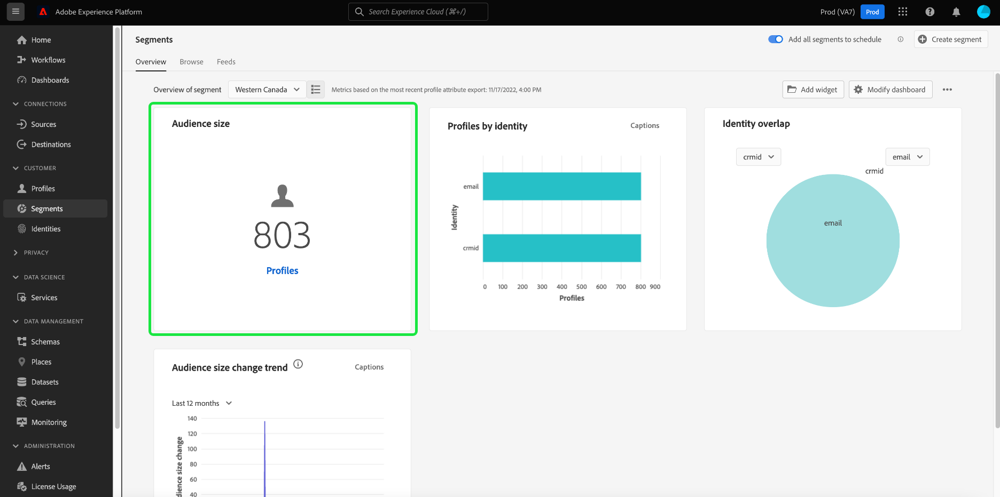
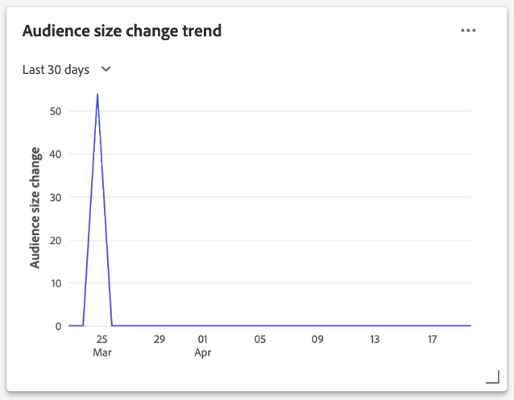

# 区段功能板 {#segment-dashboard}

Adobe Experience Platform用户界面(UI)提供了一个功能板，您可以通过该功能板查看有关区段的重要信息，这些信息是在每日快照期间捕获的。 本指南概述了如何在UI中访问和使用区段功能板，并提供了有关功能板中显示的可视化的更多信息。

要概述Platform用户界面中的所有Adobe Experience Platform分段服务功能，请访问 [Segmentation Service UI指南](../../segmentation/ui/overview.md).

## 区段功能板数据

区段功能板显示贵组织在“配置文件”存储(在Experience Platform中)中拥有的属性（记录）数据的快照。 快照不包含任何事件（时间系列）数据。

快照中的属性数据完全显示快照拍摄时在特定时间点显示的数据。 换句话说，快照不是数据的近似值或样本，而且区段仪表板不会实时更新。

>[!NOTE]
>
>自拍摄快照以来对数据所做的任何更改或更新，在拍摄下一个快照之前不会反映在功能板中。

## 浏览区段功能板

导航到 [!UICONTROL 区段] 功能板中，选择 **[!UICONTROL 区段]** 在左边栏中，选择 **[!UICONTROL 概述]** 选项卡来显示功能板。

>[!NOTE]
>
>如果贵组织是Platform的新用户，并且尚未创建活动的配置文件数据集或合并策略，则 [!UICONTROL 区段] 功能板不可见。 相反， [!UICONTROL 概述] 选项卡会显示可帮助您开始使用分段的链接和文档。

### 修改 [!UICONTROL 区段] 仪表板

您可以修改 [!UICONTROL 区段] 通过选择 **[!UICONTROL 修改功能板]**. 这样，您就可以在功能板中移动、添加和删除小组件，以及访问 **[!UICONTROL 构件库]** 以浏览可用小组件并为贵组织创建自定义小组件。

请参阅 [修改功能板](../customize/modify.md) 和 [构件库概述](../customize/widget-library.md) 文档以了解更多信息。

## 选择区段

功能板会自动选择要显示的区段，但您可以使用下拉菜单或区段选择器更改区段。

要选择其他区段，请选择区段名称旁边的下拉菜单，或使用区段选择器打开区段选择对话框。

## 小组件和量度

区段功能板由小组件组成，这些小组件是只读量度，提供有关您选定区段的重要信息。

小组件上的“上次更新”日期和时间，会显示拍摄数据的最后快照的时间。 快照的日期和时间以UTC格式提供；它不在单个用户或IMS组织的时区中。

## 标准小组件

Adobe提供了多个标准小组件，您可以使用这些小组件来可视化与区段相关的不同量度。 您还可以使用 [!UICONTROL 构件库]. 要了解有关创建自定义小组件的更多信息，请首先阅读 [构件库概述](../customize/widget-library.md).

要进一步了解每个可用的标准小组件，请从以下列表中选择小组件的名称：

* [[!UICONTROL 受众规模]](#audience-size)
* [[!UICONTROL 身份重叠]](#identity-overlap)
* [[!UICONTROL 按身份划分的用户档案]](#profiles-by-identity)
* [[!UICONTROL Audience Activation订单]](#audience-activation-order)
* [[!UICONTROL 受众大小趋势]](#audience-size-trend)
* [[!UICONTROL 受众大小更改趋势]](#audience-size-change-trend)
* [[!UICONTROL 按身份划分的受众大小趋势]](#audience-size-trend-by-identity)
* [[!UICONTROL 受众重叠]](#audience-overlap)

### [!UICONTROL 受众规模] {#audience-size}

>[!CONTEXTUALHELP]
>id="platform_dashboards_segments_audiencesize"
>title="受众规模"
>abstract="此小组件显示选定区段内合并的用户档案总数。 此数字取决于应用于数据的合并策略，并且在最新快照时是正确的。"
>additional-url="https://experienceleague.adobe.com/docs/experience-platform/dashboards/guides/segments.html#audience-size" text="从文档了解更多信息"

的 **[!UICONTROL 受众大小]** 小组件显示拍摄快照时选定区段内合并的配置文件总数。 此数字是将区段合并策略应用于配置文件数据的结果，以便将配置文件片段合并在一起，为区段中的每个人形成一个配置文件。

有关片段和合并的用户档案的更多信息，请首先阅读 [实时客户资料概述](../../profile/home.md).

### [!UICONTROL 身份重叠] {#identity-overlap}

>[!CONTEXTUALHELP]
>id="platform_dashboards_segments_identityoverlap"
>title="身份重叠"
>abstract="此小组件显示区段中包含两个所选身份的配置文件重叠。 圆圈显示每个身份的相对大小。 包含两个命名空间的配置文件数量由圈子之间的重叠表示。"
>additional-url="https://experienceleague.adobe.com/docs/experience-platform/dashboards/guides/segments.html#identity-overlap" text="从文档了解更多信息"

的 **[!UICONTROL 身份重叠]** 小组件会显示维恩图或设置图，以显示包含多个身份的区段中配置文件的重叠。

使用小组件上的下拉菜单选择要比较的身份。 圈子显示每个选定身份的相对大小，其中包含两个命名空间的配置文件数量由圈子之间重叠的大小表示。

如果客户在多个渠道上与您的品牌进行交互，则多个身份将与该个别客户关联，因此，您的组织可能具有多个包含多个身份片段的用户档案。

要进一步了解身份信息，请访问 [Adobe Experience Platform Identity Service文档](../../identity-service/home.md).

### [!UICONTROL 按身份划分的用户档案] {#profiles-by-identity}

>[!CONTEXTUALHELP]
>id="platform_dashboards_segments_profilesbyidentity"
>title="按身份划分的用户档案"
>abstract="此小组件显示选定区段中每个合并配置文件的身份划分。"
>additional-url="https://experienceleague.adobe.com/docs/experience-platform/dashboards/guides/segments.html#profiles-by-identity" text="从文档了解更多信息"

的 **[!UICONTROL 按身份划分的用户档案]** 小组件显示选定区段中每个合并配置文件的身份划分。 按身份划分的用户档案总数可能大于区段中的用户档案总数，因为一个用户档案可能具有多个与其关联的身份。 换言之，将每个身份显示的值相加，可能总计会大于区段中的受众总大小，因为如果客户在多个渠道上与您的品牌进行交互，则多个身份可能会与该个别客户关联。

选择 **[!UICONTROL 字幕]** 打开自动字幕对话框。

机器学习模型通过分析数据的整体分布和关键维度自动生成数据分析。

要进一步了解身份信息，请访问 [Adobe Experience Platform Identity Service文档](../../identity-service/home.md).

### [!UICONTROL Audience Activation订单] {#audience-activation-order}

的 [!UICONTROL Audience Activation订单] 小组件提供一个三列表格，其中列出了 [!UICONTROL 目标名称], [!UICONTROL 平台]和激活 [!UICONTROL 日期] 观众席。 该列表根据新近度按从高到低的顺序排列，最多可容纳10行。

### [!UICONTROL 受众大小趋势] {#audience-size-trend}

>[!CONTEXTUALHELP]
>id="platform_dashboards_segments_audiencesizetrend"
>title="受众大小趋势"
>abstract="此小组件提供有关满足以下条件的用户档案总数的信息： **any** 区段定义，在每日快照期间捕获，最近30天、90天或12个月。"
>additional-url="https://experienceleague.adobe.com/docs/experience-platform/dashboards/guides/segments.html#audience-size-trend" text="从文档了解更多信息"

的 **[!UICONTROL 受众大小趋势]** 小组件为符合 **any** 区段定义。 可以在30天、90天和12个月期间显示受众规模趋势。 时间段是从小组件的下拉菜单中选择的。 受众大小反映在y轴上，时间反映在x轴上。

此小组件还包含自动 [!UICONTROL 字幕] 机器学习模型分析图表和区段数据并自动生成字幕以描述关键趋势和重要事件的功能。 选择 **[!UICONTROL 字幕]** 打开自动字幕对话框。

随即会打开自动字幕对话框，该对话框提供对数据的分析。

要了解有关区段评估以及用户档案如何确定并退出区段的更多信息，请参阅 [Segmentation Service文档](../../segmentation/home.md).

### [!UICONTROL 受众大小更改趋势] {#audience-size-change-trend}

此小组件提供了一个折线图图，用于显示符合给定区段资格的配置文件总数与最近的每日快照之间的差异。 从概述下拉菜单中选择了要分析的区段。 趋势分析的周期可以显示为30天、90天和12个月。 时间段是从小组件的下拉菜单中选择的。 受众大小反映在y轴上，时间反映在x轴上。

### [!UICONTROL 按身份划分的受众大小趋势] {#audience-size-trend-by-identity}

此小组件根据从小组件下拉菜单中选择的身份类型，展示特定区段的受众大小趋势。 从概述下拉菜单中选择用于分析的区段。 趋势分析的周期可以显示为30天、90天和12个月。 时间段是从小组件的下拉菜单中选择的。

### [!UICONTROL 受众重叠] {#audience-overlap}

此小组件表示两个区段中符合两个区段定义标准的用户档案数量。 从小组件下拉菜单中选择用于比较的区段。 通过将鼠标悬停在维恩图的圆圈或交集上，可查看相关区段定义中包含的用户档案总数。

此小组件允许您通过可视化区段定义结果中的相似性来优化分段策略。

<!-- * [[!UICONTROL Audience overlap report]](#audience-overlap-report) -->
<!-- ### [!UICONTROL Audience overlap report] {#audience-overlap-report} -->

<!-- View an ordered list of audiences by Highest or Lowest overlap percentages. -->

<!--  -->

<!-- https://jira.corp.adobe.com/browse/PLAT-125511 -->

## 后续步骤

通过遵循本文档，您现在应该能够找到区段仪表板，并选择要查看的区段。 您还应了解可用小组件中显示的量度。 要了解有关在Experience PlatformUI中使用区段的更多信息，请参阅 [Segmentation Service UI指南](../../segmentation/ui/overview.md).
