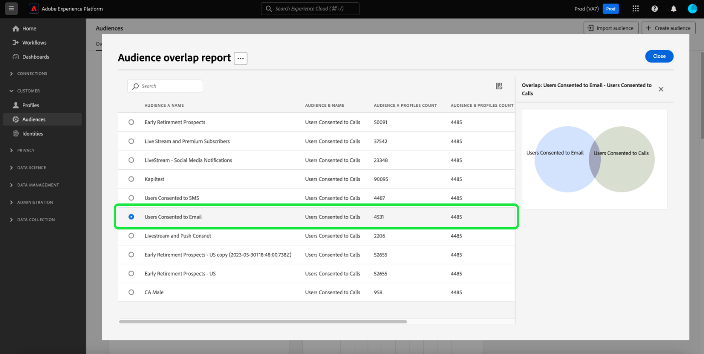

# 同意分析和跟踪

在当今的营销形势下，您需要理解并尊重客户同意首选项。 Adobe Real-time Customer Data Platform为营销人员提供了分析客户同意以建立信任、遵守隐私法规并提供更个性化体验的功能。

本文档详细介绍如何为Real-Time CDP数据的各种营销用例构建同意仪表板。 具体来说，它重点介绍如何根据您的业务需求创建具有适当属性的受众，然后通过在Adobe Experience Platform UI中使用预配置的构件来获取见解。 此外，还提供了使用用户定义的仪表板功能构建您自己的自定义小部件的另一种方法。

## 用例 {#use-cases}

本指南涵盖的使用案例是同意趋势和同意重叠。

- **同意趋势** 跟踪用户同意随时间变化的趋势。 分析同意偏好设置更改可帮助营销人员规划和执行适应这些用户偏好设置更改的营销活动。 例如，您可能需要开展有针对性的教育活动、透明度和信任活动或激励活动以推动同意选择。 您还可以关联可能已对同意产生负面影响的营销活动，以主动降低这些营销活动的频率。
- **同意重叠** 使用同意渠道之间的重叠，为同意多个渠道的客户在多个渠道上提供一致的个性化消息。 营销人员可以优先分配资源给某些渠道，在这些渠道中，更高程度的同意和个性化的消息传递可能会引起客户的共鸣，并产生更高的响应率。

<!-- ## Build a consent dashboard {#build-a-consent-dashboard} -->

## 创建同意的受众 {#create-consent-audiences}

要构建同意仪表板，您必须首先创建同意联系的所有用户档案的受众。 要导航到Real-time Customer Data Platform区段生成器，请选择 **[!UICONTROL 受众]** （在Platform UI的左侧导航中）。 从 [!UICONTROL 客户] 选项卡 [!UICONTROL 受众] 仪表板，选择 **[!UICONTROL 创建受众]** 在视图的右上角，然后 **[!UICONTROL 生成规则]**.

<!-- Update screenshot below to include Create audience -->s

![此 [!UICONTROL 受众] 仪表板 [!UICONTROL 客户]， [!UICONTROL 受众]、和 [!UICONTROL 创建区段] 突出显示。](../images/insights-use-cases/consent-analysis/create-audience.png)

此时将显示“区段生成器”。 接下来，选择 **[!UICONTROL XDM个人资料]** 从可用选项删除。 请参阅文档以了解有关 [规则生成器画布](../../segmentation/ui/segment-builder.md#rule-builder-canvas).

![具有的区段生成器 [!UICONTROL XDM个人资料] 属性文件夹高亮显示。](../images/insights-use-cases/consent-analysis/xdm-individual-profile.png)

从可用的选项中找到您的同意属性。 选择 **[!UICONTROL 同意和偏好设置]**.

>[!NOTE]
>
>如果您在与Adobe推荐字段组不同的属性中维护了您的用户同意，则必须选择这些属性，而不是下面显示的属性。

欲知更多信息，请访问 [在分段中处理同意](../../segmentation/consents.md#handling-consent-in-segmentation) 文档。

![具有的区段生成器 [!UICONTROL 同意和偏好设置] 属性文件夹高亮显示。](../images/insights-use-cases/consent-analysis/consent-and-preferences.png)

将显示各种同意和偏好设置选项。 由于本演示侧重于通过各种营销渠道进行联系的同意，因此请选择 **[!UICONTROL 营销偏好设置]**.

![具有的区段生成器 [!UICONTROL 营销偏好设置] 文件夹高亮显示。](../images/insights-use-cases/consent-analysis/marketing-preferences.png)

将显示营销偏好设置列表。 虽然此示例用例侧重于电子邮件、短信和调用，但您也可以为任何其他组合或整个选项构建见解。 对于每个渠道，执行以下步骤以创建受众。

要开始配置受众，请选择 **[!UICONTROL 接收短信]** / **[!UICONTROL 接收电子邮件]** / **[!UICONTROL 接听来电]**.

此 [!UICONTROL 订阅] 文件夹中显示。 从可用选项中，选择并拖动 **[!UICONTROL 选择值]** 属性添加到中心窗格，然后从下拉列表中选择所需的值。 在这种情况下，选择 **是（选择启用）**. 接下来，根据业务需求为受众命名，并提供用户友好的描述。

>[!NOTE]
>
>建议您创建的受众数量存在软限制。 欲知更多信息，请参见 [分段护栏文档](https://experienceleague.adobe.com/docs/experience-platform/profile/guardrails.html#segmentation-guardrails).

![此 [!UICONTROL 选择值] 属性和 [!UICONTROL 是（选择启用）] 区段生成器中高亮显示的值。 受众的名称和描述也会突出显示。](../images/insights-use-cases/consent-analysis/choice-value.png)

创建必要的受众后，会在 [!UICONTROL 受众] [!UICONTROL 浏览] 选项卡。

>[!NOTE]
>
>创建受众时，您必须等待批量分段作业完成，然后才有数据可用来开始构建同意仪表板。 批量分段描述了通过区段定义一次移动所有用户档案数据以产生相应受众的过程。 创建受众后，将保存并存储该受众以供您导出和使用。 每24小时自动评估批处理客户细分。

## 使用洞察 {#consume-insights}

Adobe已创建各种见解，这些见解自动在Profiles、Audiences和Destinations功能板中为您提供。 然后，您创建的任何受众都将自动可用于这些预配置的见解。 有关中提供的分析列表，请参阅标准构件文档 [配置文件](../guides/profiles.md#standard-widgets)， [受众](../guides/audiences.md#standard-widgets)、和 [目标](../guides/destinations.md) 功能板。

## 受众重叠 {#audience-overlap}

要检查任意两个同意受众之间的重叠，请添加 [!UICONTROL 按合并策略列出的受众重叠] 配置文件功能板，然后在下拉菜单中选择所需的受众。 有关如何将小组件添加到仪表板的说明，请参阅文档。 [*按合并策略列出的受众重叠*](../guides/profiles.md#audience-overlap-by-merge-policy) 以了解有关洞察的更多信息。

<!-- Image needs updating to night mode -->

您可以使用受众仪表板中的受众重叠报表查看所有受众的重叠，其中用户已同意接收所有其他受众的呼叫。 要查看同意受众的重叠，请先导航到 [!UICONTROL 受众] [!UICONTROL 概述] 选项卡。 从那里，您可以添加 [!UICONTROL 受众重叠报表] “受众”功能板的构件。 创建构件后，选择 **[!UICONTROL 用户同意呼叫]** 受众位于页面顶部的受众概述下拉菜单中。 接下来，选择 **[!UICONTROL 查看更多]** 在受众重叠报表小部件中，查看最多50个顶级重叠，以及有关选定区段的最少重叠中的50个。

<!-- Image needs updating to night mode -->

将展开受众重叠报表对话框，以显示其他受众重叠数据。

<!-- Image needs updating to night mode -->

## 受众规模趋势 {#audience-size-trends}

创建基于同意的受众时，会自动显示自创建受众日期起最多12个月的趋势。 要显示客户同意的完整功能趋势，请将以下小组件添加到 [!UICONTROL 区段] [!UICONTROL 概述] 页面。 这些见解提供了一种强大的手段，用于跟踪您的同意如何随时间变化。 它们甚至与您并行运行的任何可能对同意产生正面或负面影响的活动相关联。 为这些构件提供的描述适用于同意用例。

- [受众规模趋势](../guides/audiences.md#audience-size-trend)：利用此构件可跟踪您各自的同意如何随时间的变化。
- [受众规模变化趋势](../guides/audiences.md#audience-size-change-trend)：此构件跟踪您的客户同意如何每天发生更改。 例如，如果客户同意的数量减少了100,000，则可以查看每天发生的更改。
- [按身份划分的受众规模趋势](../guides/audiences.md#audience-size-trend-by-identity)：利用此小组件，您可以跟踪各自的同意如何随时间的变化，但会按特定身份（如电子邮件）进一步过滤。

<!-- Image needs updating to night mode -->

## 受众概述功能板 {#audiences-overview-dashboard}

创建同意相关的受众（例如“用户同意短信”）后，您可以通过向受众概述仪表板添加相应的小部件，查看有关受众的关键个性化同意信息。 导航至 [!UICONTROL 受众] [!UICONTROL 概述] 并从构件库中添加所选构件。 添加到仪表板视图的任何构件均可使用进行调整并移动 [!UICONTROL 修改仪表板] 功能。 您的个性化视图可以包含各种见解，例如一段时间的趋势（最多12个月）、与其他受众的重叠以及受众的身份构成。 下面显示了一个示例视图。

## 用户定义的仪表板 {#usr-defined-dashboards}

您还可以使用用户定义的仪表板构建自己的小组件。 通过构建您自己的构件，您可以完全控制构件的类型，还可以灵活地直接在Adobe Real-Time CDP中添加过滤器等。

例如，如果您希望在同一图表中显示多个同意受众的趋势，以便了解每个同意偏好设置随时间的变化。 通过用户定义的功能板，只需最少的步骤和一次性设置即可实现此类型的可视化。 首先，选择 **[!UICONTROL 仪表板]** 在左侧导航中。 此 [!UICONTROL 仪表板] 工作区即会出现。 然后选择 **[!UICONTROL 创建功能板]**. 有关如何执行操作的完整说明 [创建功能板和自定义构件](../user-defined-dashboards.md) 可在用户定义的功能板指南中找到。

当您 [选择您的数据模型](../user-defined-dashboards.md#select-data-model) 在小组件编辑器中，选择 `CDPInsights` 后接 **[!UICONTROL 下一个]**. 此 [!UICONTROL 选择表] 出现对话框。

下一个视图在左边栏中显示可用表的列表。 选择 `adwh_fact_profile_by_segment_and_namespace_trendlines`。

使用所选表中的数据填充构件编辑器后，请执行以下步骤：

- [Search [!UICONTROL 属性]](../user-defined-dashboards.md#add-filter-attributes) 对象 `[!UICONTROL date]`，然后使用+图标添加 `[!UICONTROL date]` 属性添加到X轴。
  
- Search [!UICONTROL 属性] 对象 `[!UICONTROL count_of_profiles]`，然后使用+图标添加 `[!UICONTROL count_of_profiles]` 属性添加到Y轴。
- 选择 `...` （省略号）图标 [!UICONTROL Y轴] 字段，然后选择 [!UICONTROL SUM] 下拉菜单中的聚合函数。
  
- 选择 [!UICONTROL 标记] 下拉菜单，并将图表类型更改为 [!UICONTROL 折线图].
- Search [!UICONTROL 属性] 对于 `[!UICONTROL segment_name]`，然后使用+图标添加 `segment_name` as a [!UICONTROL 筛选] 下拉菜单中。 此 [!UICONTROL 过滤器：Segment_name] 出现对话框。 选择之前创建的与同意相关的受众。 对于此示例，请选择 **[!UICONTROL 用户同意呼叫]**， **[!UICONTROL 用户同意使用短信]**、和 **[!UICONTROL 用户同意发送电子邮件]**，后接 **[!UICONTROL 应用]**.
- Search [!UICONTROL 属性] 对象 `[!UICONTROL segment_name]`，然后选择要添加的+图标 `segment_name` as a [!UICONTROL 颜色] 下拉菜单中。
- 打开 [该 [!UICONTROL 属性] 面板](../user-defined-dashboards.md#widget-properties) 并提供适当的 [!UICONTROL 构件标题] 和 [!UICONTROL 轴标签].
  
- 选择 **[!UICONTROL 保存并关闭]** 以确认您的设置。

>[!TIP]
>
>在保存仪表板之前，您现在可以调整小部件的大小或将其移动到所需的大小和位置。

下图演示了已完成的构件的显示方式以及其他潜在的自定义分析。 有关可创建的构件类型的更多详细信息，请参阅 [数据模型文档](../cdp-insights-data-model.md).

<!-- The diagram shows straight lines due to a lack of data, however in your environment the trends will reflect the actual changes over time. -->

## 跟踪同意政策 {#consent-policies}

您创建的同意功能板捕获 **仅分发同意和偏好设置属性**.

>[!NOTE]
>
>对于以下客户 **AdobeHealth Shield** 或 **Adobe隐私和安全防护板**，这些功能板 **不要** 反映对同意政策的任何跟踪。 可用跟踪包括已创建、已启用的策略的数量，以及对受众成员资格的影响。

## 后续步骤

通过阅读本文档，您已了解如何使用Real-Time CDP Insights构建功能板，以全面查看客户同意首选项。 本文档演示了Real-Time CDP如何为当今以隐私为中心的环境提供可靠的解决方案，在这些环境中，基于同意数据的收集、分段、分析和个性化营销活动对营销人员至关重要。
