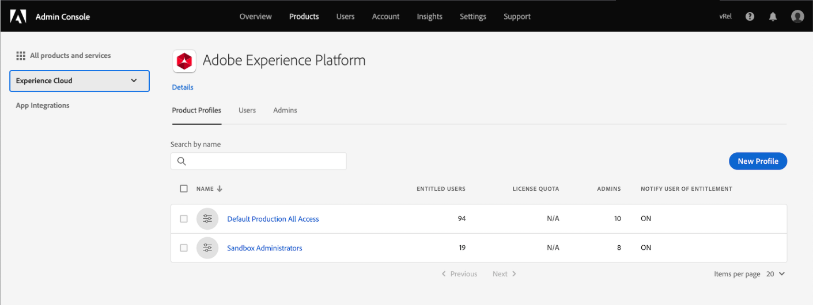

# 功能板的访问权限

要授予用户查看、编辑和更新功能板的功能，您必须首先启用权限。 在Adobe Experience Platform中，访问控制通过Adobe Admin Console提供。 此功能可利用[!DNL Admin Console]中的产品配置文件，该配置文件将用户与权限和沙箱相关联。

本文档概要介绍了如何提供对Admin Console中特定功能板权限的访问。 有关获取和分配访问权限的详细信息，请首先阅读[访问控制概述](../access-control/home.md)。

>[!NOTE]
>
>要配置[!DNL Experience Platform]的访问控制，您必须拥有具有[!DNL Experience Platform]产品集成的组织的管理员权限。 有关更多信息，请参阅Adobe Help Center关于[管理角色](https://helpx.adobe.com/enterprise/using/admin-roles.html)的文章。

## 可用权限{#available-permissions}

在Experience Platform中访问功能板需要两个主要权限。 这些权限包括：

* **查看许可证使用情况功能板**:此权限允许用户在Experience PlatformUI中以只读方式访问许可证使用功能板。
* **管理标准功能板**:此权限允许用户添加data warehouse中尚未包含的自定义属性。

以下步骤将向您展示如何使用Admin Console添加这些权限。

## 选择产品配置文件

要授予用户对Experience Platform中功能板的访问权限，请首先登录到[Adobe Admin Console](https://adminconsole.adobe.com)并从顶部导航中选择&#x200B;**产品**。

从左侧导航的Experience Cloud下拉菜单或&#x200B;*All products and services*&#x200B;下列出的卡片中选择&#x200B;**Adobe Experience Platform**。 从Adobe Experience Platform产品页面中，选择要将功能板权限添加到的产品配置文件，或选择&#x200B;**新建配置文件**&#x200B;以创建新的产品配置文件。

此时会打开选定的产品配置文件，其中显示了与该产品配置文件关联的用户。 要管理产品配置文件的权限，请选择&#x200B;**权限**。

## 添加/编辑权限

**Permissions**&#x200B;选项卡显示产品配置文件的所有可用权限。 找到&#x200B;**功能板**&#x200B;行，并注意该行当前显示“包含2个，共0个”，这意味着产品配置文件未启用功能板权限。

要编辑功能板权限，请在功能板行中选择&#x200B;**编辑**。

将打开&#x200B;**编辑权限**&#x200B;对话框，其中显示可用权限项和包含的权限项。 您可以选择添加权限旁边的加号(`+`)，或选择&#x200B;**+ Add all**&#x200B;以同时添加所有权限。

有关权限的描述，请参阅本文档前面的[可用权限](#available-permissions)部分。

>[!NOTE]
>
>您不必为所有用户启用所有权限。 根据贵组织的结构，您可能希望为某些用户创建单独的产品配置文件并授予有限的访问权限（例如只读）。

添加权限后，选择&#x200B;**Save**&#x200B;以返回到产品配置文件。

返回产品配置文件后，您可以通过确认&#x200B;**功能板**&#x200B;行显示“2个，共2个”来验证是否已添加权限。

## 后续步骤

现在，您已向功能板添加访问权限，组织内的用户可以开始在Experience PlatformUI中查看功能板，并根据您分配的权限执行其他操作。