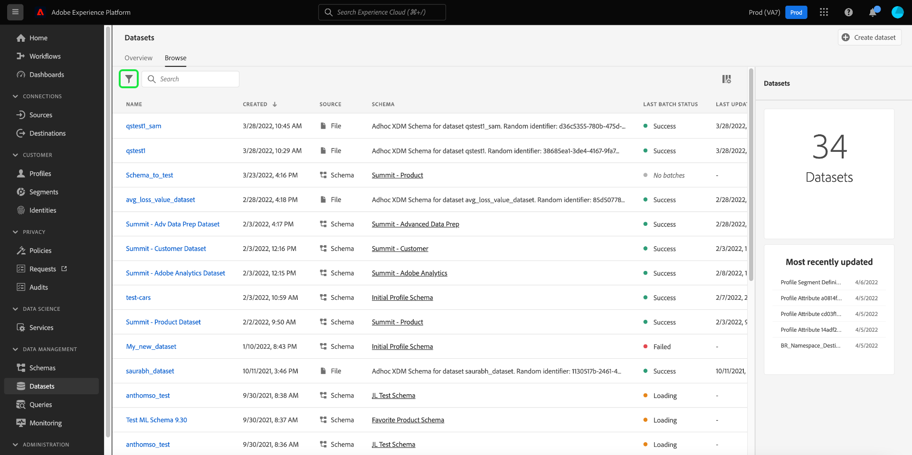

# 使用 [!DNL Query Service]

Adobe Experience Platform通过Experience PlatformUI中提供的功能板，提供有关贵组织的配置文件、区段和目标数据的重要信息。 然后，您可以使用Adobe Experience Platform [!DNL Query Service] 探索、验证和处理在数据湖中为这些功能板提供支持的原始数据集。

## 入门 [!DNL Query Service]

Adobe Experience Platform [!DNL Query Service] 支持营销人员通过启用标准SQL在数据湖中查询数据来获取其数据的洞察信息。 [!DNL Query Service] 提供了用户界面和API，可用于加入数据湖中的任何数据集，并捕获查询结果作为新数据集，以用于报表、机器学习或将摄取到实时客户配置文件中。

详细了解 [!DNL Query Service] 及其在Experience Platform中的作用，请首先阅读 [[!DNL Query Service] 概述](../query-service/home.md).

## 访问可用的数据集

您可以使用 [!DNL Query Service] 用于查询配置文件、区段和目标功能板的原始数据集。 要查看可用的数据集，请在Experience PlatformUI中，选择 **数据集** 在左侧导航中打开数据集功能板。 功能板列出了贵组织的所有可用数据集。 系统会为每个列出的数据集显示详细信息，包括其名称、数据集所遵循的架构以及最近摄取运行的状态。


### 系统生成的数据集

>[!IMPORTANT]
>
>默认情况下，系统生成的数据集会处于隐藏状态。 默认情况下， [!UICONTROL 浏览] 选项卡仅显示已将数据摄取到的数据集。

要查看系统生成的数据集，请选择过滤器图标()。



出现一个侧栏，其中包含两个切换开关， [!UICONTROL 包含在用户档案中] 和 [!UICONTROL 显示系统数据集]. 选择切换对象 [!UICONTROL 显示系统数据集] 将系统生成的数据集包含在可浏览数据集列表中。


### 配置文件属性数据集

配置文件功能板分析与您的组织定义的合并策略绑定。 对于每个活动合并策略，数据湖中都有一个可用的配置文件属性数据集。

这些数据集的命名约定为 **配置文件快照导出** 后跟系统生成的随机字母数值。 例如：`Profile-Snapshot-Export-abbc7093-80f4-4b49-b96e-e743397d763f`。

要了解每个配置文件快照导出数据集的完整架构，您可以预览和浏览数据集 [使用数据集查看器](../catalog/datasets/user-guide.md) 在Experience PlatformUI中。


#### 将配置文件属性数据集映射到合并策略ID

分配给每个系统生成的配置文件属性数据集的字母数字值是一个随机字符串，它映射到您的组织创建的其中一个合并策略的合并策略ID。 每个合并策略ID到其相关配置文件属性数据集字符串的映射将在 `adwh_dim_merge_policies` 数据集。

的 `adwh_dim_merge_policies` 数据集包含以下字段：

* `merge_policy_name`
* `merge_policy_id`
* `merge_policy`
* `dataset_id`

可以在Experience Platform中使用查询编辑器UI浏览此数据集。 要了解有关使用查询编辑器的更多信息，请参阅 [查询编辑器UI指南](../query-service/ui/user-guide.md).

### 区段元数据数据集

数据湖中有一个可用的区段元数据数据集，其中包含贵组织每个区段的元数据。

此数据集的命名约定为 **Segmentdefinition-Snapshot-Export** 后跟一个字母数字值。 例如：`Segmentdefinition-Snapshot-Export-acf28952-2b6c-47ed-8f7f-016ac3c6b4e7`

要了解每个区段定义快照导出数据集的完整架构，您可以预览和浏览数据集 [使用数据集查看器](../catalog/datasets/user-guide.md) 在Experience PlatformUI中。


### 目标元数据数据集

您组织的所有激活目标的元数据可作为数据湖中的原始数据集使用。

此数据集的命名约定为 **DIM_Destination**.

要了解DIM目标数据集的完整架构，您可以预览和浏览该数据集 [使用数据集查看器](../catalog/datasets/user-guide.md) 在Experience PlatformUI中。


## 示例查询

以下示例查询包括可在 [!DNL Query Service] 以浏览、验证和处理支持功能板的原始数据集。

### 按身份划分的用户档案计数

此配置文件分析可划分数据集中所有合并配置文件的身份。

>[!NOTE]
>
>按身份划分的用户档案总数（即将每个命名空间显示的值相加）可能大于合并的用户档案总数，因为一个用户档案可能具有与其关联的多个命名空间。 例如，如果客户在多个渠道上与您的品牌进行交互，则多个命名空间将与该个别客户关联。

**查询**

```sql
Select
        Key namespace,
        count(1) count_of_profiles
     from
        (
           Select
               explode(identitymap)
           from
              Profile-Snapshot-Export-abbc7093-80f4-4b49-b96e-e743397d763f
        )
     group by
        namespace;
```

### 按区段划分的用户档案计数

此受众分析可提供数据集中每个区段内合并用户档案的总数。 此数字是将区段合并策略应用于配置文件数据的结果，以便将配置文件片段合并在一起，为区段中的每个人形成一个配置文件。

```sql
Select          
        concat_ws('-', key, source_namespace) segment_id,
        count(1) count_of_profiles
      from
        (
            Select
              Upper(key) as source_namespace,
              explode(value)
            from
              (
                  Select
                    explode(Segmentmembership)
                  from
                    Profile-Snapshot-Export-abbc7093-80f4-4b49-b96e-e743397d763f
              )
        )
      group by
      segment_id
```

## 后续步骤

通过阅读本指南，您现在可以使用 [!DNL Query Service] 以执行多个查询来浏览和处理为配置文件、区段和目标功能板提供支持的原始数据集。

要进一步了解每个功能板及其量度，请从文档导航的可用功能板列表中选择一个功能板。
