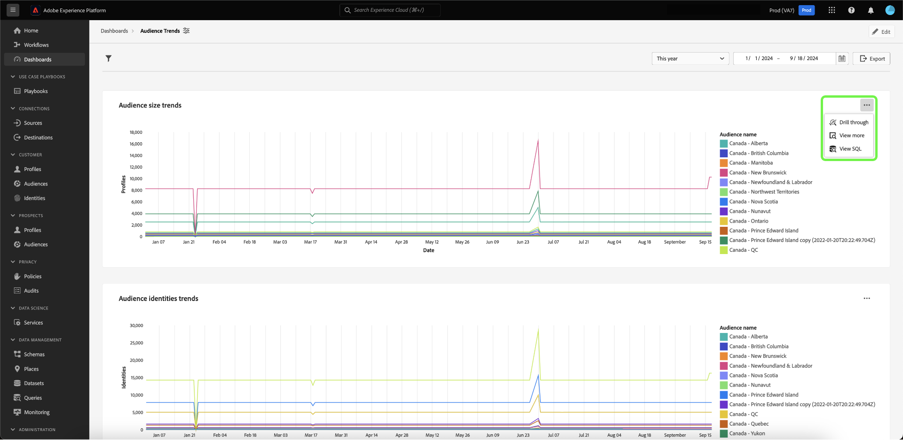

# 穿透钻取 {#drill-through}

穿透钻取通过简化从任何图表导航到新仪表板的操作，有助于进行多层数据分析。 此功能使您可以在研究趋势、客户行为、运营指标等时轻松从高级概览转变为深入的报告，确保您始终拥有所需的上下文。

系统通过自动将全局过滤器和日期范围过滤器从源仪表板传递到目标仪表板，确保您开始的分析在整个穿透钻取体验中无缝继续。 为了便于在各层之间导航研究，系统允许多级钻进。

## 创建穿透钻取 {#create-drill-through}

要创建穿透钻取，首先从仪表板视图中选择&#x200B;**[!UICONTROL 编辑]**。

选择要穿透钻取的图表中的省略号，然后选择&#x200B;**[!UICONTROL 编辑]**。

在[!UICONTROL 属性]面板中，使用切换开关启用&#x200B;**[!UICONTROL 启用穿透钻取]**，然后使用下拉菜单选择&#x200B;**[!UICONTROL 目标仪表板]**。 确保启用&#x200B;**[!UICONTROL 筛选通过]**&#x200B;的切换，然后选择&#x200B;**[!UICONTROL 保存并关闭]**。

>[!INFO]
>
>对目标仪表板重复以上突出显示的步骤以设置多级穿透钻取。

## 查看穿透钻取 {#view-drill-through}

要查看钻取，请从仪表板视图中选择图表中的省略号，然后选择&#x200B;**[!UICONTROL 钻取]**。

此时将显示穿透钻取目标仪表板。 如果您有多级穿透钻取，则可以重复此步骤。

>[!NOTE]
>
>在源功能板中应用的所有过滤器都会传递到目标功能板。 但是，日期过滤器和全局过滤器在子功能板上处于禁用状态。

## 删除穿透钻取 {#remove-drill-through}

要删除穿透钻取，首先从仪表板视图中选择&#x200B;**[!UICONTROL 编辑]**。

在图表中选择要删除穿透钻取的省略号，然后选择&#x200B;**[!UICONTROL 编辑]**。

在[!UICONTROL 属性]面板中，选择切换开关以禁用&#x200B;**[!UICONTROL 启用穿透钻取]**，然后选择&#x200B;**[!UICONTROL 保存并关闭]**。

![已为[!UICONTROL 禁用切换的图表属性面板高亮显示]启用穿透钻取。](../images/sql-insights-query-pro-mode/drill-through-disable.png)

## 后续步骤

阅读本文档后，您现在知道如何为仪表板创建穿透钻取。 您还可以学习如何使用[引导式设计模式指南](../standard-dashboards.md)，从Adobe Experience Platform UI中的现有数据模型生成图表。
