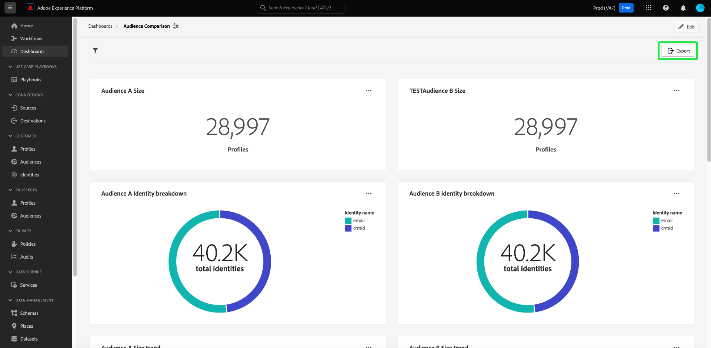

# Export PDF {#export-pdf}

创建具有[查询专业模式](./overview.md#query-pro-mode)的[自定义insight](./overview.md)后，即可以PDF格式导出图表数据。 此操作可在自定义功能板概述中执行。

从功能板工作区中，从[!UICONTROL 浏览]选项卡中列出的清单中选择自定义功能板。

此时会出现自定义仪表板。 接下来，从UI的右上角选择&#x200B;**[!UICONTROL 导出]**。

>[!NOTE]
>
>仅可视化图表导出不需要[!UICONTROL 导出仪表板数据]权限。 有关详细信息，请参阅[[!UICONTROL 查看更多]文档](./view-more.md#export)。

出现&#x200B;**[!UICONTROL 导出文件]**&#x200B;对话框。 最后，选择&#x200B;**[!UICONTROL 下载]**

此时将显示PDF预览。 选择&#x200B;**[!UICONTROL 保存]**&#x200B;以完成该过程。

