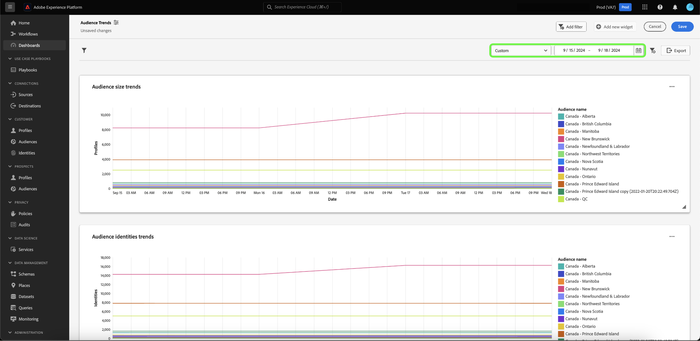

# 创建日期过滤器 {#create-date-filter}

要按日期筛选见解，必须将参数添加到可以接受日期约束的SQL查询。 此操作作为查询专家模式见解创建工作流的一部分完成。 请参阅[查询专业模式文档](../overview.md#query-pro-mode)以了解如何输入SQL作为您的见解。

利用查询参数，可处理动态数据，因为它们充当您在执行时添加值的占位符。 这些占位符值可以通过UI更新，并使技术含量较低的用户能够根据日期范围更新见解。

如果您不熟悉查询参数，请参阅文档[有关如何实现参数化查询的指导](../../../query-service/ui/parameterized-queries.md)。

## 将日期过滤器应用于仪表板 {#apply-date-filter}

要应用日期筛选器，请从仪表板视图的下拉菜单中选择&#x200B;**[!UICONTROL 添加筛选器]**，然后选择&#x200B;**[!UICONTROL 日期筛选器]**。


您会看到以下日期筛选选项。

| 筛选条件 | 描述 |
| --- | --- |
| 没有自定义日期 | 从多个预设值中选择一个或多个自定义日期。 |
| 自定义日期范围 | 从多个预设值中选择一个或多个自定义日期，或指定自定义日期范围。 |
| 自定义日期 | 从预设值中选择或指定仪表板的开始日期。 |


### 创建无自定义日期过滤器

要应用预定义的日期过滤器，请选择&#x200B;**[!UICONTROL 无自定义日期]**，然后选择要包括的预定义日期选项。 最后，使用下拉菜单选择默认日期范围，然后选择&#x200B;**[!UICONTROL 保存]**。


您将返回到仪表板，其中显示您之前选择的默认日期范围。 使用下拉菜单选择其他预设日期范围。


### 创建自定义日期范围过滤器

要应用自定义日期范围筛选器，请选择&#x200B;**[!UICONTROL 自定义日期范围]**，然后选择要包括的预定义日期选项。 最后，选择&#x200B;**[!UICONTROL 自定义]**&#x200B;以设置默认日期范围。 使用日历指定日期范围，然后选择&#x200B;**[!UICONTROL 保存]**。

>[!NOTE]
>
>无需选择预定义的日期选项。


您将返回到仪表板，其中显示您之前指定的自定义数据范围。 使用下拉菜单选择其他预设日期范围。



### 创建自定义日期过滤器

要应用自定义日期筛选器，请选择&#x200B;**[!UICONTROL 自定义日期]**，然后选择要包括的预定义日期选项。 最后，选择&#x200B;**[!UICONTROL 自定义]**，然后使用该日历选择开始日期。 最后，选择&#x200B;**[!UICONTROL 保存]**。

>[!NOTE]
>
>无需选择预定义的日期选项。


您将返回到仪表板，其中显示您之前指定的自定义数据。 使用下拉菜单选择其他日期。


## 删除日期过滤器 {#delete-date-filter}

要删除您的日期筛选器，请选择删除筛选器图标（）。


## 编辑SQL以包含日期查询参数 {#include-date-parameters}

接下来，请确保SQL包含查询参数，以便允许某个日期范围。 如果您尚未在SQL中合并查询参数，请编辑您的分析以包含这些参数。 有关如何[编辑分析](../overview.md#edit)的说明，请参阅文档。

>[!TIP]
>
>建议您在每个要启用日期过滤器的图表中，将`$START_DATE`和`$END_DATE`参数添加到SQL语句中。

>[!NOTE]
>
>日期筛选器不支持时间限制。 该过滤器仅适用于日期范围。 这意味着，如果您在24小时内拥有多个报表，则无法区分同一天内不同的小时。 因此，建议您将时间组件强制转换为日期。

如果您正在分析的数据模型或表具有时间组件，则您可以按日期对数据进行分组，然后应用这些日期过滤器。

下面的示例SQL语句演示如何合并`$START_DATE`和`$END_DATE`参数并使用`cast`将时间组件框架化为日期。

```sql
SELECT Sum(personalization_consent_count) AS Personalization,
       Sum(datacollection_consent_count)  AS Datacollection,
       Sum(datasharing_consent_count)     AS Datasharing
FROM   fact_daily_consent_aggregates f
       INNER JOIN dim_consent_valued
               ON f.consent_value_id = d.consent_value_id
WHERE  f.date BETWEEN Upper(Coalesce(Cast('$START_DATE' AS date), '')) AND Upper
                      (
                             Coalesce(Cast('$END_DATE' AS date), ''))
       AND ( ( Upper(Coalesce($consent_value_filter, '')) IN ( '', 'NULL' ) )
              OR ( f.consent_value_id IN ( $consent_value_filter ) ) )
LIMIT  0; 
```

下面的屏幕截图突出显示合并到SQL语句和查询参数键值对中的日期约束。

>[!NOTE]
>
>在query pro模式下编写语句时，必须为每个参数提供示例值，以便执行SQL语句并构建图表。 合成语句时提供的示例值由您在运行时为日期（或全局）筛选器选择的实际值替换。

![带有SQL中突出显示的日期参数的[!UICONTROL 进入SQL]对话框。](../../images/sql-insights-query-pro-mode/sql-date-parameters.png)

## 在每次分析中启用日期参数 {#enable-date-parameters}

将相应参数并入分析的SQL后，`Start_date`和`End_date`变量现在可在小组件编辑器中作为切换使用。 有关如何编辑分析的信息，请参阅[查询专业模式构件填充部分](../overview.md#populate-widget)。

从构件编辑器中，选择切换以启用`Start_date`和`End_date`参数。


接下来，从下拉菜单中选择相应的查询参数。


最后，选择&#x200B;**[!UICONTROL 保存并关闭]**&#x200B;以返回到仪表板。 现在为所有具有开始和结束日期参数的分析启用日期过滤器。
