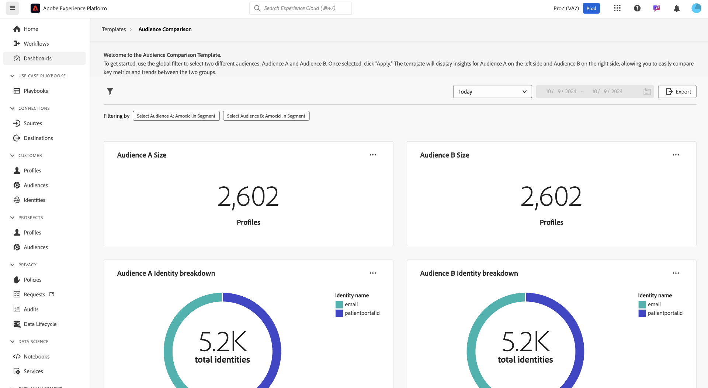

# 受众对比

[!UICONTROL 受众比较]仪表板在并排视图中比较和对比关键受众量度。 从该仪表板中，您可以执行各种操作来比较两个受众组并分析它们之间的关键量度。 然后，您可以制定与受众分段和定位策略相关的数据驱动型决策。

## 设置受众比较 {#set-audience-comparisons}

为了提供更有意义的见解和比较，请使用系统过滤器来准确地定位受众区段，并了解您有兴趣分析的时间范围。 选择过滤器图标()以选择两个不同的受众（[!UICONTROL 受众A]和[!UICONTROL 受众B]）并设置特定参数以进行比较。

出现[!UICONTROL 筛选器]对话框。 要选择第一个要分析的受众，请选择&#x200B;**[!UICONTROL 选择受众A]**&#x200B;下拉列表。 在此示例中，`California Patients`被选为受众A。应用过滤器后，此受众会显示在比较的左侧。

接下来，从&#x200B;**[!UICONTROL 选择受众B]**&#x200B;下拉列表中选择要与[!UICONTROL 受众A]进行比较的第二个受众。 在此图像中，[!UICONTROL 已选择同意使用电子邮件的用户]作为[!UICONTROL 受众B]。 应用过滤器后，此受众会显示在[!UICONTROL 受众比较]仪表板的右侧。

### 调整日期范围 {#adjust-date-ranges}

您还可以按特定时间段过滤数据，以了解这些受众在自定义日期范围内的表现或变化。 要设置时间范围以按特定期间过滤受众数据，请从日历字段中选择开始日期和结束日期。

该对话框还指示应用了多少过滤器（在下面的屏幕快照中，使用了两个过滤器：受众A和受众B，以及今天作为日期范围）。 要删除所有应用的筛选器，请选择&#x200B;**[!UICONTROL 全部清除]**。

设置受众和日期范围后，选择&#x200B;**[!UICONTROL 应用]**&#x200B;以刷新[!UICONTROL 受众比较]仪表板。

仪表板现在会显示每个受众并排显示的比较图表。

## 可用的受众比较图表 {#available-charts}

<!-- Potentially could expand this section to include images of each widget.  -->

仪表板提供了多个图表来比较见解：

- [[!UICONTROL 受众大小]](../../guides/audiences.md#audience-size)：根据每个受众包含的配置文件数轻松跟踪其大小。 此量度可帮助您了解要比较的两个受众的规模。
- [!UICONTROL 受众身份细分]：饼图提供每个受众中身份相对构成的细分。 您可以查看身份总数，并检查不同标识符（如电子邮件或CRM ID）在总数中的占比。 此图表可帮助您根据身份类型了解每个受众的组成。 将鼠标悬停在饼图的某个部分上可查看确切的身份数。
- [[!UICONTROL 受众规模趋势]](../../guides/audiences.md#audience-size-trend)：此图表表示所选受众在一段时间内的规模趋势。 使用这些图表可以可视化在选定时间段内每个受众的大小变化情况，其中峰值和谷值指示用户档案数量的增长或减少时段。
- [[!UICONTROL 受众规模变化趋势]](../../guides/audiences.md#audience-size-change-trend)：此图表显示所选受众的大小变化趋势。 它可显示随着时间的推移增加或减少的受众规模，并允许您识别受众群体中的重大转变或趋势。

>[!NOTE]
>
>[!UICONTROL 受众规模趋势]和[!UICONTROL 受众规模变化趋势]图表可帮助您跟踪和比较两个受众在指定时间段内的绝对规模和大小波动。 此信息使读者更容易了解影响受众变化的模式和因素。

## 导出见解 {#export-insights}

应用过滤器并分析受众后，可导出数据以供进一步离线分析或报告。 要导出您的分析，请选择表右上角的&#x200B;**[!UICONTROL 导出]**。 此时将显示打印PDF对话框。 在此对话框中，您可以另存为PDF或打印表中显示的数据。

选择&#x200B;**[!UICONTROL 模板]**&#x200B;以返回[!UICONTROL 模板]概述。

## 后续步骤

阅读本文档后，您已了解如何使用&#x200B;**受众比较**&#x200B;仪表板比较不同受众组之间的关键量度。 要继续改进受众分段和定位策略，请探索可提供其他见解的其他数据Distiller模板。 请参阅[受众趋势](./trends.md)、[受众标识重叠](./identity-overlaps.md)和[高级受众重叠](./overlaps.md) UI指南，以进一步增强您的决策并优化参与工作。

