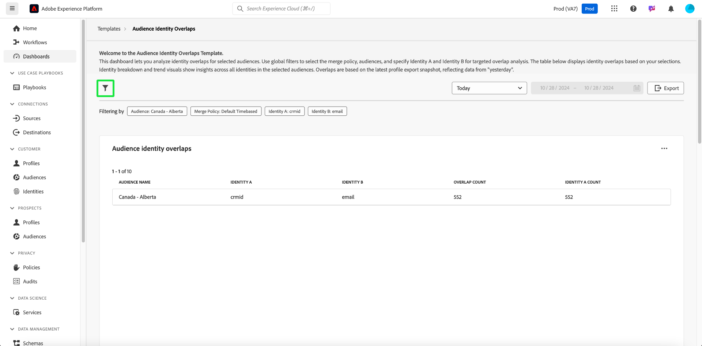
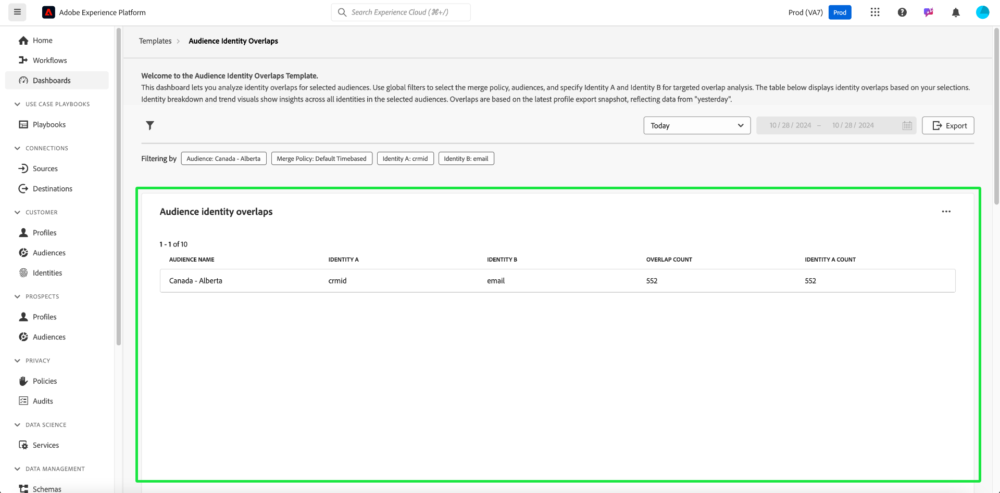

# 受众标识重叠

使用[!UICONTROL 受众身份重叠]仪表板分析所选受众的身份重叠。 您可以深入分析受众中不同身份之间的相互关系，以优化拼接策略、减少冗余并提高客户分段准确性。 通过更好地了解身份类型之间的重叠，制定有效的定位策略并简化客户交互。

## 过滤受众 {#filter-audiences}

使用自定义筛选器对特定受众和身份类型进行目标分析，以确保显示的数据与您的分析目标保持一致。 要开始分析，请选择过滤器图标（）。

出现&#x200B;**[!UICONTROL 筛选器]**&#x200B;对话框。 从该视图中，选择全局筛选器以配置要比较的受众、合并策略和身份。 从每个部分的下拉菜单中选择要分析的设置

1. 选择&#x200B;**[!UICONTROL 受众]**：选择要分析的受众区段（例如，**加拿大 — 艾伯塔**）。
2. 指定&#x200B;**[!UICONTROL 合并策略]**：定义指定如何在所选受众中组合标识的合并策略（在示例屏幕快照中，选择了&#x200B;**基于默认时间的**&#x200B;策略）。
3. 选择&#x200B;**[!UICONTROL 标识A]**&#x200B;和&#x200B;**[!UICONTROL 标识B]**&#x200B;进行比较&#x200B;**：选择要比较的两种标识类型。 在此示例中，**&#x200B;标识A&#x200B;**&#x200B;被选为“crmId”，**&#x200B;标识B**&#x200B;被选为“电子邮件”。
4. **设置日期范围**：选择预定义的范围，如“今天”，或使用日历字段手动设置开始和结束日期。

>[!TIP]
>
>要清除所有自定义全局筛选器，请从[!UICONTROL 筛选器]对话框中选择&#x200B;**[!UICONTROL 全部清除]**。 要删除单个筛选器，请选择筛选器名称右侧的“[!UICONTROL X]”。

选择筛选器后，选择&#x200B;**[!UICONTROL 应用]**&#x200B;以刷新仪表板。

## 可用的仪表板分析 {#available-insights}

**受众身份重叠**&#x200B;仪表板提供了多个可视化图表和列表数据，帮助您了解受众中的身份重叠和趋势。

### 受众标识重叠 {#overlaps-table}

**[!UICONTROL 受众身份重叠]**&#x200B;表根据您选择的筛选器显示身份重叠。 使用此信息可评估不同身份类型之间的重叠，并了解身份解析的有效性。 下表详细说明了每一列：

| 列名称 | 描述 |
|-----------------|-------------------------------|
| **[!UICONTROL 受众名称]** | 正在分析的受众的名称。 此列可识别正在审核的受众区段，以确保分析专注于预期的目标组。 |
| **[!UICONTROL 标识A]**&#x200B;和&#x200B;**[!UICONTROL 标识B]** | 正在比较的身份（例如，`crmId`和`email`）。 了解要比较的身份类型可帮助您识别哪些身份解析策略会导致受众重叠，并优化这些关系。 |
| **[!UICONTROL 重叠计数]** | 存在两个身份的配置文件计数。 此量度提供对受众中身份重叠程度的洞察。 此信息对于评估将多个身份解析为统一用户档案的效率至关重要，进而可以改进定位和个性化策略。 |
| **[!UICONTROL 标识计数]** | 所选受众中包含&#x200B;**标识A**&#x200B;的配置文件总数。 使用此信息可了解主要身份类型在受众中的普遍程度，并评估其在重叠分析中的作用。 |

### 身份细分 {#identity-breakdown}

**[!UICONTROL 身份划分]**&#x200B;图表显示选定受众中身份的相对构成。 X轴表示所选受众中的身份总数，而Y轴表示正在分析的受众名称。 使用此可视化图表可了解每种身份类型的流行情况并评估身份管理策略的影响。 此图表使用不同的颜色来区分身份类型，从而快速概述如何在受众中分布身份。

>[!TIP]
>
>将鼠标悬停在这些列上可查看每种身份类型的个人用户档案计数。

### 受众身份趋势 {#audience-identity-trends}

**[!UICONTROL 受众身份趋势]**&#x200B;图表提供有关身份总数随时间变化的见解。 X轴表示正在分析的日期范围，而Y轴表示受众的身份总数。 使用此指标跟踪身份增长、评估稳定性以及衡量正在进行的身份管理工作的有效性。

>[!TIP]
>
>将鼠标悬停在图表中的某个日期上，可查看特定日期的受众身份总数。

## 导出分析 {#export-insights}

在分析身份重叠后，可导出数据以供离线分析或报告。 要导出数据，请选择表右上角的&#x200B;**[!UICONTROL 导出]**。 此时将显示打印PDF对话框，允许您将可视化数据保存为PDF或进行打印。

**受众标识重叠**&#x200B;仪表板提供有关不同标识如何在所选受众之间交叉的基本见解。 利用这些见解，您可以优化身份拼接策略，减少冗余，并确保受众分段更准确有效。

## 后续步骤

阅读本文档后，您已了解如何使用&#x200B;**受众身份重叠**&#x200B;仪表板获得有关所选受众的身份重叠的有价值见解。 为了进一步加深您对受众分段和身份管理的了解，请探索可提供全面见解的其他数据Distiller模板。 请参阅[受众趋势](./trends.md)、[受众比较](./comparison.md)和[高级受众重叠](./overlaps.md) UI指南，以继续改进您的定位和参与策略。

