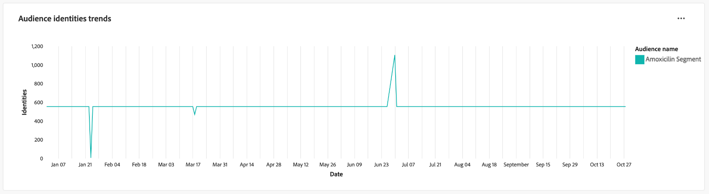

# 受众趋势

通过[!UICONTROL 受众趋势]仪表板上的关键受众量度可视化图表，分析受众如何随时间变化。 此仪表板可帮助您跟踪受众增长、身份数和单一身份配置文件计数等趋势，并让您能够做出数据驱动型决策。 通过分析这些量度，营销人员可以优化定位策略、提高受众参与度并完善其分段工作，以实现更有效的营销活动。

## 过滤受众 {#filter-audiences}

要开始分析，请使用全局过滤器选择要分析的特定受众和日期范围。 选择过滤器图标()以打开&#x200B;**[!UICONTROL 筛选器]**&#x200B;对话框，您可以：

1. **选择受众**：选择要分析的受众（在示例屏幕快照中，已选择&#x200B;**阿莫西林**&#x200B;受众）。
1. **设置日期范围**：从下拉菜单中选择预定义的范围，或使用日历字段手动选择开始日期和结束日期。

设置筛选器后，选择&#x200B;**[!UICONTROL 应用]**&#x200B;以更新仪表板。 应用您选择的过滤器，并显示特定时段内选定受众的重点分析。 您的自定义筛选器可确保数据与您的分析目标相关。

## 可用的受众趋势图 {#available-charts}

有三个主要图表可帮助您了解一段时间内的受众量度。 对于每个图表，您可以选择右上角的椭圆(`...`)，然后依次选择[!UICONTROL 查看更多]以查看以表格形式显示的结果，或者以CSV文件格式下载数据以在电子表格中查看。 有关详细信息，请参阅[查看更多指南](../view-more.md)。

>[!TIP]
>
>您可以将鼠标悬停在任何图表中的特定日期上，以便在对话框中显示各个用户档案计数。

### 受众规模趋势 {#audience-size-trends}

**[!UICONTROL 受众规模趋势]**&#x200B;图表显示一段时间内选定受众中的配置文件数。 它有助于跟踪受众的增长或减少。 您可以使用此图表来监控参与效率并了解受众规模的变化。

### 受众身份趋势 {#audience-identities-trends}

**[!UICONTROL 受众身份趋势]**&#x200B;图表提供了受众区段内身份总数的见解。 使用此图表可了解唯一身份对受众整体规模的贡献情况。 它指示受众的稳定性和参与度。

### 单一身份受众规模趋势 {#single-identity-audience-size-trends}

**[!UICONTROL 单一身份受众规模趋势]**&#x200B;图表显示仅具有单一身份的受众成员计数。 此量度有助于了解受众的组成，尤其是身份唯一性，并且有助于衡量身份拼接工作的有效性。

## 导出分析 {#export-insights}

分析量度并应用相关过滤器后，可导出数据以供进一步离线分析或报告。 要执行此操作，请选择表右上角的&#x200B;**[!UICONTROL 导出]**。 此时将显示打印PDF对话框。 从该对话框中，您可以将可视化数据保存为PDF或进行打印。

## 后续步骤

阅读本文档后，您已了解如何从&#x200B;**受众趋势**&#x200B;仪表板获得有关一段时间内受众行为的宝贵见解。 要了解可帮助您做出明智决策、优化分段并改进参与策略的其他数据Distiller模板，请参阅[受众比较](./comparison.md)、[受众身份重叠](./identity-overlaps.md)和[高级受众重叠](./overlaps.md) UI指南。
