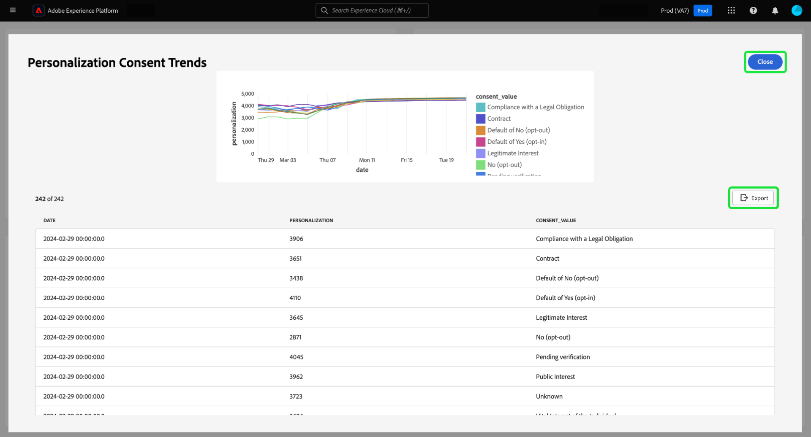
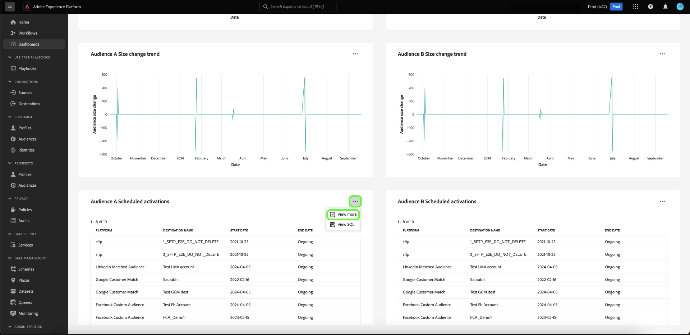

# 查看更多信息 {#view-more}

在使用[Query Pro模式](./overview.md#query-pro-mode)创建[自定义insight](./overview.md)后，您可以以多种格式查看图表数据。 您可以查看以表格形式显示的结果，或以CSV格式或通过电子邮件导出数据。

## 列表化结果 {#tabulated-results}

对于通过SQL使用查询专业模式创建的每个图表，您可以在Experience Platform UI中查看分析的列表结果。

从您的自定义仪表板中，选择任意小组件上的省略号(`...`)以访问[!UICONTROL 查看更多]和[!UICONTROL 查看SQL]选项。

## 导出 {#export}

在&#x200B;**[!UICONTROL 查看更多]**&#x200B;对话框中，通过直接下载CSV文件或发送指向您的电子邮件的链接以便稍后安全下载来导出表数据。

>[!IMPORTANT]
>
>要访问导出选项，您的管理员必须授予您&#x200B;**[!UICONTROL 导出仪表板数据]**&#x200B;权限。 如果[!UICONTROL 导出]按钮呈灰显状态，请与管理员联系。 有关仪表板权限的更多信息，请参阅[访问控制概述](../../access-control/home.md)。

>[!NOTE]
>
>仅可视化图表导出不需要[!UICONTROL 导出仪表板数据]权限。 例如，以PDF格式](./export-pdf.md)从[自定义仪表板分析导出已处理数据，或从[Platform UI仪表板分析](../download.md)导出已处理数据。

### 下载 CSV {#download-csv}

在[!UICONTROL 查看更多]对话框中，选择&#x200B;**[!UICONTROL 导出]**，然后选择&#x200B;**[!UICONTROL 下载CSV]**&#x200B;以下载CSV格式的图表数据。

>[!NOTE]
>
>CSV下载限制为前500条记录。

### 以电子邮件形式发送 {#send-as-email}

要导出500多条记录，请选择&#x200B;**[!UICONTROL 导出]**，然后从[!UICONTROL 导出文件]对话框中选择&#x200B;**[!UICONTROL 以电子邮件发送]**。 此选项会将下载链接安全地发送到与Adobe关联的电子邮件地址。 收件人的姓名和注册的Adobe电子邮件地址将显示在对话框的[!UICONTROL 收件人]部分中。

选择[!UICONTROL 以电子邮件发送]后，Adobe会生成一份报表，并向您注册的Adobe地址发送电子邮件。 该电子邮件包含一个安全下载链接，该链接需要通过Experience Platform进行身份验证。

>[!NOTE]
>
>您必须在生成链接后的24小时内下载报表；之后，文件将过期。

为了保护您的数据，Adobe会安全地托管导出的文件，而不是将它们作为附件发送。 访问需要通过Experience Platform UI进行身份验证，并且Adobe会验证文件是否仅由预期收件人下载。

此方法允许您导出最多&#x200B;**10,000条记录**，并确保对敏感数据的安全访问。

## 按列排序 {#sort-column}

查看列表化结果时，您可以使用排序功能按列升序或降序排序。 从您的自定义仪表板中，选择任意表上的省略号(`...`)以访问[!UICONTROL 查看更多]选项。

您可以通过选择列名称旁边的下拉菜单，然后选择&#x200B;**[!UICONTROL 升序排序]**&#x200B;或&#x200B;**[!UICONTROL 降序排序]**&#x200B;来对列进行排序。

>[!NOTE]
>
>[!UICONTROL 升序排序]和[!UICONTROL 降序排序]选项将仅对配置了[排序功能](./overview.md#advanced-attributes)的列显示。

## 调整列大小 {#resize-column}

您可以调整列表结果中的列大小以提高数据可读性。 从自定义仪表板中，选择表格的省略号(`...`)以访问[!UICONTROL 查看更多]选项。 使用列名称旁边的下拉菜单调整列大小，然后选择&#x200B;**[!UICONTROL 调整列大小]**。

选择滑块并向左或向右拖动以根据需要调整列大小。

## 表格分页 {#table-pagination}

分页功能会自动应用于[!UICONTROL 查看更多]功能中的表，无需手动修改SQL查询。 此功能可确保以更易于管理的格式显示数据，从而简化在大型数据集中导航的过程。

每页最多可查看500条记录。 要浏览记录，请使用位于页面底部的&#x200B;**[!UICONTROL >]**。

## 后续步骤

阅读本文档后，您现在知道如何从自定义图表的SQL分析查看列表化结果，以及如何安全地导出该数据。 查看查看SQL文档，了解如何[查看自定义分析背后的SQL](./view-sql.md)。

您还可以学习如何使用[引导式设计模式指南](../standard-dashboards.md)，从Adobe Experience Platform UI中的现有数据模型生成图表。
