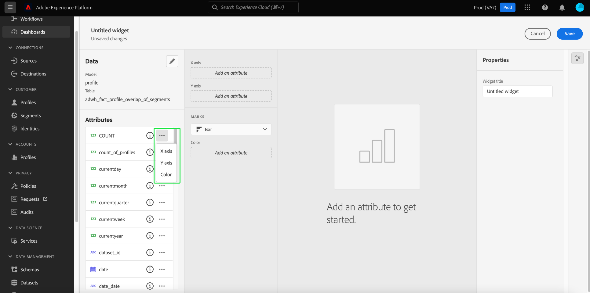
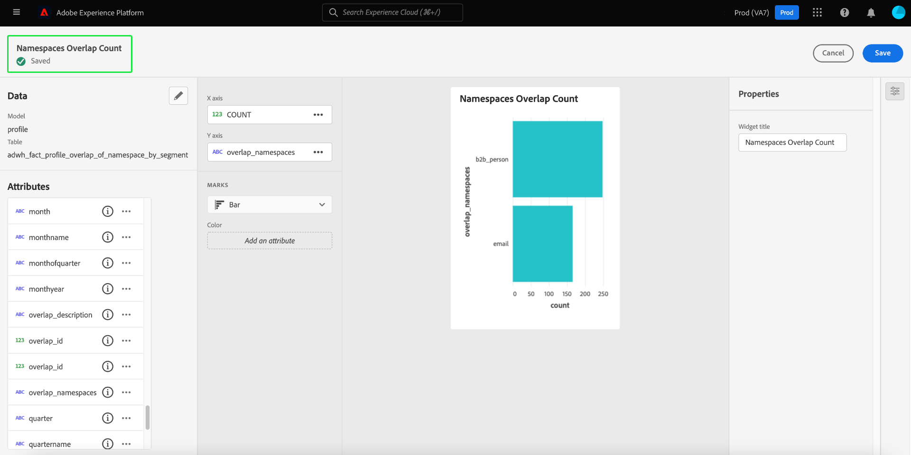

# 用户定义的仪表板

Adobe Experience Platform功能板可帮助您通过用户定义的功能来加速分析并自定义可视化图表。 通过此功能，您可以构建和管理自定义功能板，其中您可以创建、添加和编辑定制的小部件，以可视化与您的组织相关的关键量度。

<!-- Getting started / permissions section commented out for Beta. This will be necessary after GA only

## Getting started

To view dashboards in Adobe Experience Platform you must have the appropriate permissions enabled. Please read the [dashboards permissions documentation](./permissions.md#available-permissions) to learn how to grant users the ability to view, edit, and update Experience Platform dashboards using Adobe Admin Console. If you do not have administrator privileges for your organization, contact your product administrator to obtain the required permissions. -->

## 创建自定义仪表板

要创建自定义功能板，请先导航到功能板清单。 选择 **[!UICONTROL 仪表板]** 从Platform UI的左侧导航中，依次访问 **[!UICONTROL 创建功能板]**.

在添加自定义功能板之前，功能板清单为空，并显示“未找到功能板”。 消息。 创建后，您的所有用户定义的功能板都会在功能板清单中列出。

>[!NOTE]
>
>要编辑现有功能板，请从库存列表中选择功能板名称，后跟铅笔图标()

此 [!UICONTROL 创建功能板] 出现对话框。 为要创建的构件集合输入一个便于用户使用的描述性名称，然后选择 **[!UICONTROL 保存]**.

新创建的空白仪表板会在视图的左上角显示您选择的名称。

## 创建构件 {#create-widget}

>[!CONTEXTUALHELP]
>id="platform_dashboards_udd_maxwidgets"
>title="最大构件数"
>abstract="用户定义的仪表板支持最多 10 个构件。将 10 个构件添加到仪表板后，[!UICONTROL 添加新构件]选项将被禁用并显示为灰色。"

从新仪表板视图中，选择 **[!UICONTROL 添加新构件]** 以开始构件创建过程。

>[!IMPORTANT]
>
>用户定义的仪表板支持最多 10 个构件。将 10 个构件添加到仪表板后，[!UICONTROL 添加新构件]选项将被禁用并显示为灰色。

### 构件编辑器

此时将显示构件编辑器工作区。 接下来，选择 **[!UICONTROL 选择数据]** 以选择要向小部件添加属性的数据模型。

#### 选择数据模型 {#select-data-model}

此 [!UICONTROL 选择数据模型] 出现对话框。 从左列中选择一个数据模型，以显示所有可用表的预览列表。 Real-time Customer Data Platform的预配置数据模型名为 [!UICONTROL CDPInsights].

>[!TIP]
>
>选择信息图标()以查看完整的数据模型名称（如果数据边栏中显示太长）。

预览列表提供有关数据模型中所包含表的详细信息。 下表提供了有关列字段及其潜在值的说明。

| 列字段 | 描述 |
|---|---|
| [!UICONTROL 标题] | 表的名称。 |
| [!UICONTROL 表类型] | 表的类型。 可能的类型包括： `fact`， `dimension`、和 `none`. |
| [!UICONTROL 记录] | 与所选表关联的记录数。 |
| [!UICONTROL 查找] | 连接到所选表的表数。 |
| [!UICONTROL 属性] | 所选表的属性数。 |

选择 **[!UICONTROL 下一个]** 以确认您选择的数据模型。 下一个视图在左边栏中显示可用表的列表。 选择一个表以查看选定表中包含的数据的全面划分。

### 填充构件 {#populate-widget}

此 [!UICONTROL 预览] 面板包含选项卡 [!UICONTROL 样本记录] 和 [!UICONTROL 属性]. 此 [!UICONTROL 样本记录] 选项卡在表格视图中提供选定表中的记录子集。 此 [!UICONTROL 属性] 选项卡提供与所选表关联的每个属性的属性名称、数据类型和源表。

从左边栏中可用的列表中选择一个表，为您的小组件提供数据，然后选择 **[!UICONTROL 选择]** 以返回到构件编辑器。

构件编辑器现在填充了来自所选表的数据。

数据模型和当前选定的表显示在左边栏的顶部，可用于创建小组件的属性列在 [!UICONTROL 属性] 列。 您可以使用搜索栏查找属性，而不是滚动列表，或通过选择铅笔图标()。

#### 添加和筛选属性 {#add-and-filter-attributes}

选择添加图标()，以向小组件中添加属性。 显示的下拉菜单允许您添加属性作为X轴、Y轴、颜色或小部件的过滤器。 此 [!UICONTROL 颜色] 属性允许您根据颜色区分X轴和Y轴标记的结果。 它通过根据第三属性的组成将结果分割为不同的颜色来实现这一点。

>[!TIP]
>
>如果要反向X轴和Y轴的排列，请选择向上和向下箭头图标()，以切换其排列方式。

要更改小组件的图形或图表类型，请选择 [!UICONTROL 标记] 下拉菜单并从可用选项中进行选择。 选项包括条形、点、刻度、线条或区域。 选中后，将生成构件当前设置的预览可视化图表。

通过将属性添加为过滤器，您可以选择要从小部件中包括或排除哪些值。 从属性列表中添加过滤器后， [!UICONTROL 筛选] 此时将显示一个对话框，您可以在该对话框中通过其复选框选择或取消选择值。

#### 过滤掉历史数据 {#filter-historical-data}

要从构件生成的分析中过滤掉历史数据，请添加 `date_key` 属性作为筛选器并选择 **[!UICONTROL 最近日期]** 后接 **[!UICONTROL 应用]**. 此过滤器可确保从最近的系统快照获取用于获取见解的数据。

![此 [!UICONTROL 过滤器： date_key] 对话框 [!UICONTROL 最近日期] 和 [!UICONTROL 应用] 突出显示。](./images/user-defined-dashboards/recent-date.png)

或者，您可以创建一个自定义时间段，以按筛选数据。 选择 **[!UICONTROL 选择日期]** 使用可用日期列表扩展对话框。 使用 **[!UICONTROL 全选]** 此复选框可以启用或禁用所有可用选项，也可以分别选中每天的复选框。 最后，选择 **[!UICONTROL 应用]** 确认您的选择。

>[!NOTE]
>
>如果 `date_key` 属性已添加为过滤器，请选择省略号后跟 **[!UICONTROL 编辑]** 以更改过滤时段。

![此 [!UICONTROL 过滤器： date_key] 对话框，其中已选中和未选中单日复选框。](./images/user-defined-dashboards/select-dates.png)

### 构件属性

选择属性图标()以打开属性面板。 在 [!UICONTROL 属性] 面板中，为小组件输入名称 [!UICONTROL 构件标题] 文本字段。

从构件属性面板，可以编辑构件的多个方面。 您可以完全控制以编辑构件图例的位置。 要移动图例，请选择 [!UICONTROL 图例投放位置] 下拉列表，然后从可用选项列表中选择所需的位置。 您还可以重命名与图例关联的标签，并通过在 [!UICONTROL 图例标题] 文本字段，或 [!UICONTROL 轴标签] 文本字段。

#### 保存您的构件 {#save-widget}

在小组件编辑器中保存会将小组件本地保存到您的仪表板。 如果希望保存所做的工作并在以后继续，请选择 **[!UICONTROL 保存]**. 构件名称下方的勾号图标表示构件已保存。 或者，如果对小组件满意，请选择 **[!UICONTROL 保存并关闭]** 使该小组件可供对您的仪表板具有访问权限的所有其他用户使用。 选择 **[!UICONTROL 取消]** 以放弃您的工作并返回您的自定义仪表板。

>[!TIP]
>
>选择属性图标()，查看有关其创建的详细信息。 您可以在显示的对话框中更改仪表板的名称。

在此工作区中时，可以重新排列构件并调整其大小。 选择 **[!UICONTROL 保存]** 以保留您的功能板名称和配置的布局。

为了确保Adobe Real-time Customer Data Platform分析功能板的每个查询都有足够的资源来高效执行，API会通过为每个查询分配并发插槽来跟踪资源使用情况。 系统最多可以处理4个并发查询，因此可以在任意给定时间使用4个并发查询插槽。 查询基于并发插槽放入队列中，然后在队列中等待，直到有足够的并发插槽可用。

### 复制构件

创建构件后，您可以复制整个构件并自定义其属性以创建唯一构件，而无需从头开始。 要复制构件，请首先导航到功能板清单。 然后，从清单列表中选择仪表板名称。 此时会显示您的自定义仪表板。

选择铅笔图标()，以进入编辑模式。

接下来，选择要复制的构件右上角的省略号，然后选择 **[!UICONTROL 复制]** 从可用选项列表中。

用户定义的功能板中会显示一个重复的小部件。 选择新构件的省略号，然后 **[!UICONTROL 编辑]**，以自定义您的新构件。

## 后续步骤和其他资源

通过阅读本文档，您可以更好地了解如何创建自定义仪表板，以及如何为该仪表板创建、编辑和更新自定义构件。

发现预配置的可用量度和可视化图表 [用户档案](./guides/profiles.md#standard-widgets)， [区段](./guides/audiences.md#standard-widgets)、和 [目标](./guides/destinations.md#standard-widgets) 仪表板，请参阅其各自文档中的标准构件列表。

要加深您对Experience Platform中用户定义的功能板的了解，请观看以下视频：

>[!VIDEO](https://video.tv.adobe.com/v/3409637?quality=12&learn=on)
