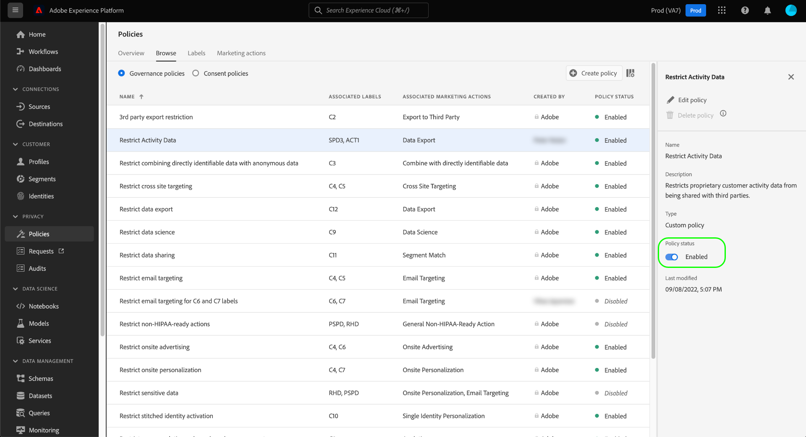

# 数据管理端到端指南

要控制可以对Adobe Experience Platform中的某些数据集和字段执行哪些营销操作，您必须设置以下内容：

1. [应用标签](#labels) 到要限制其使用情况的数据集和字段。
1. [配置并启用数据管理策略](#policy) 确定哪些类型的标记数据可用于特定营销操作。
1. [将营销操作应用到您的目标](#destinations) 以指示哪些策略适用于发送到这些目标的数据。

配置完标签、策略和营销操作后，您可以 [测试策略实施](#test) 以确保它按预期运行。

本指南将指导在Platform UI中配置和实施数据管理策略的完整过程。 有关本指南中所用功能的更多详细信息，请参阅以下主题的概述文档：

* [Adobe Experience Platform数据管理](./home.md)
* [数据使用标签](./labels/overview.md)
* [数据使用策略](./policies/overview.md)
* [策略执行](./enforcement/overview.md)

## 应用标签 {#labels}

如果您要对某个特定数据集强制实施数据使用限制，则可以 [直接将标签应用于该数据集](#dataset-labels) 或该数据集中的特定字段。

或者，您也可以 [将标签应用到架构](#schema-labels) 以便基于该架构的所有数据集都会继承相同的标签。

>[!NOTE]
>
>有关不同数据使用标签及其预期用途的更多信息，请参阅 [数据使用标签引用](./labels/reference.md). 如果可用的核心标签未涵盖您所需的所有用例，则可以 [定义您自己的自定义标签](./labels/user-guide.md#manage-custom-labels) 也是。

### 将标签应用于数据集 {#dataset-labels}

选择 **[!UICONTROL 数据集]** 在左侧导航中，选择要应用标签的数据集名称。 您可以选择使用搜索字段来缩小显示的数据集列表。

此时会显示数据集的详细信息视图。 选择 **[!UICONTROL 数据管理]** 选项卡，以查看数据集字段以及已应用于这些字段的任何标签的列表。 选中要向其添加标签的字段旁边的复选框，然后选择 **[!UICONTROL 编辑管理标签]** 中。

>[!NOTE]
>
>如果要向整个数据集添加标签，请选中 **[!UICONTROL 字段名称]** 在选择 **[!UICONTROL 编辑管理标签]**.
>
>

在下一个对话框中，选择要应用于之前选择的数据集字段的标签。 完成后，选择 **[!UICONTROL 保存更改]**.

继续按照上述步骤进行操作，以根据需要将标签应用到不同的字段（或不同的数据集）。 完成后，您可以继续下一步 [启用数据管理策略](#policy).

### 将标签应用于架构 {#schema-labels}

选择 **[!UICONTROL 模式]** 在左侧导航中，从列表中选择要向其添加标签的架构。

>[!TIP]
>
>如果您不确定哪个架构适用于特定数据集，请选择 **[!UICONTROL 数据集]** 在左侧导航中，选择 **[!UICONTROL 架构]** 列。 在显示的弹出窗口中选择架构名称，以在架构编辑器中打开架构。
>
>

架构的结构将显示在架构编辑器中。 从此处，选择 **[!UICONTROL 标签]** 选项卡，显示架构字段以及已应用到这些字段的标签的列表视图。 选中要向其添加标签的字段旁边的复选框，然后选择 **[!UICONTROL 编辑管理标签]** 中。

>[!NOTE]
>
>如果要向架构中的所有字段添加标签，请选择顶行上的铅笔图标。
>
>

在下一个对话框中，选择要应用于之前选择的架构字段的标签。 完成后，选择 **[!UICONTROL 保存]**.

请继续按照上述步骤进行操作，以根据需要将标签应用到不同的字段（或不同的架构）。 完成后，您可以继续下一步 [启用数据管理策略](#policy).

## 启用数据管理策略 {#policy}

将标签应用于架构和/或数据集后，您可以创建数据管理策略，以限制可用于某些标签的营销操作。

选择 **[!UICONTROL 策略]** 在左侧导航中，查看由Adobe定义的核心策略列表，以及您的组织之前创建的任何自定义策略。

每个核心标签都有一个关联的核心策略，在启用该策略后，该策略会对包含该标签的任何数据强制实施适当的激活限制。 要启用核心策略，请从列表中选择该策略，然后选择 **[!UICONTROL 策略状态]** 切换至 **[!UICONTROL 已启用]**.

如果可用的核心策略不涵盖您的所有用例（例如，当您使用您在组织下定义的自定义标签时），您可以改为定义自定义策略。 从 **[!UICONTROL 策略]** 工作区，选择 **[!UICONTROL 创建策略]**.

![显示 [!UICONTROL 创建策略] 按钮](./images/e2e/create-policy.png)

此时会出现一个弹出窗口，提示您选择要创建的策略类型。 选择 **[!UICONTROL 数据管理政策]**，然后选择 **[!UICONTROL 继续]**.

![显示 [!UICONTROL 数据管理政策] 选项](./images/e2e/governance-policy.png)

在下一个屏幕上，提供 **[!UICONTROL 名称]** 可选 **[!UICONTROL 描述]** 的。 在下表中，选择您希望此策略检查的标签。 换句话说，这些标签是策略将阻止用于您在下一步中指定的营销操作的标签。

如果您选择多个标签，则可以使用右边栏中的选项来确定是否必须存在所有标签，以便策略能够强制使用限制，或者是否只需要存在其中一个标签。 完成后，选择 **[!UICONTROL 下一个]**.

在下一个屏幕上，选择此策略将限制先前选择的标签用于的营销操作。 选择 **[!UICONTROL 下一个]** 继续。

最后一个屏幕显示了策略的详细信息以及策略将针对哪些标签限制的操作的摘要。 选择 **[!UICONTROL 完成]** 创建并启用策略。

策略已创建，但设置为 [!UICONTROL 已禁用] 默认情况下。 从列表中选择策略，然后设置 **[!UICONTROL 策略状态]** 切换至 **[!UICONTROL 已启用]** 以启用策略。

继续执行上述步骤以创建并启用所需的策略，然后再继续执行下一步。

## 管理目标的营销操作 {#destinations}

为了让您已启用的策略能够准确确定哪些数据可以激活到目标，您必须向该目标分配特定的营销操作。

例如，请考虑启用策略，以阻止包含 `C2` 标记[!UICONTROL 导出到第三方]&quot; 在将数据激活到目标时，策略会检查目标上存在哪些营销操作。 如果为“[!UICONTROL 导出到第三方]“ ”存在，尝试使用 `C2` 标签会导致策略违规。 如果为“[!UICONTROL 导出到第三方]“ ”不存在，则不会对具有的目标和数据强制实施策略 `C2` 标签可以自由激活。

When [在UI中连接目标](../destinations/ui/connect-destination.md), **[!UICONTROL 治理]** 工作流中的步骤允许您选择应用于此目标的营销操作，这最终可确定要为该目标强制实施哪些数据管理策略。

## 测试策略实施 {#test}

在标记数据、启用数据管理策略并将营销操作分配给目标后，您可以测试是否按预期强制实施您的策略。

如果设置正确，则当您尝试激活受策略限制的数据时，激活会被自动拒绝，并出现一条策略违规消息，概述导致违规的原因的详细数据谱系信息。

请参阅 [自动策略执行](./enforcement/auto-enforcement.md) 以了解有关如何解释策略违规消息的详细信息。

## 后续步骤

本指南介绍了在激活工作流中配置和实施数据管理策略所需的步骤。 有关本指南中涉及的“数据管理”组件的更多详细信息，请参阅以下文档：

* [数据使用标签](./labels/overview.md)
* [数据使用策略](./policies/overview.md)
* [策略执行](./enforcement/overview.md)
