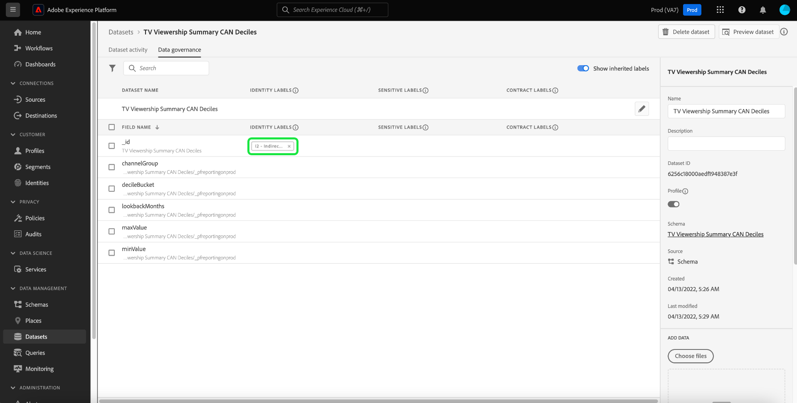

# 数据管理端到端指南

为了控制对Adobe Experience Platform中的某些数据集和字段可以执行的营销操作，您必须设置以下内容：

1. [将标签](#labels)应用于要限制其使用的架构字段或整个数据集。
1. [配置并启用数据治理策略](#policy)，以确定哪些类型的标记数据可用于某些营销操作。
1. [将营销操作应用于您的目标](#destinations)，以指示哪些策略适用于发送到这些目标的数据。

完成标签、治理策略和营销操作的配置后，您可以[测试策略实施](#test)以确保它按预期工作。

本指南将介绍在Experience Platform UI中配置和实施数据治理策略的完整过程。 有关本指南中所用功能的更多详细信息，请参阅有关以下主题的概述文档：

* [Adobe Experience Platform数据管理](./home.md)
* [数据使用情况标签](./labels/overview.md)
* [数据使用策略](./policies/overview.md)
* [策略实施](./enforcement/overview.md)

>[!NOTE]
>
>本指南重点介绍如何在Experience Platform中设置和执行有关如何使用或激活数据的策略。 如果您尝试限制组织中某些Experience Platform用户对数据本身的&#x200B;**访问**，请改为参阅关于[基于属性的访问控制](../access-control/abac/end-to-end-guide.md)的端到端指南。 基于属性的访问控制也使用标签和策略，但针对的用例与数据治理不同。

## 应用标签 {#labels}

>[!IMPORTANT]
>
>标签无法再应用于数据集级别的单个字段。 此工作流已弃用，支持在架构级别应用标签。 但是，您仍然可以为整个数据集设置标签。 在2024年5月31日之前，之前应用于单个数据集字段的任何标签仍通过Experience Platform UI受支持。 要确保您的标签在所有架构中保持一致，在未来一年中，必须将之前附加到数据集级别字段的任何标签迁移到架构级别。 有关如何迁移先前应用的标签](#migrate-labels)的说明，请参阅[部分。

您可以[将标签应用于架构](#schema-labels)，以便基于该架构的所有数据集都继承相同的标签。 这样，您就可以在一个位置管理数据管理、同意和访问控制的标签。 通过在架构级别强制实施数据使用约束，该效果会向下传播到基于该架构的所有数据集。 在架构字段级别应用的标签支持数据管理用例，并且可在[!UICONTROL 字段名称]列下的数据集工作区[!UICONTROL 数据管理]选项卡中作为只读标签发现。

如果某个特定数据集要强制实施数据使用约束，则可以[直接将标签应用于该数据集](#dataset-labels)或该数据集中的特定字段。

或者，您也可以[将标签应用于架构](#schema-labels)，以便基于该架构的所有数据集都继承相同的标签。

>[!NOTE]
>
>有关不同数据使用标签及其预期用途的更多信息，请参阅[数据使用标签参考](./labels/reference.md)。 如果可用的核心标签未涵盖所有所需用例，您也可以[定义自己的自定义标签](./labels/user-guide.md#manage-custom-labels)。

### 将标签应用于整个数据集 {#dataset-labels}

在左侧导航中选择&#x200B;**[!UICONTROL 数据集]**，然后选择要为其应用标签的数据集的名称。 您可以选择使用搜索字段来缩小显示的数据集列表。

此时将显示数据集的详细信息视图。 选择&#x200B;**[!UICONTROL 数据管理]**&#x200B;选项卡可查看数据集的字段列表以及已应用于这些字段的任何标签。 选择铅笔图标以编辑数据集标签。

出现[!UICONTROL 编辑治理标签]对话框。 选择适当的治理标签并选择&#x200B;**[!UICONTROL 保存]**。

### 将标签应用于架构 {#schema-labels}

在左侧导航中选择&#x200B;**[!UICONTROL 架构]**，然后从列表中选择要将标签添加到的架构。

>[!TIP]
>
>如果不确定哪个架构适用于特定数据集，请在左侧导航中选择&#x200B;**[!UICONTROL 数据集]**，然后为所需的数据集选择&#x200B;**[!UICONTROL 架构]**&#x200B;列下的链接。 在弹出框中选择架构名称，该弹出框显示在架构编辑器中打开该架构。
>
>

架构的结构显示在架构编辑器中。 在此处，选择&#x200B;**[!UICONTROL 标签]**&#x200B;选项卡以显示架构字段的列表视图以及已应用于这些字段的标签。 选中要添加标签的字段旁边的复选框，然后在右边栏中选择&#x200B;**[!UICONTROL 应用访问和数据治理标签]**。

>[!NOTE]
>
>如果要将标签添加到架构中的所有字段，请选择顶行上的铅笔图标。
>
>

出现[!UICONTROL 应用访问和数据治理标签]对话框。 选择要应用于所选架构字段的标签。 完成后，选择&#x200B;**[!UICONTROL 保存]**。

继续按照上述步骤，根据需要将标签应用于不同字段（或不同架构）。 完成后，您可以继续下一步[启用数据治理策略](#policy)。

### 迁移以前在数据集级别应用的标签 {#migrate-labels}

在左侧导航中选择&#x200B;**[!UICONTROL 数据集]**，然后选择要从中迁移标签的数据集的名称。 您可以选择使用搜索字段来缩小显示的数据集列表。

此时将显示数据集的详细信息视图。 选择&#x200B;**[!UICONTROL 数据管理]**&#x200B;选项卡可查看数据集的字段列表以及已应用于这些字段的任何标签。 选择要从字段中移除的任何标签旁边的取消图标。 出现确认对话框，选择[!UICONTROL 删除标签]以确认您的选择。

从数据集字段中移除标签后，导航到架构编辑器以将该标签添加到架构中。 有关如何执行此操作的说明，请参阅有关将标签应用于架构](#schema-labels)的[部分。

>[!TIP]
>
>您可以在右边栏中选择架构名称，然后单击对话框中的链接，该对话框显示为导航到相应的架构。
>

迁移必要的标签后，请确保您启用了正确的[数据管理策略](#policy)。

## 启用数据治理策略 {#policy}

将标签应用于架构和/或数据集后，您可以创建数据治理策略，以限制某些标签可用于的营销操作。

在左侧导航中选择&#x200B;**[!UICONTROL 策略]**&#x200B;以查看由Adobe定义的核心策略列表，以及您的组织之前创建的任何自定义策略。

每个核心标签都有一个相关联的核心策略，在启用该策略后，将对包含该标签的任何数据强制执行相应的激活约束。 若要启用某个核心策略，请从列表中选择该策略，然后选择&#x200B;**[!UICONTROL 策略状态]**&#x200B;切换到&#x200B;**[!UICONTROL 已启用]**。

如果可用的核心策略未涵盖您的所有用例（例如，当您使用您在组织下定义的自定义标签时），您可以改为定义自定义策略。 从&#x200B;**[!UICONTROL 策略]**&#x200B;工作区中，选择&#x200B;**[!UICONTROL 创建策略]**。

![显示正在用户界面中选择[!UICONTROL 创建策略]按钮的图像](./images/e2e/create-policy.png)

此时会出现一个弹出窗口，提示您选择要创建的策略类型。 选择&#x200B;**[!UICONTROL 数据治理策略]**，然后选择&#x200B;**[!UICONTROL 继续]**。

![显示正在选择[!UICONTROL 数据治理策略]选项的图像](./images/e2e/governance-policy.png)

在下一个屏幕上，为策略提供一个&#x200B;**[!UICONTROL Name]**&#x200B;和可选的&#x200B;**[!UICONTROL Description]**。 在下表中，选择您希望此策略检查的标签。 换言之，策略将阻止将这些标签用于您在下一步中指定的营销操作。

如果选择多个标签，则可以使用右边栏中的选项来确定是必须存在所有标签才能使策略强制实施使用限制，还是只需要存在其中一个标签。 完成后，选择&#x200B;**[!UICONTROL 下一步]**。

在下一个屏幕上，选择此策略将限制先前选择的标签用于的营销操作。 选择&#x200B;**[!UICONTROL 下一步]**&#x200B;以继续。

最后一个屏幕显示策略详细信息的摘要，以及将为哪些标签限制执行的操作。 选择&#x200B;**[!UICONTROL 完成]**&#x200B;以创建策略。

策略已创建，但默认设置为[!UICONTROL 已禁用]。 从列表中选择策略并将&#x200B;**[!UICONTROL 策略状态]**&#x200B;切换设置为&#x200B;**[!UICONTROL 已启用]**&#x200B;以启用该策略。

继续执行上述步骤以创建并启用您所需的策略，然后再继续后续步骤。

## 管理目标的营销操作 {#destinations}

为了使启用的策略能够准确地确定哪些数据可以激活到目标，您必须将特定的营销操作分配给该目标。

例如，考虑启用的策略，该策略可防止将任何包含`C2`标签的数据用于营销操作“[!UICONTROL 导出到第三方]”。 将数据激活到目标时，策略会检查目标上存在哪些营销操作。 如果存在“[!UICONTROL 导出到第三方]”，则尝试激活带有`C2`标签的数据会导致策略冲突。 如果“[!UICONTROL 导出到第三方]”不存在，则不会为目标强制执行策略，并且可以自由激活带有`C2`标签的数据。

在[连接UI](../destinations/ui/connect-destination.md)中的目标时，工作流中的&#x200B;**[!UICONTROL 管理]**&#x200B;步骤允许您选择应用于此目标的营销操作，这些操作最终将确定为该目标强制实施的数据管理策略。

## 测试策略实施 {#test}

标记数据、启用数据管理策略并将营销操作分配给目标后，您可以测试策略是否按预期执行。

如果设置正确，则当您尝试激活受策略限制的数据时，激活会自动被拒绝，并出现一条策略违规消息，其中概述了有关导致违规的原因的详细数据历程信息。

有关如何解释策略违规消息的详细信息，请参阅[自动策略实施](./enforcement/auto-enforcement.md)文档。

## 后续步骤

本指南介绍了在激活工作流中配置和实施数据治理策略所需的步骤。 有关本指南中涉及的数据管理组件的更多详细信息，请参阅以下文档：

* [数据使用情况标签](./labels/overview.md)
* [数据使用策略](./policies/overview.md)
* [策略实施](./enforcement/overview.md)
