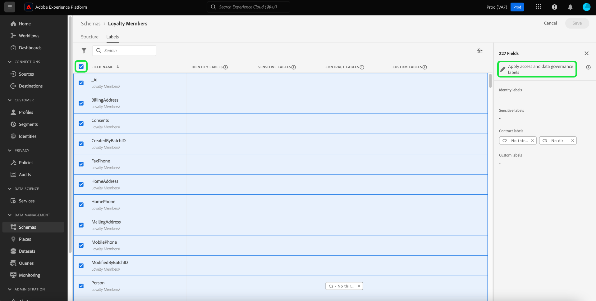
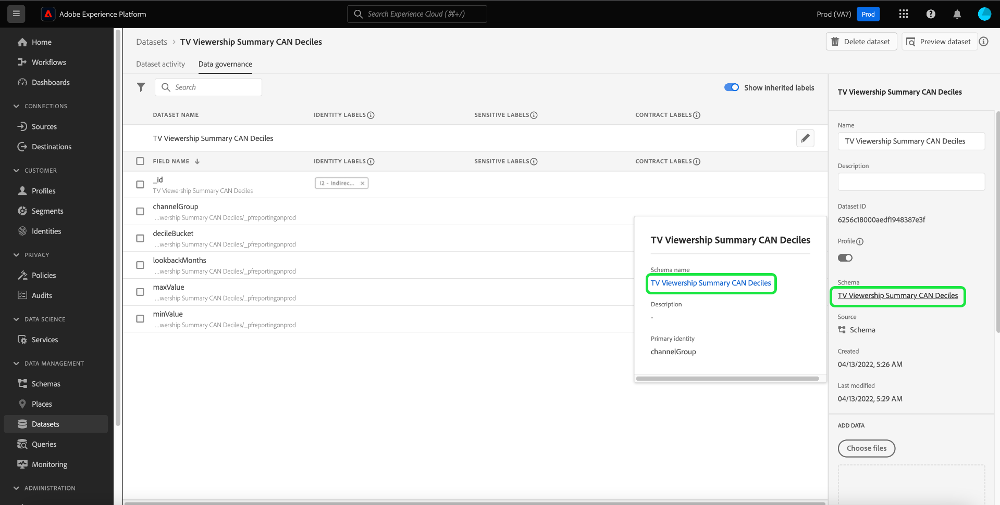

# 数据治理端到端指南

为了控制可以对Adobe Experience Platform中的某些数据集和字段执行哪些营销操作，您必须设置以下内容：

1. [应用标签](#labels) 要限制其使用情况的架构字段或整个数据集。
1. [配置并启用数据治理策略](#policy) 确定哪些类型的标记数据可用于某些营销操作。
1. [将营销操作应用于目标](#destinations) 以指示哪些策略适用于发送到这些目标的数据。

配置完标签、治理策略和营销操作后，您可以 [测试策略实施](#test) 以确保它按预期工作。

本指南将逐步介绍在Platform UI中配置和实施数据治理策略的完整过程。 有关本指南中所用功能的更多详细信息，请参阅有关以下主题的概述文档：

* [Adobe Experience Platform数据管理](./home.md)
* [数据使用情况标签](./labels/overview.md)
* [数据使用策略](./policies/overview.md)
* [策略实施](./enforcement/overview.md)

>[!NOTE]
>
>本指南重点介绍如何设置和实施在Experience Platform中使用或激活数据的策略。 如果您尝试限制 **访问** 有关贵组织内特定Platform用户的数据本身，请参阅的端到端指南 [基于属性的访问控制](../access-control/abac/end-to-end-guide.md) 而是。 基于属性的访问控制也使用标签和策略，但用例与数据治理不同。

## 应用标签 {#labels}

>[!IMPORTANT]
>
>标签无法再应用于数据集级别的单个字段。 此工作流已弃用，支持在架构级别应用标签。 但是，您仍然可以为整个数据集设置标签。 在2024年5月31日之前，之前应用于单个数据集字段的任何标签仍将通过Platform UI受到支持。 要确保您的标签在所有架构中保持一致，任何之前附加到数据集级别字段的标签，必须在未来一年中由您迁移到架构级别。 请参阅以下部分： [迁移以前应用的标签](#migrate-labels) 以获取有关如何执行此操作的说明。

您可以 [将标签应用于架构](#schema-labels) 因此，基于该架构的所有数据集将继承相同的标签。 这允许您在一个位置管理数据治理、同意和访问控制的标签。 通过在架构级别强制实施数据使用约束，该效果会向下传播到基于该架构的所有数据集。 在架构字段级别应用的标签支持数据管理用例，并且可在数据集工作区中发现 [!UICONTROL 数据管理] 选项卡 [!UICONTROL 字段名称] 列作为只读标签。

如果要对特定数据集强制执行数据使用约束，您可以 [将标签直接应用于该数据集](#dataset-labels) 或该数据集中的特定字段。

或者，您可以 [将标签应用于架构](#schema-labels) 因此，基于该架构的所有数据集将继承相同的标签。

>[!NOTE]
>
>有关不同数据使用标签及其预期用途的更多信息，请参阅 [数据使用标签参考](./labels/reference.md). 如果可用的核心标签未涵盖所有所需的用例，您可以 [定义您自己的自定义标签](./labels/user-guide.md#manage-custom-labels) 也是。

### 将标签应用于整个数据集 {#dataset-labels}

选择 **[!UICONTROL 数据集]** 在左侧导航中，选择要应用标签的数据集的名称。 您可以选择使用搜索字段来缩小显示的数据集列表。

此时将显示数据集的详细信息视图。 选择 **[!UICONTROL 数据治理]** 选项卡，以查看数据集的字段列表以及已应用于这些字段的任何标签。 选择铅笔图标以编辑数据集标签。

此 [!UICONTROL 编辑治理标签] 对话框。 选择相应的治理标签，然后选择 **[!UICONTROL 保存]**.

### 将标签应用于架构 {#schema-labels}

选择 **[!UICONTROL 架构]** 在左侧导航中，然后从列表中选择要将标签添加到的架构。

>[!TIP]
>
>如果您不确定哪个架构适用于特定数据集，请选择 **[!UICONTROL 数据集]** 在左侧导航中，然后选择位于页面顶部的 **[!UICONTROL 架构]** 列作为所需数据集。 在弹出框中选择架构名称，此时将显示在架构编辑器中打开该架构。
>
>

架构的结构显示在架构编辑器中。 从此处选择 **[!UICONTROL 标签]** 选项卡中显示架构字段的列表视图以及已应用于这些字段的标签。 选中要添加标签的字段旁边的复选框，然后选择 **[!UICONTROL 应用访问和数据治理标签]** 在右边栏中。

>[!NOTE]
>
>如果要将标签添加到架构中的所有字段，请选择顶行上的铅笔图标。
>
>

此 [!UICONTROL 应用访问和数据治理标签] 对话框。 选择要应用于所选架构字段的标签。 完成后，选择 **[!UICONTROL 保存]**.

继续执行上述步骤，根据需要将标签应用于不同字段（或不同架构）。 完成后，您可以继续的下一步 [启用数据治理策略](#policy).

### 迁移以前在数据集级别应用的标签 {#migrate-labels}

选择 **[!UICONTROL 数据集]** 在左侧导航中，选择要从中迁移标签的数据集的名称。 您可以选择使用搜索字段来缩小显示的数据集列表。

此时将显示数据集的详细信息视图。 选择 **[!UICONTROL 数据治理]** 选项卡，以查看数据集的字段列表以及已应用于这些字段的任何标签。 选择要从字段中移除的任何标签旁边的取消图标。 出现确认对话框，选择 [!UICONTROL 移除标签] 以确认您的选择。

从数据集字段删除标签后，导航到架构编辑器以将该标签添加到架构。 有关如何执行此操作的说明，请参阅 [有关将标签应用于架构的部分](#schema-labels).

>[!TIP]
>
>您可以在右边栏中选择架构名称，然后单击对话框中的链接，该对话框似乎用于导航到相应的架构。
>

迁移必要的标签后，请确保您拥有正确的标签 [已启用数据治理策略](#policy).

## 启用数据治理策略 {#policy}

将标签应用于架构和/或数据集后，您可以创建数据治理策略，以限制某些标签可用于的营销操作。

选择 **[!UICONTROL 策略]** 在左侧导航中，可查看由Adobe定义的核心策略列表，以及您的组织之前创建的任何自定义策略。

每个核心标签都有一个关联的核心策略，该策略在启用时对包含该标签的任何数据强制执行适当的激活约束。 要启用核心策略，请从列表中选择该策略，然后选择 **[!UICONTROL 策略状态]** 切换到 **[!UICONTROL 已启用]**.

如果可用的核心策略未涵盖您的所有用例（例如，当您使用组织下定义的自定义标签时），您可以改为定义自定义策略。 从 **[!UICONTROL 策略]** 工作区，选择 **[!UICONTROL 创建策略]**.

![图像显示 [!UICONTROL 创建策略] 在UI中选择的按钮](./images/e2e/create-policy.png)

此时会出现一个弹出窗口，提示您选择要创建的策略类型。 选择 **[!UICONTROL 数据治理策略]**，然后选择 **[!UICONTROL 继续]**.

![图像显示 [!UICONTROL 数据治理策略] 正在选择的选项](./images/e2e/governance-policy.png)

在下一个屏幕上，提供 **[!UICONTROL 名称]** 和可选 **[!UICONTROL 描述]** 用于策略。 在下表中，选择您希望此策略检查的标签。 换言之，这些是策略将阻止用于您在下一步中指定的营销操作的标签。

如果选择多个标签，则可以使用右边栏中的选项来确定是必须存在所有标签才能使策略强制实施使用限制，还是只需存在其中一个标签。 完成后，选择 **[!UICONTROL 下一个]**.

在下一个屏幕上，选择此策略将限制先前选择的标签使用的营销操作。 选择&#x200B;**[!UICONTROL 下一步]**&#x200B;以继续。

最后一个屏幕显示策略详细信息的摘要，以及它将针对哪些标签限制哪些操作。 选择 **[!UICONTROL 完成]** 以创建策略。

策略已创建，但设置为 [!UICONTROL 已禁用] 默认情况下。 从列表中选择策略并设置 **[!UICONTROL 策略状态]** 切换到 **[!UICONTROL 已启用]** 以启用策略。

继续执行上述步骤以创建并启用您所需的策略，然后再继续后续步骤。

## 管理目标的营销操作 {#destinations}

为了使启用的策略能够准确确定哪些数据可以激活到目标，您必须将特定的营销操作分配给该目标。

例如，考虑启用的策略，该策略阻止任何包含 `C2` 标签以免用于营销操作”[!UICONTROL 导出到第三方]“。 将数据激活到目标时，策略会检查目标上存在哪些营销操作。 If &quot;[!UICONTROL 导出到第三方]”存在，正在尝试使用激活数据 `C2` 标签导致策略违规。 If &quot;[!UICONTROL 导出到第三方]”不存在，则不会为目标和数据强制使用该策略 `C2` 标签可以自由地激活。

时间 [在UI中连接目标](../destinations/ui/connect-destination.md)，则 **[!UICONTROL 治理]** 通过工作流中的步骤，可选择应用于此目标的营销操作，这最终会确定为目标强制执行的数据治理策略。

## 测试策略实施 {#test}

标记数据、启用数据管理策略并将营销操作分配给目标后，您可以测试策略是否按预期执行。

如果设置正确，当您尝试激活受策略限制的数据时，激活会自动被拒绝，并且会显示一条策略违规消息，其中概述了有关导致违规的原因的详细数据历程信息。

查看文档 [自动策略执行](./enforcement/auto-enforcement.md) 有关如何解释策略违规消息的详细信息。

## 后续步骤

本指南介绍了在激活工作流中配置和实施数据治理策略所需的步骤。 有关本指南中涉及的数据管理组件的更多详细信息，请参阅以下文档：

* [数据使用情况标签](./labels/overview.md)
* [数据使用策略](./policies/overview.md)
* [策略实施](./enforcement/overview.md)
