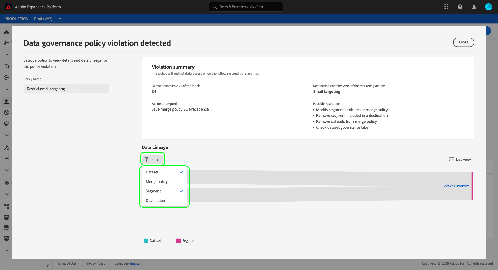
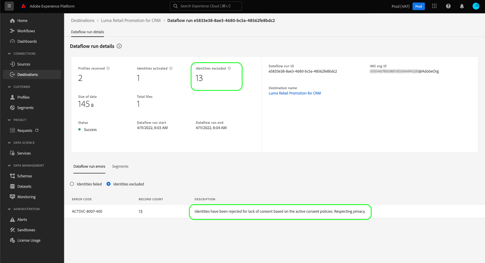

# 自动策略实施

数据使用标签和策略可供所有Adobe Experience Platform用户使用。 定义数据使用策略并应用数据使用标签，以确保准确处理任何敏感、可识别或合同数据。 这些措施有助于强制实施您组织的数据治理规则，以便确定如何访问、处理、存储和共享数据。

为了帮助保护您的组织免受潜在风险和责任的影响，如果在将受众激活到目标时发生了任何违规，Experience Platform会自动实施使用策略。

>[!IMPORTANT]
>
>同意策略和自动同意策略实施仅适用于已购买&#x200B;**Adobe Healthcare Shield**&#x200B;或&#x200B;**Adobe Privacy &amp; Security Shield**&#x200B;的组织。

本文档重点介绍数据治理和同意政策的实施。 有关访问控制策略的信息，请参阅有关[基于属性的访问控制](../../access-control/abac/overview.md)的文档。

## 先决条件

本指南要求您实际了解自动实施中涉及的Experience Platform服务。 在继续阅读本指南之前，请参阅以下文档以了解更多信息：

* [Adobe Experience Platform数据管理](../home.md)： Experience Platform通过使用标签和策略来实施数据使用合规性的框架。
* [实时客户个人资料](../../profile/home.md)：根据来自多个来源的汇总数据提供统一的实时客户个人资料。
* [Adobe Experience Platform分段服务](../../segmentation/home.md)： [!DNL Experience Platform]中的分段引擎用于根据客户行为和属性从客户配置文件创建受众。
* [目标](../../destinations/home.md)：目标是预建的与常用应用程序的集成，可无缝激活Experience Platform中的数据，以用于跨渠道营销活动、电子邮件营销活动、定向广告等。

## 实施流程 {#flow}

下图说明了如何将策略实施集成到受众激活的数据流中：

首次激活受众时，[!DNL Policy Service]会根据以下因素检查适用的策略：

* 应用于要激活受众中字段和数据集的数据使用标签。
* 目标的营销目的。
* 根据您配置的同意策略，同意包含在受众激活中的用户档案。

>[!NOTE]
>
>如果存在仅应用于某些字段的数据使用标签，则只有在满足以下至少一项条件时，才会在激活时强制实施这些字段级标签：
>
>* 这些字段在受众中使用。
>* 这些字段配置为目标目标的投影属性。

## 数据族系 {#lineage}

数据族系在如何在Experience Platform中实施策略方面起着关键作用。 一般而言，数据谱系是指一组数据的起源，以及一段时间内发生的情况（或数据的移动位置）。

在数据治理的上下文中，谱系使数据使用标签能够从架构传播到使用其数据的下游服务，例如实时客户档案和目标。 这允许在数据通过Experience Platform的历程中的几个关键点评估和实施策略，并向数据使用者提供上下文，以了解发生策略违规的原因。

在Experience Platform，政策执行涉及以下族系：

1. 数据被摄取到Experience Platform并存储在&#x200B;**数据集**&#x200B;中。
1. 根据&#x200B;**合并策略**&#x200B;合并数据片段，通过这些数据集识别和构建客户配置文件。
1. 配置文件组根据通用属性划分为&#x200B;**受众**。
1. 受众已激活到下游&#x200B;**目标**。

上述时间轴中的每个阶段都表示一个可能有助于策略实施的实体，如下表所述：

| 数据谱系阶段 | 在策略执行中的作用 |
| --- | --- |
| 数据集 | 数据集包含数据使用标签（在架构字段级别或整个数据集级别应用），用于定义整个数据集或特定字段可以使用的用例。 如果将包含特定标签的数据集或字段用于策略限制的目的，则会发生策略违规。  从客户处收集的任何同意属性也存储在数据集中。 如果您有权访问同意策略，则任何不符合策略的同意属性要求的配置文件都将从激活到目标的受众中排除。 |
| 合并策略 | 合并策略是Experience Platform用于确定在将多个数据集的片段合并到一起时如何区分数据的优先级的规则。 如果将合并策略配置为将带有受限标签的数据集激活到目标，则会发生策略违规。 有关详细信息，请参阅[合并策略概述](../../profile/merge-policies/overview.md)。 |
| 受众 | 分段规则定义应从客户配置文件中包含哪些属性。 根据区段定义包含哪些字段，受众将继承这些字段的任何应用使用标签。 如果您尝试激活的受众，其继承的标签受目标目标的适用策略（基于其营销用例）的限制，则会发生策略违规。 |
| 目标 | 在设置目标时，可以定义营销操作（有时称为营销用例）。 此用例与策略中定义的营销操作相关联。 换言之，您为目标定义的营销操作确定哪些数据使用策略和同意策略适用于该目标。  如果您尝试激活使用标签受目标目标营销操作限制的受众，则会发生数据使用策略违规。  (Beta)激活受众后，任何不包含营销操作（由您的同意政策定义）所需的同意属性的配置文件都将从激活的受众中排除。 |

>[!IMPORTANT]
>
>某些数据使用策略可能会指定两个或更多具有AND关系的标签。 例如，如果标签`C1`和`C2`同时存在，策略可以限制营销操作，但如果仅存在其中一个标签，则不会限制相同的操作。
>
>在自动实施方面，数据管理框架不考虑将单独的受众激活到目标作为数据组合。 因此，如果这些标签包含在单独的受众中，则强制实施示例`C1 AND C2`策略&#x200B;**NOT**。 相反，仅当激活时同一受众中同时存在两个标签时，才强制执行此策略。

当发生策略违规时，UI中显示的结果消息提供了有用的工具，可用于探索违规的贡献数据族系以帮助解决问题。 下一节将提供更多详细信息。

## 策略实施消息 {#enforcement}

以下部分概述了Experience Platform UI中显示的各种策略实施消息：

* [数据使用策略违规](#data-usage-violation)
* [同意策略评估](#consent-policy-evaluation)

### 数据使用策略违规 {#data-usage-violation}

如果尝试激活受众（或[对已激活的受众进行编辑](#policy-enforcement-for-activated-audiences)）时发生了违反策略的情况，则该操作会被阻止，并且会出现一个弹出窗口，指示已违反一个或多个策略。 一旦触发了违规，您正在修改的实体将禁用&#x200B;**[!UICONTROL 保存]**&#x200B;按钮，直到更新相应的组件以符合数据使用策略为止。

选择一个策略名称以显示该违规的详细信息。

违规消息提供了所违反策略的摘要，包括配置策略以检查的条件、触发违规的特定操作以及问题的可能解决方法列表。

数据族图显示在违规摘要下方，允许您可视化与策略违规相关的数据集、合并策略、受众和目标。 当前更改的图元在图形中加亮，指示流中的哪个点导致发生违规。 您可以在图形内选择实体名称，以打开相关实体的详细信息页面。

您还可以使用&#x200B;**[!UICONTROL 筛选器]**&#x200B;图标（)以按类别筛选显示的实体。 必须至少选择两个类别才能显示数据。

选择&#x200B;**[!UICONTROL 列表视图]**&#x200B;以列表形式显示数据族系。 若要切换回可视图形，请选择&#x200B;**[!UICONTROL 路径视图]**。

#### 已成功应用标签 {#labels-successfully-applied}

如果在为架构字段添加标签之前创建数据使用策略，则一旦将标签应用于架构，您可能会遇到治理策略违规对话框。 在这种情况下，您可以成功地为部分架构添加标签。 已成功应用[!UICONTROL 标签]选项卡指示已成功应用哪些标签，因为该字段没有策略限制。

使用数据族图了解在将标签添加到架构字段之前需要执行哪些其他配置更改。

![已成功应用标签为[!UICONTROL 的策略违规对话框]选项卡突出显示。](../images/enforcement/labels-successfully-applied.png)

### 同意策略评估 {#consent-policy-evaluation}

将受众激活到目标时，您可以看到在[!UICONTROL 激活目标]工作流](#pre-activation-evaluation)的[审核阶段，您的[同意策略](../policies/user-guide.md)如何影响受众的影响范围。

>[!NOTE]
>
>同意策略仅适用于已购买Adobe Healthcare Shield或Adobe Privacy &amp; Security Shield的组织。

#### 付费媒体的同意策略增强 {#consent-policy-enhancement}

已增强对[批次](../../destinations/destination-types.md#file-based)和[流](../../destinations/destination-types.md#streaming-destinations)目标（包括付费媒体激活）的同意策略实施。 此增强功能面向Privacy and Security Shield或Healthcare Shield的客户提供，可在同意状态发生变化时主动从批处理和流式处理目标中删除用户档案。 它还可以确保立即传播同意更改，以便始终定位正确的受众。

这些改进增强了营销策略的可信度，因为它使得营销人员无需手动将同意属性添加到其区段表达式。 这可确保在撤销同意或不再符合同意策略条件后，不会无意中将任何用户档案定位到任何营销体验。 现在，在下游解决方案的激活工作流中，会自动实施营销同意策略，该策略设置有关如何跨各种营销工作流管理同意或偏好设置数据的规则。

>[!NOTE]
>
>由于此增强功能，UI没有变化。

#### 预激活评估 {#pre-activation-evaluation}

在[激活目标](../../destinations/ui/activation-overview.md)时完成&#x200B;**[!UICONTROL 审核]**&#x200B;步骤后，选择&#x200B;**[!UICONTROL 查看应用的策略]**。

在激活目标工作流中

此时将显示策略检查对话框，其中预览了同意策略对要激活的受众的同意受众有何影响。

Experience Platform UI中的

该对话框每次显示一个受众的同意受众。 要查看其他受众的策略评估，请使用图表上方的下拉菜单从列表中选择一个受众。

使用左边栏可在所选受众的适用同意策略之间进行切换。 未在图中的“[!UICONTROL 其他策略]”部分中选择的策略将显示出来。

该图显示了三组配置文件之间的重叠：

1. 符合所选受众资格的用户档案
1. 符合所选同意策略的配置文件
1. 符合受众其他适用同意政策的配置文件（在图中称为“[!UICONTROL 其他政策]”）

符合上述所有三个组资格的用户档案代表同意的受众，在右边栏中概述。

策略检查对话框中的

将鼠标悬停在图中的某个受众上，可显示该受众包含的用户档案数。

同意的受众由图的中心重叠部分表示，可以像其他部分一样突出显示。

#### 流量运行实施

将数据激活到目标时，流量运行详细信息会显示由于有效同意策略而被排除的身份数。

## 针对已激活受众的策略实施 {#policy-enforcement-for-activated-audiences}

策略实施在激活受众后仍适用于这些受众，从而限制对受众或其目标所做的任何会导致策略违规的更改。 由于[数据谱系](#lineage)在策略实施中的工作方式，以下任何操作都可能触发冲突：

* 更新数据使用标签
* 更改受众的数据集
* 更改受众谓词
* 更改目标配置

如果以上任何操作触发冲突，将阻止保存该操作并显示策略冲突消息，从而确保激活的受众在修改时继续遵守数据使用策略。

## 后续步骤

本文档介绍了如何在Experience Platform中自动执行策略。 有关如何使用API调用以编程方式将策略实施集成到应用程序的步骤，请参阅有关基于[API的实施](./api-enforcement.md)的指南。
