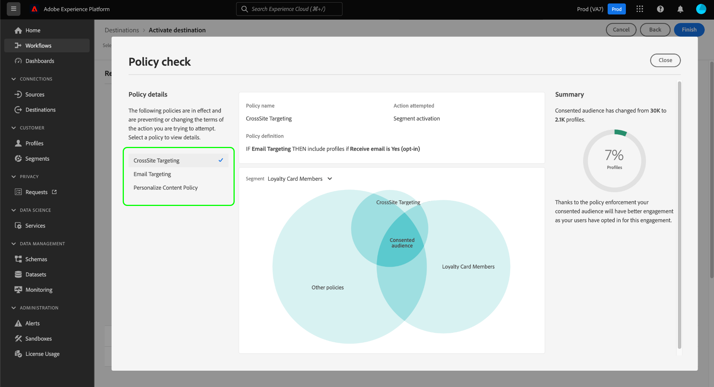

# 自动策略执行

>[!IMPORTANT]
>
>自动策略实施仅适用于已购买的组织 **Adobe医疗保健盾** 或 **Adobe隐私和安全防护**.

在标记数据并定义数据使用策略后，您可以强制数据使用符合策略。 在将受众区段激活到目标时，如果发生任何违规，Adobe Experience Platform会自动实施使用策略。

>[!NOTE]
>
>本文档重点介绍数据管理和同意策略的实施情况。 有关访问控制策略的信息，请参阅 [基于属性的访问控制](../../access-control/abac/overview.md).

## 先决条件

本指南要求您对自动执行中涉及的平台服务有一定的了解。 在继续阅读本指南之前，请参阅以下文档以了解更多信息：

* [Adobe Experience Platform数据管理](../home.md):平台通过使用标签和策略来强制遵守数据使用规定的框架。
* [实时客户资料](../../profile/home.md):根据来自多个来源的汇总数据提供统一的实时客户资料。
* [Adobe Experience Platform Segmentation Service](../../segmentation/home.md):中的分段引擎 [!DNL Platform] 用于根据客户行为和属性从客户配置文件创建受众区段。
* [目标](../../destinations/home.md):目标是与常用应用程序的预建集成，允许从平台无缝激活数据，以实现跨渠道营销活动、电子邮件促销活动、定向广告等。

## 执行流程 {#flow}

下图说明了如何将策略实施集成到区段激活的数据流中：

首次激活区段时， [!DNL Policy Service] 根据以下因素检查适用的策略：

* 应用于要激活的区段中的字段和数据集的数据使用标签。
* 目标的营销目的。
* 同意包含在区段激活中的用户档案，具体取决于您配置的同意策略。

>[!NOTE]
>
>如果数据使用标签仅应用于数据集（而非整个数据集）中的某些字段，则仅在以下条件下才会对激活强制执行这些字段级别标签：
>
>* 区段定义中使用了这些字段。
>* 这些字段配置为目标目标的投影属性。

## 数据谱系 {#lineage}

数据谱系在平台中如何强制实施策略方面起着关键作用。 一般而言，数据谱系是指一组数据的来源，以及随着时间推移（或其移动的位置）发生的情况。

在“数据管理”上下文中，沿袭允许数据使用标签从数据集传播到使用其数据的下游服务，如实时客户资料和目标。 这允许在数据通过平台的历程中的几个关键点评估和强制执行策略，并为数据使用者提供关于为何发生策略违规的上下文。

在Experience Platform中，策略执行涉及以下血统：

1. 数据将被摄取到平台中并存储在 **数据集**.
1. 根据 **合并策略**.
1. 用户档案组分为 **区段** 基于常用属性。
1. 区段激活到下游 **目标**.

上表中每个阶段代表一个可能有助于策略执行的实体，如下表所述：

| 数据谱系阶段 | 在策略执行中的作用 |
| --- | --- |
| 数据集 | 数据集包含数据使用情况标签（在数据集或字段级别应用），这些标签定义了整个数据集或特定字段可用于的用例。 如果某个数据集或包含某些标签的字段用于策略限制的目的，则会发生策略违规。  从客户收集的任何同意属性也会存储在数据集中。 如果您有权访问同意策略，则任何不符合策略同意属性要求的用户档案都将从激活到目标的区段中排除。 |
| 合并策略 | 合并策略是Platform用来确定在合并多个数据集中的片段时如何按优先级排列数据的规则。 如果您配置了合并策略，以便将具有受限标签的数据集激活到目标，则会发生策略违规。 请参阅 [合并策略概述](../../profile/merge-policies/overview.md) 以了解更多信息。 |
| 区段 | 区段规则定义应从客户配置文件中包含的属性。 根据区段定义包含的字段，区段将继承这些字段应用的所有使用情况标签。 如果您激活的区段继承的标签受目标目标目标的适用策略（基于其营销用例）的限制，则会发生策略违规。 |
| 目标 | 在设置目标时，可以定义营销操作（有时称为营销用例）。 此用例与策略中定义的营销操作关联。 换句话说，您为目标定义的营销操作决定了哪些数据使用策略和同意策略适用于该目标。  如果激活某个区段，而该区段的使用标签对目标目标的营销操作具有限制，则会发生数据使用策略违规。  （测试版）激活区段后，任何不包含营销操作所需同意属性（由您的同意策略定义）的用户档案，都将从激活的受众中排除。 |

>[!IMPORTANT]
>
>某些数据使用策略可能指定具有AND关系的两个或多个标签。 例如，如果标签为营销活动，则策略可能会限制该活动 `C1` 和 `C2` 都存在，但如果只存在其中一个标签，则不会限制相同的操作。
>
>在自动强制实施方面，数据管理框架不考虑将单独的区段作为数据组合激活到目标。 因此，示例 `C1 AND C2` 策略 **NOT** 如果这些标签包含在单独的区段中，则会强制执行。 相反，仅当激活时同一区段中同时存在两个标签时，才会强制执行此策略。

当发生策略违规时，UI中显示的生成消息将提供有用的工具，用于探索违规的贡献数据谱系，以帮助解决此问题。 下一节将提供更多详细信息。

## 策略执行消息 {#enforcement}

以下各节概述了Platform UI中显示的不同策略执行消息：

* [数据使用策略违规](#data-usage-violation)
* [同意策略评估](#consent-policy-evaluation)

### 数据使用策略违规 {#data-usage-violation}

如果发生策略违规，无法尝试激活区段(或 [对已激活的区段进行编辑](#policy-enforcement-for-activated-segments))操作被阻止，并出现一个弹出窗口，指示违反了一个或多个策略。 触发违规后， **[!UICONTROL 保存]** 按钮将被禁用，直到相应的组件更新以符合数据使用策略为止。

在弹出窗口的左列中选择一个策略违规，以显示该违规的详细信息。

违规消息提供了所违反的策略的摘要，包括策略配置要检查的条件、触发违规的具体操作以及问题的可能解决方案列表。

违规摘要下方会显示数据谱系图，以便显示与策略违规相关的数据集、合并策略、区段和目标。 图表中会突出显示您当前更改的实体，以指示流程中的哪个点导致违规发生。 您可以在图形中选择实体名称，以打开相关实体的详细信息页面。

您还可以使用 **[!UICONTROL 过滤器]** 图标()以按类别筛选显示的实体。 要显示数据，必须至少选择两个类别。

选择 **[!UICONTROL 列表视图]** 将数据谱系显示为列表。 要切换回可视图表，请选择 **[!UICONTROL 路径查看]**.

### 同意策略评估 {#consent-policy-evaluation}

如果 [创建同意策略](../policies/user-guide.md#consent-policy) 将区段激活到目标后，您可以查看您的同意策略对激活中包含的用户档案百分比有何影响。

#### 付费媒体的同意策略增强功能 {#consent-policy-enhancement}

增强了对的同意策略强制执行 [批次](../../destinations/destination-types.md#file-based) 和 [流](../../destinations/destination-types.md#streaming-destinations) 已进行付费媒体激活等目标。 此增强功能适用于隐私和安全保护或医疗保健保护的客户，并会随着同意状态的更改主动从批处理和流目标中删除用户档案。 它还可确保立即传播同意更改，以便始终定位正确的受众。

这些改进让您能够更加信任您的营销策略，因为营销人员无需向其区段表达式手动添加同意属性。 这可确保在撤回同意或不再符合同意策略的条件后，不会在无意中针对任何营销体验定位用户档案。 现在，在下游解决方案的激活工作流中自动强制实施营销同意策略，这些策略为如何跨各种营销工作流管理同意或首选项数据设置了规则。

>[!NOTE]
>
>此增强功能不会对UI进行任何更改。

#### 激活前评估

当您在 **[!UICONTROL 审阅]** 步骤 [激活目标](../../destinations/ui/activation-overview.md)，选择 **[!UICONTROL 查看已应用的策略]**.

此时会显示一个策略检查对话框，其中显示了同意策略如何影响已激活区段的同意受众的预览。

该对话框一次显示一个区段的同意受众。 要查看其他区段的策略评估，请使用图表上方的下拉菜单从列表中选择一个。

使用左边栏可在选定区段的适用同意策略之间切换。 未选择的策略在“[!UICONTROL 其他政策]“ ”部分。

该图显示了三组配置文件之间的重叠：

1. 符合选定区段资格的用户档案
1. 符合所选同意策略资格的用户档案
1. 符合该区段其他适用同意策略的用户档案(称为“[!UICONTROL 其他政策]”)

符合上述所有三个组资格条件的用户档案表示选定区段的同意受众，该受众汇总在右边栏中。

将鼠标悬停在图中的其中一个受众上，可显示其包含的用户档案数。

同意的受众由图表的中心重叠部分表示，可以像其他部分一样高亮显示。

#### 流运行强制

在将数据激活到目标后，流程运行详细信息会显示由于活动同意策略而被排除的身份数量。

## 对激活的区段执行策略 {#policy-enforcement-for-activated-segments}

策略实施仍适用于激活区段后的区段，从而限制对区段或其目标所做的任何更改，从而导致策略违规。 因为 [数据谱系](#lineage) 在策略实施中，以下任何操作都可能会触发违规：

* 更新数据使用情况标签
* 更改区段的数据集
* 更改区段谓词
* 更改目标配置

如果上述任何操作触发违规，将阻止保存该操作并显示策略违规消息，从而确保激活的区段在修改时继续遵守数据使用策略。

## 后续步骤

本文档介绍了自动策略执行在Experience Platform中的工作方式。 有关如何使用API调用以编程方式将策略实施集成到应用程序中的步骤，请参阅 [基于API的执行](./api-enforcement.md).
