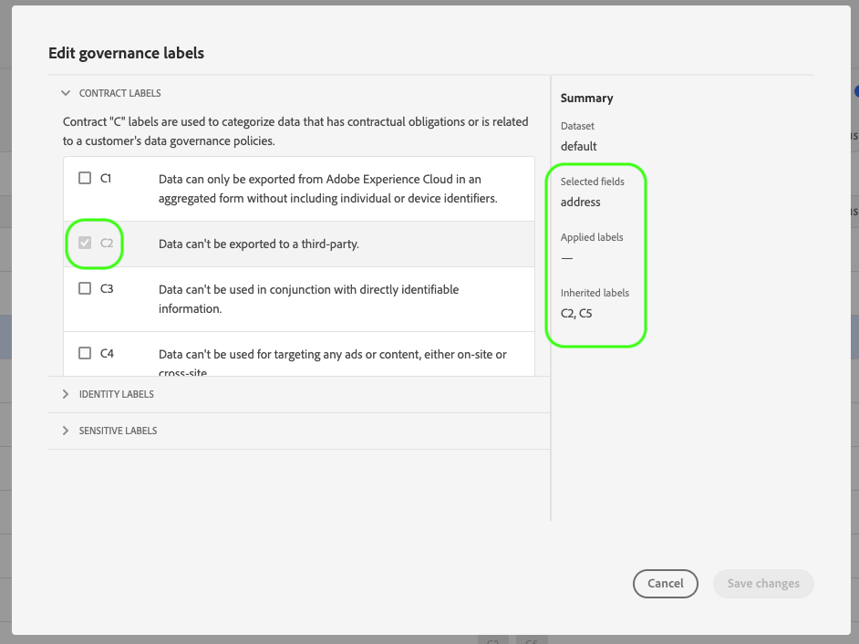

# 数据使用标签用户指南

本用户指南涵盖在用户界面中使用数据使用标签 [!DNL Experience Platform] 的步骤。 在使用指南之前，请参 [[!DNL Data Governance] 阅概述](../home.md) ，以获得框架的更强健的 [!DNL Data Governance] 介绍。

## 在数据集级别管理数据使用标签

要在数据集级别管理数据使用标签，必须选择现有数据集或创建新数据集。 登录Adobe Experience Platform后，在左 **[!UICONTROL 侧导航]** 上选择数据集以打 _开Datasets_ 工作区。 此页列表属于您组织的所有已创建数据集以及与每个数据集相关的有用详细信息。

下一节提供创建新数据集以将标签应用到的步骤。 如果要编辑现有数据集的标签，请从列表中选择数据集，然后跳到向 [数据集添加数据使用标签](#add-labels)。

### 创建新数据集

>[!NOTE]
>
>在此示例中，使用预配置(XDM)模式 [!DNL Experience Data Model] 创建数据集。 有关XDM模式的详细信息，请参 [阅XDM系统概述](../../xdm/home.md)[和模式合成基础知识](../../xdm/schema/composition.md)。

要创建新数据集，请单 **[!UICONTROL 击Datasets]** 工作区右上角的“创建 **[!UICONTROL 数据集]** ”。

将显 **[!UICONTROL 示“创建数据集]** ”屏幕。 在此处，单击 **[!UICONTROL 从模式创建数据集]**。

出现 **[!UICONTROL “选择模式]** ”屏幕，该屏幕会列表您可用于创建数据集的所有可用模式。 单击模式旁的单选按钮以选择它。 右 **[!UICONTROL 侧的模式]** 部分显示有关选定模式的其他详细信息。 选择模式后，单击“下 **[!UICONTROL 一步]**”。

将出 **[!UICONTROL 现“Configure Dataset]** （配置数据集）”屏幕。 为新数 **据集** （必需） **提供名称** (可选 **[!UICONTROL ，但建议)，然后单击“完]**&#x200B;成”。

出现 **[!UICONTROL “数据集活动]** ”页，其中显示有关新创建数据集的信息。 在此示例中，数据集命名为“Loyalty Members”，因此顶部导航显示“数据集> **Loyalty Members**”。

### 向数据集添加数据使用标签 {#add-labels}

在创建新数据集或从“数据集”工作区的列表中选 **[!UICONTROL 择现有数]** 据集后，单 **[!UICONTROL 击“数据管理]** ”以打开“ **[!UICONTROL 数据管理]** ”工作区。 工作区允许您管理数据集级别和字段级别的数据使用标签。

要在数据集级别编辑开始使用标签，请单击数据集名称旁边的铅笔图标。

此时将 **[!UICONTROL 打开编辑管理标签]** 对话框。 在对话框中，选中要应用于数据集的标签旁边的复选框。 请记住，这些标签将由数据集中的所有字段继承。 Applied **[!UICONTROL Labels]** 头会在您选中每个框时更新，显示您选择的标签。 选择所需的标签后，单击“保 **[!UICONTROL 存更改”]**。

 

“数 **[!UICONTROL 据管理]** ”工作区将重新显示，显示您在数据集级别应用的标签。 您还可以看到标签会继承到数据集中的每个字段。

请注意，在数据集级别的标签旁边会显示“x”，允许您删除标签。 每个字段旁边继承的标签旁边没有“x”，并且显示为“灰显”，无法删除或编辑。 这是因为 **继承的字段是只读的**，这意味着不能在字段级别删除它们。

默 **[!UICONTROL 认情况下，“显示继承的标签]** ”切换为打开状态，这样您就可以查看从数据集继承到其字段的任何标签。 切换关闭会隐藏数据集中所有继承的标签。

## 在数据集字段级别管理数据使用标签

继续在数据集 [级别添加和编辑数据使用标签的工作流程](#add-labels)，您还可以管理该数据集的“数据管理”工作 **[!UICONTROL 区中的字段级]** 标签。

要将数据使用标签应用于单个字段，请选中字段名称旁的复选框，然后单击“编 **[!UICONTROL 辑管理标签”]**。

将出 **[!UICONTROL 现“编辑管理标签]** ”对话框。 该对话框显示显示所选字段、已应用标签和继承标签的标题。 请注意，继承的标签（C2和C5）在对话框中灰显。 它们是从数据集级别继承的只读标签，因此只能在数据集级别编辑。

 

通过单击要使用的每个标签旁边的复选框，选择字段级标签。 选择标签时，“已应 **[!UICONTROL 用的标签]** ”标题会更新，以显示应用于“选定字段”标题中 **[!UICONTROL 显示的字段的]** 标签。 选择完字段级标签后，单击“保 **[!UICONTROL 存更改”]**。

 

“ **[!UICONTROL 数据管理]** ”工作区将重新显示，该工作区现在在字段名称旁边的行中显示选定的字段级别标签。 请注意，字段级标签旁有“x”，允许您删除该标签。

您可以重复这些步骤以继续添加和编辑其他字段的字段级标签，包括选择多个字段以同时应用字段级标签。

请务必记住，继承仅从顶级向下（数据集→字段）移动，这意味着在字段级别应用的标签不会传播到其他字段或数据集。

## 管理自定义标签

您可以在UI的“策略”工作区中创 **[!UICONTROL 建您自己]** 的自定义使 [!DNL Experience Platform] 用标签。 单击 **[!UICONTROL 左侧导]** 航中的“策略”，然后单击“ **[!UICONTROL 标签]** ”以视图现有标签的列表。 在此处，单击“ **[!UICONTROL 创建标签]**”。

将出 **[!UICONTROL 现“创建]** 标签”对话框。 从此处，为新标签提供以下信息：

* **[!UICONTROL 标识符]**:标签的唯一标识符。 此值用于查找目的，因此应简短而简明。
* **[!UICONTROL 名称]**:标签的友好显示名称。
* **[!UICONTROL 描述]**:（可选）用于提供更多上下文的标签的说明。

When finished, click **[!UICONTROL Create]**.

对话框关闭，新创建的自定义标签显示在列表的“标签” **[!UICONTROL 选项卡]** 下。

现在，在编辑数据集和字段的使 **[!UICONTROL 用标签时]** ，或在创建数据使用策略时，可以在“自定义标签”下选择该标签。

 

## 后续步骤

现在，您已在数据集和字段级别添加了数据使用标签，可以开始将数据引入 [!DNL Experience Platform]。 要了解更多信息，请阅读开始 [获取文档](../../ingestion/home.md)。

您现在还可以根据已应用的标签定义数据使用策略。 有关详细信息，请参阅 [数据使用策略概述](../policies/overview.md)。

## Journey Orchestration

以下视频旨在支持您对标签的理 [!DNL Data Governance]解，并概述如何将标签应用到数据集和单个字段。

>[!VIDEO](https://video.tv.adobe.com/v/29709?quality=12&enable10seconds=on&speedcontrol=on)
