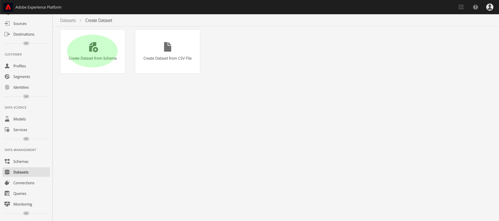
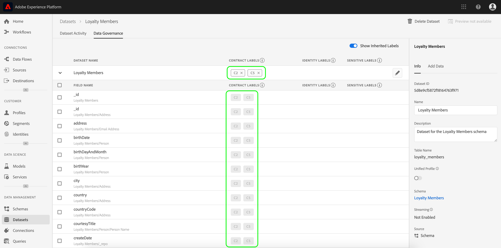

# 数据使用标签用户指南

本用户指南涵盖在Experience Platform用户界面中使用数据使用标签（也称为DULE标签）的步骤。 在使用指南之前，请参阅 [数据管理概述](../home.md) ，了解DULE框架的更强大的介绍。

## 在数据集级别管理数据使用标签

要在数据集级别管理数据使用标签，必须选择现有数据集或创建新数据集。 登录Adobe Experience Platform后，在左侧导航 **上选择Datasets** ，以打开Datasets工 _作区_ 。 此页列表了属于您组织的所有已创建数据集以及与每个数据集相关的有用详细信息。

下一节提供了创建新数据集以将标签应用到的步骤。 如果要编辑现有数据集的标签，请从列表中选择数据集，然后跳到向数 [据集添加数据使用标签](#add-labels)。

### 创建新数据集

>[!NOTE] 在此示例中，使用预配置的体验数据模型(XDM)模式创建数据集。 有关XDM模式的详细信息，请参阅 [XDM系统概述](../../xdm/home.md)[和模式合成基础知识](../../xdm/schema/composition.md)。

要创建新数据集，请单 **击“数据集** ”工作区右上角的“创建数 _据集_ ”。

将显 _示“创建数据集_ ”屏幕。 在此处，单击 **从模式创建数据集**。

将显 _示“选择模式_ ”屏幕，该屏幕列表可用于创建数据集的所有可用模式。 单击模式旁边的单选按钮以选择它。 右 _侧的模式_ 部分显示有关所选模式的其他详细信息。 选择模式后，单击“下 **一步”**。

将显 _示配置数据集_ 。 为新数 **据集提供名称** （必需）和 **描述** （可选，但建议），然后单击 **完成**。

将显 _示“数据集活动_ ”页，其中显示有关新创建的数据集的信息。 在此示例中，数据集命名为“Loyalty Members”，因此顶部导航显示的是“数据集”>“ _Loyalty Members”_。

### 向数据集添加数据使用标签 {#add-labels}

在创建新数据集或从“数据集”工作区的列表中选择现有数据集后 _，单击“数据管理_ ”以打开“数据 ****__ 管理”工作区。 工作区允许您管理数据集级别和字段级别的数据使用标签。

要编辑数据集级别的数据使用标签，请通过单击数据集名称旁边的铅笔图标进行开始。

此时将 _打开编辑管理标签_ 对话框。 在对话框中，选中要应用到数据集的标签旁边的复选框。 请记住，这些标签将由数据集中的所有字段继承。 当您 _选中每个框时_ ,“已应用的标签”标题会随之更新，其中显示您选择的标签。 选择所需的标签后，单击“保 **存更改”**。

 

重新 _显示“数据管理_ ”工作区，显示您在数据集级别应用的标签。 您还可以看到标签将继承到数据集中的每个字段。

请注意，数据集级别的标签旁边会显示“x”，允许您删除标签。 每个字段旁边的继承标签旁边没有“x”，并且显示为“灰显”，无法删除或编辑。 这是因为继 **承的字段是只读的**，这意味着它们无法在字段级别删除。

默认 **情况下，“显示继承的标签** ”切换为打开状态，这样您就可以看到从数据集继承到其字段的任何标签。 关闭切换将隐藏数据集中所有继承的标签。

## 在数据集字段级别管理数据使用标签

继续在数据集 [级别添加和编辑数据使用标签的工作流](#add-labels)__ ，您还可以管理该数据集的“数据管理”工作区中的字段级标签。

要将数据使用标签应用到单个字段，请选中字段名称旁边的复选框，然后单击编辑管 **理标签**。

此时将 _显示编辑管理标签_ 对话框。 该对话框显示显示选定字段、应用的标签和继承的标签的标题。 请注意，继承的标签（C2和C5）在对话框中灰显。 它们是从数据集级别继承的只读标签，因此只能在数据集级别编辑。

 

单击要使用的每个标签旁边的复选框，以选择字段级标签。 在选择标签时，“已应 _用的标签_ ”标题将更新为显示应用于“选定字段”标题中显示的字 _段的标签_ 。 选择字段级标签后，单击“保存 **更改”**。

 

“数 _据管理_ ”工作区将重新显示，该工作区现在在字段名称旁边的行中显示选定的字段级别标签。 请注意，字段级标签旁边有一个“x”，允许您删除该标签。

您可以重复这些步骤以继续为其他字段添加和编辑字段级标签，包括选择多个字段以同时应用字段级标签。

务必记住，继承仅从顶级向下移动（数据集→字段），这意味着在字段级别应用的标签不会传播到其他字段或数据集。

## 后续步骤

现在，您已在数据集和字段级别添加了数据使用标签，可以开始将数据引入Experience Platform。 要了解更多信息，请阅读数据获取文 [档进行开始](../../ingestion/home.md)。

## Journey Orchestration

以下视频旨在支持您对“数据管理”的理解，并概述如何将标签应用到数据集和单个字段。

>[!VIDEO](https://video.tv.adobe.com/v/29709?quality=12&enable10seconds=on&speedcontrol=on)
