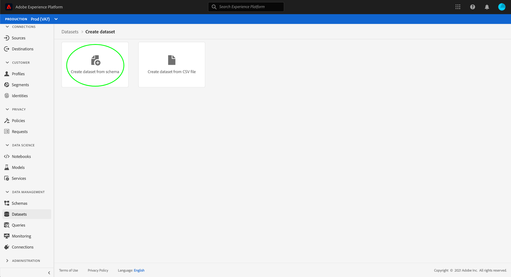
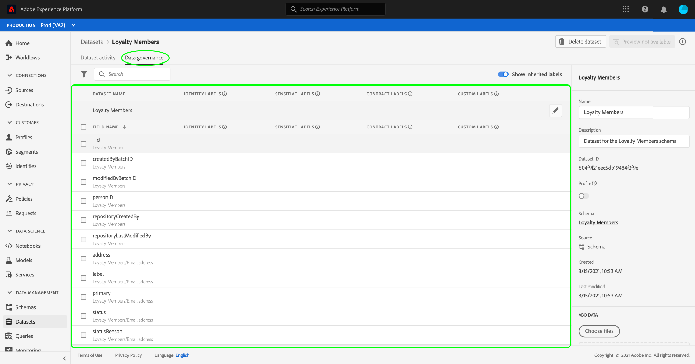
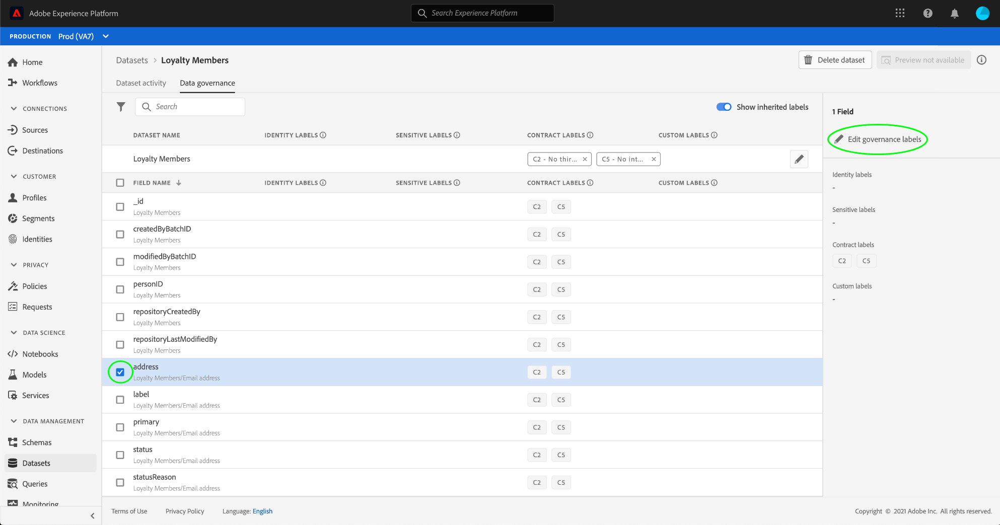

# 在UI中管理数据使用标签 {#user-guide}

>[!CONTEXTUALHELP]
>id="platform_privacyConsole_dataGovernance_description"
>title="描述"
>abstract=""

本用户指南介绍了在中使用数据使用标签的步骤。 [!DNL Experience Platform] 用户界面。

## 在数据集级别管理标签

>[!IMPORTANT]
>
>仅数据管理用例支持在数据集级别应用标签。 如果您尝试为数据创建访问策略，则必须 [将标签应用于架构](../../xdm/tutorials/labels.md) 数据集所基于的内容。 请参阅概述，位于 [基于属性的访问控制](../../access-control/abac/overview.md) 了解更多信息。

要在数据集级别管理数据使用标签，您必须选择现有数据集或创建新数据集。 登录Adobe Experience Platform后，选择 **[!UICONTROL 数据集]** 在左侧导航中打开 **[!UICONTROL 数据集]** 工作区。 此页面列出了所有属于您组织且已创建的数据集，以及与每个数据集相关的有用详细信息。

下一部分提供了创建新数据集以将标签应用于其中的步骤。 如果要编辑现有数据集的标签，请从列表中选择该数据集并跳转到 [将数据使用标签添加到数据集](#add-labels).

### 创建新数据集

>[!NOTE]
>
>在此示例中，使用预配置的数据集创建 [!DNL Experience Data Model] (XDM)架构。 有关XDM架构的更多信息，请参阅 [XDM系统概述](../../xdm/home.md) 和 [模式组合基础](../../xdm/schema/composition.md).

要创建新数据集，请选择 **[!UICONTROL 创建数据集]** 右上角的 **[!UICONTROL 数据集]** 工作区。

此 **[!UICONTROL 创建数据集]** 屏幕。 从此处选择 **[!UICONTROL 从架构创建数据集]**.

此 **[!UICONTROL 选择架构]** 屏幕，其中列出了可用于创建数据集的所有可用架构。 选择方案旁边的单选按钮以将其选中。 此 **[!UICONTROL 架构]** 右侧的部分显示有关所选架构的其他详细信息。 选择架构后，选择 **[!UICONTROL 下一个]**.

此 **[!UICONTROL 配置数据集]** 屏幕。 为新数据集提供名称（必需）和描述（可选，但推荐），然后选择 **[!UICONTROL 完成]**.

此 **[!UICONTROL 数据集活动]** 页面，显示有关新创建的数据集的信息。 在此示例中，数据集被命名为“忠诚会员”，因此顶部导航显示 **数据集>忠诚度会员**.

### 将数据使用标签添加到数据集 {#add-labels}

创建新数据集或从的列表中选择现有数据集后 **[!UICONTROL 数据集]** 工作区，选择 **[!UICONTROL 数据管理]** 以打开 **[!UICONTROL 数据管理]** 工作区。 工作区允许您在数据集级别和字段级别管理数据使用标签。

要在数据集级别编辑数据使用标签，请从选择数据集名称旁边的铅笔图标开始。

此 **[!UICONTROL 编辑治理标签]** 对话框打开。 在该对话框中，选中要应用于数据集的标签旁边的复选框。 请记住，这些标签将由数据集中的所有字段继承。 此 **[!UICONTROL 应用的标签]** 选中每个框时，标题都会更新，并显示您选择的标签。 选择所需的标签后，选择 **[!UICONTROL 保存更改]**.

此 **[!UICONTROL 数据管理]** 工作区会重新显示，其中显示已在数据集级别应用的标签。 您还可以看到标签被继承到数据集中的每个字段。

请注意，数据集级别的标签旁边将显示“x”，允许您删除标签。 每个字段旁边的继承标签旁边没有“x”，并且显示“灰显”，无法移除或编辑标签。 这是因为 **继承的字段为只读**，这意味着无法在字段级别删除它们。

此 **[!UICONTROL 显示继承的标签]** 切换默认处于打开状态，允许您查看从数据集向下继承到其字段的任何标签。 关闭切换会隐藏数据集中的任何继承标签。

## 在数据集字段级别管理标签 {#manage-labels-at-dataset-field-level}

>[!CONTEXTUALHELP]
>id="platform_privacyConsole_dataGovernance_instructions"
>title="说明"
>abstract=""

>[!IMPORTANT]
>
>仅数据管理用例支持在数据集字段级别应用标签。 如果您尝试为数据创建访问策略，则必须 [将标签应用于架构](../../xdm/tutorials/labels.md) 数据集所基于的内容。 请参阅概述，位于 [基于属性的访问控制](../../access-control/abac/overview.md) 了解更多信息。

继续的工作流 [在数据集级别添加和编辑数据使用标签](#add-labels)，您还可以管理 **[!UICONTROL 数据管理]** 该数据集的工作区。

要将数据使用标签应用于单个字段，请选中字段名称旁边的复选框，然后选择 **[!UICONTROL 编辑治理标签]**.

此 **[!UICONTROL 编辑治理标签]** 对话框。 该对话框显示标头，其中显示选定的字段、应用的标签和继承的标签。 请注意，继承的标签（C2和C5）在对话框中显示为灰色。 它们是从数据集级别继承的只读标签，因此只能在数据集级别编辑。

通过选中要使用的每个标签旁边的复选框，选择字段级标签。 当您选择标签时， **[!UICONTROL 应用的标签]** 标题更新以显示应用于字段中显示的标签 **[!UICONTROL 选定的字段]** 标头。 选择完字段级标签后，选择 **[!UICONTROL 保存更改]**.

此 **[!UICONTROL 数据管理]** 工作区会重新显示，此时会在字段名称旁边的行中显示选定的字段级别标签。 请注意，字段级标签旁边有一个“x”，允许您移除标签。

您可以重复这些步骤以继续为其他字段添加和编辑字段级标签，包括选择多个字段以同时应用字段级标签。

请务必记住，继承仅从顶级向下移动(数据集→字段)，这意味着在字段级别应用的标签不会传播到其他字段或数据集。

## 在架构级别管理标签

您可以直接将标签添加到该架构中的一个或多个字段。 在架构级别应用的任何字段都将传播到基于该架构的所有数据集。

请参阅上的教程 [管理架构级别标签](../../xdm/tutorials/labels.md) 了解更多信息。

## 管理自定义标签 {#manage-custom-labels}

>[!CONTEXTUALHELP]
>id="platform_governance_createlabels"
>title="创建标签"
>abstract="标签允许您根据应用于该数据的使用策略对数据集和字段进行分类。 Platform提供了一组标准标签供您使用，但您也可以创建特定于贵组织的自定义标签。"

您可以在中创建自己的自定义使用标签 **[!UICONTROL 策略]** 中的工作区 [!DNL Experience Platform] UI。 选择 **[!UICONTROL 策略]** 在左侧导航中，然后选择 **[!UICONTROL 标签]** 查看现有标签的列表。 从此处选择 **[!UICONTROL 创建标签]**.

此 **[!UICONTROL 创建标签]** 对话框。 从这里，为新标签提供以下信息：

* **[!UICONTROL 标识符]**：标签的唯一标识符。 此值用于查找目的，因此应简明扼要。
* **[!UICONTROL 名称]**：标签的友好显示名称。
* **[!UICONTROL 描述]**：（可选）用于提供进一步上下文的标签描述。

完成后，选择 **[!UICONTROL 创建]**.

对话框随即关闭，新建的自定义标签将显示在 **[!UICONTROL 标签]** 选项卡。

现在可以选择以下位置的标签 **[!UICONTROL 自定义标签]** 编辑数据集和字段的使用标签，或创建数据使用策略时。

 

## 后续步骤

现在，您已在数据集和字段级别添加数据使用标签，接下来可以开始将数据摄取到 [!DNL Experience Platform]. 要了解更多信息，请从阅读 [数据摄取文档](../../ingestion/home.md).

您现在还可以根据已应用的标签定义数据使用策略。 欲了解更多信息，请参见 [数据使用策略概述](../policies/overview.md).

## 其他资源

以下视频旨在支持您了解数据管理，并概述如何将标签应用于数据集和各个字段。

>[!VIDEO](https://video.tv.adobe.com/v/29709?quality=12&enable10seconds=on&speedcontrol=on)
