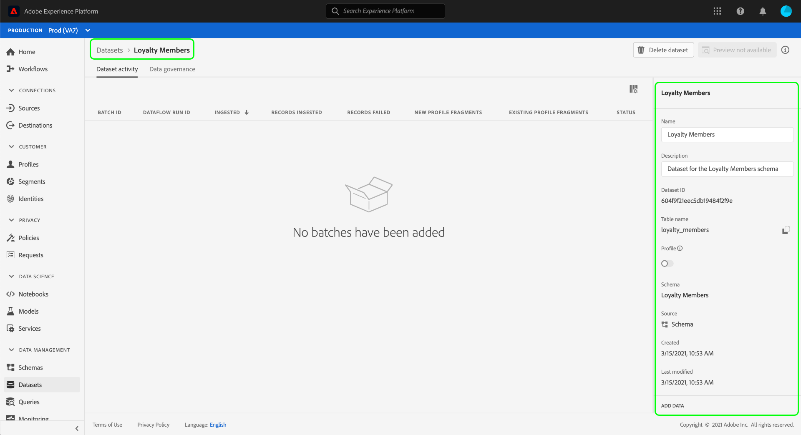

# 在UI中管理資料使用標籤 {#user-guide}

>[!CONTEXTUALHELP]
>id="platform_privacyConsole_dataGovernance_description"
>title="在 Platform 中治理数据使用"
>abstract="<h2>描述</h2>
通过 Experience Platform 中的数据治理框架，可根据数据使用限制为属性和数据集加标签，以及设置标识特定营销活动并为其遵守这些限制的策略。
"

本使用手冊說明在中使用資料使用標籤的步驟。 [!DNL Experience Platform] 使用者介面。

## 在資料集層級管理標籤

>[!IMPORTANT]
>
>僅資料控管使用案例支援在資料集層級套用標籤。 如果您嘗試建立資料的存取原則，您必須 [將標籤套用至結構描述](../../xdm/tutorials/labels.md) 資料集所根據的。 請參閱以下文章的概觀： [基於屬性的存取控制](../../access-control/abac/overview.md) 以取得詳細資訊。

若要在資料集層級管理資料使用標籤，您必須選取現有資料集或建立新資料集。 登入Adobe Experience Platform後，選取 **[!UICONTROL 資料集]** 在左側導覽以開啟 **[!UICONTROL 資料集]** 工作區。 此頁面列出屬於您組織的所有已建立資料集，以及與每個資料集相關的實用詳細資訊。

下一節提供建立新資料集以套用標籤的步驟。 如果您想要編輯現有資料集的標籤，請從清單中選取資料集，然後跳至 [將資料使用標籤新增至資料集](#add-labels).

### 建立新的資料集

>[!NOTE]
>
>在此範例中，資料集是使用預先設定的 [!DNL Experience Data Model] (XDM)結構描述。 如需XDM結構的詳細資訊，請參閱 [XDM系統總覽](../../xdm/home.md) 和 [結構描述組合基本概念](../../xdm/schema/composition.md).

若要建立新資料集，請選取 **[!UICONTROL 建立資料集]** 右上角 **[!UICONTROL 資料集]** 工作區。

此 **[!UICONTROL 建立資料集]** 畫面隨即顯示。 從此處選取 **[!UICONTROL 從結構描述建立資料集]**.

此 **[!UICONTROL 選取結構描述]** 畫面隨即顯示，其中列出可用來建立資料集的所有可用結構。 選取綱要旁的單選按鈕以選取它。 此 **[!UICONTROL 結構描述]** 右側的區段會顯示所選綱要的其他詳細資訊。 選取結構描述後，請選取 **[!UICONTROL 下一個]**.

此 **[!UICONTROL 設定資料集]** 畫面隨即顯示。 為您的新資料集提供名稱（必要）和說明（選用，但建議使用），然後選取「 」 **[!UICONTROL 完成]**.

此 **[!UICONTROL 資料集活動]** 頁面隨即顯示，顯示有關新建立資料集的資訊。 在此範例中，資料集名為「忠誠會員」，因此頂端導覽列會顯示 **資料集>忠誠度會員**.

### 將資料使用標籤新增至資料集 {#add-labels}

建立新資料集或從的清單中選取現有資料集後 **[!UICONTROL 資料集]** 工作區，選取 **[!UICONTROL 資料控管]** 以開啟 **[!UICONTROL 資料控管]** 工作區。 工作區可讓您在資料集層級和欄位層級管理資料使用標籤。

若要編輯資料集層級的資料使用標籤，請從選取資料集名稱旁的鉛筆圖示開始。

此 **[!UICONTROL 編輯治理標籤]** 對話方塊開啟。 在對話方塊中，勾選您要套用至資料集的標籤旁的方塊。 請記住，這些標籤將由資料集中的所有欄位繼承。 此 **[!UICONTROL 套用的標籤]** 勾選每個方塊時，標題都會更新，並顯示您選擇的標籤。 選取所需標籤後，請選取 **[!UICONTROL 儲存變更]**.

此 **[!UICONTROL 資料控管]** 工作區會重新出現，顯示您已在資料集層級套用的標籤。 您也可以看到標籤會繼承至資料集中的每個欄位。

請注意，資料集層級的標籤旁會出現「x」，可讓您移除標籤。 每個欄位旁邊的繼承標籤旁邊沒有「x」，並且顯示「灰色」，無法移除或編輯標籤。 這是因為 **繼承的欄位為唯讀**，這表示它們無法在欄位層級移除。

此 **[!UICONTROL 顯示繼承的標籤]** 切換預設為開啟，可讓您檢視從資料集繼承至其欄位的任何標籤。 關閉切換會隱藏資料集內任何繼承的標籤。

## 在資料集欄位層級管理標籤 {#manage-labels-at-dataset-field-level}

>[!CONTEXTUALHELP]
>id="platform_privacyConsole_dataGovernance_instructions"
>title="说明"
>abstract="<ol><li>在左侧导航中选择<a href="https://experienceleague.adobe.com/docs/experience-platform/data-governance/labels/user-guide.html?lang=zh-Hant">数据集</a>，然后选择要限制其数据的数据集。</li><li>从数据集详细信息视图中，选择<b>数据治理</b>选项卡。</li><li>选择要限制的数据集字段，然后选择<b>编辑治理标签</b>以根据使用限制为数据加标签。</li><li>为数据加标签后，在左侧导航中选择<a href="https://experienceleague.adobe.com/docs/experience-platform/data-governance/policies/overview.html?lang=zh-Hans">策略</a>，然后选择<b>创建策略</b>。</li><li>选择创建一个<a href="https://experienceleague.adobe.com/docs/experience-platform/data-governance/policies/user-guide.html#create-governance-policy">数据治理策略</a>，然后选择将应用于该策略的数据使用标签。</li><li>选择该策略将拒绝对任何包含这些标签的数据执行的营销操作。创建该策略后，从列表中选择它，然后使用右边栏中的切换开关启用它。</li><li>对于每个启用的策略，Platform 阻止将任何包含指定标签的数据用于所定义的营销操作。当您尝试对于具有关联的营销操作（用例）的目标激活加了标签的数据时，将自动施加此强制。</li></ol>"

>[!IMPORTANT]
>
>僅資料控管使用案例支援在資料集欄位層級套用標籤。 如果您嘗試建立資料的存取原則，您必須 [將標籤套用至結構描述](../../xdm/tutorials/labels.md) 資料集所根據的。 請參閱以下文章的概觀： [基於屬性的存取控制](../../access-control/abac/overview.md) 以取得詳細資訊。

繼續工作流程 [在資料集層級新增和編輯資料使用標籤](#add-labels)，您也可以管理「 」中的欄位層級標籤 **[!UICONTROL 資料控管]** 該資料集的工作區。

若要將資料使用標籤套用至個別欄位，請選取欄位名稱旁的核取方塊，然後選取 **[!UICONTROL 編輯治理標籤]**.

此 **[!UICONTROL 編輯治理標籤]** 對話方塊隨即顯示。 此對話方塊顯示標頭，其中顯示選取的欄位、套用的標籤和繼承的標籤。 請注意，繼承的標籤（C2和C5）在對話方塊中會呈現灰色。 這些標籤是繼承自資料集層級的唯讀標籤，因此只能在資料集層級編輯。

選取您要使用的每個標籤旁的核取方塊，以選取欄位層級標籤。 當您選取標籤時， **[!UICONTROL 套用的標籤]** 標題更新以顯示套用至「 」中顯示欄位的標籤 **[!UICONTROL 選取的欄位]** 標頭。 完成選取欄位層級標籤後，選取 **[!UICONTROL 儲存變更]**.

此 **[!UICONTROL 資料控管]** 工作區會重新出現，現在會在欄位名稱旁邊的列中顯示所選欄位層級標籤。 請注意，欄位層級標籤旁邊有&quot;x&quot;，可讓您移除標籤。

您可以重複這些步驟，繼續為其他欄位新增和編輯欄位層級標籤，包括選取多個欄位以同時套用欄位層級標籤。

請務必記住，繼承只會從頂層向下移動(資料集→欄位)，這表示在欄位層級套用的標籤不會傳播到其他欄位或資料集。

## 管理結構層級的標籤

您可以直接將標籤新增到該結構描述中的一個或多個欄位。 套用至結構描述層級的任何欄位都會傳播至以該結構描述為基礎的所有資料集。

請參閱教學課程，位置如下： [管理結構描述層級標籤](../../xdm/tutorials/labels.md) 以取得詳細資訊。

## 管理自定义标签 {#manage-custom-labels}

>[!CONTEXTUALHELP]
>id="platform_governance_createlabels"
>title="创建标签"
>abstract="通过标签，可根据适用于数据的使用策略将数据集和字段分类。Platform 提供了一组标准标签供您使用，但您也可以创建特定于您的组织的自定义标签。"

您可以在「 」中建立自己的自訂使用標籤 **[!UICONTROL 原則]** 工作區在 [!DNL Experience Platform] UI。 選取 **[!UICONTROL 原則]** 在左側導覽列中，然後選取 **[!UICONTROL 標籤]** 以檢視現有標籤的清單。 從此處選取 **[!UICONTROL 建立標籤]**.

此 **[!UICONTROL 建立標籤]** 對話方塊隨即顯示。 從這裡，為新標籤提供下列資訊：

* **[!UICONTROL 識別碼]**：標籤的唯一識別碼。 此值用於查閱目的，因此應簡短明瞭。
* **[!UICONTROL 名稱]**：好記的標籤顯示名稱。
* **[!UICONTROL 說明]**：（選用）標籤的描述，以提供進一步的上下文。

完成後，選取 **[!UICONTROL 建立]**.

對話方塊隨即關閉，新建立的自訂標籤會顯示在 **[!UICONTROL 標籤]** 標籤。

現在可以在下方選取標籤 **[!UICONTROL 自訂標籤]** 編輯資料集和欄位的使用標籤時，或建立資料使用原則時。

 

## 后续步骤

現在您已在資料集和欄位層級新增資料使用標籤，您可以開始將資料擷取到 [!DNL Experience Platform]. 若要深入瞭解，請先閱讀 [資料擷取檔案](../../ingestion/home.md).

您現在也可以根據已套用的標籤來定義資料使用原則。 如需詳細資訊，請參閱 [資料使用原則概觀](../policies/overview.md).

## 其他资源

以下影片旨在協助您瞭解資料控管，並概述如何將標籤套用至資料集和個別欄位。

>[!VIDEO](https://video.tv.adobe.com/v/29709?quality=12&enable10seconds=on&speedcontrol=on)
