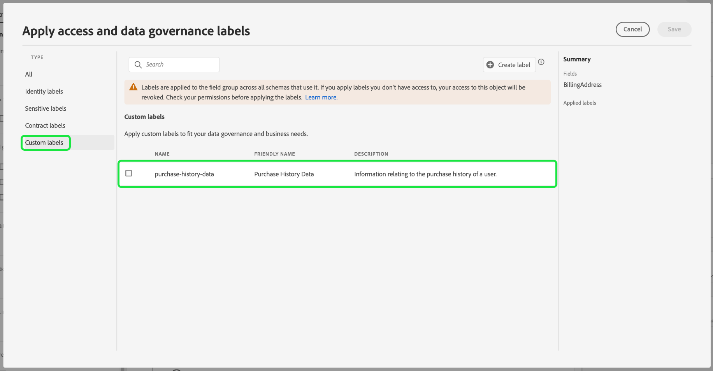

# 在 UI 中管理数据使用标签 {#user-guide}

>[!CONTEXTUALHELP]
>id="platform_privacyConsole_dataGovernance_description"
>title="管理Experience Platform中的数据使用"
>abstract="<h2>描述</h2>
通过 Experience Platform 中的数据治理框架，可根据数据使用限制为属性和架构加标签，以及设置标识特定营销活动并为其遵守这些限制的策略。
"

本用户指南介绍在[!DNL Experience Platform]用户界面中使用数据使用标签的步骤。

## 管理标签 {#manage-labels}

要将标签应用于数据，您需要&#x200B;**[!UICONTROL 管理使用标签]**&#x200B;权限才能在名为“prod”的默认生产沙盒上使用。 要创建自定义标签，您还必须对产品配置文件具有管理权限。 每个组织只有一个适用的标签列表。 您&#x200B;**无法**&#x200B;删除标签。 相反，您可以从应用了这些指标的数据集或字段中将其删除。

有关如何分配权限的更多信息，请参阅如何[配置权限](https://experienceleague.adobe.com/docs/platform-learn/getting-started-for-data-architects-and-data-engineers/configure-permissions.html)的指南或[访问控制概述](../../access-control/home.md)。 如果您无权访问组织的Admin Console，请联系您的组织管理员。

## 在架构级别管理标签

您可以直接将标签添加到架构或该架构中的字段。 在架构级别应用的任何字段都将传播到基于该架构的所有数据集。

>[!NOTE]
>
>如果数据使用策略是在标记字段之前创建的，则在将标签应用于新架构时，可能会遇到治理策略违规对话框。 此对话框指示应用此标签将违反现有使用策略。 使用数据族图了解在将标签添加到架构字段之前需要执行哪些其他配置更改。
>
>
>
>有关策略违规的详细信息，请参阅[数据使用策略违规文档](../enforcement/auto-enforcement.md#data-usage-violation)。

要在架构级别管理数据使用标签，您必须选择现有架构或创建新架构。 登录Adobe Experience Platform后，在左侧导航中选择&#x200B;**[!UICONTROL 架构]**&#x200B;以打开&#x200B;**[!UICONTROL 架构]**&#x200B;工作区。 此页面列出了属于您组织的所有已创建的方案，以及与每个方案相关的有用详细信息。

下一部分提供了创建新架构以将标签应用于的步骤。 如果要编辑现有架构的标签，请从列表中选择架构，然后跳到[将数据使用标签添加到架构](#add-labels)。

### 创建新架构

要创建新架构，请选择&#x200B;**[!UICONTROL 架构]**&#x200B;工作区的右上角的&#x200B;**[!UICONTROL 创建架构]**。 有关如何使用架构编辑器](../../xdm/tutorials/create-schema-ui.md#create)创建架构的信息，请参阅[指南。 或者，如果需要，您可以[使用架构注册表API](../../xdm/tutorials/create-schema-api.md)创建架构。

### 将数据使用标签添加到架构 {#add-labels-to-schema}

创建新架构，或从[!UICONTROL 架构]工作区的[!UICONTROL 浏览]选项卡的列表中选择现有架构后，在架构编辑器中从架构中选择一个字段。 在[!UICONTROL 字段属性]侧边栏中，选择&#x200B;**[!UICONTROL 应用访问和数据治理标签]**。

此时将显示一个对话框，允许您在架构级别和字段级别应用和管理数据使用标签。 有关[如何添加或编辑XDM架构](../../xdm/tutorials/labels.md#select-schema-field)的数据使用标签的完整说明，请参阅XDM教程。

### 向特定数据集添加数据使用标签 {#add-labels-to-dataset}

>[!CONTEXTUALHELP]
>id="platform_privacyConsole_dataGovernance_instructions"
>title="说明"
>abstract="<ol><li>在左侧导航中选择<a href="https://experienceleague.adobe.com/docs/experience-platform/data-governance/labels/user-guide.html?lang=zh-Hans">数据集</a>，然后选择要限制其数据的数据集。</li><li>从数据集详细信息视图中，选择<b>数据治理</b>选项卡。</li><li>选择要限制的数据集字段，然后选择<b>编辑治理标签</b>以根据使用限制为数据加标签。</li><li>为数据加标签后，在左侧导航中选择<a href="https://experienceleague.adobe.com/docs/experience-platform/data-governance/policies/overview.html?lang=zh-Hans">策略</a>，然后选择<b>创建策略</b>。</li><li>选择创建一个<a href="https://experienceleague.adobe.com/docs/experience-platform/data-governance/policies/user-guide.html#create-governance-policy">数据治理策略</a>，然后选择将应用于该策略的数据使用标签。</li><li>选择该策略将拒绝对任何包含这些标签的数据执行的营销操作。创建该策略后，从列表中选择它，然后使用右边栏中的切换开关启用它。</li><li>对于每个启用的策略，Experience Platform阻止将包含指定标签的任何数据用于定义的营销操作。 当您尝试对于具有关联的营销操作（用例）的目标激活加了标签的数据时，将自动施加此强制。</li></ol>"

>[!IMPORTANT]
>
>标签无法再应用于数据集级别的字段。 此工作流已弃用，支持在架构级别应用标签。 在2024年5月31日之前，之前在数据集对象级别应用的任何标签仍将通过Experience Platform UI受到支持。 要确保您的标签在所有架构中保持一致，在未来一年中，必须将之前附加到数据集级别字段的任何标签迁移到架构级别。 有关[如何将以前应用的标签从数据集迁移到架构级别](../e2e.md#migrate-labels)的说明，请参阅文档。

标签可以从&#x200B;**[!UICONTROL 数据集]**&#x200B;工作区的&#x200B;**[!UICONTROL 数据管理]**&#x200B;选项卡应用于整个数据集。 工作区允许您在数据集级别管理数据使用标签。

![突出显示了[!UICONTROL 数据集]工作区的[!UICONTROL 数据管理]选项卡。](../images/labels/dataset-governance.png)

若要在数据集级别编辑数据使用标签，请先选择铅笔图标（)。

![带有突出显示的编辑铅笔图标的[!UICONTROL 数据集]工作区的[!UICONTROL 数据管理]选项卡。](../images/labels/dataset-level-edit.png)

将打开&#x200B;**[!UICONTROL 编辑治理标签]**&#x200B;对话框。 在该对话框中，选中要应用于数据集的标签旁边的复选框。 请记住，这些标签将由数据集中的所有字段继承。 **[!UICONTROL 应用标签]**&#x200B;标题会随着您选中每个框而更新，显示您选择的标签。 选择所需的标签后，选择&#x200B;**[!UICONTROL 保存更改]**。

**[!UICONTROL 数据管理]**&#x200B;工作区将重新显示，其中显示在表的初始行中已应用于数据集级别的标签。 您还可以看到由各个信息卡指示的标签，这些标签会继承到数据集中的每个字段。

![应用了数据集级别标签并继承了数据集字段标签的[!UICONTROL 数据集]工作区的[!UICONTROL 数据管理]选项卡突出显示。](../images/labels/applied-dataset-labels.png)

### 从数据集中删除标签 {#remove-labels-from-a-dataset}

在数据集级别添加的标签卡旁边有一个“x”。 这允许您从整个数据集中删除标签。 每个字段旁边的继承标签旁边不带“x”，并且显示“灰显”。 这些&#x200B;**继承的标签是只读的**，这意味着无法在字段级别删除或编辑它们。

<!-- ## View labels at the dataset field level {#view-labels-at-dataset-field-level} -->

<!-- To view labels inherited by the dataset from the schema level, select **[!UICONTROL Datasets]** to navigate to the datasets workspace and select the relevant dataset from the list. 

Next, select the **[!UICONTROL Data Governance]** tab to show the labels that have been applied to the dataset. You can also see that the labels are inherited down to each of the fields within the dataset.

The inherited labels beside each field do not have an "x" next to them and appear "greyed out" with no ability to remove or edit. This is because **inherited fields are read-only**, meaning they cannot be removed at the field level. -->

<!--Beleive can cut above here  -->

默认情况下，**[!UICONTROL 显示继承的标签]**&#x200B;切换处于打开状态，允许您查看从架构继承到其字段的任何标签。 关闭切换将隐藏数据集中的任何继承标签。

<!-- Labels applied to the dataset appear in read-only form within the **[!UICONTROL Data Governance]** view for that dataset. 

 -->

>[!NOTE]
>
>可以在数据集标签功能被弃用之前应用的标签，通过查找相关数据集并选择标签上的取消图标从数据集中删除。
>
>有关[如何将以前应用的标签从数据集迁移到架构级别](../e2e.md#migrate-labels)的说明，请参阅文档。

## 管理自定义标签 {#manage-custom-labels}

>[!CONTEXTUALHELP]
>id="platform_governance_createlabels"
>title="创建标签"
>abstract="通过标签，可根据适用于数据的使用策略将数据集和字段分类。Experience Platform提供了一组标准标签供您使用，但您也可以创建特定于贵组织的自定义标签。"

您可以在[!DNL Experience Platform] UI的&#x200B;**[!UICONTROL 策略]**&#x200B;工作区中创建自己的自定义使用标签。 在左侧导航中选择&#x200B;**[!UICONTROL 策略]**，然后选择&#x200B;**[!UICONTROL 标签]**&#x200B;以查看现有标签列表。 从此处选择&#x200B;**[!UICONTROL 创建标签]**。

出现&#x200B;**[!UICONTROL 创建标签]**&#x200B;对话框。 从此处，为新标签提供以下信息：

* **[!UICONTROL 名称]**：标签的唯一标识符。 该值用于查找目的，因此应简明扼要。
* **[!UICONTROL 友好名称]**：标签的友好显示名称。
* **[!UICONTROL 描述]**： （可选）标签的描述以提供进一步的上下文。

完成后，选择&#x200B;**[!UICONTROL 创建]**。

对话框关闭，新建的自定义标签显示在&#x200B;**[!UICONTROL 标签]**&#x200B;选项卡下的列表中。

现在，在编辑数据集和字段的使用标签或创建数据使用策略时，可以在&#x200B;**[!UICONTROL 自定义标签]**&#x200B;下选择标签。

## 后续步骤

现在，您已在数据集和字段级别添加数据使用标签，您可以开始将数据摄取到[!DNL Experience Platform]。 要了解更多信息，请先阅读[数据摄取文档](../../ingestion/home.md)。

您现在还可以根据已应用的标签定义数据使用策略。 有关详细信息，请参阅[数据使用策略概述](../policies/overview.md)。

<!-- The workflow of this video is now outdated. This can be enabled once the video has been updated

## Additional resources

The following video is intended to support your understanding of Data Governance, and outlines how to apply labels to a dataset and individual fields.

>[!VIDEO](https://video.tv.adobe.com/v/29709?quality=12&enable10seconds=on&speedcontrol=on) -->
