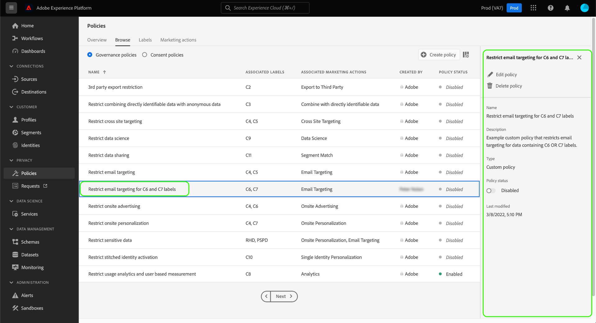

# 数据使用策略用户指南

Adobe Experience Platform Data Governance提供一个用户界面，允许您创建和管理数据使用策略。 此文档概述了您可以在Experience Platform UI的“策略 _”工作_ 区中执行的操作。

## 先决条件

本指南需要对以下Experience Platform概念有充分的了解：

- [数据管理](../home.md)
- [数据使用策略](./overview.md)

## 视图数据使用策略

在Experience Platform UI中，单击“策 **[!UICONTROL 略]** ”以打开“ *[!UICONTROL 策略]* ”工作区。 在“浏 **[!UICONTROL 览]** ”选项卡中，您可以看到可用策略的列表，包括其关联的标签、营销操作和状态。

单击列出的策略以视图其描述和类型。 如果选择了自定义策略，则会显示用于编辑、删除或启用／禁 [用该策略的其他控件](#enable)。

## 创建自定义数据使用策略

要创建新的自定义数据使用策略，请 **[!UICONTROL 单击]** “策略”工作区右上角的 *“创建策* 略”。

将显 *[!UICONTROL 示创建策略]* 工作流。 开始，为新策略提供名称和说明。

接下来，选择策略将基于的数据使用标签。 在选择多个标签时，您可以选择数据应包含所有标签还是只包含其中一个标签，以便应用策略。 完成后，单击&#x200B;**[!UICONTROL 下一步]**。

此时将 *[!UICONTROL 显示选择营销]* 操作步骤。 从提供的列表中选择适当的营销操作，然后单 **[!UICONTROL 击下]** 一步继续。

>[!NOTE] 选择多个营销活动时，策略会将其解释为“OR”规则。 换言之，如果执行了任 _何选定_ 的营销操作，则此策略适用。

此时 *[!UICONTROL 会显示]* “审阅”(Review)步骤，允许您在创建新策略之前查看其详细信息。 满意后，单击 **[!UICONTROL 完成]** 以创建策略。

“浏 *[!UICONTROL 览]* ”选项卡将重新显示，该选项卡现在将新创建的策略列表为“草稿”状态。 要启用策略，请参阅下一节。

## 启用或禁用数据使用策略 {#enable}

您可以在“策略”工作区的“浏览”选项卡上 *[!UICONTROL 启用或禁用]* “自定义数 *[!UICONTROL 据使用策]* 略”。 从列表中选择自定义策略，在右侧显示其详细信息。 在“ *[!UICONTROL 状态]*”下，选择切换按钮以启用或禁用策略。

## 后续步骤

此文档概述了如何在Experience Platform UI中管理数据使用策略。 有关如何使用DULE Policy API管理策略的步骤，请参阅开发 [人员指南](../api/getting-started.md)。 有关如何实施数据使用策略的信息，请参阅策 [略实施概述](../enforcement/overview.md)。

以下视频演示了如何在Experience Platform UI中使用使用策略：

>[!VIDEO](https://video.tv.adobe.com/v/32977?quality=12&learn=on)