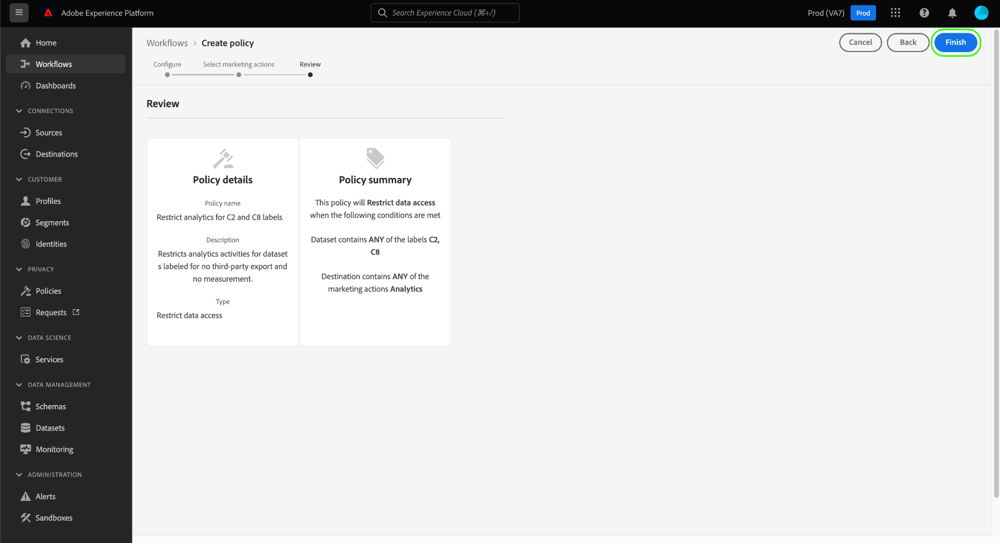

# 在UI中管理数据使用策略

Adobe Experience Platform Data Governance提供了一个用户界面，允许您创建和管理数据使用策略。 本文档概述了在 **策略** 工作区 [!DNL Experience Platform] 用户界面。

>[!IMPORTANT]
>
>默认情况下，所有数据使用策略(包括由Adobe提供的核心策略)都处于禁用状态。 要考虑实施单个策略，必须手动启用该策略。 请参阅 [启用策略](#enable) 以了解有关如何在UI中执行此操作的步骤。

## 先决条件

本指南需要对以下内容有一定的了解 [!DNL Experience Platform] 概念：

- [数据管理](../home.md)
- [数据使用策略](./overview.md)

## 查看现有策略 {#view-policies}

在 [!DNL Experience Platform] UI，选择 **[!UICONTROL 策略]** 打开 **[!UICONTROL 策略]** 工作区。 在 **[!UICONTROL 浏览]** 选项卡，您可以看到可用策略的列表，包括其关联的标签、营销操作和状态。

选择列出的策略以查看其描述和类型。 如果选择了自定义策略，则会显示其他控件以编辑、删除或 [启用/禁用策略](#enable).

## 创建自定义策略 {#create-policy}

要创建新的自定义数据使用策略，请选择 **[!UICONTROL 创建策略]** 的右上角 **[!UICONTROL 浏览]** 选项卡 **[!UICONTROL 策略]** 工作区。

的 **[!UICONTROL 创建策略]** 工作流。 首先，为新策略提供名称和描述。

接下来，选择策略所基于的数据使用标签。 选择多个标签时，您可以选择数据应包含所有标签还是仅包含其中一个标签，以便策略应用。 选择 **[!UICONTROL 下一个]** 完成。

的 **[!UICONTROL 选择营销操作]** 中。 从提供的列表中选择相应的营销操作，然后选择 **[!UICONTROL 下一个]** 继续。

>[!NOTE]
>
>选择多个营销操作时，策略会将其解释为“OR”规则。 换言之，该政策适用于 **any** 中，将执行选定的营销操作。

的 **[!UICONTROL 审阅]** 步骤，允许您在创建新策略之前查看新策略的详细信息。 满意后，选择 **[!UICONTROL 完成]** 创建策略。

的 **[!UICONTROL 浏览]** 选项卡，该选项卡现在会列出新创建的“草稿”状态策略。 要启用策略，请参阅下一节。

## 启用或禁用策略 {#enable}

默认情况下，所有数据使用策略(包括由Adobe提供的核心策略)都处于禁用状态。 要考虑实施单个策略，您必须通过API或UI手动启用该策略。

您可以在 **[!UICONTROL 浏览]** 选项卡 **[!UICONTROL 策略]** 工作区。 从列表中选择自定义策略以在右侧显示其详细信息。 在 **[!UICONTROL 状态]**，选择切换按钮以启用或禁用策略。

## 查看营销操作 {#view-marketing-actions}

在 **[!UICONTROL 策略]** 工作区中，选择 **[!UICONTROL 营销操作]** 选项卡，查看由Adobe和您自己的组织定义的可用营销操作列表。

## 创建营销操作 {#create-marketing-action}

要创建新的自定义营销操作，请选择 **[!UICONTROL 创建营销操作]** 的右上角 **[!UICONTROL 营销操作]** 选项卡 **[!UICONTROL 策略]** 工作区。

的 **[!UICONTROL 创建营销操作]** 对话框。 输入营销操作的名称和描述，然后选择 **[!UICONTROL 创建]**.

新创建的操作将显示在 **[!UICONTROL 营销操作]** 选项卡。 现在，您可以在 [创建新的数据使用策略](#create-policy).

## 编辑或删除营销操作 {#edit-delete-marketing-action}

>[!NOTE]
>
>只能编辑由您的组织定义的自定义营销操作。 无法更改或删除由Adobe定义的营销操作。

在 **[!UICONTROL 策略]** 工作区中，选择 **[!UICONTROL 营销操作]** 选项卡，查看由Adobe和您自己的组织定义的可用营销操作列表。 从列表中选择自定义营销操作，然后使用右侧部分中提供的字段来编辑营销操作的详细信息。

如果任何现有的使用策略未使用营销操作，则可以通过选择 **[!UICONTROL 删除营销操作]**.

>[!NOTE]
>
>尝试删除现有策略正在使用的营销操作将导致显示错误消息，指示删除尝试失败。

## 后续步骤

本文档概述了如何在 [!DNL Experience Platform] UI。 有关如何使用 [!DNL Policy Service API]，请参阅 [开发人员指南](../api/getting-started.md). 有关如何实施数据使用策略的信息，请参阅 [策略实施概述](../enforcement/overview.md).

以下视频演示了如何在 [!DNL Experience Platform] UI:

>[!VIDEO](https://video.tv.adobe.com/v/32977?quality=12&learn=on)
