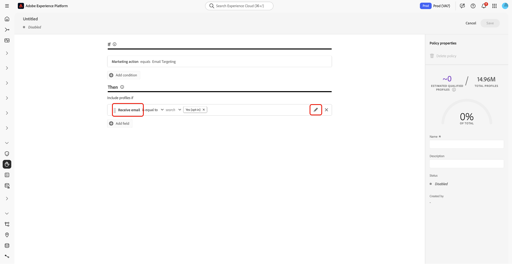

# 在 UI 中管理数据使用策略 {#user-guide}

>[!CONTEXTUALHELP]
>id="platform_privacyConsole_dataUsagePolicies_description"
>title="在您的轮廓数据中集成并强制客户同意"
>abstract="<h2>描述</h2>
通过 Experience Platform，可将从客户收集的同意数据集成到其各自的轮廓中。然后可设置同意策略以确定能否在对于特定目标激活的区段中包括这些数据。
"

本文档介绍如何在Adobe Experience Platform UI中使用&#x200B;**[!UICONTROL Policies]**&#x200B;工作区来创建和管理数据使用策略。

>[!NOTE]
>
>有关如何在UI中管理访问控制策略的信息，请参阅[基于属性的访问控制UI指南](../../access-control/abac/ui/policies.md)。

>[!IMPORTANT]
>
>默认情况下，所有数据使用策略(包括Adobe提供的核心策略)都处于禁用状态。 为了考虑实施单个策略，您必须手动启用该策略。 有关如何在UI中启用策略的步骤，请参阅[启用策略](#enable)的相关部分。

## 先决条件

本指南要求您对以下[!DNL Experience Platform]概念有一定的了解：

* [数据治理](../home.md)
* [数据使用策略](./overview.md)

## 查看现有策略 {#view-policies}

在[!DNL Experience Platform] UI中，选择&#x200B;**[!UICONTROL Policies]**&#x200B;以打开&#x200B;**[!UICONTROL Policies]**&#x200B;工作区。 在&#x200B;**[!UICONTROL Browse]**&#x200B;选项卡中，您可以看到可用策略的列表，包括其关联的标签、营销操作和状态。

如果您有权访问同意策略，请选择&#x200B;**[!UICONTROL Consent policies]**&#x200B;切换开关以在[!UICONTROL Browse]选项卡中查看它们。

选择列出的策略以查看其说明和类型。 如果选择了自定义策略，则会显示其他控件以编辑、删除或[启用/禁用策略](#enable)。

## 创建自定义策略 {#create-policy}

要创建新的自定义数据使用策略，请在&#x200B;**[!UICONTROL Create policy]**&#x200B;工作区的&#x200B;**[!UICONTROL Browse]**&#x200B;选项卡右上角选择&#x200B;**[!UICONTROL Policies]**。

出现[!UICONTROL Choose type of policy]对话框。 选择[同意策略](#consent-policy)或[数据治理策略](#create-governance-policy)。

### 同时使用数据治理和同意策略 {#combine-policies}

>[!NOTE]
>
>同意策略当前仅适用于已购买Adobe Healthcare Shield或Adobe Privacy &amp; Security Shield的组织。

治理和同意策略可结合使用，以创建强大的规则来管理映射到目标的受众。 同意策略本质上具有包容性，这意味着它们规定了每个营销体验中可以包含哪些用户档案。 反过来，治理策略会排除使用特定的已标记属性，无法对其进行配置以进行激活。

使用此行为，您可以设置策略和同意规则的组合，使其包含正确的用户档案，但阻止您包含违反您设置的组织规则的数据。 示例场景为，您希望排除包含敏感数据的情况，但仍能够通过社交媒体定位同意进行营销的用户。 下面的信息图概述了此方案的必要步骤。

### 创建数据治理策略 {#create-governance-policy}

出现&#x200B;**[!UICONTROL Create policy]**&#x200B;工作流。 首先，为新策略提供名称和描述。

接下来，选择策略将基于的数据使用标签。 选择多个标签时，您可以选择数据是应包含所有标签，还是只包含其中一个标签，以便应用策略。 完成后，选择 **[!UICONTROL Next]**。

此时会显示&#x200B;**[!UICONTROL Select marketing actions]**&#x200B;步骤。 从提供的列表中选择相应的营销操作，然后选择&#x200B;**[!UICONTROL Next]**&#x200B;以继续。

>[!NOTE]
>
>选择多个营销操作时，策略会将其解释为“OR”规则。 换言之，如果执行了&#x200B;**任意**&#x200B;选定的营销操作，则策略将适用。

此时将显示&#x200B;**[!UICONTROL Review]**&#x200B;步骤，允许您在创建新策略之前查看其详细信息。 在您满意后，选择&#x200B;**[!UICONTROL Finish]**&#x200B;以创建策略。

**[!UICONTROL Browse]**&#x200B;选项卡重新出现，该选项卡现在列出处于“草稿”状态的新创建策略。 要启用策略，请参阅下一部分。

### 创建同意策略 {#consent-policy}

>[!CONTEXTUALHELP]
>id="platform_privacyConsole_dataUsagePolicies_instructions"
>title="说明"
>abstract="<ul><li>确保您通过 OneTrust 源连接器或用于同意的标准 XDM 架构将首选项数据引入到您的联合架构中。</li><li>在左侧导航中选择<a href="https://experienceleague.adobe.com/docs/experience-platform/data-governance/policies/overview.html?lang=zh-Hans">策略</a>，然后选择<a href="https://experienceleague.adobe.com/docs/experience-platform/data-governance/policies/user-guide.html?lang=zh-Hans#create-governance-policy">创建策略</a>。</li><li>在<b>如果</b>部分下面，描述将触发策略检查的条件或操作。</li><li>在<b>则</b>部分下面，输入必须存在才能在触发该策略的操作中包括轮廓的同意属性。</li><li>选择<b>保存</b>以创建该策略。要启用该策略，请选择右边栏中的<b>状态</b>切换开关。</li><li>Experience Platform 在您对于目标激活区段时自动执行您启用的同意策略，并提供有关每项策略如何影响您的受众规模的详细信息。</li><li>有关此功能的更多帮助，请参阅 Experience League 上关于<a href="https://experienceleague.adobe.com/docs/experience-platform/data-governance/policies/user-guide.html?lang=zh-Hans#consent-policy">创建同意策略</a>的指南。</li></ul>"

>[!IMPORTANT]
>
>同意策略仅适用于已购买&#x200B;**Adobe Healthcare Shield**&#x200B;或&#x200B;**Adobe Privacy &amp; Security Shield**&#x200B;的组织。

如果您选择创建同意策略，则会显示一个新屏幕，通过该屏幕可配置新策略。

要使用同意策略，您的配置文件数据中必须存在同意属性。 有关如何将所需属性包含在合并架构中的详细步骤，请参阅Experience Platform中的[同意处理](../../landing/governance-privacy-security/consent/adobe/overview.md)指南。

同意策略由两个逻辑组件组成：

* **[!UICONTROL If]**：将触发策略检查的条件。 这可以基于正在执行的特定营销操作、特定数据使用标签的存在或两者的组合。
* **[!UICONTROL Then]**：配置文件必须存在的同意属性，才能包含在触发策略的操作中。

>[!NOTE]
>
>同意策略支持使用各种字段类型和运算符构建高级规则。 有关支持的字段类型、运算符和规则构建示例的完整引用，请参阅[同意策略规则引用](./consent-policy-rule-building-reference.md)。

#### 配置条件 {#consent-conditions}

>[!CONTEXTUALHELP]
>id="platform_governance_policies_consentif"
>title="“如果”条件"
>abstract="首先定义会触发策略检查的条件。条件可能包括正在执行的某些营销操作、存在某些数据管理标签或两者的组合。 使用AND/OR逻辑在多个条件之间创建复杂的条件关系。"

在&#x200B;**[!UICONTROL If]**&#x200B;部分下，选择应触发此策略的营销操作和/或数据使用标签。 选择&#x200B;**[!UICONTROL View all]**&#x200B;和&#x200B;**[!UICONTROL Select labels]**&#x200B;分别查看可用营销操作和标签的完整列表。

添加至少一个条件后，您可以根据需要选择&#x200B;**[!UICONTROL Add condition]**&#x200B;以继续添加更多条件，并从下拉列表中选择适当的条件类型。

如果选择多个条件，则可以使用它们之间显示的图标在“AND”和“OR”之间切换条件关系。

#### 选择同意属性 {#consent-attributes}

>[!CONTEXTUALHELP]
>id="platform_governance_policies_consentthen"
>title="“则”条件"
>abstract="定义“如果”条件后，使用“则”部分从联合架构中选择至少一个同意属性。您必须浏览容器字段（对象、映射、数组）以访问用于规则构建的基本字段（字符串、数字、布尔值等）。 此基元字段是必须存在的属性，只有该属性才能将配置文件包含在此策略控制的操作中。"

在&#x200B;**[!UICONTROL Then]**&#x200B;部分下，从合并架构中选择至少一个同意属性。 要使配置文件包含在受此策略控制的操作中，必须存在此属性。 您可以选择其中一个建议的选项，或者选择&#x200B;**[!UICONTROL View all]**&#x200B;以直接从合并架构中选择属性。

>[!NOTE]
>
>同意策略支持原始字段类型（字符串、数字、布尔值、日期）和容器类型（对象、映射、数组）。 您可以导航到容器中以选择特定属性，并应用AND/OR逻辑来组合规则。 有关支持的字段类型、运算符和规则生成示例的完整引用，请参阅[同意策略规则生成引用](./consent-policy-rule-building-reference.md)。

如果选择&#x200B;**[!UICONTROL View all]**，将显示&#x200B;**[!UICONTROL Select consent attribute]**&#x200B;对话框。 选择您希望此策略检查的同意属性。 或者，从此对话框中选择&#x200B;**[!UICONTROL Advanced Schema search]**&#x200B;以选择要作为策略的一部分评估的嵌套基元字段。 选择&#x200B;**[!UICONTROL Done]**&#x200B;以确认您的设置。

### 高级架构搜索 {#advanced-schema-search}

在&#x200B;**[!UICONTROL Select consent attribute]**&#x200B;对话框中，选择&#x200B;**[!UICONTROL Advanced Schema search]**&#x200B;以打开&#x200B;**[!UICONTROL Select union schema field]**&#x200B;对话框。 从该视图中，选择基元字段类型（如字符串、数字、布尔值和日期）以及容器类型（如对象、映射和数组）的根级别属性或嵌套属性。

#### 策略条件的固定值字段 {#fixed-value-fields}

当您选择固定值字段作为策略条件时，[!UICONTROL Selected attributes]面板将显示数据架构中定义的预定义值。

>[!NOTE]
>
>如果字段配置了固定的值集（例如，作为枚举或其他受控词汇），则策略生成器会强制实施该约束以确保仅针对有效的标准化数据评估条件。

为了保持数据质量和一致性，UI将这些值呈现为可选复选框而不是自由文本字段。 此方法可减少手动验证并帮助您的同意策略可靠地评估数据。

要定义条件，请选中您希望策略计算的值的复选框。

#### 映射策略条件的数据类型字段 {#map-data-type-fields}

当您选择映射数据类型中包含的基本字段时，**[!UICONTROL Selected attributes]**&#x200B;面板中会显示其他配置选项。 使用这些选项可跨多个密钥配置同意检查，而无需为每个密钥分别使用策略。 此配置方法通过减少您需要创建的策略数量来简化策略管理。

##### 配置映射数据类型属性 {#configure-map-attributes}

要配置“映射类型”属性，请执行以下步骤：

在合并架构图中，选择包含在Map数据类型中的原始字段（例如字符串或数字）。 **[!UICONTROL Selected attributes]**&#x200B;面板将更新以显示该字段的其他配置选项。

在&#x200B;**[!UICONTROL Selected attributes]**&#x200B;面板中，通过选择或清除&#x200B;**[!UICONTROL Find any matching item]**&#x200B;复选框来配置策略评估映射密钥的方式。

| 选项 | 操作 | 策略行为 |
| --- | --- | --- |
| **[!UICONTROL Find any matching item]**&#x200B;复选框为&#x200B;**已选中** | **[!UICONTROL within]**&#x200B;文本字段已禁用。 | 该策略检查映射中的每个键&#x200B;**1。**&#x200B;嵌套字段满足值条件的任何键均被视为策略匹配。 这对于跨动态键值属性强制实施全局合规性非常有用。 |
| **[!UICONTROL Find any matching item]**&#x200B;复选框为&#x200B;**未选中** | 必须在&#x200B;**[!UICONTROL within]**&#x200B;文本字段中输入特定的键名称。 | 该策略仅检查&#x200B;**[!UICONTROL within]**&#x200B;字段中指定的映射键。 仅匹配特定键的嵌套字段满足定义值的用户档案。 这对于针对特定项目或频率键的策略非常有用（例如，`frequencyMap.m1`）。 |

输入策略应计算的选定原始字段的值。 例如，如果字段类型为`Integer`，请输入数字值。

选择&#x200B;**[!UICONTROL Select]**&#x200B;以确认您的配置并返回策略生成器。

选择至少一个同意属性后，**[!UICONTROL Policy properties]**&#x200B;面板将更新，以显示此策略中包含的估计配置文件数，以及配置文件存储中受影响的配置文件的百分比。 当您更改策略配置时，预计的配置文件计数会自动更新。

要添加其他同意属性，请选择&#x200B;**[!UICONTROL Add result]**。 这将创建另一个规则，用于根据这些属性包含配置文件。

>[!NOTE]
>
>要编辑现有属性，请选择属性名称，然后选择铅笔图标（)。 将打开&#x200B;**[!UICONTROL Select union schema field]**&#x200B;对话框供您进行更改。
>
>

继续添加或调整条件和同意属性，直到策略符合您的要求。 完成后，输入名称和（可选）描述，然后选择&#x200B;**[!UICONTROL Save]**&#x200B;以创建策略。

同意策略现已创建，其状态默认设置为[!UICONTROL Disabled]。 要立即启用策略，请选择右边栏中的&#x200B;**[!UICONTROL Status]**&#x200B;切换开关。

#### 验证策略实施

创建并启用同意策略后，您可以预览在将区段激活到目标时，该策略对您同意的受众有何影响。 有关详细信息，请参阅[同意策略评估](../enforcement/auto-enforcement.md#consent-policy-evaluation)部分。

## 启用或禁用策略 {#enable}

默认情况下，所有数据使用策略(包括Adobe提供的核心策略)都处于禁用状态。 对于要考虑实施的单个策略，您必须通过API或UI手动启用该策略。

您可以在&#x200B;**[!UICONTROL Browse]**&#x200B;工作区的&#x200B;**[!UICONTROL Policies]**&#x200B;选项卡中启用或禁用策略。 从列表中选择自定义策略，以在右侧显示其详细信息。 在&#x200B;**[!UICONTROL Status]**&#x200B;下，选择切换按钮以启用或禁用策略。

## 查看营销活动 {#view-marketing-actions}

在&#x200B;**[!UICONTROL Policies]**&#x200B;工作区中，选择&#x200B;**[!UICONTROL Marketing actions]**&#x200B;选项卡以查看Adobe和您自己的组织定义的可用营销操作的列表。

## 创建营销操作 {#create-marketing-action}

要创建新的自定义营销操作，请在&#x200B;**[!UICONTROL Create marketing action]**&#x200B;工作区的&#x200B;**[!UICONTROL Marketing actions]**&#x200B;选项卡右上角选择&#x200B;**[!UICONTROL Policies]**。

出现&#x200B;**[!UICONTROL Create marketing action]**&#x200B;对话框。 输入营销操作的名称和描述，然后选择&#x200B;**[!UICONTROL Create]**。

新创建的操作将显示在&#x200B;**[!UICONTROL Marketing actions]**&#x200B;选项卡中。 现在，您可以在[创建新数据使用策略](#create-policy)时使用营销操作。

## 编辑或删除营销操作 {#edit-delete-marketing-action}

>[!NOTE]
>
>只能编辑由您的组织定义的自定义营销操作。 无法更改或删除Adobe定义的营销操作。

在&#x200B;**[!UICONTROL Policies]**&#x200B;工作区中，选择&#x200B;**[!UICONTROL Marketing actions]**&#x200B;选项卡以查看Adobe和您自己的组织定义的可用营销操作的列表。 从列表中选择自定义营销操作，然后使用右侧部分中提供的字段编辑营销操作的详细信息。

如果该营销操作未由任何现有使用策略使用，则可以通过选择&#x200B;**[!UICONTROL Delete marketing action]**&#x200B;将其删除。

>[!NOTE]
>
>尝试删除现有策略正在使用的营销操作会导致出现错误消息，指示删除尝试失败。

## 后续步骤

本文档概述了如何在[!DNL Experience Platform] UI中管理数据使用策略。 有关如何使用[!DNL Policy Service API]管理策略的步骤，请参阅[开发人员指南](../api/getting-started.md)。 有关如何强制实施数据使用策略的信息，请参阅[策略强制概述](../enforcement/overview.md)。

以下视频演示了如何在[!DNL Experience Platform] UI中使用使用策略：

>[!VIDEO](https://video.tv.adobe.com/v/37121?captions=chi_hans&quality=12&learn=on)
