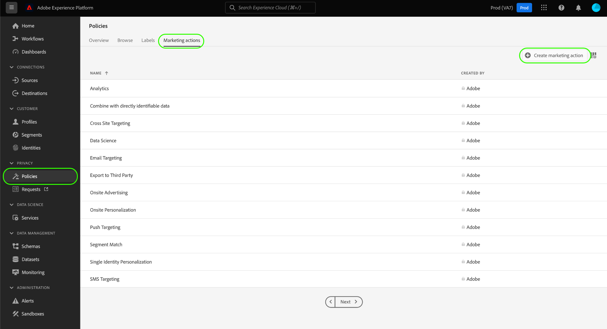

# 在UI中管理数据使用策略 {#user-guide}

>[!CONTEXTUALHELP]
>id="platform_privacyConsole_dataUsagePolicies_description"
>title="描述"
>abstract=""

本文档介绍如何使用 **[!UICONTROL 策略]** Adobe Experience Platform UI中的工作区，用于创建和管理数据使用策略。

>[!NOTE]
>
>有关如何在UI中管理访问控制策略的信息，请参阅 [基于属性的访问控制UI指南](../../access-control/abac/ui/policies.md) 而是。

>[!IMPORTANT]
>
>默认情况下，所有数据使用策略(包括Adobe提供的核心策略)都处于禁用状态。 为了考虑实施单个策略，您必须手动启用该策略。 请参阅以下部分： [启用策略](#enable) 以了解如何在UI中执行此操作的步骤。

## 先决条件

本指南要求您对以下内容有一定的了解 [!DNL Experience Platform] 概念：

* [数据治理](../home.md)
* [数据使用策略](./overview.md)

## 查看现有策略 {#view-policies}

在 [!DNL Experience Platform] UI，选择 **[!UICONTROL 策略]** 以打开 **[!UICONTROL 策略]** 工作区。 在 **[!UICONTROL 浏览]** 选项卡中，您可以看到可用策略的列表，包括其关联的标签、营销操作和状态。

如果您有权访问同意策略，请选择 **[!UICONTROL 同意政策]** 切换以在 [!UICONTROL 浏览] 选项卡。

选择列出的策略以查看其说明和类型。 如果选择自定义策略，则会显示其他控件以编辑、删除或 [启用/禁用策略](#enable).

## 创建自定义策略 {#create-policy}

要创建新的自定义数据使用策略，请选择 **[!UICONTROL 创建策略]** 右上角的 **[!UICONTROL 浏览]** 在中选项卡 **[!UICONTROL 策略]** 工作区。

根据您是否属于同意政策的Beta版，会发生以下情况之一：

* 如果您不属于Beta版，则会立即转到以下项的工作流： [创建数据治理策略](#create-governance-policy).
* 如果您是测试版的一部分，则会显示一个对话框，其中提供了一个额外选项，用于 [创建同意策略](#consent-policy).
   

### 创建数据治理策略 {#create-governance-policy}

此 **[!UICONTROL 创建策略]** 此时会显示工作流。 首先，为新策略提供名称和描述。

接下来，选择策略将基于的数据使用标签。 选择多个标签时，您可以选择是让数据包含所有标签，还是只包含其中一个标签，以便应用策略。 选择 **[!UICONTROL 下一个]** 完成后。

此 **[!UICONTROL 选择营销活动]** 步骤。 从提供的列表中选择相应的营销活动，然后选择 **[!UICONTROL 下一个]** 以继续。

>[!NOTE]
>
>选择多个营销操作时，策略会将其解释为“OR”规则。 换言之，该策略适用于以下情况 **任意** 执行的营销操作。

此 **[!UICONTROL 审核]** 步骤，允许您在创建新策略之前查看其详细信息。 在您满意后，选择 **[!UICONTROL 完成]** 以创建策略。

此 **[!UICONTROL 浏览]** 选项卡会重新显示，其中现在列出了处于“草稿”状态的新创建策略。 要启用策略，请参阅下一部分。

### 创建同意策略 {#consent-policy}

>[!CONTEXTUALHELP]
>id="platform_privacyConsole_dataUsagePolicies_instructions"
>title="说明"
>abstract=""

>[!IMPORTANT]
>
>同意策略仅适用于已购买的组织 **AdobeHealth Shield** 或 **Adobe隐私和安全防护**.

如果您选择创建同意策略，则会显示一个新屏幕，通过该屏幕可配置新策略。

要使用同意策略，您的配置文件数据中必须存在同意属性。 请参阅指南，网址为 [Experience Platform中的同意处理](../../landing/governance-privacy-security/consent/adobe/overview.md) 有关如何将所需属性包含在合并架构中的详细步骤。

同意策略由两个逻辑组件组成：

* **[!UICONTROL 如果]**：将触发策略检查的条件。 这可以基于正在执行的特定营销操作、特定数据使用标签的存在或两者的组合。
* **[!UICONTROL 则]**：要使配置文件包含在触发策略的操作中，必须存在的同意属性。

#### 配置条件 {#consent-conditions}

>[!CONTEXTUALHELP]
>id="platform_governance_policies_consentif"
>title="If条件"
>abstract="首先定义将触发策略检查的条件。 条件可能包括执行某些营销操作、存在某些数据管理标签或同时存在这些标签。"

在 **[!UICONTROL 如果]** 区域，选择应触发此策略的营销操作和/或数据使用标签。 选择 **[!UICONTROL 查看全部]** 和 **[!UICONTROL 选择标签]** 查看可用的营销操作和标签的完整列表。

添加至少一个条件后，您可以选择 **[!UICONTROL 添加条件]** 要继续根据需要添加更多条件，请从下拉菜单中选择相应的条件类型。

如果选择多个条件，则可以使用它们之间显示的图标在“AND”和“OR”之间切换条件关系。

#### 选择同意属性 {#consent-attributes}

>[!CONTEXTUALHELP]
>id="platform_governance_policies_consentthen"
>title="Then条件"
>abstract="定义“If”条件后，使用“Then”部分从合并架构中选择至少一个同意属性。 要使配置文件包含在此策略所管理的操作中，必须存在此属性。"

在 **[!UICONTROL 则]** 部分，从合并架构中选择至少一个同意属性。 要使配置文件包含在此策略所管理的操作中，必须存在此属性。 您可以从列表中选择提供的选项之一，或选择 **[!UICONTROL 查看全部]** 以直接从合并架构中选择属性。

选择同意属性时，选择要此策略检查的属性的值。

选择至少一个同意属性后， **[!UICONTROL 策略属性]** 面板更新，以显示此策略允许的预估配置文件数，包括占配置文件存储总数的百分比。 当您调整策略配置时，此估算会自动更新。

要进一步向策略添加同意属性，请选择 **[!UICONTROL 添加结果]**.

您可以根据需要继续向策略添加和调整条件和同意属性。 如果您对配置感到满意，请在选择之前提供策略的名称和可选描述 **[!UICONTROL 保存]**.

现已创建同意策略，其状态设置为 [!UICONTROL 已禁用] 默认情况下。 要立即启用策略，请选择 **[!UICONTROL 状态]** 在右边栏中切换。

#### 验证策略实施

创建并启用同意策略后，您可以预览它在将区段激活到目标时如何影响您的同意受众。 请参阅以下部分： [同意政策评估](../enforcement/auto-enforcement.md#consent-policy-evaluation) 了解更多信息。

## 启用或禁用策略 {#enable}

默认情况下，所有数据使用策略(包括Adobe提供的核心策略)都处于禁用状态。 对于要考虑实施的单个策略，您必须通过API或UI手动启用该策略。

您可以从以下位置启用或禁用策略 **[!UICONTROL 浏览]** 在中选项卡 **[!UICONTROL 策略]** 工作区。 从列表中选择一个自定义策略，以在右侧显示其详细信息。 下 **[!UICONTROL 状态]**，选择切换按钮以启用或禁用策略。

## 查看营销活动 {#view-marketing-actions}

在 **[!UICONTROL 策略]** 工作区，选择 **[!UICONTROL 营销活动]** 选项卡以查看由Adobe和您自己的组织定义的可用营销操作列表。

## 创建营销活动 {#create-marketing-action}

要创建新的自定义营销操作，请选择 **[!UICONTROL 创建营销活动]** 右上角的 **[!UICONTROL 营销活动]** 在中选项卡 **[!UICONTROL 策略]** 工作区。

此 **[!UICONTROL 创建营销活动]** 对话框。 输入营销活动的名称和描述，然后选择 **[!UICONTROL 创建]**.

新创建的操作将显示在 **[!UICONTROL 营销活动]** 选项卡。 现在，您可以在以下情况下使用营销操作 [创建新的数据使用策略](#create-policy).

## 编辑或删除营销操作 {#edit-delete-marketing-action}

>[!NOTE]
>
>只能编辑由您的组织定义的自定义营销操作。 无法更改或删除Adobe定义的营销操作。

在 **[!UICONTROL 策略]** 工作区，选择 **[!UICONTROL 营销活动]** 选项卡以查看由Adobe和您自己的组织定义的可用营销操作列表。 从列表中选择自定义营销操作，然后使用右侧部分中提供的字段编辑营销操作的详细信息。

如果营销操作未由任何现有使用策略使用，则可以通过选择将其删除 **[!UICONTROL 删除营销活动]**.

>[!NOTE]
>
>尝试删除现有策略正在使用的营销操作会导致出现错误消息，指示删除尝试失败。

## 后续步骤

本文档概述了如何在中管理数据使用策略 [!DNL Experience Platform] UI。 有关如何使用管理策略的步骤 [!DNL Policy Service API]，请参见 [开发人员指南](../api/getting-started.md). 有关如何实施数据使用策略的信息，请参阅 [策略实施概述](../enforcement/overview.md).

以下视频演示了如何在中使用使用策略 [!DNL Experience Platform] UI：

>[!VIDEO](https://video.tv.adobe.com/v/32977?quality=12&learn=on)
