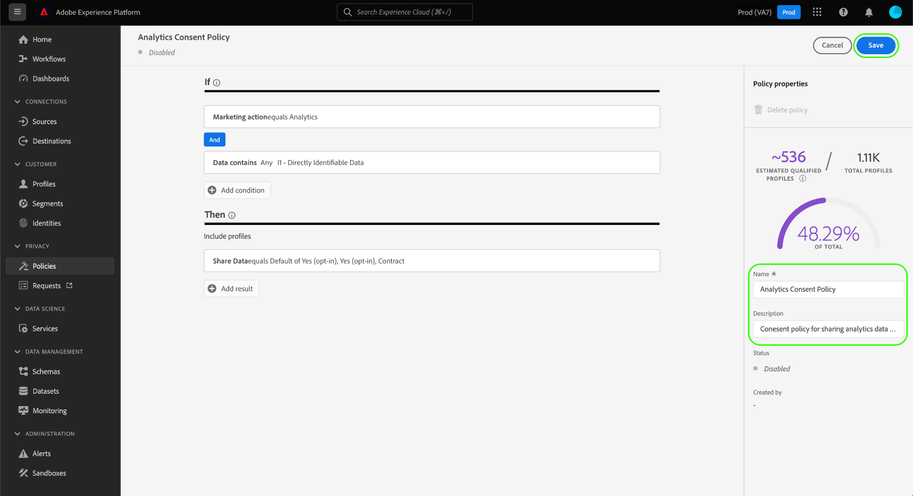

# 在 UI 中管理数据使用策略 {#user-guide}

>[!CONTEXTUALHELP]
>id="platform_privacyConsole_dataUsagePolicies_description"
>title="在您的轮廓数据中集成并强制客户同意"
>abstract="<h2>描述</h2>
通过 Experience Platform，可将从客户收集的同意数据集成到其各自的轮廓中。然后可设置同意策略以确定能否在对于特定目标激活的区段中包括这些数据。
"

本文档介绍如何在Adobe Experience Platform UI中使用&#x200B;**[!UICONTROL 策略]**&#x200B;工作区来创建和管理数据使用策略。

>[!NOTE]
>
>有关如何在UI中管理访问控制策略的信息，请参阅[基于属性的访问控制UI指南](../../access-control/abac/ui/policies.md)。

>[!IMPORTANT]
>
>默认情况下，所有数据使用策略(包括Adobe提供的核心策略)都处于禁用状态。 为了考虑实施单个策略，您必须手动启用该策略。 有关如何在UI中启用策略的步骤，请参阅[启用策略](#enable)的相关部分。

## 先决条件

本指南要求您对以下[!DNL Experience Platform]概念有一定的了解：

* [数据治理](../home.md)
* [数据使用策略](./overview.md)

## 查看现有策略 {#view-policies}

在[!DNL Experience Platform] UI中，选择&#x200B;**[!UICONTROL 策略]**&#x200B;以打开&#x200B;**[!UICONTROL 策略]**&#x200B;工作区。 在&#x200B;**[!UICONTROL 浏览]**&#x200B;选项卡中，您可以看到可用策略的列表，包括其关联的标签、营销操作和状态。

如果您有权访问同意策略，请选择&#x200B;**[!UICONTROL 同意策略]**&#x200B;切换开关以在[!UICONTROL 浏览]选项卡中查看它们。

选择列出的策略以查看其说明和类型。 如果选择了自定义策略，则会显示其他控件以编辑、删除或[启用/禁用策略](#enable)。

## 创建自定义策略 {#create-policy}

要创建新的自定义数据使用策略，请在&#x200B;**[!UICONTROL 策略]**&#x200B;工作区的&#x200B;**[!UICONTROL 浏览]**&#x200B;选项卡右上角选择&#x200B;**[!UICONTROL 创建策略]**。

根据您是否为同意政策的Beta测试版的一部分，会发生以下情况之一：

* 如果您不属于Beta版，则会立即进入工作流[创建数据治理策略](#create-governance-policy)。
* 如果您是测试版成员，则对话框会提供一个额外的选项，用于[创建同意策略](#consent-policy)。
  

### 同时使用数据治理和同意策略 {#combine-policies}

>[!NOTE]
>
>同意策略当前仅适用于已购买Adobe Healthcare Shield或Adobe Privacy &amp; Security Shield的组织。

治理和同意策略可结合使用，以创建强大的规则来管理映射到目标的受众。 同意策略本质上具有包容性，这意味着它们规定了每个营销体验中可以包含哪些用户档案。 反过来，治理策略会排除使用特定的已标记属性，无法对其进行配置以进行激活。

使用此行为，您可以设置策略和同意规则的组合，使其包含正确的用户档案，但阻止您包含违反您设置的组织规则的数据。 示例场景为，您希望排除包含敏感数据的情况，但仍能够通过社交媒体定位同意进行营销的用户。 下面的信息图概述了此方案的必要步骤。

### 创建数据治理策略 {#create-governance-policy}

出现&#x200B;**[!UICONTROL 创建策略]**&#x200B;工作流。 首先，为新策略提供名称和描述。

接下来，选择策略将基于的数据使用标签。 选择多个标签时，您可以选择数据是应包含所有标签，还是只包含其中一个标签，以便应用策略。 完成后，选择&#x200B;**[!UICONTROL 下一步]**。

此时将显示&#x200B;**[!UICONTROL 选择营销操作]**&#x200B;步骤。 从提供的列表中选择相应的营销操作，然后选择&#x200B;**[!UICONTROL 下一步]**&#x200B;以继续。

>[!NOTE]
>
>选择多个营销操作时，策略会将其解释为“OR”规则。 换言之，如果执行了&#x200B;**任意**&#x200B;选定的营销操作，则策略将适用。

此时将显示&#x200B;**[!UICONTROL 审核]**&#x200B;步骤，允许您在创建新策略之前查看其详细信息。 在您满意后，选择&#x200B;**[!UICONTROL 完成]**&#x200B;以创建策略。

**[!UICONTROL 浏览]**&#x200B;选项卡重新出现，该选项卡现在列出处于“草稿”状态的新创建的策略。 要启用策略，请参阅下一部分。

### 创建同意策略 {#consent-policy}

>[!CONTEXTUALHELP]
>id="platform_privacyConsole_dataUsagePolicies_instructions"
>title="说明"
>abstract="<ul><li>确保您通过 OneTrust 源连接器或用于同意的标准 XDM 架构将首选项数据引入到您的联合架构中。</li><li>在左侧导航中选择<a href="https://experienceleague.adobe.com/docs/experience-platform/data-governance/policies/overview.html?lang=zh-Hans">策略</a>，然后选择<a href="https://experienceleague.adobe.com/docs/experience-platform/data-governance/policies/user-guide.html?lang=zh-Hans#create-governance-policy">创建策略</a>。</li><li>在<b>如果</b>部分下面，描述将触发策略检查的条件或操作。</li><li>在<b>则</b>部分下面，输入必须存在才能在触发该策略的操作中包括轮廓的同意属性。</li><li>选择<b>保存</b>以创建该策略。要启用该策略，请选择右边栏中的<b>状态</b>切换开关。</li><li>Experience Platform 在您对于目标激活区段时自动执行您启用的同意策略，并提供有关每项策略如何影响您的受众规模的详细信息。</li><li>有关此功能的更多帮助，请参阅 Experience League 上关于<a href="https://experienceleague.adobe.com/docs/experience-platform/data-governance/policies/user-guide.html?lang=zh-Hans#consent-policy">创建同意策略</a>的指南。</li></ul>"

>[!IMPORTANT]
>
>同意策略仅适用于已购买&#x200B;**Adobe Healthcare Shield**&#x200B;或&#x200B;**Adobe Privacy &amp; Security Shield**&#x200B;的组织。

如果您选择创建同意策略，则会显示一个新屏幕，通过该屏幕可配置新策略。

要使用同意策略，您的配置文件数据中必须存在同意属性。 有关如何将所需属性包含在合并架构中的详细步骤，请参阅Experience Platform中的[同意处理](../../landing/governance-privacy-security/consent/adobe/overview.md)指南。

同意策略由两个逻辑组件组成：

* **[!UICONTROL If]**：将触发策略检查的条件。 这可以基于正在执行的特定营销操作、特定数据使用标签的存在或两者的组合。
* **[!UICONTROL Then]**：配置文件必须存在的同意属性，才能包含在触发策略的操作中。

#### 配置条件 {#consent-conditions}

>[!CONTEXTUALHELP]
>id="platform_governance_policies_consentif"
>title="“如果”条件"
>abstract="首先定义会触发策略检查的条件。条件可以包括正在采取的某些营销行动、存在的某些数据治理标签，或两者的组合。"

在&#x200B;**[!UICONTROL If]**&#x200B;部分下，选择应触发此策略的营销操作和/或数据使用标签。 选择&#x200B;**[!UICONTROL 查看全部]**&#x200B;和&#x200B;**[!UICONTROL 选择标签]**&#x200B;分别查看可用营销操作和标签的完整列表。

添加至少一个条件后，您可以选择&#x200B;**[!UICONTROL 添加条件]**&#x200B;以继续根据需要添加更多条件，并从下拉列表中选择相应的条件类型。

如果选择多个条件，则可以使用它们之间显示的图标在“AND”和“OR”之间切换条件关系。

#### 选择同意属性 {#consent-attributes}

>[!CONTEXTUALHELP]
>id="platform_governance_policies_consentthen"
>title="“则”条件"
>abstract="定义“如果”条件后，使用“则”部分从联合架构中选择至少一个同意属性。这是必须存在的属性，以便轮廓包含在此策略所控制的操作中。"

在&#x200B;**[!UICONTROL Then]**&#x200B;部分下，从合并架构中选择至少一个同意属性。 要使配置文件包含在受此策略控制的操作中，必须存在此属性。 您可以从列表中选择提供的选项之一，或选择&#x200B;**[!UICONTROL 查看全部]**&#x200B;以直接从合并架构中选择属性。

选择同意属性时，请选择要此策略检查的属性的值。

选择至少一个同意属性后，**[!UICONTROL 策略属性]**&#x200B;面板将更新，以显示此策略允许的预估配置文件数，包括占配置文件存储总数的百分比。 此估计会在您调整策略配置时自动更新。

若要向策略添加更多同意属性，请选择&#x200B;**[!UICONTROL 添加结果]**。

您可以根据需要继续向策略添加和调整条件和同意属性。 如果您对配置感到满意，请在选择&#x200B;**[!UICONTROL 保存]**&#x200B;之前提供策略的名称和可选描述。

同意策略现已创建，其状态默认设置为[!UICONTROL 已禁用]。 要立即启用策略，请选择右边栏中的&#x200B;**[!UICONTROL 状态]**&#x200B;切换开关。

#### 验证策略实施

创建并启用同意策略后，您可以预览在将区段激活到目标时，该策略对您同意的受众有何影响。 有关详细信息，请参阅[同意策略评估](../enforcement/auto-enforcement.md#consent-policy-evaluation)部分。

## 启用或禁用策略 {#enable}

默认情况下，所有数据使用策略(包括Adobe提供的核心策略)都处于禁用状态。 对于要考虑实施的单个策略，您必须通过API或UI手动启用该策略。

您可以在&#x200B;**[!UICONTROL 策略]**&#x200B;工作区的&#x200B;**[!UICONTROL 浏览]**&#x200B;选项卡中启用或禁用策略。 从列表中选择自定义策略，以在右侧显示其详细信息。 在&#x200B;**[!UICONTROL 状态]**&#x200B;下，选择切换按钮以启用或禁用策略。

## 查看营销活动 {#view-marketing-actions}

在&#x200B;**[!UICONTROL 策略]**&#x200B;工作区中，选择&#x200B;**[!UICONTROL 营销操作]**&#x200B;选项卡以查看由Adobe和您自己的组织定义的可用营销操作列表。

## 创建营销操作 {#create-marketing-action}

要创建新的自定义营销操作，请在&#x200B;**[!UICONTROL 策略]**&#x200B;工作区的&#x200B;**[!UICONTROL 营销操作]**&#x200B;选项卡右上角选择&#x200B;**[!UICONTROL 创建营销操作]**。

此时将显示&#x200B;**[!UICONTROL 创建营销操作]**&#x200B;对话框。 输入营销操作的名称和描述，然后选择&#x200B;**[!UICONTROL 创建]**。

新创建的操作将显示在&#x200B;**[!UICONTROL 营销操作]**&#x200B;选项卡中。 现在，您可以在[创建新数据使用策略](#create-policy)时使用营销操作。

## 编辑或删除营销操作 {#edit-delete-marketing-action}

>[!NOTE]
>
>只能编辑由您的组织定义的自定义营销操作。 无法更改或删除Adobe定义的营销操作。

在&#x200B;**[!UICONTROL 策略]**&#x200B;工作区中，选择&#x200B;**[!UICONTROL 营销操作]**&#x200B;选项卡以查看由Adobe和您自己的组织定义的可用营销操作列表。 从列表中选择自定义营销操作，然后使用右侧部分中提供的字段编辑营销操作的详细信息。

如果该营销操作未由任何现有使用策略使用，则可以通过选择&#x200B;**[!UICONTROL 删除营销操作]**&#x200B;来删除该营销操作。

>[!NOTE]
>
>尝试删除现有策略正在使用的营销操作会导致出现错误消息，指示删除尝试失败。

## 后续步骤

本文档概述了如何在[!DNL Experience Platform] UI中管理数据使用策略。 有关如何使用[!DNL Policy Service API]管理策略的步骤，请参阅[开发人员指南](../api/getting-started.md)。 有关如何强制实施数据使用策略的信息，请参阅[策略强制概述](../enforcement/overview.md)。

以下视频演示了如何在[!DNL Experience Platform] UI中使用使用策略：

>[!VIDEO](https://video.tv.adobe.com/v/32977?quality=12&learn=on)
