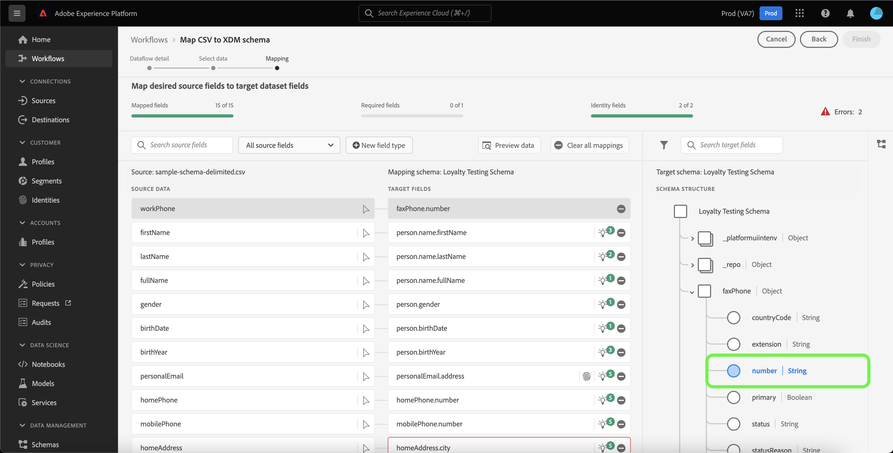
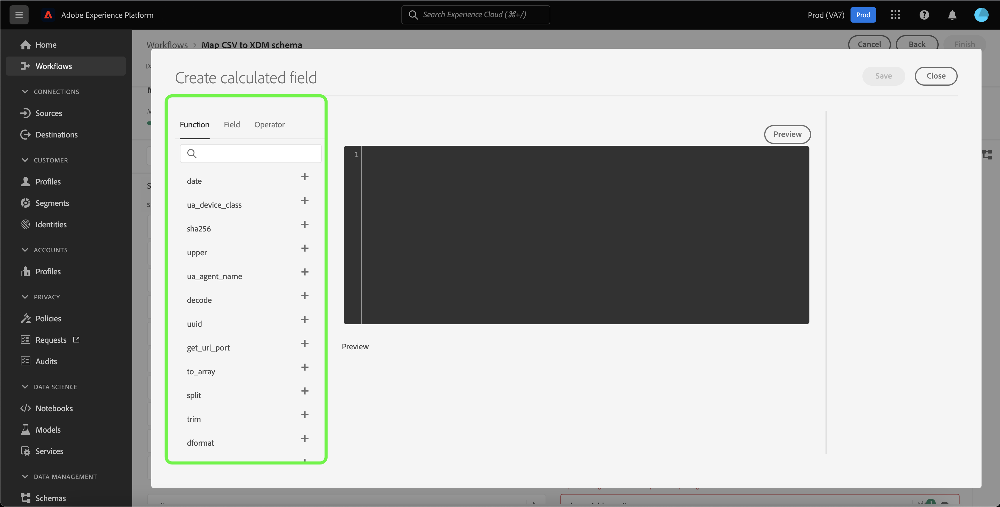
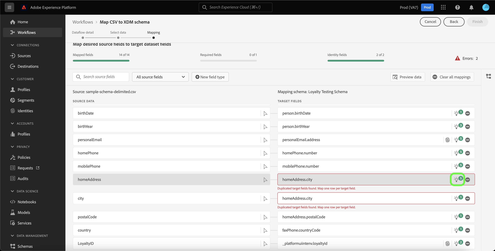
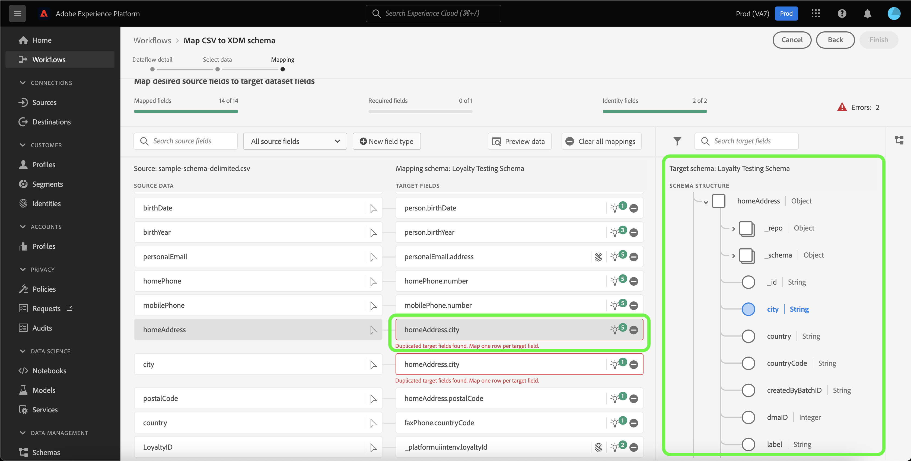

# 数据准备UI指南

本文档提供了有关如何使用Adobe Experience Platform用户界面中的数据准备功能将CSV文件映射到XDM架构的说明。

## 快速入门

本教程需要深入了解以下平台组件：

* [[!DNL Experience Data Model (XDM)] 系统](../../xdm/home.md)：Platform用于组织客户体验数据的标准化框架。
   * [模式组合基础](../../xdm/schema/composition.md)：了解XDM架构的基本构建基块，包括架构构成中的关键原则和最佳实践。
   * [架构编辑器教程](../../xdm/tutorials/create-schema-ui.md)：了解如何使用架构编辑器UI创建自定义架构。
* [Identity Service](../../identity-service/home.md)：通过跨设备和系统桥接身份，更好地了解个人客户及其行为。
* [[!DNL Real-Time Customer Profile]](../../profile/home.md)：根据来自多个来源的汇总数据提供统一的实时使用者个人资料。
* [源](../../sources/home.md)：Experience Platform允许从各种源摄取数据，同时让您能够使用Platform服务来构建、标记和增强传入数据。

## 数据流详细信息

>[!TIP]
>
>您可以通过从源目录中选择任意源来访问数据流详细信息。 欲了解更多信息，请参见 [源概述](../../sources/home.md).

在将CSV数据映射到XDM架构之前，必须首先建立数据流的详细信息。

此 [!UICONTROL 数据流详细信息] 页面允许您选择是将CSV数据摄取到现有目标数据集还是新目标数据集。 现有数据集附带预建的目标架构可将您的数据映射到，而新数据集要求您选择现有架构或创建新架构以将您的数据映射到。

### 使用现有目标数据集

要将CSV数据摄取到现有数据集，请选择 **[!UICONTROL 现有数据集]**. 您可以使用检索现有数据集 [!UICONTROL 高级搜索] 选项中进行选择，或者通过滚动下拉菜单中的现有数据集列表来进行选择。

选择数据集后，为数据流提供名称和可选描述。

在此过程中，您还可以启用 [!UICONTROL 错误诊断] 和 [!UICONTROL 部分摄取]. [!UICONTROL 错误诊断] 为数据流中发生的任何错误记录启用详细的错误消息生成，而 [!UICONTROL 部分摄取] 允许您摄取包含错误的数据，摄取到手动定义的特定阈值为止。 请参阅 [部分批量摄取概述](../../ingestion/batch-ingestion/partial.md) 了解更多信息。

### 使用新的目标数据集

要将CSV数据摄取到新数据集，请选择 **[!UICONTROL 新建数据集]** 然后提供输出数据集名称和可选描述。 接下来，使用选择要映射到的架构 [!UICONTROL 高级搜索] 选项中进行选择，或者通过滚动下拉菜单中的现有架构列表来进行选择。

选择架构后，提供数据流的名称和可选描述，然后应用 [!UICONTROL 错误诊断] 和 [!UICONTROL 部分摄取] 数据流所需的设置。 完成后，选择 **[!UICONTROL 下一个]**.

## 选择数据

此 [!UICONTROL 选择数据] 此时将显示步骤，为您提供用于上传本地文件并预览其结构和内容的界面。 选择 **[!UICONTROL 选择文件]** 以从本地系统上传CSV文件。 或者，您也可以将要上传的CSV文件拖放到 [!UICONTROL 拖放文件] 面板。

>[!TIP]
>
>本地文件上传当前仅支持CSV文件。 每个文件的最大文件大小为1 GB。

上传文件后，预览界面会更新以显示文件的内容和结构。

根据您的文件，可以为源数据选择列分隔符，例如制表符、逗号、管道或自定义列分隔符。 选择 **[!UICONTROL 分隔符]** 下拉箭头，然后从菜单中选择相应的分隔符。

完成后，选择 **[!UICONTROL 下一个]**.

## 映射

此 **[!UICONTROL 映射]** 界面为您提供了一个全面的工具，用于将源架构中的源字段映射到目标架构中相应的目标XDM字段。

### 了解映射界面 {#mapping-interface}

映射界面包括一个功能板，该功能板提供有关摄取工作流上下文中映射字段的运行状况的信息。 仪表板显示有关映射字段的以下详细信息：

| 属性 | 描述 |
| --- | --- |
| [!UICONTROL 映射字段] | 显示已映射到目标XDM字段的源字段总数（不考虑错误）。 |
| [!UICONTROL 必填字段] | 显示所需映射字段的数量。 |
| [!UICONTROL 标识字段] | 显示定义为标识的映射字段总数。 这些映射字段由指纹图标表示。 |
| [!UICONTROL 错误] | 显示错误映射字段的数量。 |

映射界面还提供了选项面板，您可以从中选择这些选项以更好地在映射字段中进行交互或筛选。

要搜索特定的映射集，请选择 **[!UICONTROL 搜索源字段]** 并输入要隔离的源数据的名称。

选择 **[!UICONTROL 所有源字段]** 查看筛选选项的下拉菜单，以更好地缩小映射界面的查看范围。

筛选选项包括：

| 源字段 | 描述 |
| --- | --- |
| [!UICONTROL 所有源字段] | 此选项显示源架构的所有源字段。 默认显示此选项。 |
| [!UICONTROL 必填字段] | 此选项筛选源架构以仅显示完成映射所需的字段。 |
| [!UICONTROL 标识字段] | 此选项筛选源架构以仅显示标记为标识的字段。 |
| [!UICONTROL 映射字段] | 此选项筛选源架构以仅显示已映射的字段。 |
| [!UICONTROL 未映射字段] | 此选项筛选源架构以仅显示尚未映射的字段。 |
| [!UICONTROL 包含推荐的字段] | 此选项筛选源架构以仅显示包含映射推荐的字段。 |

选择 **[!UICONTROL 有错误的字段]** 查看所有包含错误的映射字段。

将出现一个错误映射字段的隔离视图，允许您通过智能映射推荐或手动映射树解决错误。

### 添加新字段类型

您可以通过选择来添加新映射字段或计算字段 **[!UICONTROL 新字段类型]**.

#### 新建映射字段

要添加新映射字段，请选择 **[!UICONTROL 新字段类型]** 然后选择 **[!UICONTROL 添加新字段]** 从出现的下拉菜单中。

接下来，从显示的源架构树中选择要添加的源字段，然后选择 **[!UICONTROL 选择]**.

映射界面将使用您选择的源字段和空的目标字段进行更新。 选择 **[!UICONTROL 映射目标字段]** 开始将新源字段映射到其相应的目标XDM字段。

此时将显示交互式目标架构树，允许您手动遍历目标架构并找到适用于源字段的相应目标XDM字段。

完成后，选择架构图标以关闭目标架构界面。

#### 计算字段 {#calculated-fields}

计算字段允许根据输入架构中的属性创建值。 然后，可以将这些值分配给目标架构中的属性，并提供名称和描述以便更轻松地引用。 计算字段的最大长度为4096个字符。

要创建计算字段，请选择 **[!UICONTROL 新字段类型]** 然后选择 **[!UICONTROL 添加计算字段]**

此 **[!UICONTROL 创建计算字段]** 面板。 左侧对话框包含计算字段中支持的字段、函数和运算符。 选择其中一个选项卡，开始向表达式编辑器添加函数、字段或运算符。

| 选项卡 | 描述 |
| --- | ----------- |
| [!UICONTROL 函数] | 函数选项卡列出了可用于转换数据的函数。 要了解有关可在计算字段中使用的函数的更多信息，请阅读以下指南： [使用数据准备（映射器）函数](../functions.md). |
| [!UICONTROL 字段] | 字段选项卡列出了源架构中可用的字段和属性。 |
| [!UICONTROL 操作员] | 运算符选项卡列出了可用于转换数据的运算符。 |

您可以使用位于中心的表达式编辑器手动添加字段、函数和运算符。 选择编辑器以开始创建表达式。 完成后，选择 **[!UICONTROL 保存]** 以继续。

### 导入映射 {#import}

您可以重用现有数据流的映射，以减少数据摄取的手动配置时间并限制错误。 选择 **[!UICONTROL 导入映射]** 以重用现有映射。

此 [!UICONTROL 导入映射] 窗口，为您提供一系列可供选择的数据流。

选择预览图标以预览所选数据流的映射。

预览窗口允许您在导入到数据流之前检查现有映射。 验证映射后，可以选择 **[!UICONTROL 返回]** 返回到数据流列表并检查另一组映射，或者可以选择 **[!UICONTROL 选择]** 以继续。

或者，您可以从数据流窗口列表中选择要导入的映射。 选择包含要导入的映射的数据流，然后选择 **[!UICONTROL 选择]** 以继续。

界面会随着您导入的映射而更新。

>[!NOTE]
>
>您建立或ML映射建议的任何现有映射集都将被从现有数据流导入的映射替换。

选择 **[!UICONTROL 预览数据]** 查看选定数据集中最多100行示例数据的映射结果。

在预览期间，标识列将优先作为第一个字段，因为它是验证映射结果时所需的关键信息。 完成后，选择 **[!UICONTROL 关闭]**.

要删除所有映射字段，请选择 **[!UICONTROL 清除所有映射]**.

### 使用映射界面

Platform会根据您选择的目标架构或数据集，自动为自动映射的字段提供智能推荐。 您可以手动调整映射规则以适合您的用例，也可以修复任何重复的映射字段以清除任何错误。

在要调整的目标字段中选择灯泡图标。

此 [!UICONTROL 映射推荐] 此时会显示弹出面板，其中显示可映射到特定源字段的推荐目标字段列表。 默认情况下，会自动应用第一个推荐。

有时，源架构有多个推荐可用。 发生这种情况时，映射卡片会显示最显眼的推荐，后跟一个图标，其中包含可用的其他推荐数量。 选择灯泡图标将显示其他建议的列表。 通过选中要映射到的推荐旁边的复选框，您可以选择替代推荐之一。

在此处，您可以更改所选目标字段以修复错误或匹配您的用例。

或者，您可以选择 **[!UICONTROL 手动选择]** 以手动使用交互式目标架构映射树。

目标架构映射界面与映射字段显示在同一视图中，允许您在同一屏幕中修改映射对。 选择适合您的用例或修复错误的目标字段。

完成后，选择 **[!UICONTROL 完成]** 以继续。

## 后续步骤

通过阅读本文档，您已使用Platform UI中的映射界面成功将CSV文件映射到目标XDM架构。 有关更多信息，请参阅以下文档：

* [数据准备概述](../home.md)
* [源概述](../../sources/home.md)
* [在UI中监控源数据流](../../dataflows/ui/monitor-sources.md)
