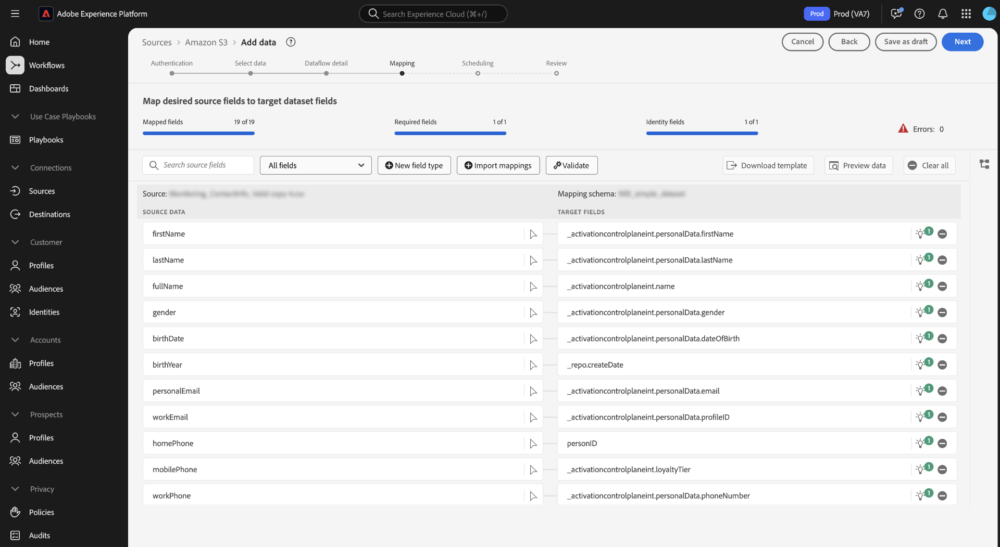
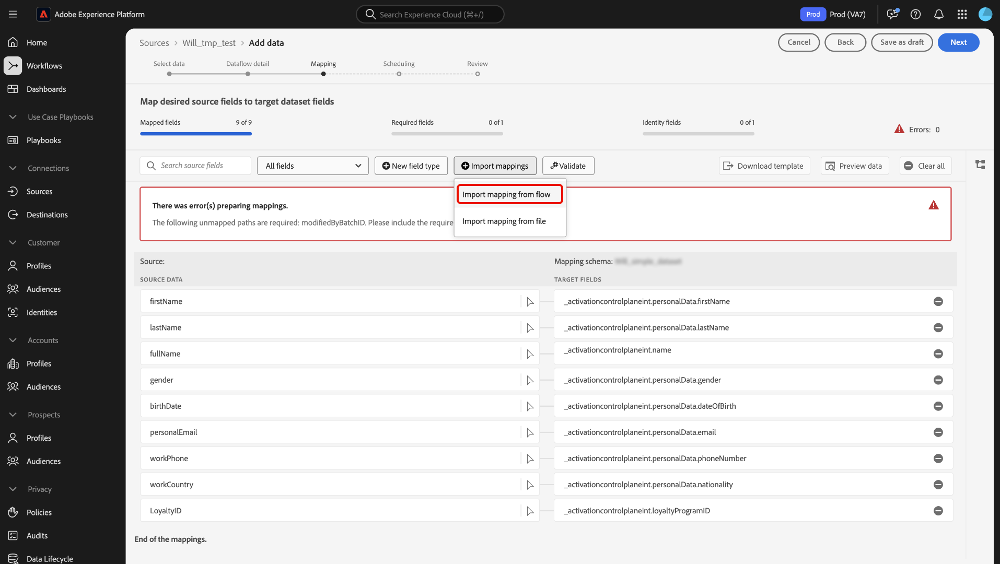

# 数据准备UI指南

阅读本指南，了解如何使用Adobe Experience Platform用户界面中的[数据准备](../home.md)映射函数将CSV文件映射到[体验数据模型(XDM)架构](../../xdm/home.md)。

## 快速入门

本教程需要您实际了解以下Experience Platform组件：

* [[!DNL Experience Data Model (XDM)] 系统](../../xdm/home.md)： Experience Platform用于组织客户体验数据的标准化框架。
   * [架构组合的基础知识](../../xdm/schema/composition.md)：了解XDM架构的基本构建块，包括架构组合中的关键原则和最佳实践。
   * [架构编辑器教程](../../xdm/tutorials/create-schema-ui.md)：了解如何使用架构编辑器UI创建自定义架构。
* [身份服务](../../identity-service/home.md)：通过跨设备和系统桥接身份，更好地了解个人客户及其行为。
* [[!DNL Real-Time Customer Profile]](../../profile/home.md)：根据来自多个源的汇总数据，提供统一的实时使用者个人资料。
* [源](../../sources/home.md)： Experience Platform允许从各种源摄取数据，同时让您能够使用Experience Platform服务来构建、标记和增强传入数据。

## 访问UI中的映射界面

您可以通过两种不同的路径访问UI中的映射界面。

1. 在Experience Platform UI中，从左侧导航中选择&#x200B;**[!UICONTROL 工作流]**，然后选择&#x200B;**[!UICONTROL 将CSV映射到XDM架构]**。 接下来，提供数据流详细信息并选择要摄取的数据。 完成后，您将转到映射界面，您可以在其中配置源数据和XDM架构之间的映射。
2. 您还可以通过源工作区访问映射界面。

## 将CSV文件映射到XDM架构

使用映射界面及其提供的综合工具集成功将源架构中的数据字段映射到目标架构中相应的目标XDM字段。

### 了解映射界面 {#mapping-interface}

有关摄取工作流上下文中映射字段的运行状况的信息，请参阅界面顶部的仪表板。 仪表板显示有关映射字段的以下详细信息：

| 属性 | 描述 |
| --- | --- |
| [!UICONTROL 映射的字段] | 显示已映射到目标XDM字段的源字段总数，无论是否存在错误。 |
| [!UICONTROL 必填字段] | 显示所需映射字段的数量。 |
| [!UICONTROL 标识字段] | 显示定义为标识的映射字段总数。 这些映射字段由指纹图标表示。 |
| [!UICONTROL 个错误] | 显示错误映射字段的数量。 |

{style="table-layout:auto"}

接下来，您可以使用标头中列出的选项来更好地在映射字段中进行交互或过滤。

| 选项 | 描述 |
| --- | --- |
| [!UICONTROL 搜索源字段] | 使用搜索栏导航到特定源字段。 |
| [!UICONTROL 所有字段] | 选择&#x200B;**[!UICONTROL 所有字段]**&#x200B;以查看用于筛选映射的选项的下拉菜单。 可用的筛选选项包括：<ul><li>**[!UICONTROL 必填字段]**：筛选界面以仅显示完成工作流所需的字段。</li><li> **[!UICONTROL 标识字段]**：筛选界面以仅显示标记为标识的字段。</li><li>**[!UICONTROL 映射的字段]**：筛选界面以仅显示已映射的字段。</li><li>**[!UICONTROL 未映射的字段]**：筛选界面以仅显示尚未映射的字段。</li><li>**[!UICONTROL 有错误的字段]**：筛选界面以仅显示有错误的字段。</li></ul> |
| [!UICONTROL 新字段类型] | 选择&#x200B;**[!UICONTROL 新字段类型]**&#x200B;以添加新字段或计算字段。 有关详细信息，请阅读有关[添加新字段类型](#add-a-new-field-type)的部分。 |
| [!UICONTROL 导入映射] | 选择&#x200B;**[!UICONTROL 导入映射]**&#x200B;以从现有文件或数据流导入映射。 有关详细信息，请阅读有关[导入映射](#import-mapping)的部分。 |
| [!UICONTROL 验证] | 选择&#x200B;**[!UICONTROL 验证]**&#x200B;以检查映射中是否存在错误。 |
| [!UICONTROL 下载模板] | 选择&#x200B;**[!UICONTROL 下载模板]**&#x200B;以导出并下载映射的CSV文件。 |
| [!UICONTROL 预览数据] | 选择&#x200B;**[!UICONTROL 预览数据]**&#x200B;以使用预览面板并检查源数据集的结构和内容。 |
| [!UICONTROL 全部清除] | 选择&#x200B;**[!UICONTROL 全部清除]**&#x200B;以删除界面中的所有映射。 |

{style="table-layout:auto"}

### 添加新字段类型 {#add-a-new-field-type}

您可以通过选择&#x200B;**[!UICONTROL 新字段类型]**&#x200B;来添加新的映射字段或计算字段。

#### 新建映射字段

要添加新映射字段，请选择&#x200B;**[!UICONTROL 新字段类型]**，然后从出现的下拉菜单中选择&#x200B;**[!UICONTROL 添加新字段]**。

接下来，从显示的源架构树中选择要添加的源字段，然后选择&#x200B;**[!UICONTROL 选择]**。

映射界面将使用您选择的源字段和空的目标字段进行更新。 选择&#x200B;**[!UICONTROL 映射目标字段]**&#x200B;以开始将新的源字段映射到其相应的目标XDM字段。

此时会显示交互式目标架构树，允许您手动遍历目标架构并找到适用于源字段的相应目标XDM字段。

#### 计算字段 {#calculated-fields}

计算字段允许根据输入架构中的属性创建值。 然后，可以将这些值分配给目标架构中的属性，并提供名称和描述以便更轻松地引用。 计算字段的最大长度为4096个字符。

要创建计算字段，请选择&#x200B;**[!UICONTROL 新字段类型]**，然后选择&#x200B;**[!UICONTROL 添加计算字段]**

出现&#x200B;**[!UICONTROL 创建计算字段]**&#x200B;窗口。 使用界面输入计算字段，并参阅左侧的对话框以了解支持的字段、函数和运算符。

| 选项卡 | 描述 |
| --- | ----------- |
| [!UICONTROL 函数] | 函数选项卡列出了可用于转换数据的函数。 若要了解有关可在计算字段中使用的函数的更多信息，请阅读有关[使用数据准备（映射器）函数](../functions.md)的指南。 |
| [!UICONTROL 字段] | 字段选项卡列出了源架构中可用的字段和属性。 |
| [!UICONTROL 操作员] | 运算符选项卡列出了可用于转换数据的运算符。 |

您可以使用位于中心的表达式编辑器手动添加字段、函数和运算符。 选择编辑器以开始创建表达式。 完成后，选择&#x200B;**[!UICONTROL 保存]**&#x200B;以继续。

### 导入映射 {#import-mapping}

通过使用数据准备的导入映射功能，您可以缩短数据摄取过程的手动配置时间并限制错误。 您可以从现有流或导出的文件导入映射。

>[!BEGINTABS]

>[!TAB 从流导入映射]

如果您有多个基于相似源文件和目标架构的数据流，则可以导入现有映射并将其重新用于新数据流。

要从现有数据流导入映射，请选择&#x200B;**[!UICONTROL 导入映射]**，然后选择&#x200B;**[!UICONTROL 从流]**&#x200B;导入映射。

接下来，使用弹出窗口找到要导入其映射的数据流。 在此步骤中，您还可以使用搜索功能来隔离特定数据流并检索其映射。 完成后，选择&#x200B;**[!UICONTROL 选择]**。

>[!TAB 从文件导入映射]

在某些情况下，您可能需要为数据实施大量映射。 您可以使用映射界面手动执行此操作，但也可以导出映射模板并在离线电子表格上配置映射，以节省时间并避免用户在Experience Platform上超时。

若要从导出的文件导入映射，请选择&#x200B;**[!UICONTROL 导入映射]**，然后选择&#x200B;**[!UICONTROL 从文件]**&#x200B;导入映射。

接下来，使用[!UICONTROL 上载模板]窗口下载映射的CSV副本。 然后，您可以使用支持编辑CSV文件类型的任何软件，在设备上本地配置映射。 在此步骤中，您必须确保仅使用源文件和目标架构中提供的字段。

+++选择以查看导出映射文件的示例

+++

完成后，选择&#x200B;**[!UICONTROL 上载文件]**，然后选择映射的更新csv文件。 等待系统处理一段时间，然后选择&#x200B;**[!UICONTROL 完成]**。

>[!ENDTABS]

映射完成后，您现在可以选择&#x200B;**[!UICONTROL 完成]**，然后继续下一步以完成数据流。

>[!TIP]
>
>完成创建映射后，请等待最多10分钟再开始数据摄取。 此等待期可确保新映射完全保存并在系统中可用。

## 后续步骤

您现在可以使用Experience Platform UI中的映射界面成功将CSV文件映射到目标XDM架构。 有关详细信息，请阅读以下文档：

* [数据准备概述](../home.md)
* [源概述](../../sources/home.md)
* [在UI中监视源数据流](../../dataflows/ui/monitor-sources.md)
