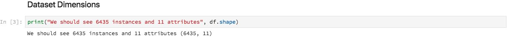
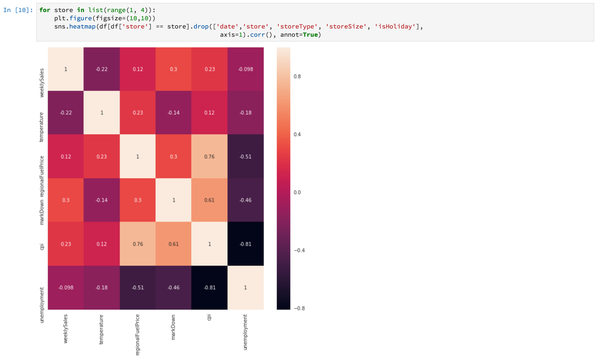

# 使用笔记本分析数据

本教程侧重于如何使用在数据科学工作区中构建的Jupyter笔记本电脑访问、探索和可视化您的数据。 在本教程的结尾，您应该了解Jupyter笔记本优惠的某些功能，以便更好地了解您的数据。

介绍了以下概念：

- **JupyterLab:** JupyterLab [](https://blog.jupyter.org/jupyterlab-is-ready-for-users-5a6f039b8906) 是Project Jupyter的下一代基于Web的界面，并且紧密集成到Adobe Experience Platform中。
- **批：** 数据集由批量组成。 批是在一段时间内收集并作为单个单元一起处理的一组数据。 将数据添加到数据集时会创建新批。
- **Data Access SDK（已弃用）:** 数据访问SDK现已弃用。 请使用 [Platform SDK](../authoring/platform-sdk.md) 指南。

## 在数据科学工作区中浏览笔记本

在本节中，我们将探索之前引入零售模式的数据。

数据科学工作区允许用户通过JupyterLab平台创建Jupyter笔记本，在JupyterLab平台中，他们可以创建和编辑机器学习工作流。 JupyterLab是一种服务器——客户端协作工具，它允许用户通过Web浏览器编辑笔记本文档。 这些笔记本电脑可以同时包含可执行代码和富文本元素。 出于我们的目的，我们将使用Markdown进行分析描述和可执行的Python代码来执行数据探索和分析。

### 选择工作区

在启动JupyterLab时，我们为Jupyter Notebooks提供了一个基于Web的界面。 根据我们选择的笔记本类型，将启动相应的内核。

在比较要使用的环境时，我们必须考虑每项服务的限制。 例如，如果我们将熊猫库与 [Python一起使用](https://pandas.pydata.org/) ，作为普通用户，RAM限制为2 GB。 即使是高级用户，我们也将仅限20 GB的RAM。 如果处理更大的计算，则使用Spark是明智的，它优惠1.5 TB，可与所有笔记本实例共享。

默认情况下，Tensorflow菜谱在GPU群集中工作，Python在CPU群集中运行。

### 创建新笔记本

在Adobe Experience Platform UI中，单击顶部菜单中的“数据科学”选项卡，将您带到数据科学工作区。 在此页中，单击将打开JupyterLab启动器的JupyterLab选项卡。 您应当看到一个类似于此的页面。


在我们的教程中，我们将使用Jupyter Notebook中的Python 3来展示如何访问和浏览数据。 在“启动器”页面中，提供了示例笔记本。 我们将使用Python 3的零售销售菜谱。


零售销售菜谱是一个独立示例，它使用相同的零售销售数据集来显示如何在Jupyter Notebook中浏览和可视化数据。 此外，该笔记本还通过培训和验证进一步深入。 有关此特定笔记本的更多信息，请参阅此步 [骤](../walkthrough.md)。

### 访问数据

>[!NOTE] 已 `data_access_sdk_python` 弃用，不再推荐。 要转换代码， [请参阅将数据访问SDK转换为Platform SDK](../authoring/platform-sdk.md) 教程。 下面的步骤仍然适用于本教程。

我们将从Adobe Experience Platform内部访问数据，从外部访问数据。 我们将使用库访 `data_access_sdk_python` 问内部数据，如数据集和XDM模式。 对于外部数据，我们将使用熊猫Python图书馆。

#### 外部数据

打开零售销售笔记本后，找到“加载数据”标题。 以下Python代码使用熊猫的 `DataFrame` 数据结构和 [](https://pandas.pydata.org/pandas-docs/stable/generated/pandas.read_csv.html#pandas.read_csv) read_csv()函数将Github上托管的CSV读入DataFrame:


熊猫的DataFrame数据结构是一种二维标记数据结构。 要快速查看数据的维度，我们可以使用 `df.shape`。 这将返回表示DataFrame的维度的元组：



最后，我们可以一睹数据的真实效果。 我们可 `df.head(n)` 以使用视图 `n` DataFrame的前几行：


#### 体验平台数据

现在，我们将重点介绍如何访问Experience Platform数据。

##### 按数据集ID

对于此部分，我们使用零售销售数据集，该数据集与零售销售示例笔记本中使用的数据集相同。

在Jupyter Notebook中，我们可以从左侧的“数据 **** ”选项卡访问数据。 单击该选项卡后，您将能够看到一列表数据集。


现在，在数据集目录中，我们将能够查看所有摄取的数据集。 请注意，如果目录中填充了大量数据集，则加载所有条目可能需要一分钟。

由于数据集是相同的，因此我们希望替换使用外部数据的上一节中的加载数据。 选择“ **Load Data** ”（加载数据）下的代码块， **然后按键盘上的** “d”键两次。 确保焦点位于块上而非文本中。 您可以按 **&#39;esc&#39;** 以避开文本焦点，然后按 **&#39;d&#39;** 两次。

现在，我们可以右键单击数 `Retail-Training-<your-alias>` 据集并在下拉菜单中选择“浏览笔记本中的数据”选项。 笔记本中将显示一个可执行代码项。

>[!TIP] 请参阅平 [台SDK](../authoring/platform-sdk.md) 指南以转换代码。

```PYTHON
from data_access_sdk_python.reader import DataSetReader
from datetime import date
reader = DataSetReader()
df = reader.load(data_set_id="xxxxxxxx", ims_org="xxxxxxxx@AdobeOrg")
df.head()
```

如果您使用的是除Python之外的其他内核，请参 [阅本页](https://github.com/adobe/acp-data-services-dsw-reference/wiki/Accessing-Data-on-the-Platform) ，以访问Adobe Experience Platform上的数据。

选择可执行文件单元格，然后在工具栏中按播放按钮将运行可执行文件代码。 的输出 `head()` 将是一个表，其中数据集的键为列，前n行为数据集中的行。 `head()` 接受整数参数以指定要输出的行数。 默认情况下，此值为5。


如果重新启动内核并再次运行所有单元格，应获得与以前相同的输出。


### 浏览数据

既然我们可以访问您的数据，我们就使用统计数据和可视化来关注数据本身。 我们使用的数据集是一个零售数据集，它提供有关给定日期45个不同商店的杂项信息。 给定的某些特 `date` 性 `store` 包括：
- `storeType`
- `weeklySales`
- `storeSize`
- `temperature`
- `regionalFuelPrice`
- `markDown`
- `cpi`
- `unemployment`
- `isHoliday`

#### 统计摘要

我们可以利用Python的熊猫库来获取每个属性的数据类型。 以下调用的输出将提供有关每个列的条目数和数据类型的信息：

```PYTHON
df.info()
```


此信息很有用，因为了解每列的数据类型将使我们能够了解如何处理数据。

现在，我们来看统计摘要。 只显示数字数据类型，因此 `date`、 `storeType`和 `isHoliday` 将不输出：

```PYTHON
df.describe()
```


通过这个，我们可以看到，每个特征有6435个实例。 给出了平均、标准差(std)、最小、最大和间隔等统计信息。 这给出了有关数据偏差的信息。 在下一节中，我们将重点介绍可视化功能，这些功能与这些信息一起使用，以便我们更好地了解我们的数据。

从最小值和最大值看， `store`我们可以看到有45个数据表示的唯一存储。 还有一些 `storeTypes` 因素使商店与众不同。 通过执行以下操作，我们可 `storeTypes` 以看到Adobe的分发：


这意味着22家商店 `storeType` 有17家， `A`6家有 `storeType``B``storeType``C`。

#### 数据可视化

既然我们了解了数据框架值，我们就想用可视化来补充这一点，让事情变得更清晰、更容易识别模式。 在将结果传送到受众时，图形也很有用。 一些Python库对于可视化很有用，包括：
- [Matplotlib](https://matplotlib.org/)
- [熊猫](https://pandas.pydata.org/)
- [searn](https://seaborn.pydata.org/)
- [gplot](https://ggplot2.tidyverse.org/)

在本节中，我们将快速介绍使用每个库的一些优势。

[Matplotlib](https://matplotlib.org/) 是最古老的Python可视化包。 他们的目标是让“容易而困难的事情变得可能”。 这一点往往是正确的，因为该软件包非常强大，但也伴随着复杂性。 在不花费大量时间和精力的情况下，获得合理的外观图并不总是件容易的事。

[Pactomys](https://pandas.pydata.org/) 主要用于其DataFrame对象，它允许使用集成索引进行数据处理。 但是，熊猫还包括一个基于matplotlib的内置绘图功能。

[seaborn](https://seaborn.pydata.org/) 是在matplotlib上构建的包。 其主要目标是使默认图形更具视觉吸引力并简化复杂图形的创建。

[ggplot](https://ggplot2.tidyverse.org/) 是也构建在matplotlib顶部的包。 但主要区别在于该工具是R的ggplot2端口。与西博恩相似，其目标是改进matplotlib。 熟悉gplot2 for R的用户应考虑此库。


##### 单变量图

单变量图是单个变量的图。 通用的单变量图用于可视化数据，即框图和晶须图。

利用我们以前的零售数据集，我们可以为45家商店及其每周销售量中的每家生成包装盒和须条图。 使用函数生成绘 `seaborn.boxplot` 图。


用方框和晶须图显示数据的分布。 图的外线显示上四分位图和下四分位图，而框横跨四分位图范围。 框中的线标记中间值。 高于上四分之一或下四分之一的任何数据点都标记为圆。 这些点被视为异常值。

##### 多变量图

多变量图用于查看变量之间的交互。 通过可视化，数据科学家可以发现变量之间是否存在任何相关性或模式。 使用的通用多变量图是关联矩阵。 利用相关矩阵，用相关系数量化多个变量之间的依赖关系。

利用同一个零售数据集，可以生成关联矩阵。



注意中心下方1的对角线。 这说明在比较变量与自身时，它具有完全正相关性。 强正相关度将接近1，弱正相关度将接近0。 显示负相关，负系数显示逆趋势。


## 后续步骤

本教程介绍了如何在数据科学工作区中创建新的Jupyter笔记本，以及如何从外部以及从Adobe Experience Platform访问数据。 具体来说，我们浏览了以下步骤：
- 创建新的Jupyter笔记本
- 访问数据集和模式
- 浏览数据集

现在，您可以转到下一节 [来打包菜谱](../models-recipes/package-source-files-recipe.md) ，并导入Data Science Workspace。