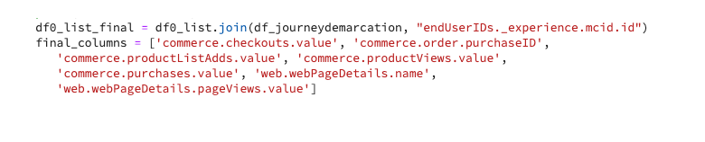

# 使用JupyterLab Notebooks创建模型

>[!NOTE]
>
>数据科学Workspace不再可供购买。
>
>本文档面向之前有权访问数据科学Workspace的现有客户。

本教程将指导您完成使用JupyterLab Notebooks方法生成器模板创建模型的所需步骤。

## 引入的概念：

- **方法：**&#x200B;方法是Adobe对模型规范的术语，它是一个顶级容器，表示构建和执行经过训练的模型所需的特定机器学习、AI算法或算法组合、处理逻辑和配置。
- **模型：**&#x200B;模型是机器学习方法的实例，使用历史数据和配置进行培训以针对业务用例进行解析。
- **训练：**&#x200B;训练是从标记数据中学习模式和洞察的过程。
- **评分：**&#x200B;评分是使用经过训练的模型从数据生成洞察的过程。

## 下载所需的资产 {#assets}

在继续本教程之前，您必须创建所需的架构和数据集。 访问有关[创建Luma倾向模型架构和数据集](../models-recipes/create-luma-data.md)的教程，以下载所需的资源并设置先决条件。

## 开始使用[!DNL JupyterLab]笔记本环境

可在[!DNL Data Science Workspace]内从头开始创建方法。 要开始，请导航到[Adobe Experience Platform](https://platform.adobe.com)并选择左侧的&#x200B;**[!UICONTROL Notebooks]**&#x200B;选项卡。 要创建新笔记本，请从[!DNL JupyterLab Launcher]中选择方法生成器模板。

[!UICONTROL Recipe Builder]笔记本允许您在笔记本内运行训练和评分运行。 这样，您就可以灵活地在针对训练和评分数据运行实验之间更改其`train()`和`score()`方法。 如果您对训练和评分的输出感到满意，则可以创建一个方法，然后使用该方法为功能建模并将其作为模型发布。

>[!NOTE]
>
>[!UICONTROL Recipe Builder]笔记本支持使用所有文件格式，但当前创建方法功能仅支持[!DNL Python]。


从启动器中选择[!UICONTROL Recipe Builder]笔记本时，该笔记本将在新选项卡中打开。

在顶部的新笔记本选项卡中，将加载包含三个其他操作的工具栏 — **[!UICONTROL Train]**、**[!UICONTROL Score]**&#x200B;和&#x200B;**[!UICONTROL Create Recipe]**。 这些图标仅显示在[!UICONTROL Recipe Builder]笔记本中。 在笔记本中构建方法后，有关这些操作的更多信息[在培训和评分部分](#training-and-scoring)中提供。


## 开始使用[!UICONTROL Recipe Builder]笔记本

在提供的资源文件夹中为Luma倾向模型`propensity_model.ipynb`。 使用JupyterLab中的“上载笔记本”选项，上载提供的型号并打开笔记本。


本教程的其余部分介绍了在倾向性模型笔记本中预定义的以下文件：

- [要求文件](#requirements-file)
- [配置文件](#configuration-files)
- [训练数据加载器](#training-data-loader)
- [评分数据加载程序](#scoring-data-loader)
- [管道文件](#pipeline-file)
- [计算器文件](#evaluator-file)
- [数据保存程序文件](#data-saver-file)

以下视频教程介绍Luma倾向模型笔记本：

>[!VIDEO](https://video.tv.adobe.com/v/333570)

### 要求文件 {#requirements-file}

要求文件用于声明您希望在模型中使用的其他库。 如果存在依赖关系，则可以指定版本号。 要查找其他库，请访问[anaconda.org](https://anaconda.org)。 要了解如何格式化要求文件，请访问[Conda](https://docs.conda.io/projects/conda/en/latest/user-guide/tasks/manage-environments.html#creating-an-environment-file-manually)。 已使用的主要库列表包括：

```JSON
python=3.6.7
scikit-learn
pandas
numpy
data_access_sdk_python
```

>[!NOTE]
>
>您添加的库或特定版本可能与上述库不兼容。 此外，如果您选择手动创建环境文件，则不允许覆盖`name`字段。

对于Luma倾向性模型笔记本，无需更新要求。

### 配置文件 {#configuration-files}

配置文件`training.conf`和`scoring.conf`用于指定要用于训练和评分以及添加超参数的数据集。 有单独的训练和评分配置。

为了使模型运行训练，您必须提供`trainingDataSetId`、`ACP_DSW_TRAINING_XDM_SCHEMA`和`tenantId`。 此外，为了进行评分，您必须提供`scoringDataSetId`、`tenantId`和`scoringResultsDataSetId`。

要查找数据集和架构ID，请转到左侧导航栏上notebooks中的数据选项卡（文件夹图标下）。 需要提供三个不同的数据集ID。 `scoringResultsDataSetId`用于存储模型评分结果，并且应为空数据集。 这些数据集以前在[必需资产](#assets)步骤中创建。


在[架构](https://platform.adobe.com/)**[和](https://platform.adobe.com/schema)数据集****[选项卡下的](https://platform.adobe.com/dataset/overview)Adobe Experience Platform**&#x200B;上可找到相同的信息。

竞争后，您的训练和评分配置应类似于以下屏幕截图：


默认情况下，在训练和评分数据时会为您设置以下配置参数：

- `ML_FRAMEWORK_IMS_USER_CLIENT_ID`
- `ML_FRAMEWORK_IMS_TOKEN`
- `ML_FRAMEWORK_IMS_ML_TOKEN`
- `ML_FRAMEWORK_IMS_TENANT_ID`

## 了解培训数据加载器 {#training-data-loader}

培训数据加载器的目的是实例化用于创建机器学习模型的数据。 通常，培训数据加载器会完成以下两个任务：

- 正在从[!DNL Experience Platform]加载数据
- 数据准备和特征工程

以下两个部分将重载数据和准备数据。

### 正在加载数据 {#loading-data}

此步骤使用[熊猫数据流](https://pandas.pydata.org/pandas-docs/stable/generated/pandas.DataFrame.html)。 可以使用[!DNL Adobe Experience Platform] SDK ([!DNL Experience Platform])从`platform_sdk`中的文件加载数据，也可以使用熊猫的`read_csv()`或`read_json()`函数从外部源加载数据。

- [[!DNL Experience Platform SDK]](#platform-sdk)
- [外部源](#external-sources)

>[!NOTE]
>
>在方法生成器笔记本中，通过`platform_sdk`数据加载器加载数据。

### [!DNL Experience Platform] SDK {#platform-sdk}

有关使用`platform_sdk`数据加载器的深入教程，请访问[Experience Platform SDK指南](../authoring/platform-sdk.md)。 本教程提供有关构建身份验证、数据基本读取和数据基本写入的信息。

### 外部源 {#external-sources}

此部分将向您展示如何将JSON或CSV文件导入熊猫对象。 大熊猫图书馆的官方文件可在此处找到：

- [read_csv](https://pandas.pydata.org/pandas-docs/stable/generated/pandas.read_csv.html)
- [read_json](https://pandas.pydata.org/pandas-docs/stable/generated/pandas.read_json.html)

首先，以下是导入CSV文件的示例。 `data`参数是CSV文件的路径。 此变量是从`configProperties`上一节[中的](#configuration-files)导入的。

```PYTHON
df = pd.read_csv(data)
```

您还可以从JSON文件导入。 `data`参数是CSV文件的路径。 此变量是从`configProperties`上一节[中的](#configuration-files)导入的。

```PYTHON
df = pd.read_json(data)
```

现在，您的数据位于数据流对象中，可以在[下一部分](#data-preparation-and-feature-engineering)中分析和处理。

## 培训数据加载器文件

在此示例中，数据是使用Experience Platform SDK加载的。 可通过在页面顶部包含行来导入库：

`from platform_sdk.dataset_reader import DatasetReader`

然后，您可以使用`load()`方法从配置(`trainingDataSetId`)文件中设置的`recipe.conf`中获取训练数据集。

```PYTHON
def load(config_properties):
    print("Training Data Load Start")

    #########################################
    # Load Data
    #########################################    
    client_context = get_client_context(config_properties)
    dataset_reader = DatasetReader(client_context, dataset_id=config_properties['trainingDataSetId'])
```

>[!NOTE]
>
>如[配置文件部分](#configuration-files)中所述，使用`client_context = get_client_context(config_properties)`从Experience Platform访问数据时，将为您设置以下配置参数：
>
> - `ML_FRAMEWORK_IMS_USER_CLIENT_ID`
> - `ML_FRAMEWORK_IMS_TOKEN`
> - `ML_FRAMEWORK_IMS_ML_TOKEN`
> - `ML_FRAMEWORK_IMS_TENANT_ID`

现在您已经拥有了数据，接下来可以从数据准备和功能工程开始。

### 数据准备和特征工程 {#data-preparation-and-feature-engineering}

加载数据后，需要清理数据并进行数据准备。 在此示例中，模型的目标是预测客户是否会订购产品。 由于模型未查看特定产品，因此您不需要`productListItems`，因此将删除该列。 接下来，删除在单个列中仅包含单个值或两个值的其他列。 在训练模型时，请务必仅保留有助于预测目标的有用数据。


一旦删除了任何不必要的数据，就可以开始特征工程。 用于此示例的演示数据不包含任何会话信息。 通常，您需要特定客户的当前和过去会话的数据。 由于缺少会话信息，此示例改为通过历程划分来模拟当前和过去的会话。


完成分界后，将标记数据并创建旅程。



接下来，创建特征并将其分为过去和现在。 然后，任何不必要的列都会被丢弃，从而为您留下Luma客户的过去和当前历程。 这些历程包含信息，例如客户是否购买了一个项目以及购买之前他们经历的历程。


## 评分数据加载程序 {#scoring-data-loader}

加载数据进行评分的过程与加载训练数据类似。 仔细查看代码，您可以看到除`scoringDataSetId`中的`dataset_reader`之外的所有内容都相同。 这是因为训练和评分使用的是相同的Luma数据源。

如果您希望使用不同的数据文件来进行训练和评分，则训练和评分数据加载器是分开的。 这样，您就可以执行其他预处理，如在必要时将培训数据映射到评分数据。

## 管道文件 {#pipeline-file}

`pipeline.py`文件包含用于训练和评分的逻辑。

培训的目的是使用培训数据集中的功能和标签创建模型。 选择训练模型后，必须将x和y训练数据集适合模型，并且函数会返回经过训练的模型。

>[!NOTE]
> 
>特征是指机器学习模型用来预测标签的输入变量。


`score()`函数应包含评分算法并返回一个度量值以指示模型执行的成功程度。 `score()`函数使用评分数据集标签和经过训练的模型生成一组预测的功能。 然后，将这些预测值与评分数据集中的实际特征进行比较。 在此示例中，`score()`函数使用经过训练的模型，使用评分数据集中的标签来预测功能。 返回预测的特征。


## 计算器文件 {#evaluator-file}

`evaluator.py`文件包含您希望如何评估训练的方法以及如何拆分训练数据的逻辑。

### 拆分数据集 {#split-the-dataset}

训练的数据准备阶段需要拆分数据集以用于训练和测试。 此`val`数据在训练模型后隐式用于评估模型。 此过程与评分不同。

此部分显示`split()`函数，该函数将数据加载到笔记本中，然后通过删除数据集中不相关的列来清理数据。 从那里，可以执行特征工程，即从数据中的现有原始特征创建附加相关特征的过程。


### 评估经过训练的模型 {#evaluate-the-trained-model}

`evaluate()`函数在模型训练后执行，并返回一个量度以指示模型执行的成功程度。 `evaluate()`函数使用测试数据集标签和经过训练的模型来预测一组功能。 然后，将这些预测值与测试数据集中的实际特征进行比较。 在此示例中，使用的量度是`precision`、`recall`、`f1`和`accuracy`。 请注意，该函数返回一个包含评估指标数组的`metric`对象。 这些量度用于评估经过训练的模型的性能。


添加`print(metric)`允许您查看度量结果。


## 数据保存程序文件 {#data-saver-file}

`datasaver.py`文件包含`save()`函数，用于在测试评分时保存您的预测。 `save()`函数进行预测并使用[!DNL Experience Platform Catalog] API，将数据写入您在`scoringResultsDataSetId`文件中指定的`scoring.conf`。 您可以


## 培训和评分 {#training-and-scoring}

当您对笔记本进行更改并想要训练您的方法时，可以选择栏顶部的相关按钮，以在单元格中创建训练运行。 选择按钮后，训练脚本的命令和输出日志将显示在笔记本中（`evaluator.py`单元格下）。 Conda首先安装所有依赖项，然后启动培训。

请注意，在运行评分之前，您必须至少运行一次训练。 选择&#x200B;**[!UICONTROL Run Scoring]**&#x200B;按钮将在培训期间生成的经过培训的模型上得分。 评分脚本出现在`datasaver.py`下。

出于调试目的，如果您希望查看隐藏的输出，请将`debug`添加到输出单元格的末尾，然后重新运行它。


## 创建方法 {#create-recipe}

编辑完方法并对训练/评分输出感到满意后，可通过选择右上角的&#x200B;**[!UICONTROL Create Recipe]**&#x200B;从笔记本中创建方法。


选择&#x200B;**[!UICONTROL Create Recipe]**&#x200B;后，系统将提示您输入方法名称。 此名称表示在[!DNL Experience Platform]上创建的实际方法。


选择&#x200B;**[!UICONTROL Ok]**&#x200B;后，方法创建过程将开始。 这可能需要一些时间，并且会显示一个进度条来代替“创建方法”按钮。 完成后，您可以选择&#x200B;**[!UICONTROL View Recipes]**&#x200B;按钮以转到&#x200B;**[!UICONTROL Recipes]**&#x200B;下的&#x200B;**[!UICONTROL ML Models]**&#x200B;选项卡


>[!CAUTION]
>
> - 不删除任何文件单元格
> - 不要编辑文件单元格顶部的`%%writefile`行
> - 不要同时在不同笔记本中创建配方

## 后续步骤 {#next-steps}

通过完成本教程，您已了解如何在[!UICONTROL Recipe Builder]笔记本中创建机器学习模型。 您还了解了如何练习将笔记本用于方法工作流。

要继续了解如何使用[!DNL Data Science Workspace]中的资源，请访问[!DNL Data Science Workspace]配方和模型下拉列表。