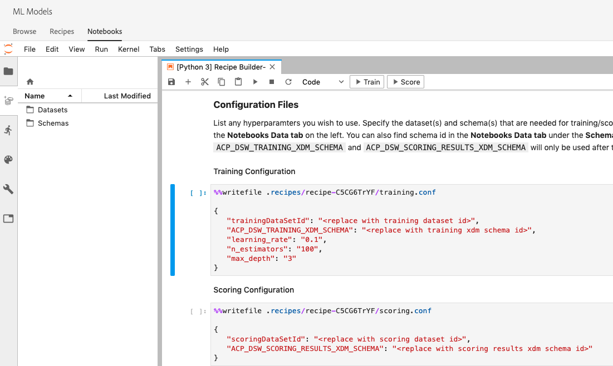

# 使用Jupyter笔记本创建菜谱

本教程将分两个主要部分。 首先，您将使用JupyterLab Notebook中的模板创建机器学习模型。 接下来，您将在JupyterLab中练习笔记本到菜谱工作流程，以在Data Science Workspace中创建菜谱。
- [开始使用JupyterLab笔记本环境](#get-started-with-the-jupyterlab-notebook-environment)
- [编辑菜谱文件](#make-edits-to-recipe-files)
- [Recipe Builder笔记本入门](#get-started-with-the-recipe-builder-notebook)
   - [要求文件](#requirements-file)
   - [配置文件](#configuration-files)
   - [培训数据加载器](#training-data-loader)
   - [评分数据加载器](#scoring-data-loader)
   - [管线文件](#pipeline-file)
   - [求值器文件](#evaluator-file)
   - [数据保护程序文件](#data-saver-file)
- [培训和评分](#training-and-scoring)
- [创建菜谱](#create-recipe)

## 引入的概念：

- **菜谱：** 菜谱是Adobe的模型规范术语，是表示特定机器学习、AI算法或集成算法、处理逻辑和配置的顶级容器，构建和执行经过培训的模型所需，因此有助于解决特定的业务问题。
- **模型：** 模型是机器学习菜谱的实例，该菜谱使用历史数据和配置来训练以解决业务用例。
- **培训：** 培训是从标记数据学习模式和洞察的过程。
- **评分：** 评分是使用经过培训的模型从数据中生成洞察的过程。

## 开始使用JupyterLab笔记本环境

从头开始创建菜谱可在Data Science Workspace中完成。 要进行开始，请导航到 [Adobe Experience Platform](https://platform.adobe.com) ，然后单击左侧的“ **ML模型** ”选项卡，以转到数据科学工作区。 在此处，单击“笔记本 **电脑** ”子选项卡，在Jupyterlab启动器屏幕上，通过选择Recipe Builder模板创建新笔记本。

Recipe Builder笔记本电脑允许您在笔记本内运行培训和评分。 这使您能够灵活地在对培训和评分数据 `train()` 运行 `score()` 实验之间更改其和方法。 在您满意培训和评分的输出后，您可以创建一个菜谱，以便在Data Science Workspace中使用，该菜谱使用笔记本创建菜谱功能，该功能内置于Recipe Builder笔记本中。

>[!NOTE] Recipe Builder笔记本电脑支持使用所有文件格式，但目前“创建菜谱”功能仅支持Python。


单击启动器中的Recipe Builder笔记本时，该笔记本将在选项卡中打开。 笔记本中使用的模板是Python Retail Sales Forecasting Recipe，也可以在此公共存储库 [中找到它](https://github.com/adobe/experience-platform-dsw-reference/tree/master/recipes/python/retail/)

您会注意到，在工具栏中还有三个其他操作，即 **培训**、 **得分** 和 **创建菜谱**。 这些图标将仅显示在Recipe Builder笔记本中。 在笔记本中构建菜谱后，有关这些操 [作的更多信息将在培训和评分部分介绍](#training-and-scoring) 。


## 编辑菜谱文件

<!-- Databricks update to recipe needed -->
要编辑菜谱文件，请导航到Jupyter中与文件路径对应的单元格。 例如，如果要更改，请 `evaluator.py`查找 `%%writefile demo-recipe/evaluator.py`。

开始对单元格进行必要的更改，完成后，只需运行单元格。 该 `%%writefile filename.py` 命令将单元格的内容写入 `filename.py`。 您必须手动为每个包含更改的文件运行单元格。

>[!NOTE] 如果适用，您应手动运行单元格。

## Recipe Builder笔记本入门

既然您了解了JupyterLab笔记本环境的基础知识，就可以开始查看构成机器学习模型菜谱的文件。 我们将讨论的文件如下：

- [要求文件](#requirements-file)
- [配置文件](#configuration-files)
- [培训数据加载器](#training-data-loader)
- [评分数据加载器](#scoring-data-loader)
- [管线文件](#pipeline-file)
- [求值器文件](#evaluator-file)
- [数据保护程序文件](#data-saver-file)


### 要求文件

要求文件用于声明您希望在菜谱中使用的其他库。 如果存在依赖关系，则可以指定版本号。 要查找其他库，请访问https://anaconda.org。 正在使用的主要库的列表包括：

```JSON
python=3.5.2
scikit-learn
pandas
numpy
data_access_sdk_python
```

>[!NOTE] 您添加的库或特定版本可能与上述库不兼容。


### 配置文件

配置文件和 `training.conf` 用 `scoring.conf`于指定要用于培训和评分的数据集以及添加超参数。 培训和评分有不同的配置。

用户在运行培训和评分之前必须填写以下变量：
- `trainingDataSetId`
- `ACP_DSW_TRAINING_XDM_SCHEMA`
- `scoringDataSetId`
- `ACP_DSW_SCORING_RESULTS_XDM_SCHEMA`
- `scoringResultsDataSetId`

要查找数据集和模式ID，请转到左侧导航栏（文件夹图标下）笔记本电脑中的数据选项卡。



在 [Adobe Experience Platform上的“模式”和“数据集](https://platform.adobe.com/) ”选项卡下可 **[找到相同](https://platform.adobe.com/schema)**的信息**[](https://platform.adobe.com/dataset/overview)** 。

默认情况下，在访问数据时会为您设置以下配置参数：

- `ML_FRAMEWORK_IMS_USER_CLIENT_ID`
- `ML_FRAMEWORK_IMS_TOKEN`
- `ML_FRAMEWORK_IMS_ML_TOKEN`
- `ML_FRAMEWORK_IMS_TENANT_ID`


## 培训数据加载器

培训数据加载器的目的是实例化用于创建机器学习模型的数据。 通常，培训数据加载器将完成以下两个任务:
- 从平台加载数据
- 数据准备和功能工程

以下两个部分将重新加载数据和准备数据。

### 加载数据

这一步使用了 [熊猫数据框](https://pandas.pydata.org/pandas-docs/stable/generated/pandas.DataFrame.html)。 可以使用Platform SDK(`platform_sdk`)从Adobe Experience Platform中的文件加载数据，或使用熊猫的或功能从外部源 `read_csv()` 加载 `read_json()` 数据。

- [Platform SDK](#platform-sdk)
- [外部来源](#external-sources)

>[!NOTE] 在Recipe Builder笔记本中，数据通过数据加载器 `platform_sdk` 加载。

### Platform SDK

有关使用数据加载器的详细教 `platform_sdk` 程，请访问 [Platform SDK指南](../authoring/platform-sdk.md)。 本教程提供有关构建身份验证、基本读取数据和基本写入数据的信息。

### 外部来源

本节将向您介绍如何将JSON或CSV文件导入到熊猫对象。 熊猫图书馆的官方文件可在此处找到：
- [read_csv](https://pandas.pydata.org/pandas-docs/stable/generated/pandas.read_csv.html)
- [read_json](https://pandas.pydata.org/pandas-docs/stable/generated/pandas.read_json.html)

首先，此处是导入CSV文件的示例。 参 `data` 数是CSV文件的路径。 此变量是从上一节 `configProperties` 中导 [入的](#configuration-files)。

```PYTHON
df = pd.read_csv(data)
```

您还可以从JSON文件导入。 参 `data` 数是CSV文件的路径。 此变量是从上一节 `configProperties` 中导 [入的](#configuration-files)。

```PYTHON
df = pd.read_json(data)
```

现在，您的数据位于数据帧对象中，可在下一节中分析和 [处理](#data-preparation-and-feature-engineering)。


### 从Data Access SDK（已弃用）

>[!CAUTION]  不 `data_access_sdk_python` 再推荐，请参阅将 [数据访问代码转换为Platform SDK](../authoring/platform-sdk.md) ，以获取有关使用数据加载器的 `platform_sdk` 指南。

用户可以使用数据访问SDK加载数据。 通过包含以下行，可以在页面顶部导入库：

`from data_access_sdk_python.reader import DataSetReader`

然后，我们 `load()` 使用该方法从配置()文 `trainingDataSetId` 件中的集合中获取培训数据集`recipe.conf`。

```PYTHON
prodreader = DataSetReader(client_id=configProperties['ML_FRAMEWORK_IMS_USER_CLIENT_ID'],
                           user_token=configProperties['ML_FRAMEWORK_IMS_TOKEN'],
                           service_token=configProperties['ML_FRAMEWORK_IMS_ML_TOKEN'])

df = prodreader.load(data_set_id=configProperties['trainingDataSetId'],
                     ims_org=configProperties['ML_FRAMEWORK_IMS_TENANT_ID'])
```

>[!NOTE] 如配置文 [件部分所述](#configuration-files)，当您从Experience Platform访问数据时，会为您设置以下配置参数：
> - `ML_FRAMEWORK_IMS_USER_CLIENT_ID`
> - `ML_FRAMEWORK_IMS_TOKEN`
> - `ML_FRAMEWORK_IMS_ML_TOKEN`
> - `ML_FRAMEWORK_IMS_TENANT_ID`


现在您掌握了数据，您可以从数据准备和功能设计开始。

### 数据准备和功能工程

在加载数据后，数据进行准备，然后被拆分到数据集 `train` 和数 `val` 据集。 示例代码如下所示：

```PYTHON
#########################################
# Data Preparation/Feature Engineering
#########################################
dataframe.date = pd.to_datetime(dataframe.date)
dataframe['week'] = dataframe.date.dt.week
dataframe['year'] = dataframe.date.dt.year

dataframe = pd.concat([dataframe, pd.get_dummies(dataframe['storeType'])], axis=1)
dataframe.drop('storeType', axis=1, inplace=True)
dataframe['isHoliday'] = dataframe['isHoliday'].astype(int)

dataframe['weeklySalesAhead'] = dataframe.shift(-45)['weeklySales']
dataframe['weeklySalesLag'] = dataframe.shift(45)['weeklySales']
dataframe['weeklySalesDiff'] = (dataframe['weeklySales'] - dataframe['weeklySalesLag']) / dataframe['weeklySalesLag']
dataframe.dropna(0, inplace=True)

dataframe = dataframe.set_index(dataframe.date)
dataframe.drop('date', axis=1, inplace=True) 
```

在此示例中，对原始数据集执行了五项操作：
- 添加 `week` 和列 `year`
- 转换 `storeType` 为指示符变量
- 转换 `isHoliday` 为数字变量
- 抵销 `weeklySales` 未来及过往销售价值
- 按日期拆分数据至数 `train` 据 `val` 集

首先，创 `week` 建和 `year` 列，并将原始列转 `date` 换为Python日 [期时间](https://pandas.pydata.org/pandas-docs/stable/generated/pandas.to_datetime.html)。 周值和年值从日期时间对象中提取。

接下来， `storeType` 将转换为表示三种不同存储类型(`A`、 `B`和)的三列 `C`。 每个值都将包含一个布尔值，以状态 `storeType` 为true。 将 `storeType` 删除该列。

同样，将 `weeklySales` 布尔值更 `isHoliday` 改为数字表示形式（1或0）。

此数据分为数据 `train` 集和 `val` 数据集。

函 `load()` 数应以和数据集 `train` 作为 `val` 输出。

### 评分数据加载器

加载用于评分的数据的过程类似于在函数中加载培训数 `split()` 据。 我们使用Data Access SDK从我们文件中的 `scoringDataSetId` 位置加载数 `recipe.conf` 据。

```PYTHON
def load(configProperties):

    print("Scoring Data Load Start")

    #########################################
    # Load Data
    #########################################
    prodreader = DataSetReader(client_id=configProperties['ML_FRAMEWORK_IMS_USER_CLIENT_ID'],
                               user_token=configProperties['ML_FRAMEWORK_IMS_TOKEN'],
                               service_token=configProperties['ML_FRAMEWORK_IMS_ML_TOKEN'])

    df = prodreader.load(data_set_id=configProperties['scoringDataSetId'],
                         ims_org=configProperties['ML_FRAMEWORK_IMS_TENANT_ID'])
```

在加载数据后，进行数据准备和特征工程。

```PYTHON
#########################################
# Data Preparation/Feature Engineering
#########################################
df.date = pd.to_datetime(df.date)
df['week'] = df.date.dt.week
df['year'] = df.date.dt.year

df = pd.concat([df, pd.get_dummies(df['storeType'])], axis=1)
df.drop('storeType', axis=1, inplace=True)
df['isHoliday'] = df['isHoliday'].astype(int)

df['weeklySalesAhead'] = df.shift(-45)['weeklySales']
df['weeklySalesLag'] = df.shift(45)['weeklySales']
df['weeklySalesDiff'] = (df['weeklySales'] - df['weeklySalesLag']) / df['weeklySalesLag']
df.dropna(0, inplace=True)

df = df.set_index(df.date)
df.drop('date', axis=1, inplace=True)

print("Scoring Data Load Finish")

return df
```

由于我们模型的目的是预测未来每周的销售，因此您需要创建一个评分数据集来评估模型的预测效果。

此Recipe Builder笔记本电脑通过抵消我们每周7天的远期销售额实现了这一点。 请注意，每周有45个商店的测量值，因此您可以将45个数据集 `weeklySales` 的值转发到一个名为的新列中 `weeklySalesAhead`。

```PYTHON
df['weeklySalesAhead'] = df.shift(-45)['weeklySales']
```

同样，您也可以通过向后移45 `weeklySalesLag` 来创建列。 使用此选项，您还可以计算每周销售额的差额，并将其存储在列中 `weeklySalesDiff`。

```PYTHON
df['weeklySalesLag'] = df.shift(45)['weeklySales']
df['weeklySalesDiff'] = (df['weeklySales'] - df['weeklySalesLag']) / df['weeklySalesLag']
```

由于您正在向前偏移45个数据 `weeklySales` 点和向后偏移45个数据集以创建新列，因此前45个和最后45个数据点将具有NaN值。 您可以使用函数从数据集中删除这些点，该函 `df.dropna()` 数会删除所有具有NaN值的行。

```PYTHON
df.dropna(0, inplace=True)
```

评分 `load()` 数据加载器中的函数应以评分数据集作为输出。


### 管线文件

该文 `pipeline.py` 件包括用于培训和评分的逻辑。 接下来的两节我们将对这两个部分进行介绍。

### 培训

培训的目的是使用培训数据集中的功能和标签创建一个模型。

>[!NOTE]  功 _能_ ，是指机器学习模型用来预测标签的输入变 _量_。

该功 `train()` 能应包括训练模型，并返回训练模型。 不同型号的一些示例可在 [scikit-learn用户指南文档中找到](https://scikit-learn.org/stable/user_guide.html)。

在选择培训模型后，您会将x和y培训数据集拟合到该模型中，该函数将返回该培训模型。 显示此情况的示例如下：

```PYTHON
def train(configProperties, data):

    print("Train Start")

    #########################################
    # Extract fields from configProperties
    #########################################
    learning_rate = float(configProperties['learning_rate'])
    n_estimators = int(configProperties['n_estimators'])
    max_depth = int(configProperties['max_depth'])


    #########################################
    # Fit model
    #########################################
    X_train = data.drop('weeklySalesAhead', axis=1).values
    y_train = data['weeklySalesAhead'].values

    seed = 1234
    model = GradientBoostingRegressor(learning_rate=learning_rate,
                                      n_estimators=n_estimators,
                                      max_depth=max_depth,
                                      random_state=seed)

    model.fit(X_train, y_train)

    print("Train Complete")

    return model
```

请注意，根据您的应用程序，您的函数中将包含参数 `GradientBoostingRegressor()` 。 `xTrainingDataset` 应包含用于培训的功能，而应 `yTrainingDataset` 包含您的标签。


### 评分

该函 `score()` 数应包含评分算法并返回一个度量，以指示模型执行的成功程度。 该函 `score()` 数使用评分数据集标签和训练的模型来生成一组预测特征。 然后，将这些预测值与评分数据集中的实际特征进行比较。 在此示例中，函数使 `score()` 用经过训练的模型来使用评分数据集中的标签来预测特征。 返回预测特征。

```PYTHON
def score(configProperties, data, model):

    print("Score Start")

    X_test = data.drop('weeklySalesAhead', axis=1).values
    y_test = data['weeklySalesAhead'].values
    y_pred = model.predict(X_test)

    data['prediction'] = y_pred
    data = data[['store', 'prediction']].reset_index()
    data['date'] = data['date'].astype(str)

    print("Score Complete")

    return data
```

### 求值器文件

该 `evaluator.py` 文件包含如何评估培训菜谱以及如何拆分培训数据的逻辑。 在零售销售示例中，将包括加载和准备培训数据的逻辑。 我们将浏览以下两节。

### 拆分数据集

培训的数据准备阶段需要拆分要用于培训和测试的数据集。 该数 `val` 据在训练后将被隐式用于评估模型。 此过程与评分分开。

此部分将显示首 `split()` 先将数据加载到笔记本中，然后通过删除数据集中不相关的列来清理数据的函数。 从那里，您将能够执行功能工程，即根据数据中的现有原始功能创建其他相关功能的过程。 下面显示了此过程的示例和说明。

函 `split()` 数如下所示。 参数中提供的数据帧将拆分为要返 `train` 回 `val` 的和变量。

```PYTHON
def split(self, configProperties={}, dataframe=None):
    train_start = '2010-02-12'
    train_end = '2012-01-27'
    val_start = '2012-02-03'
    train = dataframe[train_start:train_end]
    val = dataframe[val_start:]

    return train, val
```

### 评估培训的模型

该函 `evaluate()` 数在模型训练后执行，并将返回一个度量来指示模型执行的成功程度。 该函 `evaluate()` 数使用测试数据集标签和“培训”模型来预测一组特征。 然后，将这些预测值与测试数据集中的实际特征进行比较。 常见评分算法包括：
- [平均绝对百分比误差(MAPE)](https://en.wikipedia.org/wiki/Mean_absolute_percentage_error)
- [平均绝对误差(MAE)](https://en.wikipedia.org/wiki/Mean_absolute_error)
- [均方根误差](https://en.wikipedia.org/wiki/Root-mean-square_deviation)


零售 `evaluate()` 销售范例中的功能如下：

```PYTHON
def evaluate(self, data=[], model={}, configProperties={}):
    print ("Evaluation evaluate triggered")
    val = data.drop('weeklySalesAhead', axis=1)
    y_pred = model.predict(val)
    y_actual = data['weeklySalesAhead'].values
    mape = np.mean(np.abs((y_actual - y_pred) / y_actual))
    mae = np.mean(np.abs(y_actual - y_pred))
    rmse = np.sqrt(np.mean((y_actual - y_pred) ** 2))

    metric = [{"name": "MAPE", "value": mape, "valueType": "double"},
                {"name": "MAE", "value": mae, "valueType": "double"},
                {"name": "RMSE", "value": rmse, "valueType": "double"}]

    return metric
```

请注意，该函数返回一个 `metric` 包含一组评估度量的对象。 这些指标将用于评估经过培训的模型的表现。

### 数据保护程序文件

该文 `datasaver.py` 件包含在测 `save()` 试评分时保存预测的函数。 该函 `save()` 数将执行您的预测，并使用Experience Platform Catalog API，将数据写入您在文 `scoringResultsDataSetId` 件中指定的 `scoring.conf` 值。

此处显示了零售销售示例菜谱中使用的示例。 请注意使用库 `DataSetWriter` 将数据写入平台：

```PYTHON
from data_access_sdk_python.writer import DataSetWriter

def save(configProperties, prediction):
    print("Datasaver Start")
    print("Setting up Writer")

    catalog_url = "https://platform.adobe.io/data/foundation/catalog"
    ingestion_url = "https://platform.adobe.io/data/foundation/import"

    writer = DataSetWriter(catalog_url=catalog_url,
                           ingestion_url=ingestion_url,
                           client_id=configProperties['ML_FRAMEWORK_IMS_USER_CLIENT_ID'],
                           user_token=configProperties['ML_FRAMEWORK_IMS_TOKEN'],
                           service_token=configProperties['ML_FRAMEWORK_IMS_ML_TOKEN'])

    print("Writer Configured")

    writer.write(data_set_id=configProperties['scoringResultsDataSetId'],
                 dataframe=prediction,
                 ims_org=configProperties['ML_FRAMEWORK_IMS_TENANT_ID'])

    print("Write Done")
    print("Datasaver Finish")
    print(prediction)
```


## 培训和评分

在对笔记本进行更改并要培训菜谱后，您可以单击栏顶部的关联按钮在单元格中创建培训运行。 单击该按钮后，培训脚本的命令和输出日志将显示在笔记本(位于单元 `evaluator.py` 格下)中。 Conda首先安装所有依赖项，然后开始培训。

请注意，您必须至少运行一次培训才能运行评分。 单击“运 **行评分** ”按钮将对培训期间生成的培训模型进行得分。 评分脚本将显示在下 `datasaver.py`面。

出于调试目的，如果您希望看到隐藏的输出，请将 `debug` 其添加到输出单元格的末尾，然后重新运行它。

## 创建菜谱

编辑菜谱并对培训／评分输出满意后，您可以按“创建菜谱”从笔记本创建菜 **谱**。 按下按钮后，将提示您输入菜谱名称。 此名称将表示在平台上创建的实际菜谱。


按“确 **定** ”后，您将能够导航到 [Adobe Experience Platform上的新菜谱](https://platform.adobe.com/)。 您可以单击“ **视图菜谱** ”按钮，转到“ML模型”下的“ **菜谱****”选项卡**


一旦该过程完成，菜谱将类似于：


>[!CAUTION]
> - 请勿删除任何文件单元格
> - 请勿编辑文 `%%writefile` 件单元格顶部的行
> - 请勿同时在不同的笔记本电脑中创建菜谱


## 后续步骤

通过完成本教程，您学习了如何在Recipe Builder笔记本中创建机器学习模型。 您还学习了如何在笔记本电脑中练习笔记本到菜谱工作流程，以在Data Science Workspace中创建菜谱。

要继续学习如何在Data Science Workspace中使用资源，请访问Data Science Workspace方法和模型下拉列表。

## Journey Orchestration

以下视频旨在支持您对构建和部署模型的理解。

>[!VIDEO](https://video.tv.adobe.com/v/30575?quality=12&enable10seconds=on&speedcontrol=on)


