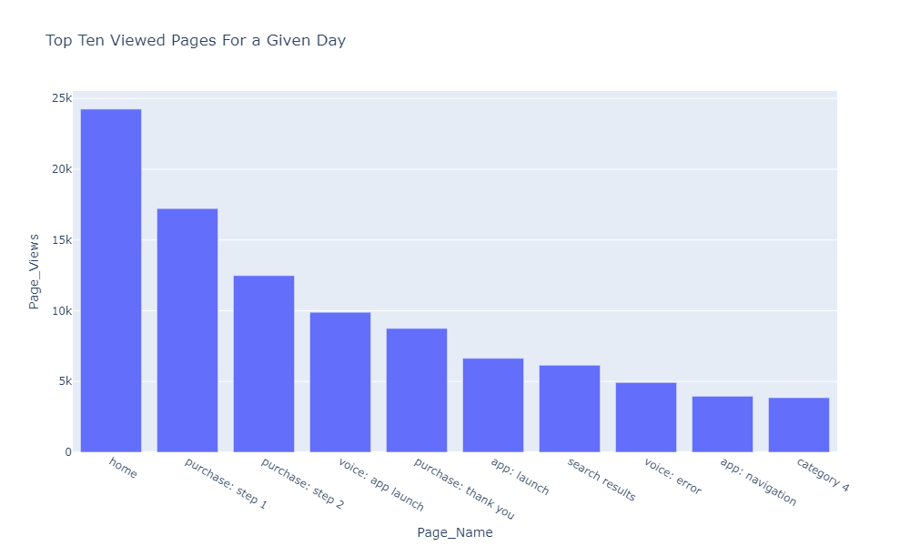
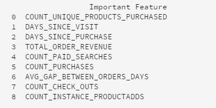

# 使用探索数据分析(EDA)笔记本探索预测模型的基于Web的数据

>[!NOTE]
>
>数据科学Workspace不再可供购买。
>
>本文档面向之前有权访问数据科学Workspace的现有客户。

探索数据分析(EDA)笔记本旨在帮助您发现数据模式、检查数据健全度以及总结预测模型的相关数据。

针对EDA笔记本实例进行了基于Web的数据优化。 第一部分从使用查询服务查看趋势和数据快照开始。 接下来，考虑到探索性数据分析的目标，在个人资料和访客级别聚合数据。

第二部分从使用Python库对聚合数据执行描述性分析开始。 此笔记本展示一些可视化图表，如直方图、散点图、方框图和关联矩阵，从中可得出可用于确定哪些功能最可能有助于预测目标的可操作洞察。

## 快速入门

在阅读本指南之前，请查看[[!DNL JupyterLab] 用户指南](./overview.md)，以详细了解[!DNL JupyterLab]及其在数据科学Workspace中的角色。 此外，如果您使用自己的数据，请查阅 [!DNL Jupyterlab] 笔记本[&#128279;](./access-notebook-data.md)中数据访问的文档。 本指南包含有关笔记本数据限制的重要信息。

此笔记本使用Analytics Analysis Workspace中的Adobe Analytics Experience Events数据形式的中值数据集。 要使用EDA笔记本，您需要使用以下值`target_table`和`target_table_id`定义数据表。 可以使用任何中间值数据集。

要查找这些值，请按照JupyterLab数据访问指南的[写入python中的数据集](./access-notebook-data.md#write-python)部分中所述的步骤进行操作。 数据集名称(`target_table`)位于数据集目录中。 右键单击数据集以在笔记本中浏览或写入数据后，可执行代码条目中会提供一个数据集ID (`target_table_id`)。

## 数据发现

本节包含用于查看趋势（如“按用户活动划分的前十个城市”或“查看的前10个产品”）的配置步骤和示例查询。

### 库配置

JupyterLab支持多个库。 可以在代码单元格中粘贴和运行以下代码，以收集并安装此示例中使用的所有必需包。 您可以在本示例之外使用其他或替代包进行您自己的数据分析。 有关支持的包的列表，请将`!pip list --format=columns`复制并粘贴到新单元格中。

```python
!pip install colorama
import chart_studio.plotly as py
import plotly.graph_objs as go
from plotly.offline import iplot
from scipy import stats
import numpy as np
import warnings
warnings.filterwarnings('ignore')
from scipy.stats import pearsonr
import matplotlib.pyplot as plt
from scipy.stats import pearsonr
import pandas as pd
import math
import re
import seaborn as sns
from datetime import datetime
import colorama
from colorama import Fore, Style
pd.set_option('display.max_columns', None)
pd.set_option('display.max_rows', None)
pd.set_option('display.width', 1000)
pd.set_option('display.expand_frame_repr', False)
pd.set_option('display.max_colwidth', -1)
```

### 连接到Adobe Experience Platform [!DNL Query Service]

Experience Platform上的[!DNL JupyterLab]允许您使用[!DNL Python]笔记本中的SQL通过[查询服务](https://www.adobe.com/go/query-service-home-en)访问数据。 通过[!DNL Query Service]访问数据对于处理大型数据集很有用，因为其运行时间较长。 请注意，使用[!DNL Query Service]查询数据的处理时间限制为10分钟。

在[!DNL JupyterLab]中使用[!DNL Query Service]之前，请确保您对[[!DNL Query Service] SQL语法](https://www.adobe.com/go/query-service-sql-syntax-en)有一定的了解。

要在JupyterLab中使用查询服务，必须先在正在工作的Python笔记本和查询服务之间创建连接。 可以通过执行以下单元格来实现这一点。

```python
qs_connect()
```

### 定义用于探索的中值数据集

要开始查询和浏览数据，必须提供中间值数据集表。 将`table_name`和`table_id`值复制并替换为您自己的数据表值。

```python
target_table = "table_name"
target_table_id = "table_id"
```

完成后，此单元格应该类似于以下示例：

```python
target_table = "cross_industry_demo_midvalues"
target_table_id = "5f7c40ef488de5194ba0157a"
```

### 浏览数据集以查看可用日期

使用下面提供的单元格，您可以查看表中包含的日期范围。 探索天数、第一个日期和最后一个日期的目的是帮助选择日期范围以供进一步分析。

```python
%%read_sql -c QS_CONNECTION
SELECT distinct Year(timestamp) as Year, Month(timestamp) as Month, count(distinct DAY(timestamp)) as Count_days, min(DAY(timestamp)) as First_date, max(DAY(timestamp)) as Last_date, count(timestamp) as Count_hits
from {target_table}
group by Month(timestamp), Year(timestamp)
order by Year, Month;
```

运行单元格将产生以下输出：


### 配置数据集发现日期

在确定数据集发现的可用日期后，需要更新以下参数。 在此单元格中配置的日期仅用于查询形式的数据发现。 日期将再次更新到适合的范围，以便在本指南的后面部分进行探索性数据分析。

```python
target_year = "2020" ## The target year
target_month = "02" ## The target month
target_day = "(01,02,03)" ## The target days
```

### 数据集发现

配置完所有参数、启动[!DNL Query Service]并设定日期范围后，即可开始读取数据行。 您应该限制读取的行数。

```python
from platform_sdk.dataset_reader import DatasetReader
from datetime import date
dataset_reader = DatasetReader(PLATFORM_SDK_CLIENT_CONTEXT, dataset_id=target_table_id)
# If you do not see any data or would like to expand the default date range, change the following query
Table = dataset_reader.limit(5).read()
```

要查看数据集中可用的列数，请使用以下单元格：

```python
print("\nNumber of columns:",len(Table.columns))
```

要查看数据集的行，请使用以下单元格。 在此示例中，行数限制为5。

```python
Table.head(5)
```


了解数据集中包含哪些数据后，进一步划分数据集会很有价值。 在此示例中，列出了每个列的列名和数据类型，而输出用于检查数据类型是否正确。

```python
ColumnNames_Types = pd.DataFrame(Table.dtypes)
ColumnNames_Types = ColumnNames_Types.reset_index()
ColumnNames_Types.columns = ["Column_Name", "Data_Type"]
ColumnNames_Types
```


### 数据集趋势探究

以下部分包含四个用于探索数据趋势和模式的示例查询。 下面提供的示例并非详尽无遗，但涵盖了一些更常见的功能。

给定日期的&#x200B;**小时活动计数**

此查询分析一天内操作和点击的次数。 输出以表的形式表示，其中包含一天中每个小时的活动计数量度。

```sql
%%read_sql query_2_df -c QS_CONNECTION

SELECT Substring(timestamp, 12, 2)                        AS Hour, 
       Count(enduserids._experience.aaid.id) AS Count 
FROM   {target_table}
WHERE  Year(timestamp) = {target_year} 
       AND Month(timestamp) = {target_month}  
       AND Day(timestamp) in {target_day}
GROUP  BY Hour
ORDER  BY Hour;
```


确认查询工作后，数据可以呈现在单变量直方图中，以便更加清晰地显示。

```python
trace = go.Bar(
    x = query_2_df['Hour'],
    y = query_2_df['Count'],
    name = "Activity Count"
)

layout = go.Layout(
    title = 'Activity Count by Hour of Day',
    width = 1200,
    height = 600,
    xaxis = dict(title = 'Hour of Day'),
    yaxis = dict(title = 'Count')
)

fig = go.Figure(data = [trace], layout = layout)
iplot(fig)
```

查询1的条形图输出

**给定日期查看的前10个页面**

此查询分析给定日期内查看次数最多的页面。 输出以表的形式表示，表中包含有关页面名称和页面查看次数的量度。

```sql
%%read_sql query_4_df -c QS_CONNECTION

SELECT web.webpagedetails.name                 AS Page_Name, 
       Sum(web.webpagedetails.pageviews.value) AS Page_Views 
FROM   {target_table}
WHERE  Year(timestamp) = {target_year}
       AND Month(timestamp) = {target_month}
       AND Day(timestamp) in {target_day}
GROUP  BY web.webpagedetails.name 
ORDER  BY page_views DESC 
LIMIT  10;
```

确认查询工作后，数据可以呈现在单变量直方图中，以便更加清晰地显示。

```python
trace = go.Bar(
    x = query_4_df['Page_Name'],
    y = query_4_df['Page_Views'],
    name = "Page Views"
)

layout = go.Layout(
    title = 'Top Ten Viewed Pages For a Given Day',
    width = 1000,
    height = 600,
    xaxis = dict(title = 'Page_Name'),
    yaxis = dict(title = 'Page_Views')
)

fig = go.Figure(data = [trace], layout = layout)
iplot(fig)
```



**按用户活动分组的前10个城市**

此查询分析数据来自哪些城市。

```sql
%%read_sql query_6_df -c QS_CONNECTION

SELECT concat(placeContext.geo.stateProvince, ' - ', placeContext.geo.city) AS state_city, 
       Count(timestamp)                                                     AS Count
FROM   {target_table}
WHERE  Year(timestamp) = {target_year}
       AND Month(timestamp) = {target_month}
       AND Day(timestamp) in {target_day}
GROUP  BY state_city
ORDER  BY Count DESC
LIMIT  10;
```

确认查询工作后，数据可以呈现在单变量直方图中，以便更加清晰地显示。

```python
trace = go.Bar(
    x = query_6_df['state_city'],
    y = query_6_df['Count'],
    name = "Activity by City"
)

layout = go.Layout(
    title = 'Top Ten Cities by User Activity',
    width = 1200,
    height = 600,
    xaxis = dict(title = 'City'),
    yaxis = dict(title = 'Count')
)

fig = go.Figure(data = [trace], layout = layout)
iplot(fig)
```


**查看的十大产品**

此查询提供查看的前10个产品的列表。 在下面的示例中，`Explode()`函数用于将`productlistitems`对象中的每个产品返回到其自己的行。 这样，您就可以执行嵌套查询来聚合不同SKU的产品视图。

```sql
%%read_sql query_7_df -c QS_CONNECTION

SELECT Product_List_Items.sku AS Product_SKU,
       Sum(Product_Views) AS Total_Product_Views
FROM  (SELECT Explode(productlistitems) AS Product_List_Items, 
              commerce.productviews.value   AS Product_Views 
       FROM   {target_table}
       WHERE  Year(timestamp) = {target_year}
              AND Month(timestamp) = {target_month}
              AND Day(timestamp) in {target_day}
              AND commerce.productviews.value IS NOT NULL) 
GROUP BY Product_SKU 
ORDER BY Total_Product_Views DESC
LIMIT  10;
```

确认查询工作后，数据可以呈现在单变量直方图中，以便更加清晰地显示。

```python
trace = go.Bar(
    x = "SKU-" + query_7_df['Product_SKU'],
    y = query_7_df['Total_Product_Views'],
    name = "Product View"
)

layout = go.Layout(
    title = 'Top Ten Viewed Products',
    width = 1200,
    height = 600,
    xaxis = dict(title = 'SKU'),
    yaxis = dict(title = 'Product View Count')
)

fig = go.Figure(data = [trace], layout = layout)
iplot(fig)
```


在探索数据的趋势和模式后，您应该清楚知道要为预测目标而构建哪些功能。 快速浏览表格可以快速突出显示每个数据属性的形式、明显的错误表示和值中的大型离群值，并开始建议候选关系以探索属性之间的关系。

## 探索性数据分析

探索性数据分析用于提高您对数据情况的了解，并帮助您直觉地回答可用作建模基础的紧迫问题。

完成数据发现步骤后，您将会在事件级别探索数据，以及事件、城市或用户ID级别的一些聚合，以查看一天内的趋势。 虽然这些数据很重要，但它并未提供完整的资料。 您仍然不了解是什么促使您在网站上进行购买。

要理解这一点，您需要聚合用户档案/访客级别的数据，定义购买目标，并应用统计概念，如关联、框图和散点图。 这些方法用于在您定义的预测窗口中比较购买者与非购买者的活动模式。

本节将创建并探讨以下功能：

- `COUNT_UNIQUE_PRODUCTS_PURCHASED`：购买的唯一产品数。
- `COUNT_CHECK_OUTS`：结帐次数。
- `COUNT_PURCHASES`：购买次数。
- `COUNT_INSTANCE_PRODUCTADDS`：产品添加实例数。
- `NUMBER_VISITS`：访问次数。
- `COUNT_PAID_SEARCHES`：付费搜索的次数。
- `DAYS_SINCE_VISIT`：自上次访问以来的天数。
- `TOTAL_ORDER_REVENUE`：总订单收入。
- `DAYS_SINCE_PURCHASE`：自上次购买以来的天数。
- `AVG_GAP_BETWEEN_ORDERS_DAYS`：购买之间的平均间隔（以天为单位）。
- `STATE_CITY`：包含州和市。

在继续数据聚合之前，您需要定义用于探索性数据分析的预测变量的参数。 换句话说，您想要从数据科学模型中获取什么？ 常用参数包括目标、预测时段和分析时段。

如果您使用的是EDA笔记本，则需要在继续之前替换以下值。

```python
goal = "commerce.`order`.purchaseID" #### prediction variable
goal_column_type = "numerical" #### choose either "categorical" or "numerical"
prediction_window_day_start = "2020-01-01" #### YYYY-MM-DD
prediction_window_day_end = "2020-01-31" #### YYYY-MM-DD
analysis_period_day_start = "2020-02-01" #### YYYY-MM-DD
analysis_period_day_end = "2020-02-28" #### YYYY-MM-DD

### If the goal is a categorical goal then select threshold for the defining category and creating bins. 0 is no order placed, and 1 is at least one order placed:
threshold = 1
```

### 用于创建功能和目标的数据聚合

要开始探索性分析，您需要在用户档案级别创建目标，然后聚合数据集。 在此示例中，提供了两个查询。 第一个查询包含创建目标。 第二个查询需要更新，以包含第一个查询中的变量以外的任何变量。 您可能需要更新查询的`limit`。 在执行以下查询后，聚合数据现在可用于探索。

```sql
%%read_sql target_df -d -c QS_CONNECTION

SELECT DISTINCT endUserIDs._experience.aaid.id                  AS ID,
       Count({goal})                                            AS TARGET
FROM   {target_table}
WHERE DATE(TIMESTAMP) BETWEEN '{prediction_window_day_start}' AND '{prediction_window_day_end}'
GROUP BY endUserIDs._experience.aaid.id;
```

```sql
%%read_sql agg_data -d -c QS_CONNECTION

SELECT z.*, z1.state_city as STATE_CITY
from
((SELECT y.*,a2.AVG_GAP_BETWEEN_ORDERS_DAYS as AVG_GAP_BETWEEN_ORDERS_DAYS
from
(select a1.*, f.DAYS_SINCE_PURCHASE as DAYS_SINCE_PURCHASE
from
(SELECT DISTINCT a.ID  AS ID,
COUNT(DISTINCT Product_Items.SKU) as COUNT_UNIQUE_PRODUCTS_PURCHASED,
COUNT(a.check_out) as COUNT_CHECK_OUTS,
COUNT(a.purchases) as COUNT_PURCHASES, 
COUNT(a.product_list_adds) as COUNT_INSTANCE_PRODUCTADDS,
sum(CASE WHEN a.search_paid = 'TRUE' THEN 1 ELSE 0 END) as COUNT_PAID_SEARCHES,
DATEDIFF('{analysis_period_day_end}', MAX(a.date_a)) as DAYS_SINCE_VISIT,
ROUND(SUM(Product_Items.priceTotal * Product_Items.quantity), 2) AS TOTAL_ORDER_REVENUE
from 
(SELECT endUserIDs._experience.aaid.id as ID,
commerce.`checkouts`.value as check_out,
commerce.`order`.purchaseID as purchases, 
commerce.`productListAdds`.value as product_list_adds,
search.isPaid as search_paid,
DATE(TIMESTAMP) as date_a,
Explode(productlistitems) AS Product_Items
from {target_table}
Where DATE(TIMESTAMP) BETWEEN '{analysis_period_day_start}' AND '{analysis_period_day_end}') as a
group by a.ID) as a1
left join 
(SELECT DISTINCT endUserIDs._experience.aaid.id as ID,
DATEDIFF('{analysis_period_day_end}', max(DATE(TIMESTAMP))) as DAYS_SINCE_PURCHASE
from {target_table}
where DATE(TIMESTAMP) BETWEEN '{analysis_period_day_start}' AND '{analysis_period_day_end}'
and commerce.`order`.purchaseid is not null
GROUP BY endUserIDs._experience.aaid.id) as f
on f.ID = a1.ID
where a1.COUNT_PURCHASES>0) as y
left join
(select ab.ID, avg(DATEDIFF(ab.ORDER_DATES, ab.PriorDate)) as AVG_GAP_BETWEEN_ORDERS_DAYS
from
(SELECT distinct endUserIDs._experience.aaid.id as ID, TO_DATE(DATE(TIMESTAMP)) as ORDER_DATES, 
TO_DATE(LAG(DATE(TIMESTAMP),1) OVER (PARTITION BY endUserIDs._experience.aaid.id ORDER BY DATE(TIMESTAMP))) as PriorDate
FROM {target_table}
where DATE(TIMESTAMP) BETWEEN '{analysis_period_day_start}' AND '{analysis_period_day_end}'
AND commerce.`order`.purchaseid is not null) AS ab
where ab.PriorDate is not null
GROUP BY ab.ID) as a2
on a2.ID = y.ID) z    
left join
(select t.ID, t.state_city from
(
SELECT DISTINCT endUserIDs._experience.aaid.id as ID,
concat(placeContext.geo.stateProvince, ' - ', placeContext.geo.city) as state_city, 
ROW_NUMBER() OVER(PARTITION BY endUserIDs._experience.aaid.id ORDER BY DATE(TIMESTAMP) DESC) AS ROWNUMBER
FROM   {target_table}
WHERE  DATE(TIMESTAMP) BETWEEN '{analysis_period_day_start}' AND '{analysis_period_day_end}') as t
where t.ROWNUMBER = 1) z1
on z.ID = z1.ID)
limit 500000;
```

### 将聚合数据集中的功能与目标合并

以下单元格用于将上例中概述的聚合数据集中的功能与您的预测目标合并。

```python
Data = pd.merge(agg_data,target_df, on='ID',how='left')
Data['TARGET'].fillna(0, inplace=True)
```

下面三个示例单元格用于确保合并成功。

`Data.shape`返回列数后跟行数，例如： (11913， 12)。

```python
Data.shape
```

`Data.head(5)`返回一个包含5行数据的表。 返回的表包含映射到用户档案ID的所有12列聚合数据。

```python
Data.head(5)
```


此单元格打印唯一配置文件的数量。

```python
print("Count of unique profiles:", (len(Data)))
```

### 检测缺少的值和离群值

完成数据聚合并将其与目标合并后，您需要查看有时称为数据运行状况检查的数据。

此过程涉及识别缺少的值和离群值。 确定问题后，下一个任务是提出处理这些问题的具体策略。

>[!NOTE]
>
>在此步骤中，您可能会发现值损坏，这可能表示数据记录过程中出现了故障。

```python
Missing = pd.DataFrame(round(Data.isnull().sum()*100/len(Data),2))
Missing.columns =['Percentage_missing_values'] 
Missing['Features'] = Missing.index
```

以下单元格用于显示缺少的值。

```python
trace = go.Bar(
    x = Missing['Features'],
    y = Missing['Percentage_missing_values'],
    name = "Percentage_missing_values")

layout = go.Layout(
    title = 'Missing values',
    width = 1200,
    height = 600,
    xaxis = dict(title = 'Features'),
    yaxis = dict(title = 'Percentage of missing values')
)

fig = go.Figure(data = [trace], layout = layout)
iplot(fig)
```


在检测到缺失值后，识别异常值至关重要。 参数统计量如平均值、标准差和相关性对异常值高度敏感。 此外，常见的统计程序（如线性回归）的假设也基于这些统计。 这意味着，离群值可能真的会扰乱分析。

为了识别离群值，此示例使用四分位数之间的范围。 四分位数范围(IQR)是指介于第一个和第三个四分位数（第25个和第75个百分位数）之间的范围。 此示例收集的所有数据点要么位于第25百分位数以下IQR的1.5倍，要么位于第75百分位数以上IQR的1.5倍。 属于其中任一情况的值在后续单元格中定义为离群值。

>[!TIP]
>
>纠正离群值需要您了解您从事的业务和行业。 有时，您不能仅仅因为观察值是异常值而放弃观察值。 离群值可能是合理的观察结果，通常是最有趣的观察结果。 若要了解有关删除离群值的详细信息，请访问[可选的数据清理步骤](#optional-data-clean)。

```python
TARGET = Data.TARGET

Data_numerical = Data.select_dtypes(include=['float64', 'int64'])
Data_numerical.drop(['TARGET'],axis = 1,inplace = True)
Data_numerical1 = Data_numerical

for i in range(0,len(Data_numerical1.columns)):
    Q1 = Data_numerical1.iloc[:,i].quantile(0.25)
    Q3 = Data_numerical1.iloc[:,i].quantile(0.75)
    IQR = Q3 - Q1
    Data_numerical1.iloc[:,i] = np.where(Data_numerical1.iloc[:,i]<(Q1 - 1.5 * IQR),np.nan, np.where(Data_numerical1.iloc[:,i]>(Q3 + 1.5 * IQR),
                                                                                                    np.nan,Data_numerical1.iloc[:,i]))
    
Outlier = pd.DataFrame(round(Data_numerical1.isnull().sum()*100/len(Data),2))
Outlier.columns =['Percentage_outliers'] 
Outlier['Features'] = Outlier.index   
```

与往常一样，将结果直观地展示出来很重要。

```python
trace = go.Bar(
    x = Outlier['Features'],
    y = Outlier['Percentage_outliers'],
    name = "Percentage_outlier")

layout = go.Layout(
    title = 'Outliers',
    width = 1200,
    height = 600,
    xaxis = dict(title = 'Features'),
    yaxis = dict(title = 'Percentage of outliers')
)

fig = go.Figure(data = [trace], layout = layout)
iplot(fig)
```


### 单变量分析

更正数据中的缺失值和离群值后，您便可以开始分析。 分析分为三类：单变量、双变量和多变量分析。 单变量分析使用单变量关系获取数据、总结和查找数据中的模式。 双变量分析一次查看多个变量，而多变量分析一次查看三个或更多变量。

下面的示例生成一个表以可视化特征的分布。

```python
Data_numerical = Data.select_dtypes(include=['float64', 'int64'])
distribution = pd.DataFrame([Data_numerical.count(),Data_numerical.mean(),Data_numerical.quantile(0), Data_numerical.quantile(0.01),
                             Data_numerical.quantile(0.05),Data_numerical.quantile(0.25), Data_numerical.quantile(0.5),
                        Data_numerical.quantile(0.75),  Data_numerical.quantile(0.95),Data_numerical.quantile(0.99), Data_numerical.max()])
distribution = distribution.T
distribution.columns = ['Count', 'Mean', 'Min', '1st_perc','5th_perc','25th_perc', '50th_perc','75th_perc','95th_perc','99th_perc','Max']
distribution
```


功能分布完毕后，即可使用数组创建可视化数据图表。 以下单元格用于使用数值数据可视化上表。

```python
A = sns.palplot(sns.color_palette("Blues"))
```

```python
for column in Data_numerical.columns[0:]:
    plt.figure(figsize=(5, 4))
    plt.ticklabel_format(style='plain', axis='y')
    sns.distplot(Data_numerical[column], color = A, kde=False, bins=6, hist_kws={'alpha': 0.4});
```


### 类别数据

分组分类数据用于了解聚合数据的每个列中包含的值及其分布。 此示例使用前10个类别来帮助绘制分配。 请务必注意，列中可能包含数千个唯一值。 你不想让一个杂乱的阴谋变得难以辨认。 根据您的业务目标，分组数据可产生更有意义的结果。

```python
Data_categorical = Data.select_dtypes(include='object')
Data_categorical.drop(['ID'], axis = 1, inplace = True, errors = 'ignore')
```

```python
for column in Data_categorical.columns[0:]:
    if (len(Data_categorical[column].value_counts())>10):
        plt.figure(figsize=(12, 8))
        sns.countplot(x=column, data = Data_categorical, order = Data_categorical[column].value_counts().iloc[:10].index, palette="Set2");
    else:
        plt.figure(figsize=(12, 8))
        sns.countplot(x=column, data = Data_categorical, palette="Set2");
```


### 删除仅具有单个非重复值的列

只有值1的列不会向分析添加任何信息，并且可以删除。

```python
for col in Data.columns:
    if len(Data[col].unique()) == 1:
        if col == 'TARGET':
            print(Fore.RED + '\033[1m' + 'WARNING: TARGET HAS A SINGLE UNIQUE VALUE, ANY BIVARIATE ANALYSIS (NEXT STEP IN THIS NOTEBOOK) OR PREDICTION WILL BE MEANINGLESS' + Fore.RESET + '\x1b[21m')
        elif col == 'ID':
            print(Fore.RED + '\033[1m' + 'WARNING: THERE IS ONLY ONE PROFILE IN THE DATA, ANY BIVARIATE ANALYSIS (NEXT STEP IN THIS NOTEBOOK) OR PREDICTION WILL BE MEANINGLESS' + Fore.RESET + '\x1b[21m')
        else:
            print('Dropped column:',col)
            Data.drop(col,inplace=True,axis=1)
```

删除单值列后，在新单元格中使用`Data.columns`命令检查剩余列是否有任何错误。

### 更正缺少的值

以下部分包含一些有关更正缺少值的方法示例。 事件，尽管在上面的数据中，只有一列缺少值，但下面的示例单元格为所有数据类型都纠正了值。 这些功能包括：

- 数字数据类型：输入0或最大值（如果适用）
- 类别数据类型：输入模式值

```python
#### Select only numerical data
Data_numerical = Data.select_dtypes(include=['float64', 'int64'])

#### For columns that contain days we impute max days of history for null values, for rest all we impute 0

# Imputing days with max days of history
Days_cols = [col for col in Data_numerical.columns if 'DAYS_' in col]
d1 = datetime.strptime(analysis_period_day_start, "%Y-%m-%d")
d2 = datetime.strptime(analysis_period_day_end, "%Y-%m-%d")
A = abs((d2 - d1).days)

for column in Days_cols:
    Data[column].fillna(A, inplace=True)

# Imputing 0
Data_numerical = Data.select_dtypes(include=['float64', 'int64'])
Missing_numerical = Data_numerical.columns[Data_numerical.isnull().any()].tolist()

for column in Missing_numerical:
    Data[column].fillna(0, inplace=True)
```

```python
#### Correct for missing values in categorical columns (Replace with mode)
Data_categorical = Data.select_dtypes(include='object')
Missing_cat = Data_categorical.columns[Data_categorical.isnull().any()].tolist() 
for column in Missing_cat:
    Data[column].fillna(Data[column].mode()[0], inplace=True)
```

完成后，清理的数据即可进行双变量分析。

### 双变量分析

双变量分析用于帮助了解两组值（例如您的功能和目标变量）之间的关系。 由于不同的图形适用于分类和数值数据类型，因此应当为每个数据类型单独进行此分析。 建议使用下列图表进行双变量分析：

- **相关**：相关系数是两个特征之间关系强度的度量值。 相关值介于–1和1之间，其中：1表示强正关系，-1表示强负关系，而结果为0则表示完全没关系。
- **对图**：对图是一种直观显示每个变量之间关系的简单方法。 它生成数据中每个变量之间的关系矩阵。
- **热图**：热图是数据集中所有变量的相关系数。
- **框图**：框图是一种基于五个数字汇总(最小值、第一个四分位数(Q1)、中间值、第三个四分位数(Q3)和最大值)来显示数据分布的标准化方式。
- **计数图**：计数图类似于某些分类特征的直方图或条形图。 它根据特定类别显示项目的发生次数。

为了了解“目标”变量与预测器/功能之间的关系，会根据数据类型使用图表。 对于数字功能，如果“目标”变量是分类变量，则应该使用方框图；如果“目标”变量是数字，则应该使用配对图和热图。

对于分类功能，如果“目标”变量是分类的，您应该使用计数图；如果“目标”变量是数字，您应该使用方框图。 使用这些方法有助于了解关系。 这些关系可以是特征或预测值和目标的形式。

**数值预测值**

```python
if len(Data) == 1:
    print(Fore.RED + '\033[1m' + 'THERE IS ONLY ONE PROFILE IN THE DATA, BIVARIATE ANALYSIS IS NOT APPLICABLE, PLEASE INCLUDE AT LEAST ONE MORE PROFILE TO DO BIVARIATE ANALYSIS')
elif len(Data['TARGET'].unique()) == 1:
    print(Fore.RED + '\033[1m' + 'TARGET HAS A SINGLE UNIQUE VALUE, BIVARIATE ANALYSIS IS NOT APPLICABLE, PLEASE INCLUDE PROFILES WITH ATLEAST ONE DIFFERENT VALUE OF TARGET TO DO BIVARIATE ANALYSIS')
else:
    if (goal_column_type == "categorical"):
        TARGET_categorical = pd.DataFrame(np.where(TARGET>=threshold,"1","0"))
        TARGET_categorical.rename(columns={TARGET_categorical.columns[0]: "TARGET_categorical" }, inplace = True)
        Data_numerical = Data.select_dtypes(include=['float64', 'int64'])
        Data_numerical.drop(['TARGET'],inplace=True,axis=1)
        Data_numerical = pd.concat([Data_numerical, TARGET_categorical.astype(int)], axis = 1)
        ncols_for_charts = len(Data_numerical.columns)-1
        nrows_for_charts = math.ceil(ncols_for_charts/4)
        fig, axes = plt.subplots(nrows=nrows_for_charts, ncols=4, figsize=(18, 15))
        for idx, feat in enumerate(Data_numerical.columns[:-1]):
            ax = axes[int(idx // 4), idx % 4]
            sns.boxplot(x='TARGET_categorical', y=feat, data=Data_numerical, ax=ax)
            ax.set_xlabel('')
            ax.set_ylabel(feat)
            fig.tight_layout();
    else:
        Data_numerical = Data.select_dtypes(include=['float64', 'int64'])
        TARGET = pd.DataFrame(Data_numerical.TARGET)
        Data_numerical = Data.select_dtypes(include=['float64', 'int64'])
        Data_numerical.drop(['TARGET'],inplace=True,axis=1)
        Data_numerical = pd.concat([Data_numerical, TARGET.astype(int)], axis = 1)
        for i in Data_numerical.columns[:-1]:
            sns.pairplot(x_vars=i, y_vars=['TARGET'], data=Data_numerical, height = 4)
        f, ax = plt.subplots(figsize = (10,8))
        corr = Data_numerical.corr()
```

运行单元格将产生以下输出：


**类别预测值**

以下示例用于绘制和查看每个分类变量前10个类别的频率图。

```python
if len(Data) == 1:
    print(Fore.RED + '\033[1m' + 'THERE IS ONLY ONE PROFILE IN THE DATA, BIVARIATE ANALYSIS IS NOT APPLICABLE, PLEASE INCLUDE AT LEAST ONE MORE PROFILE TO DO BIVARIATE ANALYSIS')
elif len(Data['TARGET'].unique()) == 1:
    print(Fore.RED + '\033[1m' + 'TARGET HAS A SINGLE UNIQUE VALUE, BIVARIATE ANALYSIS IS NOT APPLICABLE, PLEASE INCLUDE PROFILES WITH ATLEAST ONE DIFFERENT VALUE OF TARGET TO DO BIVARIATE ANALYSIS')
else:
    if (goal_column_type == "categorical"):
        TARGET_categorical = pd.DataFrame(np.where(TARGET>=threshold,"1","0"))
        TARGET_categorical.rename(columns={TARGET_categorical.columns[0]: "TARGET_categorical" }, inplace = True)
        Data_categorical = Data.select_dtypes(include='object')
        Data_categorical.drop(["ID"], axis =1, inplace = True)
        Cat_columns = Data_categorical
        Data_categorical = pd.concat([TARGET_categorical,Data_categorical], axis =1)
        for column in Cat_columns.columns:
            A = Data_categorical[column].value_counts().iloc[:10].index
            Data_categorical1 = Data_categorical[Data_categorical[column].isin(A)]
            plt.figure(figsize=(12, 8))
            sns.countplot(x="TARGET_categorical",hue=column, data = Data_categorical1, palette = 'Blues')
            plt.xlabel("GOAL")
            plt.ylabel("COUNT")
            plt.show();
    else:
        Data_categorical = Data.select_dtypes(include='object')
        Data_categorical.drop(["ID"], axis =1, inplace = True)
        Target = Data.TARGET
        Data_categorical = pd.concat([Data_categorical,Target], axis =1)
        for column in Data_categorical.columns[:-1]:
            A = Data_categorical[column].value_counts().iloc[:10].index
            Data_categorical1 = Data_categorical[Data_categorical[column].isin(A)]
            sns.catplot(x=column, y="TARGET", kind = "boxen", data =Data_categorical1, height=5, aspect=13/5);
```

运行单元格将产生以下输出：


### 重要数字特征

使用相关性分析，可以创建前10个重要数字特征的列表。 这些特征都可以用于预测“目标”特征。 此列表可用作开始构建模型时的特征列表。

```python
if len(Data) == 1:
    print(Fore.RED + '\033[1m' + 'THERE IS ONLY ONE PROFILE IN THE DATA, BIVARIATE ANALYSIS IS NOT APPLICABLE, PLEASE INCLUDE AT LEAST ONE MORE PROFILE TO FIND IMPORTANT VARIABLES')
elif len(Data['TARGET'].unique()) == 1:
    print(Fore.RED + '\033[1m' + 'TARGET HAS A SINGLE UNIQUE VALUE, BIVARIATE ANALYSIS IS NOT APPLICABLE, PLEASE INCLUDE PROFILES WITH ATLEAST ONE DIFFERENT VALUE OF TARGET TO FIND IMPORTANT VARIABLES')
else:
    Data_numerical = Data.select_dtypes(include=['float64', 'int64'])
    Correlation = pd.DataFrame(Data_numerical.drop("TARGET", axis=1).apply(lambda x: x.corr(Data_numerical.TARGET)))
    Correlation['Corr_abs'] = abs(Correlation)
    Correlation = Correlation.sort_values(by = 'Corr_abs', ascending = False)
    Imp_features = pd.DataFrame(Correlation.index[0:10])
    Imp_features.rename(columns={0:'Important Feature'}, inplace=True)
    print(Imp_features)
```



### insight示例

当您在分析数据的过程中，发现洞察是很常见的事。 以下示例是一个insight，它映射目标事件的回访间隔和货币值。

```python
# Proxy for monetary value is TOTAL_ORDER_REVENUE and proxy for frequency is NUMBER_VISITS
if len(Data) == 1:
    print(Fore.RED + '\033[1m' + 'THERE IS ONLY ONE PROFILE IN THE DATA, INSIGHTS ANALYSIS IS NOT APPLICABLE, PLEASE INCLUDE AT LEAST ONE MORE PROFILE TO FIND IMPORTANT VARIABLES')
elif len(Data['TARGET'].unique()) == 1:
    print(Fore.RED + '\033[1m' + 'TARGET HAS A SINGLE UNIQUE VALUE, INSIGHTS ANALYSIS IS NOT APPLICABLE, PLEASE INCLUDE PROFILES WITH ATLEAST ONE DIFFERENT VALUE OF TARGET TO FIND IMPORTANT VARIABLES')
else:
    sns.lmplot("DAYS_SINCE_VISIT", "TOTAL_ORDER_REVENUE", Data, hue="TARGET", fit_reg=False);
```


## 可选的数据清理步骤 {#optional-data-clean}

纠正离群值需要您了解您从事的业务和行业。 有时，您不能仅仅因为观察值是异常值而放弃观察值。 离群值可能是合理的观察结果，通常是最有趣的观察结果。

有关离群值以及是否删除离群值的详细信息，请从[分析因子](https://www.theanalysisfactor.com/outliers-to-drop-or-not-to-drop/)中读取此条目。

以下示例单元格大写值和大写值数据点是使用[四分位数范围](https://www.thoughtco.com/what-is-the-interquartile-range-rule-3126244)的离群值。

```python
TARGET = Data.TARGET

Data_numerical = Data.select_dtypes(include=['float64', 'int64'])
Data_numerical.drop(['TARGET'],axis = 1,inplace = True)

for i in range(0,len(Data_numerical.columns)):
    Q1 = Data_numerical.iloc[:,i].quantile(0.25)
    Q3 = Data_numerical.iloc[:,i].quantile(0.75)
    IQR = Q3 - Q1
    Data_numerical.iloc[:,i] = np.where(Data_numerical.iloc[:,i]<(Q1 - 1.5 * IQR), (Q1 - 1.5 * IQR), np.where(Data_numerical.iloc[:,i]>(Q3 + 1.5 * IQR),
                                                                                                     (Q3 + 1.5 * IQR),Data_numerical.iloc[:,i]))
Data_categorical = Data.select_dtypes(include='object')
Data = pd.concat([Data_categorical, Data_numerical, TARGET], axis = 1)
```

## 后续步骤

完成探索性数据分析后，您就可以开始创建模型了。 或者，您可以使用派生的数据和见解来创建功能板，其中包含Power BI等工具。

Adobe Experience Platform将模型创建过程分为两个不同的阶段：方法（模型实例）和模型。 要开始配方创建过程，请访问文档[在JupyerLab Notebooks中创建配方](./create-a-model.md)。 此文档包含在[!DNL JupyterLab]笔记本中创建、培训和评分方法的信息和示例。
