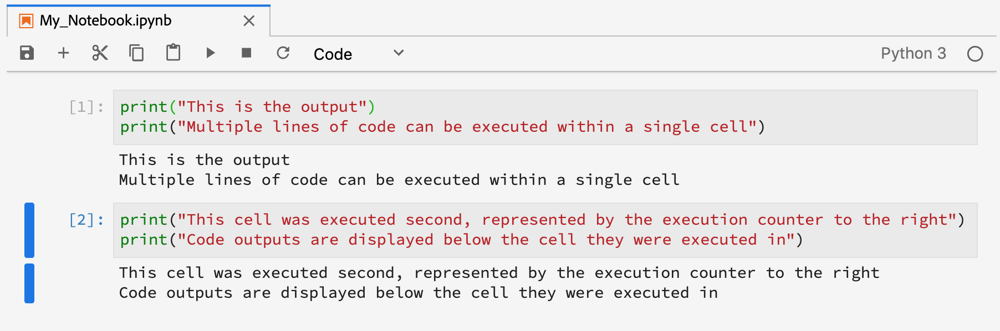

# JupyterLab用户指南

JupyterLab是Project Jupyter的基于Web的用 <a href="https://jupyter.org/" target="_blank">户界面</a> ，与Adobe Experience Platform紧密集成。 它为数据科学家提供了一个交互式开发环境，以便与Jupyter笔记本、代码和数据一起使用。

本文档概述了JupyterLab及其功能以及执行常见操作的说明。

## JupyterLab on Experience Platform

Experience Platform的JupyterLab集成随附了架构更改、设计注意事项、自定义笔记本扩展、预装库和Adobe主题界面。

以下列表概述了JupyterLab在平台上独有的一些功能：

| 功能 | 描述 |
| --- | --- |
| **内核** | 内核提供笔记本电脑和其他JupyterLab前端，能够以不同编程语言执行和检查代码。 Experience Platform提供了额外的内核，可支持Python、R、PySpark和Spark中的开发。 有关更多 [详细信息](#kernels) ，请参阅内核部分。 |
| **数据访问** | 借助对读和写功能的完全支持，直接从JupyterLab中访问现有数据集。 |
| **平台服务集成** | 内置集成允许您直接从JupyterLab中利用其他平台服务。 与其他平台服务的集成部分提供了支持的集 [成的完整列表](#service-integration)。 |
| **身份验证** | 除了 <a href="https://jupyter-notebook.readthedocs.io/en/latest/security.html" target="_blank">JupyterLab的内置安全模型外</a>，您的应用程序与Experience Platform（包括平台服务与服务通信）之间的每次交互都会通过 <a href="https://www.adobe.io/authentication/auth-methods.html" target="_blank">Adobe Identity Management System(IMS)进行加密和验证</a>。 |
| **开发库** | 在Experience Platform中，JupyterLab为Python、R和PySpark提供预装库。 有关受支 [持库的完整列表](#supported-libraries) ，请参阅附录。 |
| **库控制器** | 当您的需要缺少预装的库时，可以为Python和R安装其他库，并临时存储在隔离的容器中，以保持平台的完整性和数据的安全。 有关更多 [详细信息](#kernels) ，请参阅内核部分。 |

>[!NOTE] 其他库仅可用于安装它们的会话。 必须重新安装启动新会话时需要的任何其他库。

## 与其他平台服务集成 {#service-integration}

标准化和互操作性是Experience Platform的主要概念。 JupyterLab作为嵌入式IDE的集成使其能够与其他平台服务交互，从而使您能够充分利用平台的潜力。 JupyterLab提供以下平台服务：

* **目录服务：** 使用读写功能访问和浏览数据集。
* **查询服务：** 使用SQL访问和浏览数据集，在处理大量数据时提供较低的数据访问开销。
* **Sensei ML框架：** 模型开发具有培训和评分数据的能力，并且只需单击一下即可创建菜谱。

>[!NOTE] JupyterLab上的某些平台服务集成仅限于特定内核。 有关更多详细信息，请 [参阅](#kernels) “内核”一节。

## 主要功能和常见操作

有关JupyterLab的主要功能以及执行常见操作的说明的信息，请参见以下各节：

* [访问JupyterLab](#access-jupyterlab)
* [JupyterLab界面](#jupyterlab-interface)
* [代码单元格](#code-cells)
* [内核](#kernels)
* [内核会话](#kernel-sessions)
* [PySpark/Spark执行资源](#execution-resource)
* [启动器](#launcher)

### 访问JupyterLab {#access-jupyterlab}

在 [Adobe Experience Platform中](https://platform.adobe.com)，从左侧导航列 **中选择“笔记本电脑** ”。 为JupyterLab完全初始化留出时间。


### JupyterLab界面 {#jupyterlab-interface}

JupyterLab界面由菜单栏、可折叠的左侧提要栏和包含文档和活动选项卡的主工作区组成。

**菜单栏**

界面顶部的菜单栏有顶级菜单，这些菜单显示JupyterLab中可用的操作及其键盘快捷键：

* **文件：** 与文件和目录相关的操作
* **编辑：** 与编辑文档和其他活动相关的操作
* **视图:** 改变JupyterLab外观的操作
* **运行：** 在不同活动（如笔记本电脑和代码控制台）中运行代码的操作
* **内核：** 用于管理内核的操作
* **选项卡：** 一列表开放式文档和活动
* **设置：** 常用设置和高级设置编辑器
* **帮助：** JupyterLab和内核帮助链接的列表

**左侧栏**

左侧提要栏包含可单击的选项卡，这些选项卡提供对以下功能的访问：

* **文件浏览器：** 保存的笔记本文档和目录的列表
* **数据浏览器：** 浏览、访问和浏览数据集和模式
* **运行内核和终端：** 具有终止能力的活动内核和终端会话的列表
* **命令：** 一列表有用的命令
* **单元格检查器：** 提供对工具和元数据的访问的单元格编辑器，这些工具和元数据可用于为演示目的设置笔记本
* **选项卡：** 一列表打开的选项卡

单击某个选项卡以显示其功能，或单击展开的选项卡折叠左侧提要栏，如下所示：


**主要工作区**

JupyterLab中的主要工作区域允许您将文档和其他活动排列到选项卡面板中，这些选项卡可以调整大小或细分。 将选项卡拖动到选项卡面板的中心以迁移选项卡。 将选项卡拖动到面板的左侧、右侧、顶部或底部，以划分面板：


### 代码单元格 {#code-cells}

代码单元是笔记本电脑的主要内容。 它们包含笔记本关联内核的语言和作为执行代码单元的结果的输出的源代码。 在表示其执行顺序的每个代码单元的右侧显示执行计数。



常见单元格操作如下所述：

* **添加单元格：** 单击笔记本菜单中的加&#x200B;**号(+**)可添加空单元格。 新单元被放置在当前正在与之交互的单元下，或者如果没有特定单元处于焦点，则被放置在笔记本的末尾。

* **移动单元格：** 将光标放在要移动的单元格的右侧，然后单击该单元格并将其拖动到新位置。 此外，将一个单元从一个笔记本移动到另一个单元将复制该单元及其内容。

* **执行单元格：** 单击要执行的单元格的正文，然后单击笔记本 **菜单中的** “播放&#x200B;**”图▶标(**)。 当内核处理执行时，单元格的执行计数器中会显示星号(**\***)，并在完成时替换为整数。

* **删除单元格：** 单击要删除的单元格的正文，然后单击剪刀 **图标** 。

### 内核 {#kernels}

笔记本电脑内核是专门用于处理笔记本电脑单元的语言计算引擎。 除了Python之外，JupyterLab还在R、PySpark和Spark中提供其他语言支持。 打开笔记本文档时，将启动关联的内核。 当执行笔记本单元时，内核执行计算并产生可能消耗大量CPU和内存资源的结果。 请注意，在内核关闭之前不会释放已分配的内存。

>[!IMPORTANT] JupyterLab Launcher从Spark 2.3更新到Spark 2.4。Spark 2.4笔记本不再支持Spark和PySpark内核。

某些特性和功能仅限于下表所述的特定内核：

| 内核 | 库安装支持 | 平台集成 |
| :----: | :--------------------------: | :-------------------- |
| **Python** | 是 | <ul><li>Sensei ML框架</li><li>目录服务</li><li>查询服务</li></ul> |
| **R** | 是 | <ul><li>Sensei ML框架</li><li>目录服务</li></ul> |
| **PySpark —— 已弃用** | 否 | <ul><li>Sensei ML框架</li><li>目录服务</li></ul> |
| **Spark —— 已弃用** | 否 | <ul><li>Sensei ML框架</li><li>目录服务</li></ul> |
| **斯卡拉** | 否 | <ul><li>Sensei ML框架</li><li>目录服务</li></ul> |

### 内核会话 {#kernel-sessions}

JupyterLab上的每个活动笔记本或活动都使用内核会话。 所有活动会话都可以通过从左侧提要栏中 **展开“运行终端和内核** ”选项卡找到。 通过观察笔记本界面的右上角，可以识别笔记本的内核的类型和状态。 在下图中，笔记本的关联内核是 **Python 3** ，其当前状态由右侧的灰色圆圈表示。 空心圆表示空闲内核，实心圆表示忙碌内核。


如果内核长时间处于关闭或非活动状态，则无 **内核！** 显示实心圆。 通过单击内核状态并选择相应的内核类型来激活内核，如下所示：


### PySpark/Spark执行资源 {#execution-resource}

>[!IMPORTANT]
>将Spark 2.3过渡到Spark 2.4后，Spark和PySpark内核均已弃用。
>
>新的PySpark 3(Spark 2.4)笔记本电脑使用Python3 Kernel。 有关更新现有笔记本的详细教程，请参阅将 [Pyspark 3(Spark 2.3)转换为PySpark 3(Spark 2.4)](../recipe-notebook-migration.md) 指南。
>
>新的Spark笔记本电脑应利用Scala内核。 有关更新现有笔记本的详细教程，请参阅将 [Spark 2.3转换为Scala(Spark 2.4)](../recipe-notebook-migration.md) 指南。

PySpark和Spark内核允许您使用configure命令(`%%configure`)在PySpark或Spark笔记本内配置Spark群集资源，并提供一列表配置。 理想情况下，这些配置是在Spark应用程序初始化之前定义的。 在Spark应用程序处于活动状态时修改配置需要在命令(`%%configure -f`)之后添加一个额外的强制标志，该命令将重新启动应用程序以便应用更改，如下所示：

>[!CAUTION]
>PySpark 3(Spark 2.4)和Scala(Spark 2.4)笔记本电脑不再 `%%` 支持Sparkmagic。 不能再使用以下操作：
* `%%help`
* `%%info`
* `%%cleanup`
* `%%delete`
* `%%configure`
* `%%local`

```python
%%configure -f 
{
    "numExecutors": 10,
    "executorMemory": "8G",
    "executorCores":4,
    "driverMemory":"2G",
    "driverCores":2,
    "conf": {
        "spark.cores.max": "40"
    }
}
```

下表列出了所有可配置的属性：

| 属性 | 描述 | 类型 |
| :------- | :---------- | :-----:|
| 一种 | 会话类型（必需） | `session kind`_ |
| proxyUser | 要模拟运行此会话的用户（例如bob） | 字符串 |
| 罐子 | 要放置到Java上的文件 `classpath` | 列表路径 |
| pyFiles | 要放置到 `PYTHONPATH` | 列表路径 |
| 文件 | 要放置在执行器工作目录中的文件 | 列表路径 |
| driverMemory | 驱动程序的内存（以兆字节或千兆字节为单位）（例如1000M、2G） | 字符串 |
| driverCores | 驱动器使用的芯数（仅限CHARN模式） | int |
| executorMemory | 以兆字节或千兆字节为单位的执行器内存（例如1000M、2G） | 字符串 |
| executorCores | 执行器使用的核数 | int |
| numExecutors | 执行者数量（仅限HAIRN模式） | int |
| 档案 | 要在执行器工作目录中解压缩的存档（仅限CHAIRN模式） | 列表路径 |
| 队列 | 要提交的HAIR队列（仅限CHAIRN模式） | 字符串 |
| name | 应用程序的名称 | 字符串 |
| 会议 | Spark配置属性 | 键映射=val |

### 启动器 {#launcher}

[//]: # (Talk about the different Notebooks, introduce that certain starter notebooks are limited to particular kernels)

自定义的 *Launcher* 为您提供了实用的笔记本模板，这些模板支持内核，可帮助您启动任务，包括：

| 模板 | 描述 |
| --- | --- |
| 空白 | 空的笔记本文件。 |
| Starter | 预填充的笔记本电脑演示使用样本数据进行数据探索。 |
| 零售 | 预填的笔记本电脑，其中包含使 <a href="https://adobe.ly/2wOgO3L" target="_blank">用范例数据的“零售销售菜谱</a> ”。 |
| Recipe Builder | 用于在JupyterLab中创建菜谱的笔记本模板。 它预填充了演示和描述菜谱创建过程的代码和评论。 有关详细 <a href="https://www.adobe.com/go/data-science-create-recipe-notebook-tutorial-en" target="_blank">的演练，请参阅笔记本</a> “菜谱”教程。 |
| 查询服务 | 一个预填充的笔记本，它直接在JupyterLab中演示查询服务的使用，并提供可大规模分析数据的示例工作流。 |
| XDM事件 | 预装的笔记本电脑，展示了对后值体验事件数据的数据探索，侧重于数据结构中的常见功能。 |
| XDM查询 | 预装的笔记本电脑可展示关于体验事件数据的示例业务查询。 |
| 聚合 | 预填充的笔记本演示了将大量数据聚合为更小、可管理的块的样本工作流。 |
| 聚类 | 预填充的笔记本电脑使用聚类算法演示端到端机器学习建模过程。 |

某些笔记本模板仅限于某些内核。 下表映射了每个内核的模板可用性：

<table>
    <tr>
        <td></td>
        <th><strong>空白</strong></th>
        <th><strong>Starter</strong></th>
        <th><strong>零售</strong></th>
        <th><strong>Recipe Builder</strong></th>
        <th><strong>查询服务</strong></th>
        <th><strong>XDM事件</strong></th>
        <th><strong>XDM查询</strong></th>
        <th><strong>聚合</strong></th>
        <th><strong>聚类</strong></th>
    </tr>
    <tr>
        <th><strong>Python</strong></th>
        <td >是</td>
        <td >是</td>
        <td >是</td>
        <td >是</td>
        <td >是</td>
        <td >是</td>
        <td >否</td>
        <td >否</td>
        <td >否</td>
    </tr>
    <tr>
        <th ><strong>R</strong></th>
        <td >是</td>
        <td >是</td>
        <td >是</td>
        <td >否</td>
        <td >否</td>
        <td >否</td>
        <td >否</td>
        <td >否</td>
        <td >否</td>
    </tr>
    <tr>
        <th  ><strong>PySpark 3（Spark 2.3 —— 已弃用）</strong></th>
        <td >是</td>
        <td >是</td>
        <td >否</td>
        <td >否</td>
        <td >否</td>
        <td >否</td>
        <td >是</td>
        <td >是</td>
        <td >否</td>
    </tr>
    <tr>
        <th ><strong>Spark（Spark 2.3 —— 已弃用）</strong></th>
        <td >是</td>
        <td >是</td>
        <td >否</td>
        <td >否</td>
        <td >否</td>
        <td >否</td>
        <td >否</td>
        <td >否</td>
        <td >是</td>
    </tr>
      <tr>
        <th  ><strong>PySpark 3(Spark 2.4)</strong></th>
        <td >否</td>
        <td >是</td>
        <td >否</td>
        <td >否</td>
        <td >否</td>
        <td >否</td>
        <td >是</td>
        <td >是</td>
        <td >否</td>
    </tr>
    <tr>
        <th ><strong>斯卡拉</strong></th>
        <td >是</td>
        <td >是</td>
        <td >否</td>
        <td >否</td>
        <td >否</td>
        <td >否</td>
        <td >否</td>
        <td >否</td>
        <td >是</td>
    </tr>
</table>

要打开新的启动 *器*，请单击“文 **件”>“新建启动器”**。 或者，从左侧提 **要栏中展开** “文件”浏览器，然后单击加号(**+**):


## 使用笔记本访问平台数据

每个支持的内核都提供内置功能，允许您从笔记本内的数据集中读取平台数据。 但是，对分页数据的支持仅限于Python和R笔记本。

### 从Python/R中的数据集读取

Python和R笔记本电脑允许您在访问数据集时对数据进行分页。 下面演示了用于读取有分页和无分页数据的示例代码。

[//]: # (In the following samples, the first step is currently required but once the SDK is complete, users are no longer required to explicitly define client_context)

#### 在Python/R中读取数据集，无需分页

执行以下代码将读取整个数据集。 如果执行成功，则数据将保存为变量引用的Pactys数据帧 `df`。

```python
# Python

client_context = PLATFORM_SDK_CLIENT_CONTEXT
from platform_sdk.dataset_reader import DatasetReader
dataset_reader = DatasetReader(client_context, "{DATASET_ID}")
df = dataset_reader.read()
df.head()
```

```R
# R

library(reticulate)
use_python("/usr/local/bin/ipython")
psdk <- import("platform_sdk")
py_run_file("../.ipython/profile_default/startup/platform_sdk_context.py")
client_context <- py$PLATFORM_SDK_CLIENT_CONTEXT
DatasetReader <- psdk$dataset_reader$DatasetReader
dataset_reader <- DatasetReader(client_context, "{DATASET_ID}") 
df <- dataset_reader$read() 
df
```

* `{DATASET_ID}`:要访问的数据集的唯一标识

#### 使用分页从Python/R中的数据集读取

执行以下代码将从指定的数据集中读取数据。 分页是通过分别通过函数和函数限制和偏移数据 `limit()` 来实现 `offset()` 的。 限制数据是指要读取的数据点的最大数，而偏移是指在读取数据之前要跳过的数据点的数量。 如果读取操作成功执行，则数据将保存为变量引用的Pactys数据帧 `df`。

```python
# Python

client_context = PLATFORM_SDK_CLIENT_CONTEXT
from platform_sdk.dataset_reader import DatasetReader

dataset_reader = DatasetReader(client_context, "{DATASET_ID}")
df = dataset_reader.limit(100).offset(10).read()
```

```R
# R

library(reticulate)
use_python("/usr/local/bin/ipython")
psdk <- import("platform_sdk")
py_run_file("../.ipython/profile_default/startup/platform_sdk_context.py")
client_context <- py$PLATFORM_SDK_CLIENT_CONTEXT

DatasetReader <- psdk$dataset_reader$DatasetReader
dataset_reader <- DatasetReader(client_context, "{DATASET_ID}") 
df <- dataset_reader$limit(100L)$offset(10L)$read() 
```

* `{DATASET_ID}`:要访问的数据集的唯一标识

### 从PySpark/Spark/Scala中的数据集读取

>[!IMPORTANT]
>将Spark 2.3过渡到Spark 2.4后，Spark和PySpark内核均已弃用。
>
>新的PySpark 3(Spark 2.4)笔记本电脑使用Python3 Kernel。 如果您希望转换现有的Spark 2.3代码，请参阅将 [Pyspark 3(Spark 2.3)转换为PySpark 3(Spark 2.4)](../recipe-notebook-migration.md) 指南。 新笔记本应遵循 [以下PySpark 3(Spark 2.4)示例](#pyspark2.4) 。
>
>新的Spark笔记本电脑应利用Scala内核。 如果您希望转换现 [有的Spark 2.3代码，请参阅将Spark 2.3转换为Scala(Spark 2.4)](../recipe-notebook-migration.md) 指南。 新笔记本应遵循 [以下Scala(Spark 2.4)示例](#spark2.4) 。

打开活动的PySpark或Spark笔记本，从左侧提要栏中展开 **Data Explorer** （数据浏览器）选项卡，然后单击 **Datasets** （数据集）以视图可用数据集的列表。 右键单击要访问的数据集列表，然后单击“在笔记本 **电脑中浏览数据”**。 将生成以下代码单元格：

#### PySpark（Spark 2.3 —— 已弃用）

```python
# PySpark 3 (Spark 2.3 - deprecated)

pd0 = spark.read.format("com.adobe.platform.dataset").\
    option('orgId', "YOUR_IMS_ORG_ID@AdobeOrg").\
    load("{DATASET_ID}")
pd0.describe()
pd0.show(10, False)
```

#### PySpark(Spark 2.4) {#pyspark2.4}

随着Spark 2.4的推出，自定义 [`%dataset`](#magic) 的魔法功能也随之提供。

```python
# PySpark 3 (Spark 2.4)

%dataset read --datasetId {DATASET_ID} --dataFrame pd0
pd0.describe()
pd0.show(10, False)
```

#### Spark（Spark 2.3 —— 已弃用）

```scala
// Spark (Spark 2.3 - deprecated)

import com.adobe.platform.dataset.DataSetOptions
val dataFrame = spark.read.
    format("com.adobe.platform.dataset").
    option(DataSetOptions.orgId, "YOUR_IMS_ORG_ID@AdobeOrg").
    load("{DATASET_ID}")
dataFrame.printSchema()
dataFrame.show()
```

#### Scala(Spark 2.4) {#spark2.4}

```scala
// Scala (Spark 2.4)

// initialize the session
import org.apache.spark.sql.{Dataset, SparkSession}
val spark = SparkSession.builder().master("local").getOrCreate()

val dataFrame = spark.read.format("com.adobe.platform.query")
    .option("user-token", sys.env("PYDASDK_IMS_USER_TOKEN"))
    .option("ims-org", sys.env("IMS_ORG_ID"))
    .option("api-key", sys.env("PYDASDK_IMS_CLIENT_ID"))
    .option("service-token", sys.env("PYDASDK_IMS_SERVICE_TOKEN"))
    .option("mode", "batch")
    .option("dataset-id", "{DATASET_ID}")
    .load()
dataFrame.printSchema()
dataFrame.show()
```

>[!TIP]
>在Scala中，您可以使 `sys.env()` 用在中声明和返回值 `option`。

### 在PySpark 3(Spark 2.4)笔记本中使用%dataset魔术 {#magic}

随着Spark 2.4的推出，自定 `%dataset` 义功能已经提供，可用于新的PySpark 3(Spark 2.4)笔记本（Python 3内核）。

**使用情况**

`%dataset {action} --datasetId {id} --dataFrame {df}`

**描述**

用于从Python笔记本（Python 3内核）读取或写入数据集的自定义数据科学工作区神奇命令。

* **{action}**:要对数据集执行的操作类型。 有两个操作是“read”或“write”。
* **—datasetId {id}**:用于提供要读或写的数据集的id。 这是必需参数。
* **—dataFrame {df}**:熊猫数据框。 这是必需参数。
   * 当操作为“read”时，{df}是数据集读取操作结果可用的变量。
   * 当操作为“write”时，此数据帧{df}将写入数据集。
* **—mode（可选）**:允许的参数为“batch”和“interactive”。 默认情况下，该模式设置为“交互”。 建议在读取大量数据时使用“批处理”模式。

**示例**

* **阅读示例**: `%dataset read --datasetId 5e68141134492718af974841 --dataFrame pd0`
* **编写示例**: `%dataset write --datasetId 5e68141134492718af974842 --dataFrame pd0`

### 查询Python中查询服务的数据

JupyterLab on Platform允许您在Python笔记本中使用SQL通过 <a href="https://www.adobe.com/go/query-service-home-en" target="_blank">Adobe Experience Platform查询服务访问数据</a>。 通过查询服务访问数据由于其出色的运行时间而对处理大型数据集很有帮助。 建议使用查询服务查询数据的处理时间限制为十分钟。

在JupyterLab中使用查询服务之前，请确保您对查询服务SQL语法有 <a href="https://www.adobe.com/go/query-service-sql-syntax-en" target="_blank">正确的理解</a>。

使用查询服务查询数据需要您提供目标数据集的名称。 您可以使用“数据浏览器”查找所需的数据集，从而生成必要的代 **码单元格**。 右键单击数据集列表，然后单击“笔记本 **电脑中的查询数据** ”，以在笔记本电脑中生成以下两个代码单元格：


要在JupyterLab中利用查询服务，您必须首先在工作中的Python笔记本和查询服务之间建立连接。 这可以通过执行第一生成的单元来实现。

```python
qs_connect()
```

在第二个生成的单元格中，必须在SQL查询之前定义第一行。 默认情况下，生成的单元格定义一个可选变量(`df0`)，该变量将查询结果保存为Apcontis数据帧。 <br>该参 `-c QS_CONNECTION` 数是必需的，它告知内核对查询服务执行SQL查询。 有关其 [他参数的列表](#optional-sql-flags-for-query-service) ，请参阅附录。

```python
%%read_sql df0 -c QS_CONNECTION
SELECT *
FROM name_of_the_dataset
LIMIT 10
/* Querying table "name_of_the_dataset" (datasetId: {DATASET_ID})*/
```

Python变量可以通过使用字符串格式的语法并在大括号(`{}`)中包含变量，在SQL查询中直接引用，如下例所示：

```python
table_name = 'name_of_the_dataset'
table_columns = ','.join(['col_1','col_2','col_3'])
```

```python
%%read_sql demo -c QS_CONNECTION
SELECT {table_columns}
FROM {table_name}
```

### 在Python/R中过滤ExperienceEvent数据

要访问和过滤Python或R笔记本中的ExperienceEvent数据集，您必须提供数据集(`{DATASET_ID}`)的ID以及使用逻辑运算符定义特定时间范围的过滤器规则。 定义时间范围后，将忽略任何指定的分页，并考虑整个数据集。

过滤操作符的列表说明如下：

* `eq()`:等于
* `gt()`:大于
* `ge()`:大于或等于
* `lt()`:小于
* `le()`:小于或等于
* `And()`:逻辑AND运算符
* `Or()`:逻辑OR运算符

以下单元格将ExperienceEvent数据集过滤为2019年1月1日至2019年12月31日之间仅存在的数据。

```python
# Python

client_context = PLATFORM_SDK_CLIENT_CONTEXT
from platform_sdk.dataset_reader import DatasetReader

dataset_reader = DatasetReader(client_context, "{DATASET_ID}")
df = dataset_reader.\
    where(dataset_reader["timestamp"].gt("2019-01-01 00:00:00").\
    And(dataset_reader["timestamp"].lt("2019-12-31 23:59:59"))\
).read()
```

```R
# R

library(reticulate)
use_python("/usr/local/bin/ipython")
psdk <- import("platform_sdk")
py_run_file("../.ipython/profile_default/startup/platform_sdk_context.py")
client_context <- py$PLATFORM_SDK_CLIENT_CONTEXT

DatasetReader <- psdk$dataset_reader$DatasetReader
dataset_reader <- DatasetReader(client_context, "{DATASET_ID}") 
df <- dataset_reader$
    where(dataset_reader["timestamp"]$gt("2019-01-01 00:00:00")$
    And(dataset_reader["timestamp"]$lt("2019-12-31 23:59:59"))
)$read()
```

### 在PySpark/Spark中过滤ExperienceEvent数据

>[!IMPORTANT]
>将Spark 2.3过渡到Spark 2.4后，Spark和PySpark内核均已弃用。
>
>新的PySpark 3(Spark 2.4)笔记本电脑使用Python3 Kernel。 有关转换现有代码的更多信息，请参阅将 [Pyspark 3(Spark 2.3)转换为PySpark 3(Spark 2.4)指南](../recipe-notebook-migration.md) 。 如果您要创建新的PySpark笔记本，请使用 [PySpark 3(spark 2.4)示例过滤ExperienceEvent数据](#pyspark3-spark2.4) 。
>
>新的Spark笔记本电脑应利用Scala内核。 有关转换现有代码的更 [多信息，请参阅将Spark 2.3转换为Scala(Spark 2.4)的指南](../recipe-notebook-migration.md) 。 如果您要创建新的Spark笔记本，请使用 [Scala(spark 2.4)示例过滤ExperienceEvent数据](#scala-spark) 。

在PySpark或Spark笔记本中访问和过滤ExperienceEvent数据集要求您提供数据集标识(`{DATASET_ID}`)、组织的IMS标识以及定义特定时间范围的过滤器规则。 过滤时间范围通过使用函数来定义， `spark.sql()`其中函数参数是SQL查询字符串。

以下单元格将ExperienceEvent数据集过滤为2019年1月1日至2019年12月31日之间仅存在的数据。

#### PySpark 3（Spark 2.3 —— 已弃用）

```python
# PySpark 3 (Spark 2.3 - deprecated)

pd = spark.read.format("com.adobe.platform.dataset").\
    option("orgId", "YOUR_IMS_ORG_ID@AdobeOrg").\
    load("{DATASET_ID}")

pd.createOrReplaceTempView("event")
timepd = spark.sql("""
    SELECT *
    FROM event
    WHERE timestamp > CAST('2019-01-01 00:00:00.0' AS TIMESTAMP)
    AND timestamp < CAST('2019-12-31 23:59:59.9' AS TIMESTAMP)
""")
```

#### PySpark 3(Spark 2.4) {#pyspark3-spark2.4}

```python
# PySpark 3 (Spark 2.4)

from pyspark.sql import SparkSession
spark = SparkSession.builder.getOrCreate()

%dataset read --datasetId {DATASET_ID} --dataFrame df

df.createOrReplaceTempView("event")
timepd = spark.sql("""
    SELECT *
    FROM event
    WHERE timestamp > CAST('2019-01-01 00:00:00.0' AS TIMESTAMP)
    AND timestamp < CAST('2019-12-31 23:59:59.9' AS TIMESTAMP)
""")
timepd.show()
```

#### Spark（Spark 2.3 —— 已弃用）

```scala
// Spark (Spark 2.3 - deprecated)

import com.adobe.platform.dataset.DataSetOptions
val dataFrame = spark.read.
    format("com.adobe.platform.dataset").
    option(DataSetOptions.orgId, "YOUR_IMS_ORG_ID@AdobeOrg").
    load("{DATASET_ID}")

dataFrame.createOrReplaceTempView("event")
val timedf = spark.sql("""
    SELECT * 
    FROM event 
    WHERE timestamp > CAST('2019-01-01 00:00:00.0' AS TIMESTAMP)
    AND timestamp < CAST('2019-12-31 23:59:59.9' AS TIMESTAMP)
""")
```

#### Scala(Spark 2.4) {#scala-spark}

```scala
// Spark (Spark 2.4)

// Turn off extra logging
import org.apache.log4j.{Level, Logger}
Logger.getLogger("org").setLevel(Level.OFF)
Logger.getLogger("com").setLevel(Level.OFF)

import org.apache.spark.sql.{Dataset, SparkSession}
val spark = org.apache.spark.sql.SparkSession.builder().appName("Notebook")
  .master("local")
  .getOrCreate()

// Stage Exploratory
val dataSetId: String = "{DATASET_ID}"
val orgId: String = sys.env("IMS_ORG_ID")
val clientId: String = sys.env("PYDASDK_IMS_CLIENT_ID")
val userToken: String = sys.env("PYDASDK_IMS_USER_TOKEN")
val serviceToken: String = sys.env("PYDASDK_IMS_SERVICE_TOKEN")
val mode: String = "batch"

var df = spark.read.format("com.adobe.platform.query")
  .option("user-token", userToken)
  .option("ims-org", orgId)
  .option("api-key", clientId)
  .option("mode", mode)
  .option("dataset-id", dataSetId)
  .option("service-token", serviceToken)
  .load()
df.createOrReplaceTempView("event")
val timedf = spark.sql("""
    SELECT * 
    FROM event 
    WHERE timestamp > CAST('2019-01-01 00:00:00.0' AS TIMESTAMP)
    AND timestamp < CAST('2019-12-31 23:59:59.9' AS TIMESTAMP)
""")
timedf.show()
```

>[!TIP]
>在Scala中，您可以使 `sys.env()` 用在中声明和返回值 `option`。 如果您知道变量只会被一次使用，则无需定义变量。 以下示例从上 `val userToken` 述示例中开始，并声明它在行中作为 `option` 替代内容：
> 
```scala
> .option("user-token", sys.env("PYDASDK_IMS_USER_TOKEN"))
> ```

## 支持的库 {#supported-libraries}

### Python / R

| 库 | 版本 |
| :------ | :------ |
| 笔记本 | 6.0.0 |
| 请求 | 2.22.0 |
| 极端 | 4.0.0 |
| 青叶 | 0.10.0 |
| ipywidgets | 7.5.1 |
| bokeh | 1.3.1 |
| gensim | 3.7.3 |
| ipyparallel | 0.5.2 |
| jq | 1.6 |
| keras | 2.2.4 |
| nltk | 3.2.5 |
| 熊猫 | 0.22.0 |
| pandasql | 0.7.3 |
| 枕 | 6.0.0 |
| Scikit图像 | 0.15.0 |
| scikit-learn | 0.21.3 |
| 熏 | 1.3.0 |
| 烦躁 | 1.3.0 |
| searn | 0.9.0 |
| statsmodels | 0.10.1 |
| 弹性 | 5.1.0.17 |
| gplot | 0.11.5 |
| py-xgboost | 0.90 |
| opencv | 3.4.1 |
| 皮什帕克 | 2.4.3 |
| 火炬 | 1.0.1 |
| wxpython | 4.0.6 |
| 着色器 | 0.3.0 |
| geopandas | 0.5.1 |
| 地源 | 2.1.0 |
| 酷 | 1.6.4 |
| rpy2 | 2.9.4 |
| r-essentials | 3.6 |
| r-arules | 1.6_3 |
| r-fpc | 2.2_3 |
| r-e1071 | 1.7_2 |
| r-gam | 1.16.1 |
| r-gbm | 2.1.5 |
| r-ggthemes | 4.2.0 |
| r-ggvis | 0.4.4 |
| r-igraph | 1.2.4.1 |
| r-leaps | 3.0 |
| r-manipulate | 1.0.1 |
| r-rocr | 1.0_7 |
| r-rmysql | 0.10.17 |
| r-rodbc | 1.3_15 |
| r-rsqlite | 2.1.2 |
| r-rstan | 2.19.2 |
| r-sqldf | 0.4_11 |
| r-survis | 2.44_1.1 |
| 动物园 | 1.8_6 |
| r弦长 | 0.9.5.2 |
| R-四重组 | 1.5_7 |
| r-rjson | 0.2.20 |
| r-forecast | 8.7 |
| r-rsolnp | 1.16 |
| r-网状 | 1.12 |
| r-mlr | 2.14.0 |
| r-viridis | 0.5.1 |
| r-corplot | 0.84 |
| r-fnn | 1.1.3 |
| r-lubridate | 1.7.4 |
| r-randomforest | 4.6_14 |
| 逆反 | 1.2.1 |
| r-tree | 1.0_39 |
| pymongo | 3.8.0 |
| pyarrow | 0.14.1 |
| boto3 | 1.9.199 |
| ipyvolume | 0.5.2 |
| fasterpac | 0.3.2 |
| python-snappy | 0.5.4 |
| ipywebrtc | 0.5.0 |
| jupyter_client | 5.3.1 |
| wordcloud | 1.5.0 |
| graphviz | 2.40.1 |
| python-graphviz | 0.11.1 |
| azure-存储 | 0.36.0 |
| jupterlab | 1.0.4 |
| 熊猫_ml | 0.6.1 |
| Tensorflow-gpu | 1.14.0 |
| nodejs | 12.3.0 |
| 模拟 | 3.0.5 |
| ipympl | 0.3.3 |
| fonts-anacond | 1.0 |
| psycopg2 | 2.8.3 |
| 鼻子 | 1.3.7 |
| autovizwidget | 0.12.9 |
| 阿尔泰 | 3.1.0 |
| vega_datasets | 0.7.0 |
| 平磨机 | 1.0.1 |
| sql_magic | 0.0.4 |
| iso3166 | 1.0 |
| nbimporter | 0.3.1 |

### PySpark

| 库 | 版本 |
| :------ | :------ |
| 请求 | 2.18.4 |
| gensim | 2.3.0 |
| keras | 2.0.6 |
| nltk | 3.2.4 |
| 熊猫 | 0.20.1 |
| pandasql | 0.7.3 |
| 枕 | 5.3.0 |
| Scikit图像 | 0.13.0 |
| scikit-learn | 0.19.0 |
| 熏 | 0.19.1 |
| 烦躁 | 1.3.3 |
| statsmodels | 0.8.0 |
| 弹性 | 4.0.30.44 |
| py-xgboost | 0.60 |
| opencv | 3.1.0 |
| pyarrow | 0.8.0 |
| boto3 | 1.5.18 |
| azure-存储-blob | 1.4.0 |
| pyrom | 3.6.7 |
| mkl-rt | 11.1 |

## 查询服务的可选SQL标志 {#optional-sql-flags-for-query-service}

此表概述了可用于查询服务的可选SQL标志。

| **旗标** | **描述** |
| --- | --- |
| `-h`, `--help` | 显示帮助消息并退出。 |
| `-n`, `--notify` | 用于通知查询结果的切换选项。 |
| `-a`, `--async` | 使用此标志可异步执行查询，并可在查询执行时释放内核。 将查询结果分配给变量时要小心，因为如果查询不完成，则该结果可能未定义。 |
| `-d`, `--display` | 使用此标志可阻止显示结果。 |

