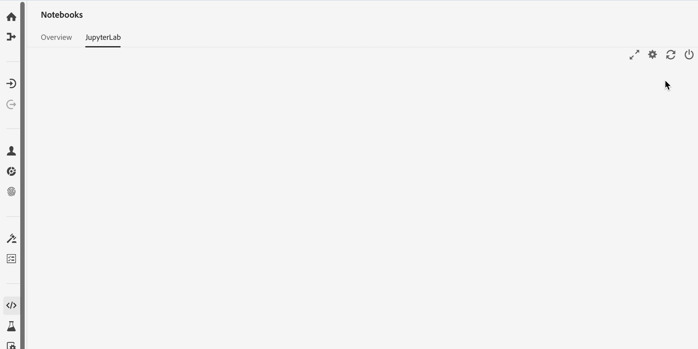

# [!DNL JupyterLab] UI 概述

>[!NOTE]
>
>数据科学Workspace不再可供购买。
>
>本文档面向之前有权访问数据科学Workspace的现有客户。

[!DNL JupyterLab]是[Project Jupyter](https://jupyter.org/)的基于Web的用户界面，已紧密集成到Adobe Experience Platform中。 它为数据科学家提供了交互式开发环境，以便使用Jupyter Notebooks、代码和数据。

本文档概述了[!DNL JupyterLab]及其功能，并提供了执行常见操作的说明。

## [!DNL Experience Platform]上的[!DNL JupyterLab]

Experience Platform的JupyterLab集成伴随着体系结构变化、设计注意事项、自定义笔记本扩展、预安装的库和Adobe主题的界面。

下表概述了Experience Platform上JupyterLab的特有功能：

| 功能 | 描述 |
| --- | --- |
| **内核** | 内核提供笔记本和其他[!DNL JupyterLab]前端以不同编程语言执行和内部检查代码的功能。 [!DNL Experience Platform]提供了额外的内核以支持[!DNL Python]、R、PySpark和[!DNL Spark]中的开发。 有关更多详细信息，请参阅[内核](#kernels)部分。 |
| **数据访问** | 直接从[!DNL JupyterLab]中访问现有数据集，完全支持读取和写入功能。 |
| **[!DNL Experience Platform]服务集成** | 内置集成允许您直接从[!DNL JupyterLab]中利用其他[!DNL Experience Platform]服务。 有关[与其他Experience Platform服务](#service-integration)的集成的部分中提供了支持的集成的完整列表。 |
| **身份验证** | 除了<a href="https://jupyter-notebook.readthedocs.io/en/stable/security.html" target="_blank">JupyterLab的内置安全模型</a>之外，您的应用程序与Experience Platform之间的每次交互(包括Experience Platform服务到服务通信)都通过<a href="https://www.adobe.io/authentication/auth-methods.html" target="_blank">[!DNL Adobe Identity Management System] (IMS)</a>进行加密和身份验证。 |
| **开发库** | 在[!DNL Experience Platform]中，[!DNL JupyterLab]为[!DNL Python]、R和PySpark提供预安装的库。 有关支持的库的完整列表，请参阅[附录](#supported-libraries)。 |
| **库控制器** | 当预安装的库无法满足您的需求时，可以为Python和R安装其他库，并临时存储在隔离的容器中，以保持[!DNL Experience Platform]的完整性并保持数据的安全。 有关更多详细信息，请参阅[内核](#kernels)部分。 |

>[!NOTE]
>
>其他库仅适用于安装这些库的会话。 在启动新会话时，必须重新安装所需的任何其他库。

## 与其他[!DNL Experience Platform]服务集成 {#service-integration}

标准化和互操作性是[!DNL Experience Platform]背后的关键概念。 将[!DNL JupyterLab]作为嵌入式IDE集成到[!DNL Experience Platform]上后，可以与其他[!DNL Experience Platform]服务进行交互，从而使您能够充分利用[!DNL Experience Platform]。 以下[!DNL Experience Platform]服务在[!DNL JupyterLab]中可用：

* **[!DNL Catalog Service]：**&#x200B;访问和浏览具有读写功能的数据集。
* **[!DNL Query Service]：**&#x200B;使用SQL访问和浏览数据集，在处理大量数据时提供较低的数据访问开销。
* **[!DNL Sensei ML Framework]：**&#x200B;模型开发，能够训练数据和为数据评分，以及通过一次单击即可创建方法。
* **[!DNL Experience Data Model (XDM)]：**&#x200B;标准化和互操作性是Adobe Experience Platform背后的关键概念。 由Adobe驱动的[体验数据模型(XDM)](https://www.adobe.com/go/xdm-home-en)致力于标准化客户体验数据并定义用于客户体验管理的架构。

>[!NOTE]
>
>[!DNL JupyterLab]上的某些[!DNL Experience Platform]服务集成仅限于特定内核。 有关更多详细信息，请参阅[内核](#kernels)部分。

## 主要功能和常见操作

以下各节提供了有关[!DNL JupyterLab]的主要功能的信息以及执行常见操作的说明：

* [访问JupyterLab](#access-jupyterlab)
* [JupyterLab接口](#jupyterlab-interface)
* [编码单元格](#code-cells)
* [内核](#kernels)
* [内核会话](#kernel-sessions)
* [启动器](#launcher)

### 访问[!DNL JupyterLab] {#access-jupyterlab}

在[Adobe Experience Platform](https://platform.adobe.com)中，从左侧导航列中选择&#x200B;**[!UICONTROL 笔记本]**。 留出一段时间让[!DNL JupyterLab]完全初始化。

### [!DNL JupyterLab]接口 {#jupyterlab-interface}

[!DNL JupyterLab]界面由菜单栏、可折叠的左侧边栏以及包含文档和活动选项卡的主工作区组成。

**菜单栏**

界面顶部的菜单栏有顶级菜单，这些菜单显示[!DNL JupyterLab]中可用的操作及其键盘快捷键：

* **文件：**&#x200B;与文件和目录相关的操作
* **编辑：**&#x200B;与编辑文档和其他活动相关的操作
* **视图：**&#x200B;更改[!DNL JupyterLab]外观的操作
* **运行：**&#x200B;在不同活动（如笔记本和代码控制台）中运行代码的操作
* **内核：**&#x200B;用于管理内核的操作
* **选项卡：**&#x200B;打开的文档和活动的列表
* **设置：**&#x200B;常用设置和高级设置编辑器
* **帮助：** [!DNL JupyterLab]和内核帮助链接的列表

**左侧栏**

左侧边栏包含可单击的选项卡，通过这些选项卡可访问以下功能：

* **文件浏览器：**&#x200B;已保存笔记本文档和目录的列表
* **数据资源管理器：**&#x200B;浏览、访问和浏览数据集和架构
* **正在运行内核和终端：**&#x200B;能够终止的活动内核和终端会话列表
* **命令：**&#x200B;有用的命令列表
* **单元格检查器：**&#x200B;单元格编辑器，用于访问可用于设置笔记本以进行演示的工具和元数据
* **选项卡：**&#x200B;打开的选项卡列表

选择选项卡以显示其功能，或在展开的选项卡上选择以折叠左侧边栏，如下所示：

**主工作区**

[!DNL JupyterLab]中的主工作区允许您将文档和其他活动排列到选项卡面板中，这些面板可以调整大小或进行细分。 将选项卡拖到选项卡面板的中心以迁移选项卡。 通过将选项卡拖到面板的左侧、右侧、顶部或底部来划分面板：

### [!DNL Python]/R中的GPU和内存服务器配置

在[!DNL JupyterLab]中，选择右上角的齿轮图标以打开&#x200B;*笔记本服务器配置*。 您可以通过滑块打开GPU并分配所需的内存量。 可分配的内存量取决于您的组织已配置的内存量。 选择&#x200B;**[!UICONTROL 更新配置]**&#x200B;以进行保存。

>[!NOTE]
>
>每个组织只能为Notebooks配置一个GPU。 如果GPU正在使用中，则需要等待当前已保留GPU的用户将其释放。 可以通过注销或让GPU处于空闲状态四小时或更长时间来完成此操作。

### 终止并重新启动[!DNL JupyterLab]

在[!DNL JupyterLab]中，您可以终止会话以防止使用其他资源。 首先选择&#x200B;**电源图标** ，然后从似乎将终止会话的弹出框中选择&#x200B;**[!UICONTROL 关闭]**。 笔记本会话在12小时不活动后自动终止。

若要重新启动[!DNL JupyterLab]，请选择电源图标左边的&#x200B;**重新启动图标** ，然后从显示的弹出框中选择&#x200B;**[!UICONTROL 重新启动]**。

### 编码单元格 {#code-cells}

代码单元格是笔记本的主要内容。 它们包含以笔记本关联内核的语言编写的源代码，以及执行代码单元后的输出。 执行计数显示在每个代码单元格的右侧，表示其执行顺序。

下面介绍了常见的单元格操作：

* **添加单元格：**&#x200B;单击笔记本菜单中的加号(**+**)可添加空单元格。 新单元格被放置在当前正在交互的单元格下方，如果没有特定单元格处于焦点位置，则位于笔记本的末尾。

* **移动单元格：**&#x200B;将光标放在要移动的单元格的右侧，然后单击并将单元格拖到新位置。 此外，将单元格从一个笔记本移动到另一个笔记本会复制该单元格及其内容。

* **执行单元格：**&#x200B;单击要执行的单元格正文，然后单击笔记本菜单中的&#x200B;**播放**&#x200B;图标(**▶**)。 当内核正在处理执行时，单元格的执行计数器中会显示一个星号(**\***)，完成时该星号会被替换为整数。

* **删除单元格：**&#x200B;单击要删除单元格的正文，然后单击&#x200B;**剪刀**&#x200B;图标。

### 内核 {#kernels}

笔记本内核是用于处理笔记本电池的语言特定计算引擎。 除了[!DNL Python]之外，[!DNL JupyterLab]还在R、PySpark和[!DNL Spark] (Scala)中提供其他语言支持。 打开笔记本文档时，会启动关联的内核。 当执行笔记本单元格时，内核执行计算并产生可能消耗大量CPU和内存资源的结果。 请注意，在关闭内核之前，不会释放分配的内存。

某些特性和功能仅限于下表所述的特定内核：

| 核心 | 库安装支持 | [!DNL Experience Platform]集成 |
| :----: | :--------------------------: | :-------------------- |
| **[!DNL Python]** | 是 | <ul><li>[!DNL Sensei ML Framework]</li><li>[!DNL Catalog Service]</li><li>[!DNL Query Service]</li></ul> |
| **R** | 是 | <ul><li>[!DNL Sensei ML Framework]</li><li>[!DNL Catalog Service]</li></ul> |
| **Scala** | 否 | <ul><li>[!DNL Sensei ML Framework]</li><li>[!DNL Catalog Service]</li></ul> |

### 内核会话 {#kernel-sessions}

[!DNL JupyterLab]上的每个活动笔记本或活动都使用内核会话。 通过展开左侧边栏中的&#x200B;**正在运行的终端和内核**&#x200B;选项卡，可以找到所有活动会话。 通过观察笔记本界面的右上角，可以识别笔记本内核的类型和状态。 在下图中，笔记本的关联内核为&#x200B;**[!DNL Python]3**，其当前状态由右侧的灰色圆圈表示。 空心圆表示空闲内核，实心圆表示繁忙内核。

如果内核关闭或长时间处于非活动状态，则&#x200B;**无内核！显示带实心圆的**。 单击内核状态并选择适当的内核类型来激活内核，如下所示：

### 启动器 {#launcher}

[//]: # (Talk about the different Notebooks, introduce that certain starter notebooks are limited to particular kernels)

自定义的&#x200B;*启动器*&#x200B;为您提供有用的笔记本模板，用于其受支持的核心，以帮助您启动任务，包括：

| 模板 | 描述 |
| --- | --- |
| 空白 | 空的笔记本。 |
| 起始者 | 一个预填充的笔记本，演示使用示例数据探索数据。 |
| 零售业 | 使用样本数据预填充的笔记本，其中包含[零售销售方法](../pre-built-recipes/retail-sales.md)。 |
| 方法生成器 | 用于在[!DNL JupyterLab]中创建方法的笔记本模板。 它预先填充了代码和注释，用于演示和描述处方创建过程。 有关详细演练，请参阅[笔记本到方法教程](https://www.adobe.com/go/data-science-create-recipe-notebook-tutorial-en)。 |
| [!DNL Query Service] | 预填充的笔记本，用于演示直接在[!DNL JupyterLab]中使用[!DNL Query Service]，并提供大规模分析数据的示例工作流。 |
| XDM事件 | 一个预填充的笔记本，演示关于后值体验事件数据的数据探索，重点介绍整个数据结构中的共有功能。 |
| XDM查询 | 一个预填充的笔记本，用于演示有关体验事件数据的示例业务查询。 |
| 聚合 | 一个预填充的笔记本，演示将大量数据聚合到较小、可管理的块中的示例工作流。 |
| 聚类 | 一个预填充的笔记本，演示使用聚类算法的端到端机器学习建模过程。 |

某些笔记本模板仅限于某些内核。 每个内核的模板可用性如下表所示：

<table>
    <tr>
        <td></td>
        <th><strong>空白</strong></th>
        <th><strong>起始者</strong></th>
        <th><strong>零售业</strong></th>
        <th><strong>方法生成器</strong></th>
        <th><strong>[!DNL Query Service]</strong></th>
        <th><strong>XDM事件</strong></th>
        <th><strong>XDM查询</strong></th>
        <th><strong>聚合</strong></th>
        <th><strong>聚类</strong></th>
    </tr>
    <tr>
        <th><strong>[!DNL Python]</strong></th>
        <td >是</td>
        <td >是</td>
        <td >是</td>
        <td >是</td>
        <td >是</td>
        <td >是</td>
        <td >否</td>
        <td >否</td>
        <td >否</td>
    </tr>
    <tr>
        <th ><strong>R</strong></th>
        <td >是</td>
        <td >是</td>
        <td >是</td>
        <td >否</td>
        <td >否</td>
        <td >否</td>
        <td >否</td>
        <td >否</td>
        <td >否</td>
    </tr>
      <tr>
        <th  ><strong>PySpark 3 ([!DNL Spark] 2.4)</strong></th>
        <td >否</td>
        <td >是</td>
        <td >否</td>
        <td >否</td>
        <td >否</td>
        <td >否</td>
        <td >是</td>
        <td >是</td>
        <td >否</td>
    </tr>
    <tr>
        <th ><strong>Scala</strong></th>
        <td >是</td>
        <td >是</td>
        <td >否</td>
        <td >否</td>
        <td >否</td>
        <td >否</td>
        <td >否</td>
        <td >否</td>
        <td >是</td>
    </tr>
</table>

要打开新的&#x200B;*启动器*，请单击&#x200B;**文件>新建启动器**。 或者，从左侧边栏展开&#x200B;**文件浏览器**，然后单击加号(**+**)：

## 后续步骤

要了解有关每个受支持的笔记本及其使用方法的更多信息，请访问[Jupyterlab notebooks数据访问](./access-notebook-data.md)开发人员指南。 本指南重点介绍如何使用JupyterLab笔记本访问您的数据，包括读取、写入和查询数据。 数据访问指南还包含有关每个受支持的笔记本可读取的最大数据量的信息。

## 支持的库 {#supported-libraries}

要获取Python、R和PySpark中支持的包列表，请将`!conda list`复制并粘贴到新单元格中，然后运行该单元格。 系统按字母顺序填充了受支持的资源包列表。

此外，还使用了以下依赖项，但未列出这些依赖项：
* CUDA 11.2
* CUDNN 8.1

