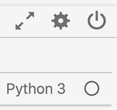

# Jupyter笔记本的查询服务

Adobe Experience Platform允许您在数据科学工作区中使用结构化查询语言(SQL)，方法是将查询服务作为标准功能集成到JupyterLab中。

本教程演示了以下SQL查询范例，这些范例用于探索、转换和分析Adobe Analytics数据的常见用例：

- [访问JupyterLab和查询服务](#access-jupyterlab-and-query-service)
- [查询数据](#query-your-data)
   - [每小时访客计数](#hourly-visitor-count)
   - [每小时活动计数](#hourly-activity-count)
   - [每访客会话的事件数](#number-of-events-per-visitor-session)
   - [指定日期的热门页面](#popular-pages-for-a-given-day)
   - [指定日期的活动用户](#active-users-for-a-given-day)
   - [按用户活动划分的活跃城市](#active-cities-by-user-activity)

## 入门指南

在开始本教程之前，您必须具备以下先决条件：

- 访问Adobe Experience Platform。 如果您无权访问Experience Platform中的IMS组织，请在继续操作之前与系统管理员联系

- Adobe Analytics数据集

- 对本教程中使用的以下主要概念的了解：
   - [体验数据模型(XDM)和XDM系统](../../xdm/home.md)
   - [查询服务](../../query-service/home.md)
   - [查询服务SQL语法](../../query-service/sql/overview.md)
   - Adobe Analytics

## 访问JupyterLab和查询服务

1. 在 [Experience Platform中](https://platform.adobe.com)，从左侧导航 **列导航** 到“模型”。 单击 **顶部标题** “Notebooks”（笔记本）以打开JupyterLab。 请稍等片刻，让JupyterLab加载。

   

   > [!NOTE] 如果未自动显示新的“启动器”选项卡，请通过单击“文件”>“新建启动器”，打开 **新的“启动器”选项卡**。

2. 在“启动器”选项卡中，单 **击** Python 3环境中的“空白”图标以打开空笔记本。

   

   > [!NOTE] Python 3是目前唯一支持的笔记本查询服务环境。

3. 在左侧选择边栏上，单击“数据 **”图标** ，然后多次单击“数据集 **** ”目录以列表所有数据集。

   

4. 查找要浏览的Adobe Analytics数据集并右键单击列表，单击“笔记本”中的 **查询数据** ，以在空笔记本中生成SQL查询。

5. 单击包含该函数的第一个生成的单元 `qs_connect()` 格，并通过单击播放按钮执行该单元格。 此函数在笔记本实例与查询服务之间建立连接。

   

6. 从第二个生成的SQL查询中复制Adobe Analytics数据集名称，它将是后面的值 `FROM`。

   

7. 单击+按钮插入新的笔记本 **单元** 格。

   

8. 在新单元格中复制、粘贴和执行以下导入语句。 这些语句将用于可视化您的数据：

   ```python
   import plotly.plotly as py
   import plotly.graph_objs as go
   from plotly.offline import iplot
   ```

9. 然后，在新单元格中复制并粘贴以下变量。 根据需要修改其值，然后执行它们。

   ```python
   target_table = "your Adobe Analytics dataset name"
   target_year = "2019"
   target_month = "04"
   target_day = "01"
   ```

   - `target_table` :您的Adobe Analytics数据集的名称。
   - `target_year` :目标数据来源的特定年份。
   - `target_month` :目标的具体月份。
   - `target_day` :目标数据所来自的特定日期。
   >[!NOTE] 您可以随时更改这些值。 执行该操作时，请务必为要应用的更改执行变量单元格。

## 查询数据

在各个笔记本单元格中输入以下SQL查询。 通过单击查询的单元格，然后单击播放按 **钮** 。 成功的查询结果或错误日志显示在执行的单元格下方。

当笔记本电脑长时间处于非活动状态时，笔记本电脑与查询服务之间的连接可能会断开。 在这种情况下，通过单击右上角的 **Power** （电源）按钮重新启动JupyterLab。



笔记本内核将重置，但单元格将保留，重 **新运行** 所有单元格以继续您上次中断的位置。

### 每小时访客计数

以下查询返回指定日期的每小时访客计数：

#### 查询

```sql
%%read_sql hourly_visitor -c QS_CONNECTION
SELECT Substring(timestamp, 1, 10)                               AS Day,
       Substring(timestamp, 12, 2)                               AS Hour, 
       Count(DISTINCT concat(enduserids._experience.aaid.id, 
                             _experience.analytics.session.num)) AS Visit_Count 
FROM   {target_table}
WHERE _acp_year = {target_year} 
      AND _acp_month = {target_month}  
      AND _acp_day = {target_day}
GROUP  BY Day, Hour
ORDER  BY Hour;
```

在上述查询中，子句 `_acp_year` 中的目标 `WHERE` 设置为的值 `target_year`。 将变量包含在大括号(`{}`)中，以在SQL查询中。

查询的第一行包含可选变量 `hourly_visitor`。 查询结果将作为Apcontics数据帧存储在该变量中。 将结果存储在数据帧中后，您可以使用所需的Python包稍后可视化查询结果。 在新单元格中执行以下Python代码以生成条形图：

```python
trace = go.Bar(
    x = hourly_visitor['Hour'],
    y = hourly_visitor['Visit_Count'],
    name = "Visitor Count"
)
layout = go.Layout(
    title = 'Visit Count by Hour of Day',
    width = 1200,
    height = 600,
    xaxis = dict(title = 'Hour of Day'),
    yaxis = dict(title = 'Count')
)
fig = go.Figure(data = [trace], layout = layout)
iplot(fig)
```

### 每小时活动计数

以下查询返回指定日期的每小时活动计数：

#### 查询 <!-- omit in toc -->

```sql
%%read_sql hourly_actions -d -c QS_CONNECTION
SELECT Substring(timestamp, 1, 10)                        AS Day,
       Substring(timestamp, 12, 2)                        AS Hour, 
       Count(concat(enduserids._experience.aaid.id, 
                    _experience.analytics.session.num,
                    _experience.analytics.session.depth)) AS Count 
FROM   {target_table}
WHERE  _acp_year = {target_year} 
       AND _acp_month = {target_month}  
       AND _acp_day = {target_day}
GROUP  BY Day, Hour
ORDER  BY Hour;
```

执行上述查询会将结果存储 `hourly_actions` 为数据帧。 在新单元格中执行以下函数以预览结果：

```python
hourly_actions.head()
```

可以修改上述查询，以使用 **WHERE子句中的逻辑运算符返回指定日期范围的每小时操作计数** :

#### 查询 <!-- omit in toc -->

```sql
%%read_sql hourly_actions_date_range -d -c QS_CONNECTION
SELECT Substring(timestamp, 1, 10)                        AS Day,
       Substring(timestamp, 12, 2)                        AS Hour, 
       Count(concat(enduserids._experience.aaid.id, 
                    _experience.analytics.session.num,
                    _experience.analytics.session.depth)) AS Count 
FROM   {target_table}
WHERE  timestamp >= TO_TIMESTAMP('2019-06-01 00', 'YYYY-MM-DD HH')
       AND timestamp <= TO_TIMESTAMP('2019-06-02 23', 'YYYY-MM-DD HH')
GROUP  BY Day, Hour
ORDER  BY Hour;
```

执行修改后的查询将将结果存储 `hourly_actions_date_range` 为数据帧。 在新单元格中执行以下函数以预览结果：

```python
hourly_actions_date_rage.head()
```

### 每访客会话的事件数

以下查询返回指定日期的每个访客会话的事件数：

#### 查询 <!-- omit in toc -->

```sql
%%read_sql events_per_session -c QS_CONNECTION
SELECT concat(enduserids._experience.aaid.id, 
              '-#', 
              _experience.analytics.session.num) AS aaid_sess_key, 
       Count(timestamp)                          AS Count 
FROM   {target_table}
WHERE  _acp_year = {target_year} 
       AND _acp_month = {target_month}  
       AND _acp_day = {target_day}
GROUP BY aaid_sess_key
ORDER BY Count DESC;
```

执行以下Python代码以生成每次访问会话的事件数直方图：

```python
data = [go.Histogram(x = events_per_session['Count'])]

layout = go.Layout(
    title = 'Histogram of Number of Events per Visit Session',
    xaxis = dict(title = 'Number of Events'),
    yaxis = dict(title = 'Count')
)

fig = go.Figure(data = data, layout = layout)
iplot(fig)
```

### 指定日期的热门页面

以下查询返回指定日期中十个最受欢迎的页面：

#### 查询 <!-- omit in toc -->

```sql
%%read_sql popular_pages -c QS_CONNECTION
SELECT web.webpagedetails.name                 AS Page_Name, 
       Sum(web.webpagedetails.pageviews.value) AS Page_Views 
FROM   {target_table}
WHERE  _acp_year = {target_year}
       AND _acp_month = {target_month}
       AND _acp_day = {target_day}
GROUP  BY web.webpagedetails.name 
ORDER  BY page_views DESC 
LIMIT  10;
```

### 指定日期的活动用户

以下查询返回指定日期中最活跃的十个用户：

#### 查询 <!-- omit in toc -->

```sql
%%read_sql active_users -c QS_CONNECTION
SELECT enduserids._experience.aaid.id AS aaid, 
       Count(timestamp)               AS Count
FROM   {target_table}
WHERE  _acp_year = {target_year}
       AND _acp_month = {target_month}
       AND _acp_day = {target_day}
GROUP  BY aaid
ORDER  BY Count DESC
LIMIT  10;
```

### 按用户活动划分的活跃城市

以下查询返回在指定日期生成大部分用户活动的十个城市：

#### 查询 <!-- omit in toc -->

```sql
%%read_sql active_cities -c QS_CONNECTION
SELECT concat(placeContext.geo.stateProvince, ' - ', placeContext.geo.city) AS state_city, 
       Count(timestamp)                                                     AS Count
FROM   {target_table}
WHERE  _acp_year = {target_year}
       AND _acp_month = {target_month}
       AND _acp_day = {target_day}
GROUP  BY state_city
ORDER  BY Count DESC
LIMIT  10;
```

## 后续步骤 <!-- omit in toc -->

本教程演示了在Jupyter笔记本中使用查询服务的一些示例用例。 请按照 [使用Jupyter Notebooks](./analyze-your-data.md) （笔记本）教程分析数据，了解如何使用Data Access SDK执行类似操作。