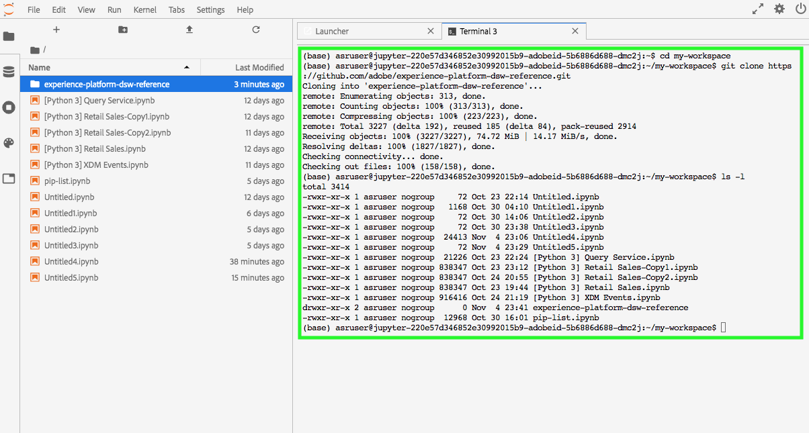

# 在JupyterLab中使用Git进行协作

Git是一种分布式版本控制系统，用于跟踪软件开发过程中源代码的更改。 Git预安装在Data Science Workspace JupyterLab环境中。

## 先决条件

>[!NOTE]
> 您要使用的Git服务器需要通过Internet访问。

数据科学工作区JupyterLab环境是一个托管环境，未部署在公司防火墙内，因此您连接到的Git服务器必须可从公共Internet访问。 这可以是GitHub上的公 [共或](https://github.com/) 专用存储库，也可以是您决定自行托管的Git服务器的其他实例。

## 将Git连接到数据科学工作区JupyterLab笔记本环境

开始，启动Adobe Experience Platform并导航到 [JupyterLabs Notebooks](https://platform.adobe.com/notebooks/jupyterLab) 环境。

在JupyterLab中，选择“ **[!UICONTROL 文件]** ”，然后悬停在“ **[!UICONTROL 新建”上]**。 从显示的下拉菜单中，选择 **[!UICONTROL 终端]**。

然后，在终 *端中* ，使用以下命令导航到您的工作区： `cd my-workspace`.

>[!TIP]
> 要查看一列表可用的git命令，请发出以下命令： `git -help` 在终端中。

然后，使用命令克隆要使用的存储 `git clone` 库。 使用URL而不是 `https://` URL克隆您的项 `ssh://`目。

**示例**:

`git clone https://github.com/adobe/experience-platform-dsw-reference.git`

>[!NOTE]
> 要执行任何写操作(例`git push` 如)，需要对每个新会话运行以下配置命令。 另请注意，任何推送命令都会提示输入用户名和密码。
>
>`git config --global user.email "you@example.com"`
>
>`git config --global user.name "Your Name"`

## 后续步骤

克隆完存储库后，您可以像在本地计算机上一样使用Git，在笔记本上与他人协作。 有关在JupyterLab中可以做什么的详细信息，请参 [阅JupyterLab用户指南](./overview.md)。
