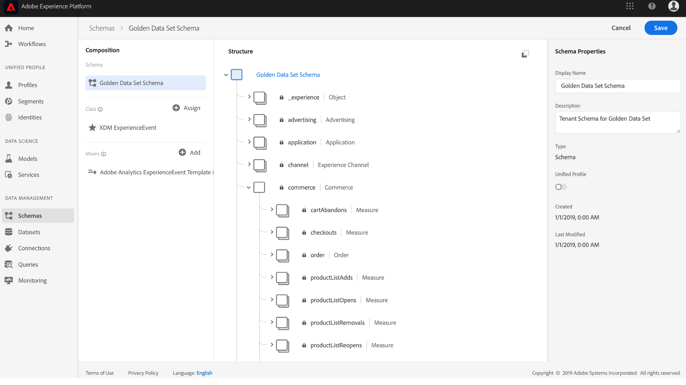
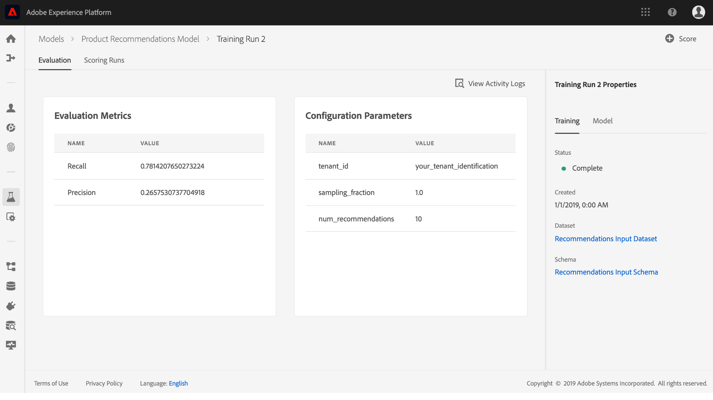

# 创建和发布机器学习模型

假装您拥有在线零售网站。 当您的客户在您的零售网站上购物时，您希望向他们提供个性化的产品建议，以展示您的业务优惠的各种其他产品。 在您网站的存在期间，您不断收集客户数据，并希望以某种方式利用这些数据生成个性化的产品推荐。

[!DNL Adobe Experience Platform] [!DNL Data Science Workspace] 借助预建的产品Recommendations菜谱，提供实现您 [目标的方法](../pre-built-recipes/product-recommendations.md)。请按照本教程，了解如何访问和了解您的零售数据、创建和优化机器学习模型以及在[!DNL Data Science Workspace]中生成洞察。

本教程介绍了[!DNL Data Science Workspace]的工作流，并介绍了创建机器学习模型的以下步骤：

1. [准备数据](#prepare-your-data)
2. [创作模型](#author-your-model)
3. [培训和评估您的模型](#train-and-evaluate-your-model)
4. [操作模型](#operationalize-your-model)

## 入门指南

在开始本教程之前，您必须具有以下先决条件：

* 访问[!DNL Adobe Experience Platform]。 如果您无权访问[!DNL Experience Platform]中的IMS组织，请在继续操作前与系统管理员联系。

* Enablement Assets。 请联系您的客户代表，为您提供以下项目。
   * Recommendations菜谱
   * Recommendations输入数据集
   * Recommendations输入模式
   * Recommendations输出数据集
   * Recommendations产出模式
   * 黄金数据集postValues
   * 黄金数据集模式

* 从[Adobe公共 [!DNL Git] 存储库](https://github.com/adobe/experience-platform-dsw-reference/tree/master/Summit/2019/resources/Notebooks-Thurs)下载三个必需的[!DNL Jupyter Notebook]文件，这些文件将用于演示[!DNL Data Science Workspace]中的[!DNL JupyterLab]工作流。

* 对本教程中使用的下列主要概念的有效理解：
   * [[!DNL Experience Data Model]](../../xdm/home.md):由Adobe领导的标准化工作，为客户体验管理定 [!DNL Profile] 义标准模式，如和ExperienceEvent。
   * 数据集：实际数据的存储和管理结构。 [XDM模式](../../xdm/schema/field-dictionary.md)的物理实例化实例。
   * 批：数据集由批量组成。 批是在一段时间内收集的一组数据，并作为单个单元一起处理。
   * [!DNL JupyterLab]: [[!DNL JupyterLab]](https://blog.jupyter.org/jupyterlab-is-ready-for-users-5a6f039b8906) 是一个面向Project的开放源码、基于web的界 [!DNL Jupyter] 面，并紧密集成到 [!DNL Experience Platform]中

## 准备数据{#prepare-your-data}

要创建能够向客户提供个性化产品建议的机器学习模型，必须分析您网站上先前的客户购买情况。 本节探讨如何通过[!DNL Adobe Analytics]将此数据引入[!DNL Platform]，以及如何将该数据转换为功能数据集以供机器学习模型使用。

### 浏览数据并了解模式

1. 登录到[Adobe Experience Platform](https://platform.adobe.com/)并单击&#x200B;**[!UICONTROL 数据集]**&#x200B;以列表所有现有数据集并选择要浏览的数据集。 在这种情况下，[!DNL Analytics]数据集&#x200B;**Golden Data Set postValues**。
   
2. 选择右上角附近的&#x200B;**[!UICONTROL 预览数据集]**&#x200B;检查示例记录，然后单击&#x200B;**[!UICONTROL 关闭]**。
   
3. 选择右边栏中模式下的链接以视图数据集的模式，然后返回数据集详细信息页面。”
   

其他数据集已预先填充了批，以便进行预览。 您可以重复上述步骤来视图这些数据集。

| 数据集名称 | 架构 | 描述 |
| ----- | ----- | ----- |
| 黄金数据集postValues | 黄金数据集模式 | [!DNL Analytics] 您网站的源数据 |
| Recommendations输入数据集 | Recommendations输入模式 | 使用特征管道将[!DNL Analytics]数据转换为培训数据集。 此数据用于培训产品Recommendations机器学习模型。 `itemid` 和与 `userid` 该客户购买的产品相对应。 |
| Recommendations输出数据集 | Recommendations产出模式 | 存储了评分结果的数据集，它将包含每个客户推荐产品的列表。 |

## 创作您的型号{#author-your-model}

[!DNL Data Science Workspace]生命周期的第二个组件涉及创作方法和模型。 产品Recommendations处方旨在通过利用过去的购买数据和机器学习大规模生成产品推荐。

菜谱是模型的基础，因为它们包含机器学习算法和用于解决特定问题的逻辑。 更重要的是，菜谱使您能够在整个组织内实现机器学习的大众化，使其他用户能够访问针对不同用例的模型，而无需编写任何代码。

### 浏览产品Recommendations秘方

1. 在[!DNL Adobe Experience Platform]中，从左侧导航列导航到&#x200B;**[!UICONTROL 模型]**，然后单击顶部的&#x200B;**[!UICONTROL 方法]**以视图组织的可用方法列表。
   
2. 单击提供的&#x200B;**[!UICONTROL Recommendations菜谱]**名称，找到并打开它。
   
3. 在右边栏中，单击&#x200B;**[!UICONTROL Recommendations输入模式]**&#x200B;以视图为菜谱通电的模式。 模式字段“[!UICONTROL itemId]”和“[!UICONTROL userId]”对应于该客户在特定时间([!UICONTROL timestamp])购买的产品([!UICONTROL interactionType])。 按照相同的步骤查看&#x200B;**[!UICONTROL Recommendations输出模式]**的字段。
   

您现在已查看了“产品Recommendations处方”要求的输入和输出模式。 您现在可以继续阅读下一节，了解如何创建、培训和评估产品Recommendations模型。

## 培训并评估您的型号{#train-and-evaluate-your-model}

现在您的数据已准备就绪，菜谱已经可供使用，您可以创建、培训和评估您的机器学习模型。

### 创建模型

模型是处方的一个实例，使您能够大规模地对数据进行培训和评分。

1. 在[!DNL Adobe Experience Platform]中，从左侧导航列导航到&#x200B;**[!UICONTROL 模型]**，然后单击页面顶部的&#x200B;**[!UICONTROL 方法]**以显示您组织的所有可用方法的列表。
   
2. 通过单击菜谱的名称，输入菜谱的概述页，找到并打开提供的&#x200B;**[!UICONTROL Recommendations菜谱]**。 单击&#x200B;**[!UICONTROL 从中心（如果没有现有模型）或从“处方概述”页的右上角创建模型]**。
   
3. 显示培训的可用输入数据集列表，选择&#x200B;**[!UICONTROL Recommendations输入数据集]**&#x200B;并单击&#x200B;**[!UICONTROL 下一步]**。
   
4. 提供模型的名称，例如“产品Recommendations模型”。 此时会列出模型的可用配置，其中包含模型的默认培训和评分行为的设置。 由于这些配置特定于您的组织，因此无需进行任何更改。 查看配置并单击&#x200B;**[!UICONTROL 完成]**。
   
5. 模型现已创建，新生成的培训运行中将显示模型的&#x200B;*概述*页。 默认情况下，创建模型时会生成培训运行。
   

您可以选择等待培训运行完成，或在下一节中继续创建新的培训运行。

### 使用自定义超参数训练模型

1. 在&#x200B;**模型概述**&#x200B;页面上，单击右上角附近的&#x200B;**[!UICONTROL 培训]**&#x200B;以创建新的培训运行。 选择创建模型时使用的同一输入数据集，然后单击&#x200B;**[!UICONTROL Next]**。
   
2. 将显示&#x200B;**配置**&#x200B;页。 您可以在此配置培训运行的“[!UICONTROL num_recommendations]”值，也称为超级参数。 经过训练和优化的模型将根据训练结果使用性能最佳的超参数。

   无法学习超参数，因此必须在进行培训之前分配超参数。 调整超参数可能会改变训练模型的精度。 由于优化模型是一个迭代过程，因此在获得满意的评估之前可能需要多次培训运行。

   >[!TIP]
   >
   >将&#x200B;**[!UICONTROL num_recommendations]**&#x200B;设置为10。

   
3. 新培训运行完成后，模型评估图表上将显示一个额外的数据点，这可能需要几分钟时间。
   

### 评估模型

每次培训运行完成时，您都可以视图生成的评估指标，以确定模型的执行情况。

1. 单击培训运行，查看每个已完成培训运行的评估指标（精确度和召回率）。
2. 浏览为每个评估指标提供的信息。 这些指标越高，模型执行得越好。
   
3. 您可以在右侧边栏上查看用于每个培训运行的数据集、模式和配置参数。
4. 导航回“模型”页，通过观察培训的评估指标确定运行效果最好的培训。

## 操作模型{#operationalize-your-model}

数据科学工作流程的最后一步是操作模型，以便从数据存储中得分和使用洞察。

### 评分和生成洞察

1. 在产品推荐“模型&#x200B;*概述*”页面上，单击性能最佳的培训运行的名称，其中具有最高的召回率和精确度值。
2. 在培训运行详细信息页面的右上角，单击&#x200B;**[!UICONTROL 得分]**。
3. 选择&#x200B;**[!UICONTROL Recommendations输入数据集]**&#x200B;作为评分输入数据集，该数据集与您创建模型并执行其培训运行时使用的数据集相同。 然后，单击&#x200B;**[!UICONTROL 下一步]**。
   
4. 选择&#x200B;**[!UICONTROL Recommendations输出数据集]**作为评分输出数据集。 评分结果将作为批处理存储在此数据集中。
   
5. 查看评分配置。 这些参数包含先前选择的输入和输出数据集以及相应的模式。 单击&#x200B;**[!UICONTROL 完成]**开始计分运行。 运行可能需要几分钟才能完成。
   

### 视图洞察

评分运行成功完成后，您将能够预览结果并视图生成的洞察。

1. 在评分运行页面上，单击已完成的评分运行，然后单击右边栏上的&#x200B;**[!UICONTROL 预览评分结果数据集]**。
   
2. 在预览表中，每行包含针对特定客户的产品推荐，分别标记为[!UICONTROL 推荐]和[!UICONTROL userId]。 由于示例屏幕截图中的[!UICONTROL num_recommendations]超参数设置为10，因此每行推荐最多可包含10个产品标识，用数字符号(#)分隔。
   

## 后续步骤 {#next-steps}

做得好，您已成功生成产品推荐！

本教程向您介绍了[!DNL Data Science Workspace]的工作流程，演示如何通过机器学习将未经处理的原始数据转换为有用的信息。 要进一步了解如何使用[!DNL Data Science Workspace]，请继续阅读有关创建零售销售模式和数据集](./create-retails-sales-dataset.md)的下一个指南。[