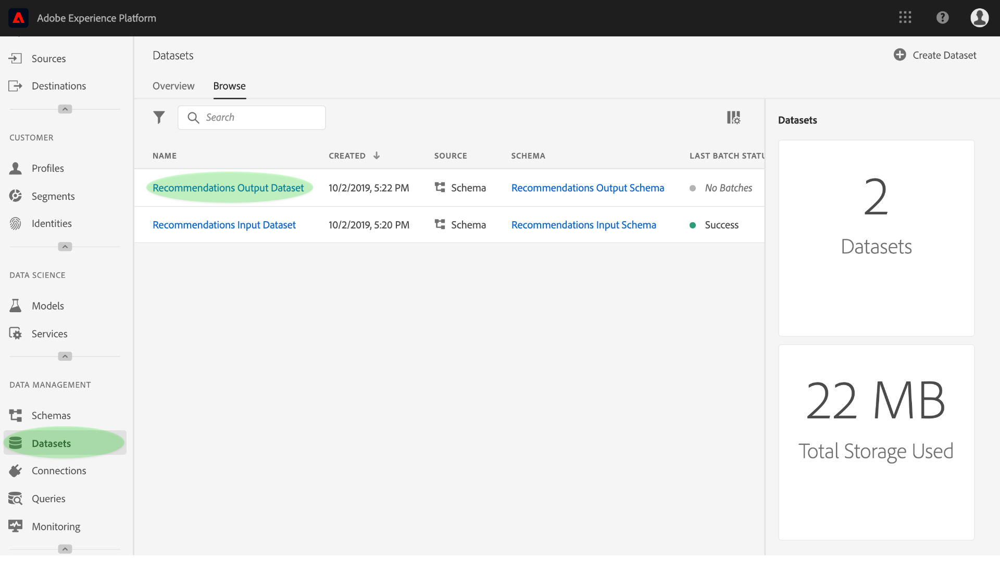
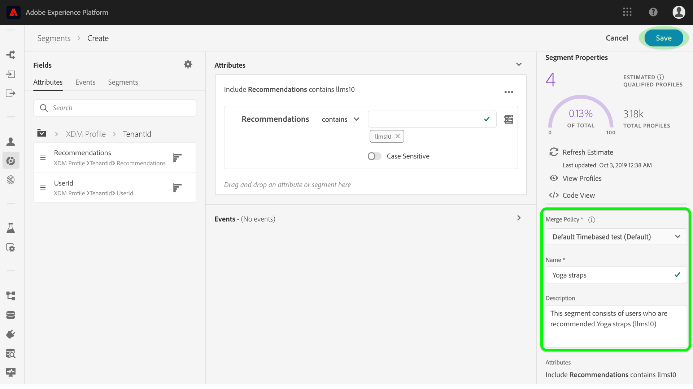

# 利用机器学习洞察丰富实时客户用户档案

Adobe Experience Platform Data Science Workspace提供了用于创建、评估和利用机器学习模型生成数据预测和洞察的工具和资源。 当机器学习洞察被引入支持用户档案的数据集时，同一数据也被作为用户档案记录被引入，然后使用Experience Platform Segmentation Service将这些记录细分为相关元素的子集。

本文档提供了一个分步教程，用于通过机器学习洞察丰富实时客户用户档案，其中分为以下几节分步介绍：

1. [创建输出模式和数据集](#create-an-output-schema-and-dataset)
2. [配置输出模式和数据集](#configure-an-output-schema-and-dataset)
3. [使用“区段生成器”创建区段](#create-segments-using-the-segment-builder)

## 入门指南

本教程需要对Adobe Experience Platform的各个方面进行有效的理解，这些方面涉及获取用户档案数据和创建细分。 在开始本教程之前，请查看以下服务的相关文档：

* [实时客户用户档案](../../rtcdp/overview.md):根据来自多个来源的汇总数据提供统一、实时的消费者用户档案。
* [标识服务](../../identity-service/home.md):通过将来自不同数据源的身份引入平台，实现实时客户用户档案。
* [体验数据模型(XDM)](../../xdm/home.md):平台通过标准化框架组织客户体验数据。

除了上述文档之外，强烈建议您查看以下模式和模式编辑指南：

* [模式合成的基础知识](../../xdm/schema/composition.md):介绍XDM模式、构件块、原则和最佳实践，以组成要在Experience Platform中使用的模式。
* [模式编辑器教程](../../xdm/tutorials/create-schema-ui.md):提供有关使用Experience Platform中的模式编辑器创建模式的详细说明。

## 创建输出模式和数据集

通过评分洞察丰富实时客户用户档案的第一步是了解您的数据定义的真实对象（如人）。 了解数据使您能够描述和设计一种对数据有意义的结构，就像设计关系数据库一样。

编写模式从指定类开始。 类定义模式将包含的数据的行为方面（记录或时间序列）。 本节提供使用模式构建器创建模式的基本说明。 有关更详细的教程，请参阅有关使用模式编 [辑器创建模式的教程](../../xdm/tutorials/create-schema-ui.md)。

1. 在Adobe Experience Platform上，单击“模式 **”** ()选项卡以访问模式浏览器。 单击 **创建模式** ，访问 *模式编辑器*，您可以在其中交互构建和创建模式。
   

2. 在“合 *成* ”窗口中，单 **击“分配** ”以浏览可用类。
   * 要分配现有类，请单击并突出显示所需的类，然后单击“分 **配类”**。
      

   * 要创建自定义类，请单击 **在浏览器窗口的中心顶部附近的** “创建新类”。 提供类名称、说明，然后选择类的行为。 完成 **后，单击** “分配类”。
      
   此时，您的模式结构应包含一些类字段，并且您已准备好分配混音。 混合是描述特定概念的一个或多个字段的组。

3. 在“合 *成* ”窗口中，单 **击“Mixins** ”子 *部分中的“添加* ”。
   * 要分配现有混音，请单击并高亮显示所需的混音，然后单击“添 **加混音”**。 与类不同，只要适当，多个混音就可以分配给单个模式。
      

   * 要创建新混音，请单击浏 **览器窗口中心顶部附近的** “新建混音”。 提供混音的名称和说明，然后在完成后 **单击“指定混音** ”。
      

   * 要添加混音字段，请在“合成”窗口中单击混音的 *名称* 。 然后，您将可以通过单击“结构”窗口中的“添加字段” **来添加混音** , *以选择* 。 确保相应地提供混音属性。
      

4. 构建完模式后，在“结构”窗口中单击模式的顶级字段，以在右侧属性窗口中显示模式的属性。 ** 提供名称和说明，然后单击“ **保存** ”以创建模式。
   

5. 使用新创建的模式创建输出数据集，方法是单击左侧导航列 **中的数据集** ，然后单击创 **建数据集**。 在下一个屏幕上，选择“从 **模式创建数据集”**。
   

6. 使用模式浏览器，查找并选择新创建的模式，然后单击“下 **一步”**。
   

7. 提供名称和可选说明，然后单击 **完成** ，以创建数据集。
   

现在您已经创建了输出模式数据集，您可以继续到下一节来配置和启用它们以进行用户档案扩充。

## 配置输出模式和数据集

在启用数据集进行用户档案之前，您需要先配置数据集的模式，使其具有主标识字段，然后启用模式进行用户档案。 如果要创建并启用新模式，可参阅有关使用模式编辑 [器创建模式的教程](../../xdm/tutorials/create-schema-ui.md)。 否则，请按照以下说明启用现有模式和数据集。

1. 在Adobe Experience Platform上，使用模式浏览器查找要启用用户档案的输出模式，然后单击其名称以视图其合成。
   

2. 展开模式结构并查找要设置为主标识符的相应字段。 单击所需字段以显示其属性。
   

3. 通过启用字段的 **Identity** 属性、 **Primary Identity** 属性，然后选择相应的标识命名空间，将字段设置为主 **标识**。 进行 **更改后** ，单击“应用”。
   

4. 单击模式结构的顶级对象以显示模式属性，并通过切换用户档案开关启用用户档案 **模式** 。 单击 **保存** ，以完成更改，现在可以启用此模式创建的数据集以进行用户档案。
   

5. 使用数据集浏览器查找要启用用户档案的数据集，然后单击其名称以访问其详细信息。
   

6. 通过切换右侧信息列中的 **用户档案开关** ，启用数据集以进行用户档案。
   

当将数据引入支持用户档案的数据集时，同一数据也会作为用户档案记录被引入。 现在您的模式和数据集已准备好，可使用相应的模型执行评分运行，从而将一些数据生成到数据集中，并继续本教程以使用“区段生成器”创建分析区段。

## 使用“区段生成器”创建区段

现在，您已经生成洞察并将其引入支持用户档案的数据集，您可以通过使用区段生成器识别相关元素的子集来管理这些数据。 请按照以下步骤构建您自己的细分。

1. 在Adobe Experience Platform上，单击“区段” **选项卡** ，后跟 **“创建区段** ”以访问区段生成器。
   

2. 在“区段生成器”中，左边栏提供了对区段核心构建块的访问：属性、事件和现有区段。 每个构建块都显示在其各自的选项卡中。 选择您的启用用户档案的模式所扩展的类，然后浏览并查找区段的构建块。
   

3. 将构建块拖放到规则构建器画布上，通过提供比较语句完成它们。
   

4. 在构建区段时，您可以通过观察区段属性面板来预览估计的 *区段结果* 。
   

5. 选择适当的 **合并策略**，提供名称和可选说明，然后单击 **保存** ，以完成新细分。
   

## 后续步骤

此文档指导您完成启用模式和数据集进行用户档案所需的步骤，并简要演示了使用区段生成器创建分析区段的工作流。 要进一步了解区段和区段生成器，请参阅分段 [服务概述](../../segmentation/home.md)。