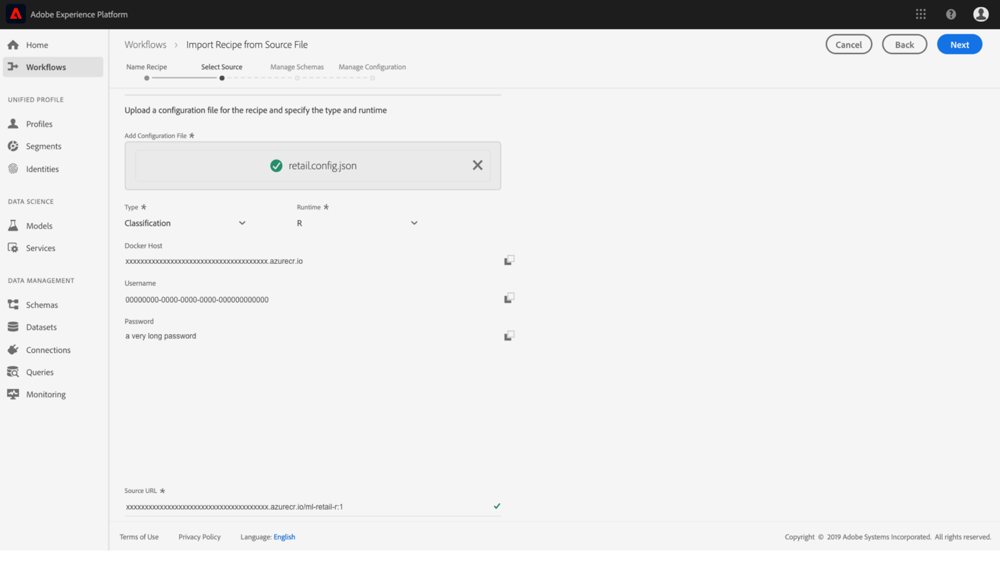

# 导入打包菜谱(UI)

本教程使用提供的零售销售示例提供有关如何配置和导入打包菜谱的分析。 在本教程结束时，您将准备好在Adobe Experience Platform Data Science Workspace中创建、培训和评估模型。

## 先决条件

本教程需要以Docker图像URL形式打包的菜谱。 有关详细信息，请参 [阅有关如何将源文件打包到菜谱](./package-source-files-recipe.md) 的教程。

## UI工作流程

将打包的菜谱导入Data Science Workspace需要特定菜谱配置，并编译为单个JavaScript对象表示法(JSON)文件，此菜谱配置编译称为配置 **文件**。 具有一组特定配置的打包菜谱称为菜谱 **实例**。 一个菜谱可用于在Data Science Workspace中创建许多菜谱实例。

导入包菜谱的工作流包括以下步骤：
- [配置菜谱](#configure)
- [导入基于Docker的菜谱- Python](#python)
- [导入基于Docker的菜谱- R](#r)
- [导入基于Docker的菜谱- PySpark](#pyspark)
- [导入基于Docker的菜谱- Scala](#scala)

已弃用的工作流:
- [导入基于二进制的菜谱- PySpark](#pyspark-deprecated)
- [导入基于二进制的菜谱- Scala Spark](#scala-deprecated)

### 配置菜谱 {#configure}

Data Science Workspace中的每个菜谱实例都附带一组配置，这些配置可根据特定用例定制菜谱实例。 配置文件定义使用此菜谱实例创建的模型的默认培训和评分行为。

>[!NOTE] 配置文件是特定于菜谱和大小写的。

以下是一个示例配置文件，其中显示了零售销售菜谱的默认培训和评分行为。

```json
[
    {
        "name": "train",
        "parameters": [
            {
                "key": "learning_rate",
                "value": "0.1"  
            },
            {
                "key": "n_estimators",
                "value": "100"
            },
            {
                "key": "max_depth",
                "value": "3"
            },
            {
                "key": "ACP_DSW_INPUT_FEATURES",
                "value": "date,store,storeType,storeSize,temperature,regionalFuelPrice,markdown,cpi,unemployment,isHoliday"
            },
            {
                "key": "ACP_DSW_TARGET_FEATURES",
                "value": "weeklySales"
            },
            {
                "key": "ACP_DSW_FEATURE_UPDATE_SUPPORT",
                "value": false
            },
            {
                "key": "tenantId",
                "value": "_{TENANT_ID}"
            },
            {
                "key": "ACP_DSW_TRAINING_XDM_SCHEMA",
                "value": "{SEE BELOW FOR DETAILS}"
            },
            {
                "key": "evaluation.labelColumn",
                "value": "weeklySalesAhead"
            },
            {
                "key": "evaluation.metrics",
                "value": "MAPE,MAE,RMSE,MASE"
            }
        ]
    },
    {
        "name": "score",
        "parameters": [
            {
                "key": "tenantId",
                "value": "_{TENANT_ID}"
            },
            {
                "key":"ACP_DSW_SCORING_RESULTS_XDM_SCHEMA",
                "value":"{SEE BELOW FOR DETAILS}"
            }
        ]
    }
]
```

| 参数键 | 类型 | 描述 |
| ----- | ----- | ----- |
| `learning_rate` | 数值 | 渐变乘的标量。 |
| `n_estimators` | 数值 | 随机森林分类器森林中树木的数量。 |
| `max_depth` | 数值 | 随机森林分类器中树的最大深度。 |
| `ACP_DSW_INPUT_FEATURES` | 字符串 | 列表以逗号分隔的输入模式属性。 |
| `ACP_DSW_TARGET_FEATURES` | 字符串 | 列表以逗号分隔的输出模式属性。 |
| `ACP_DSW_FEATURE_UPDATE_SUPPORT` | Boolean | 确定输入和输出功能是否可修改 |
| `tenantId` | 字符串 | 此ID可确保您创建的资源命名正确并包含在IMS组织中。 [请按照此处的步骤](../../xdm/api/getting-started.md#know-your-tenant_id) ，查找您的租户ID。 |
| `ACP_DSW_TRAINING_XDM_SCHEMA` | 字符串 | 用于培训模型的输入模式。 在UI中导入时将此值留空，在使用API导入时，将其替换为培训SchemaID。 |
| `evaluation.labelColumn` | 字符串 | 用于评估可视化的列标签。 |
| `evaluation.metrics` | 字符串 | 用于评估模型的评估指标的以逗号分隔的列表。 |
| `ACP_DSW_SCORING_RESULTS_XDM_SCHEMA` | 字符串 | 用于对模型进行评分的输出模式。 在UI中导入时将此值留空，在使用API导入时，将其替换为评分SchemaID。 |

在本教程中，您可以保留数据科学工作区参考中零售销售菜谱的默认配置文件。

### 导入基于Docker的菜谱- Python {#python}

开始，方法是导 **[!UICONTROL Workflows]** 航并选择位于平台UI左上角的位置。 接下来，选择“ *导入菜谱* ”并单击 **[!UICONTROL Launch]**。


此时将 *显示* “导入菜谱” *工作流的“配置* ”页。 输入菜谱的名称和说明，然后 **[!UICONTROL Next]** 在右上角选择。


>[!NOTE]
> 在将源文 [件打包到菜谱教程中](./package-source-files-recipe.md) ，使用Python源文件构建零售销售菜谱的结尾处提供了一个Docker URL。

在“选择源”页 *面上* ，在字段中粘贴与使用Python源文件构建的打包菜谱对应的Docker URL **[!UICONTROL Source URL]** 。 然后，通过拖放导入提供的配置文件，或使用文件系统浏 **览器**。 可在上找到提供的配置文件 `experience-platform-dsw-reference/recipes/python/retail/retail.config.json`。 在“ **[!UICONTROL Python]** 运行 *时* ”下拉列表和“ **[!UICONTROL Classification]** 类型 *”下拉列表中选* 择。 填写完所有内容后，单 **[!UICONTROL Next]** 击右上角的以继续“管理 *模式”*。

>[!NOTE]
> *Type *supports **[!UICONTROL Classification]**and **[!UICONTROL Regression]**. 如果模型不属于这些类型之一，请选择&#x200B;**[!UICONTROL Custom]**。


接下来，在“管理模式”部分下选择“零售模式”输入和输出 *，这些输入和输出是使用创建零售模式和数据集教程中提供的引导*&#x200B;脚本创建的 [](../models-recipes/create-retails-sales-dataset.md) 。


在“功 *能管理* ”部分下，在模式查看器中单击租户标识以展开“零售销售”输入模式。 通过突出显示所需功能并在右窗口中选择或选择 **[!UICONTROL Input Feature]** 输入 **[!UICONTROL Target Feature]** 和输出功 **[!UICONTROL Field Properties]** 能。 在本教程中，将其设置为， **[!UICONTROL weeklySales]** 并将其 **[!UICONTROL Target Feature]** 他项设置为 **[!UICONTROL Input Feature]**。 单击 **[!UICONTROL Next]** 查看您新配置的菜谱。

根据需要查看菜谱、添加、修改或删除配置。 单击 **[!UICONTROL Finish]** 以创建菜谱。


继续执行下 [一步](#next-steps) ，了解如何使用新创建的零售销售菜谱在Data Science Workspace中创建模型。

### 导入基于Docker的菜谱- R {#r}

开始，方法是导 **[!UICONTROL Workflows]** 航并选择位于平台UI左上角的位置。 接下来，选择“ *导入菜谱* ”并单击 **[!UICONTROL Launch]**。


此时将 *显示* “导入菜谱” *工作流的“配置* ”页。 输入菜谱的名称和说明，然后 **[!UICONTROL Next]** 在右上角选择。


>[!NOTE]
> 在将源 [文件打包到菜谱教程中](./package-source-files-recipe.md) ，在使用R源文件构建零售销售菜谱的结尾处提供了一个Docker URL。

在“选择源”页 *面上* ，粘贴与使用R源文件构建的打包菜谱对应的Docker URL（文档URL） **[!UICONTROL Source URL]** 字段。 然后，通过拖放导入提供的配置文件，或使用文件系统浏 **览器**。 可在上找到提供的配置文件 `experience-platform-dsw-reference/recipes/R/Retail\ -\ GradientBoosting/retail.config.json`。 在“ **[!UICONTROL R]** 运行 *时* ”下拉列表和 **[!UICONTROL Classification]** “类型 *”下拉列表中选* 择。 填写完所有内容后，单 **[!UICONTROL Next]** 击右上角的以继续“管理 *模式”*。

>[!NOTE]
> *Type *supports **[!UICONTROL Classification]**and **[!UICONTROL Regression]**. 如果模型不属于这些类型之一，请选择&#x200B;**[!UICONTROL Custom]**。



接下来，在“管理模式”部分下选择“零售模式”输入和输出 *，这些输入和输出是使用创建零售模式和数据集教程中提供的引导*&#x200B;脚本创建的 [](../models-recipes/create-retails-sales-dataset.md) 。


在“功 *能管理* ”部分下，在模式查看器中单击租户标识以展开“零售销售”输入模式。 通过突出显示所需功能并在右窗口中选择或选择 **[!UICONTROL Input Feature]** 输入 **[!UICONTROL Target Feature]** 和输出功 **[!UICONTROL Field Properties]** 能。 在本教程中，将其设置为， **[!UICONTROL weeklySales]** 并将其 **[!UICONTROL Target Feature]** 他项设置为 **[!UICONTROL Input Feature]**。 单击 **[!UICONTROL Next]** 以查看您的新配置菜谱。

根据需要查看菜谱、添加、修改或删除配置。 单击 **完成** ，以创建菜谱。


继续执行下 [一步](#next-steps) ，了解如何使用新创建的零售销售菜谱在Data Science Workspace中创建模型。

### 导入基于Docker的菜谱- PySpark {#pyspark}

开始，方法是导 **[!UICONTROL Workflows]** 航并选择位于平台UI左上角的位置。 接下来，选择“ *导入菜谱* ”并单击 **[!UICONTROL Launch]**。


此时将 *显示* “导入菜谱” *工作流的“配置* ”页。 输入菜谱的名称和说明，然后 **[!UICONTROL Next]** 在右上角选择以继续。


>[!NOTE]
> 在将源文 [件打包到菜谱教程中](./package-source-files-recipe.md) ，使用PySpark源文件构建零售销售菜谱的结尾处提供了一个Docker URL。

在“选择源 *”页上后，请在字段中粘贴与使用PySpark源文件构建的打包菜谱对应的Docker URL***[!UICONTROL Source URL]** 。 然后，通过拖放导入提供的配置文件，或使用文件系统浏 **览器**。 可在上找到提供的配置文件 `experience-platform-dsw-reference/recipes/pyspark/retail/pipeline.json`。 在“ **[!UICONTROL PySpark]** 运行时 *”下拉框中* 选择。 选择PySpark运行时后，将自动填充默认伪像 **[!UICONTROL Docker]**。 接下来，在 **[!UICONTROL Classification]** 类型下拉 *框中* 选择。 填写完所有内容后，单 **[!UICONTROL Next]** 击右上角的以继续“管理 *模式”*。

>[!NOTE]
> *Type *supports **[!UICONTROL Classification]**and **[!UICONTROL Regression]**. 如果模型不属于这些类型之一，请选择&#x200B;**[!UICONTROL Custom]**。


接下来，在“管理模式”部分下选择“零售模式”输入和输出 *，这些输入和输出是使用创建零售模式和数据集教程中提供的引导*&#x200B;脚本创建的 [](../models-recipes/create-retails-sales-dataset.md) 。


在“功 *能管理* ”部分下，在模式查看器中单击租户标识以展开“零售销售”输入模式。 通过突出显示所需功能并在右窗口中选择或选择 **[!UICONTROL Input Feature]** 输入 **[!UICONTROL Target Feature]** 和输出功 **[!UICONTROL Field Properties]** 能。 在本教程中，将其设置为， **[!UICONTROL weeklySales]** 并将其 **[!UICONTROL Target Feature]** 他项设置为 **[!UICONTROL Input Feature]**。 单击 **[!UICONTROL Next]** 查看您新配置的菜谱。

根据需要查看菜谱、添加、修改或删除配置。 单击 **[!UICONTROL Finish]** 以创建菜谱。


继续执行下 [一步](#next-steps) ，了解如何使用新创建的零售销售菜谱在Data Science Workspace中创建模型。

### 导入基于Docker的菜谱- Scala {#scala}

开始，方法是导 **[!UICONTROL Workflows]** 航并选择位于平台UI左上角的位置。 接下来，选择“ *导入菜谱* ”并单击 **[!UICONTROL Launch]**。


此时将 *显示* “导入菜谱” *工作流的“配置* ”页。 输入菜谱的名称和说明，然后 **[!UICONTROL Next]** 在右上角选择以继续。


>[!NOTE]
> 在将源文 [件打包到菜谱教程中](./package-source-files-recipe.md) ，使用Scala(Spark)源文件构建零售销售菜谱的结尾处提供了一个Docker URL。

在“选择源 *”页上，粘贴与使用“源URL”字段中的“缩放源文件”构建的打包菜谱对应的Docker URL*** 。 然后，通过拖放导入提供的配置文件，或使用文件系统浏 **览器**。 可在上找到提供的配置文件 `experience-platform-dsw-reference/recipes/scala/retail/pipelineservice.json`。 在“ **[!UICONTROL Spark]** 运行时 *”下拉框中* 选择。 选择Spark运行时后，默认的伪像会自动填充到 **[!UICONTROL Docker]**。 接下来，从 **[!UICONTROL Regression]** 类型下拉 *框中选择* 。 填写完所有内容后，单 **[!UICONTROL Next]** 击右上角的以继续“管理 *模式”*。

>[!NOTE]
> *Type *supports **[!UICONTROL Classification]**and **[!UICONTROL Regression]**. 如果模型不属于这些类型之一，请选择&#x200B;**[!UICONTROL Custom]**。


接下来，在“管理模式”部分下选择“零售模式”输入和输出 *，这些输入和输出是使用创建零售模式和数据集教程中提供的引导*&#x200B;脚本创建的 [](../models-recipes/create-retails-sales-dataset.md) 。


在“功 *能管理* ”部分下，在模式查看器中单击租户标识以展开“零售销售”输入模式。 通过突出显示所需功能并在右窗口中选择或选择 **[!UICONTROL Input Feature]** 输入 **[!UICONTROL Target Feature]** 和输出功 **[!UICONTROL Field Properties]** 能。 在本教程中，将其设置为， **[!UICONTROL weeklySales]** 并将其 **[!UICONTROL Target Feature]** 他项设置为 **[!UICONTROL Input Feature]**。 单击 **[!UICONTROL Next]** 查看您新配置的菜谱。

根据需要查看菜谱、添加、修改或删除配置。 单击 **[!UICONTROL Finish]** 以创建菜谱。


继续执行下 [一步](#next-steps) ，了解如何使用新创建的零售销售菜谱在Data Science Workspace中创建模型。

## 后续步骤 {#next-steps}

本教程提供了有关配置菜谱并将其导入到数据科学工作区的分析。 您现在可以使用新创建的菜谱创建、培训和评估模型。

- [在UI中培训和评估模型](./train-evaluate-model-ui.md)
- [使用API培训和评估模型](./train-evaluate-model-api.md)

## 已弃用的工作流

>[!CAUTION]
>PySpark 3(Spark 2.4)和Scala(Spark 2.4)中不再支持导入基于二进制的方法。

### 导入基于二进制的菜谱- PySpark {#pyspark-deprecated}

在将源 [文件打包到Recipe教程中](./package-source-files-recipe.md) ，使用Retail Sales PySpark源文件构建 **EGG** 二进制文件。

1. 在 [Adobe Experience Platform中](https://platform.adobe.com/)，找到左侧导航面板并单击 **工作流**。 在工作流界面中，启 **动** “从源文 **件导入菜谱”进程** 。
   
2. 为“零售销售”菜谱输入相应的名称。 例如，“零售销售菜谱PySpark”。 （可选）包括菜谱说明和文档URL。 完 **成后** ，单击“下一步”。
   
3. 通过拖放将在“包”源文件中创建的PySpark零售销售菜谱导入 [Recipe](./package-source-files-recipe.md) 教程，或使用文件系统 **Browser**。 包装的菜谱应位于 `experience-platform-dsw-reference/recipes/pyspark/dist`。
同样，通过拖放导入提供的配置文件，或使用文件系统浏 **览器**。 可在上找到提供的配置文件 `experience-platform-dsw-reference/recipes/pyspark/pipeline.json`。 提供 **两个文件后** ，单击“下一步”。
   
4. 此时您可能会遇到错误。 这是正常行为，是意料之中的。 在“管理模式”部分下选择“零售模式”输入和输出 **，这些是使用创建零售模式和数据集教程中提供的引导**&#x200B;脚本创建的 [](../models-recipes/create-retails-sales-dataset.md) 。
   
在“功 **能管理** ”部分下，在模式查看器中单击租户标识以展开“零售销售”输入模式。 通过突出显示所需的功能并在右侧的“字段属性”窗口中选择“输 **入功能** ”或“ **目标功能** ”来选择输入 **和输出功能** 。 在本教程中，请将 **weeklySales** (每周销售 **量** )设置为 **目标功能**，将其他所有内容设置为输入功能。 单击 **下一步** ，查看您新配置的菜谱。
5. 根据需要查看菜谱、添加、修改或删除配置。 单击 **完成** ，以创建菜谱。
   

继续执行下 [一步](#next-steps) ，了解如何使用新创建的零售销售菜谱在Data Science Workspace中创建模型。


### 导入基于二进制的菜谱- Scala Spark {#scala-deprecated}

在将源文 [件打包到Recipe教程中](./package-source-files-recipe.md) ，使用Retail Sales Scala Spark源文件构建了 **JAR** 二进制文件。

1. 在 [Adobe Experience Platform中](https://platform.adobe.com/)，找到左侧导航面板并单击 **工作流**。 在工作流界面中，启 **动** “从源文 **件导入菜谱”进程** 。
   
2. 为“零售销售”菜谱输入相应的名称。 例如，“零售销售菜谱Scala Spark”。 （可选）包括菜谱说明和文档URL。 完 **成后** ，单击“下一步”。
   
3. 通过拖放将在“包”源文件中创建的Scala Spark Retail Sales菜谱导入 [Recipe](./package-source-files-recipe.md) 教程，或使用文件系统 **Browser**。 包含依赖关系 **的打包菜谱** ，位于 `experience-platform-dsw-reference/recipes/scala/target`。 同样，通过拖放导入提供的配置文件，或使用文件系统浏 **览器**。 可在上找到提供的配置文件 `experience-platform-dsw-reference/recipes/scala/src/main/resources/pipelineservice.json`。 提供 **两个文件后** ，单击“下一步”。
   
4. 此时您可能会遇到错误。 这是正常行为，是意料之中的。 在“管理模式”部分下选择“零售模式”输入和输出 **，这些是使用创建零售模式和数据集教程中提供的引导**&#x200B;脚本创建的 [](../models-recipes/create-retails-sales-dataset.md) 。
   
在“功 **能管理** ”部分下，在模式查看器中单击租户标识以展开“零售销售”输入模式。 通过突出显示所需的功能并在右侧的“字段属性”窗口中选择“输 **入功能** ”或“ **目标功能** ”来选择输入 **和输出功能** 。 在本教程中，请将 **weeklySales** (每周销售 **量** )设置为 **目标功能**，将其他所有内容设置为输入功能。 单击 **下一步** ，查看您新配置的菜谱。
5. 根据需要查看菜谱、添加、修改或删除配置。 单击 **完成** ，以创建菜谱。
   

继续执行下 [一步](#next-steps) ，了解如何使用新创建的零售销售菜谱在Data Science Workspace中创建模型。