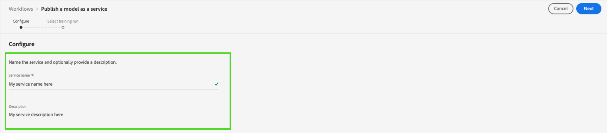

# 在数据科学工作区UI中作为服务发布模型

Adobe Experience Platform Data Science Workspace允许您发布经过培训和评估的模型即服务，从而让组织内的用户能够对数据进行评分，而无需自行创建模型。

## 快速入门

要完成本教程，您必须具有 [!DNL Experience Platform]. 如果您在 [!DNL Experience Platform]，请在继续操作之前与系统管理员联系。

本教程要求现有模型并成功运行培训。 如果没有可发布的模型，请按照 [在UI中培训和评估模型](./train-evaluate-model-ui.md) 教程，然后再继续。

如果您希望使用Sensei机器学习API发布模型，请参阅 [API教程](./publish-model-service-api.md).

## 发布模型 {#publish-a-model}

在Adobe Experience Platform中，选择 **[!UICONTROL 模型]** ，然后选择 **[!UICONTROL 浏览]** 选项卡来列出所有现有模型。 选择要作为服务发布的模型的名称。

选择 **[!UICONTROL 发布]** 在“模型概述”页面的右上方附近，启动服务创建过程。

为服务输入所需的名称并（可选）提供服务描述，选择 **[!UICONTROL 下一个]** 完成。

将列出针对模型的所有成功培训运行。 新服务将从所选培训运行继承培训和评分配置。

选择 **[!UICONTROL 完成]** 创建服务并重定向到 **[!UICONTROL 服务库]** 以显示所有可用的服务，包括新创建的服务。

## 使用服务进行评分 {#access-a-service}

在Adobe Experience Platform中，选择 **[!UICONTROL 服务]** 选项卡，用于访问 **[!UICONTROL 服务库]**. 查找要使用的服务，然后选择 **[!UICONTROL 打开]**.

在服务概述页面中，选择 **[!UICONTROL 得分]**.

为评分运行选择适当的输入数据集，然后选择 **[!UICONTROL 下一个]**. 系统会要求您对评分数据集执行相同的步骤。 选择输入和输出数据集后，即可更新配置。

创建服务后，该服务会继承默认的评分配置。 您可以通过双击值来查看和根据需要调整这些配置。 对配置满意后，选择 **[!UICONTROL 完成]** 开始打分。

服务的 **概述** 页面，将显示新评分作业及其进度的详细信息。 作业完成后， **[!UICONTROL 最近]** 标题 **[!UICONTROL 评分]** 容器更新。

## 后续步骤 {#next-steps}

通过阅读本教程，您已成功将模型发布为可访问的服务，并通过 [!UICONTROL 服务库]. 请继续下一个教程，了解如何 [安排在服务上运行自动培训和评分](./schedule-models-ui.md).
