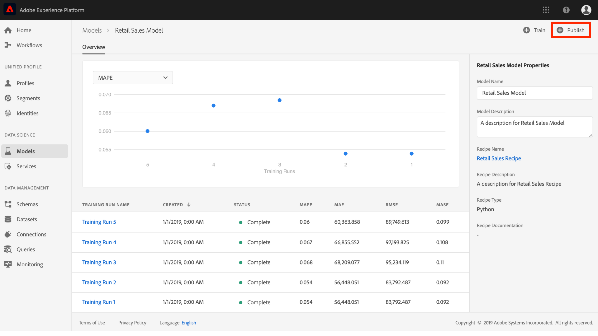
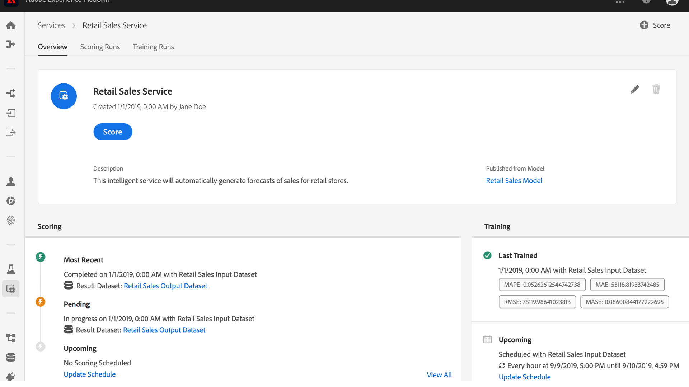

# 将模型发布为服务(UI)

Adobe Experience Platform Data Science Workspace允许您将经过培训和评估的模型作为服务发布，使IMS组织内的用户能够对数据进行评分，而无需创建自己的模型。

本教程将逐步介绍如何通过服务库将模型发布为服务，并使用服务对数据 *评分*。 它分为以下几个主要部分：

- [发布模型](#publish-a-model)
- [使用服务得分](#access-a-service)

## 入门指南

要完成本教程，您必须具有Experience Platform的访问权限。 如果您无权访问Experience Platform中的IMS组织，请在继续操作之前与系统管理员联系。

本教程要求现有模型成功运行培训。 如果您没有可发布的模型，请在继续之 [前，按照UI教程中的“培训](./train-evaluate-model-ui.md) ”并评估模型。

如果您希望使用Sensei机器学习API发布模型，请参阅 [API教程](./publish-model-service-api.md)。

## 发布模型

1. 在Adobe Experience Platform中，单击左侧导 **航列中的** “模型”链接以列表所有现有模型。 查找并单击要作为服务发布的模型的名称。
   
1. 单 **击“模型** ”概述页面右上方附近的“发布”以开始服务创建过程。
   
1. 为服务输入所需的名称并（可选）提供服务说明，完成后单击 **下一步** 。
   
1. 列出了“模型”的所有成功培训运行。 新服务将从选定的培训运行继承培训和评分配置。
   
1. 单击 **完成** ，以创建服务并重定向到服务 **库** ，以显示所有可用的服务，包括新创建的服务。
   

## 使用服务得分

1. 在Adobe Experience Platform中，单击左侧导 **航列中的** “服务”选项卡以访问服 *务库*。 查找您希望使用的服务，然后单击“ **得分”**。
   
1. 为评分运行选择适当的输入数据集，然后单击“下 **一步”**。
   
1. 为评分结果选择适当的输出数据集，然后单击“下 **一步”**。
   
1. 创建服务后，它会继承默认的评分配置。 您可以查看这些配置，并根据需要通过多次单击这些值来调整它们。 对配置满意后，单击“完 **成** ”开始评分运行。
   
1. 在服务的“概 *述* ”页面上，将显示新评分作业及其进度的详细信息。 作业完成后，将更 **新“最近** ”评分作业。
   

## 后续步骤

通过本教程，您成功地将模型发布为可访问的服务，并使用新服务通过服务库获得的 *数据*。 继续下一个教程，了解如何 [计划在服务上运行的自动培训和评分](./schedule-models-ui.md)。
