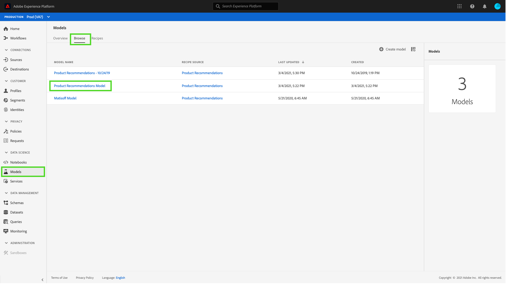
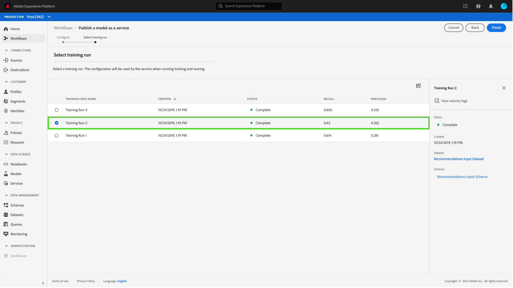

# 在数据科学工作区用户界面中将模型作为服务发布

Adobe Experience Platform Data Science Workspace允许您将经过培训和评估的模型作为服务发布，使IMS组织内的用户无需创建自己的模型即可对数据进行评分。

## 入门指南

要完成本教程，您必须具有对[!DNL Experience Platform]的访问权限。 如果您无权访问[!DNL Experience Platform]中的IMS组织，请在继续操作之前与您的系统管理员联系。

本教程要求现有模型成功运行培训。 如果您没有可发布的模型，请按照[培训并评估UI](./train-evaluate-model-ui.md)教程中的模型，然后继续。

如果您希望使用Sensei机器学习API发布模型，请参阅[API教程](./publish-model-service-api.md)。

## 发布模型{#publish-a-model}

在Adobe Experience Platform中，选择位于左侧导航列中的&#x200B;**[!UICONTROL Models]**，然后选择&#x200B;**[!UICONTROL Browse]**&#x200B;选项卡以列表所有现有模型。 选择要作为服务发布的模型的名称。

选择“模型概述”页右上方附近的&#x200B;**[!UICONTROL Publish]**&#x200B;以开始服务创建过程。

输入所需的服务名称并（可选）提供服务说明，完成后选择&#x200B;**[!UICONTROL Next]**。

列出所有成功的“模型”培训运行。 新服务将从所选培训运行继承培训和评分配置。

选择&#x200B;**[!UICONTROL Finish]**&#x200B;以创建服务并重定向到&#x200B;**[!UICONTROL Service Gallery]**&#x200B;以显示所有可用服务，包括新创建的服务。

## 使用服务{#access-a-service}得分

在Adobe Experience Platform中，选择位于左侧导航列中的&#x200B;**[!UICONTROL Services]**&#x200B;选项卡以访问&#x200B;**[!UICONTROL Service Gallery]**。 查找您要使用的服务并选择&#x200B;**[!UICONTROL Open]**。

在服务概述页中，选择&#x200B;**[!UICONTROL Score]**。

为评分运行选择适当的输入数据集，然后选择&#x200B;**[!UICONTROL Next]**。 系统会要求您对评分数据集执行相同步骤。 选择输入和输出数据集后，即可更新配置。

创建服务后，服务会继承默认的评分配置。 您可以查看这些配置，并根据需要通过多次单击这些值来调整它们。 对配置满意后，选择&#x200B;**[!UICONTROL Finish]**&#x200B;开始计分运行。

在服务的&#x200B;**概述**&#x200B;页面上，将显示新评分作业及其进度的详细信息。 作业完成后，**[!UICONTROL Scoring]**&#x200B;容器中的&#x200B;**[!UICONTROL Most Recent]**&#x200B;标头会更新。

## 后续步骤 {#next-steps}

通过本教程，您成功地将模型发布为可访问的服务，并通过[!UICONTROL Service Gallery]使用新服务对数据进行了计分。 继续下一个教程，了解如何[计划服务](./schedule-models-ui.md)上运行的自动化培训和评分。
